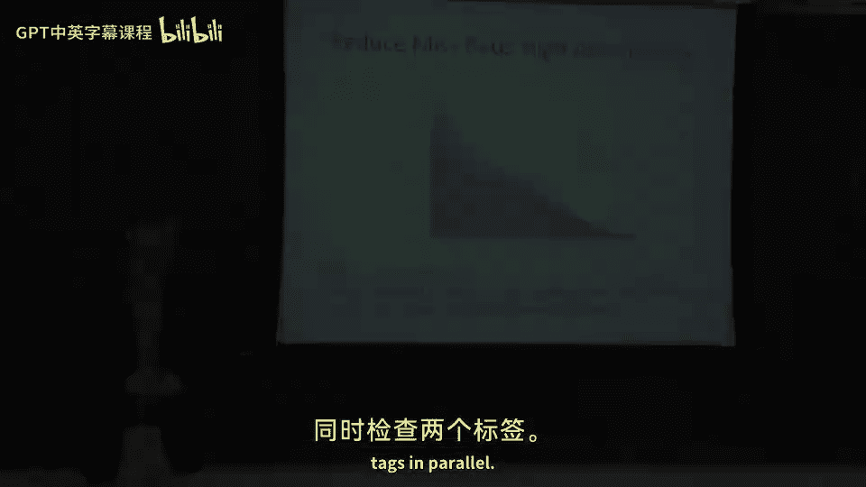

# 【计算机体系结构】普林斯顿—中英字幕 p19 18_03_cache-performance -BV1ii421D7WR_p19-

Okay， so let's start talking about performance because the whole reason we built caches is to。

 you know， have lower power and higher performance。And let's， let's go back to the iron law。

So what is， what is a cache trying to do well。What Ka is trying to do is if you look at that iron law of processor performance。

When you do a load or a store， we're trying to decrease the clocks per instruction to process that load or the store。

 So if you have to go all the way out to main memory in a cache miss， well say。

 or if you don't have a cache。It going take a long time。

But if you shrink the cost per instruction for a loader in the store， everything gets， gets faster。

 So you can actually， actually go， go faster here。 So as I sort of showing here。

 we have some loop that does it loads some ads。 And here it takes a， a cash miss。😊，If。

 if we can somehow do things to the cache， which reduce the probability of a cache miss， we can。

Shrink the amount of time it takes。To do that and the whole program will run faster。

So reducing our number of cache misses is good。 using our cache to actually keep the data local。

 And also sort of as you can see here in this diagram， this， this first load here hits in the cache。

 So it doesn't have to go out to main memory。 So it just hits And if it's a properly pipeline cache。

 its return the data on that load。Just want to introduce， yeah， sort of in this diagram， two things。

 processor to cache and coming back。 That's a hit in the cache。 Miss takes longer。

 just takes more cycles。Okay， so this is an important slide because it introduces some important ways to think about caches。

So we want to categorize。The types of misses we have to cache。

 So this is figuring out why we will have these different heuristics inside of caches based on the different policies and the different ways that you could actually have a cash miss。

And a lot of times people'll call this the three Cs of caches。Okay， the first C。A compulsory。

Cash miss。So what that means is that it's the first reference to a block。

And you're going to take that cash miss， even if you have an infinite sized cache。 It's just。

 you can't get things into the cache unless you go to try to access them the first time ever。

So that that's what a compulsory cacheist is， is that first reference。You can try real hard。

You could think about having a prefecher， actually。

 to try to reduce the amount of compulsory cache miss is。 You could like think really hard and say。

 oh， I think I'm gonna access this data sometime in the future。 I should go get it。

 And then when you go to actually go access it， you won't take a cash miss。 So that's， that's。

 that's a possibility。Okay， the second C that contributes to our performance of caches is the capacity of the cache。

So traditionally， a larger cache will be able to fit more。Data， well， that's always true。

 But traditionally in larger cache， you will have a lower miss rate if you have a larger cache。

 So let's think about that。 This is is an important question here。

Wooly larger cash always have a lower cash miss rate。Than a smaller cache。 in the loop。

Let's think about what kicks。Data out。If you have a cache that is。

 let's say8 lines and you have a cache that is 16 lines。By definition。

The addresses that would alias in the。Bigger cash are going to elias in the smaller cache。 Also。

 if you go let's say， from a8 a 16 entry cash to a 8 entry cash。 So it's actually。

 if you're going up by factors of 2， at least your cash miss rate is always going to be better with a larger cache or the the cash rate is going to be lower with larger cash。

The one place it could actually come up is if you have， if you try to change the hashing function。

So if you have a cache that is， let's say。Two third the size you well， you have a cache that is。

 let's say8 entries。 and youve catch that is 12 entries。So there。

 the hashing locations are going to be different。 You can actually think about having different patterns there。

 but it's likely that the larger cache will still do better then。So large， large is good。嗯。That's。

 that's assuming like sort of direct mapped cache。 you could， you know。

 depending on your L R U strategy， probably or your， your replacement policy。

 there's probably some other caveats that I'd have to think a little bit harder about。Okay。

 so finally， what's the last thing that can cause a cash？

Conflict to occur is or mis to occur is conflict in the cache。

So this means that we don't have a high enough associivity in two different。Pieces of data。

 two different blocks， alleys to the same location。 And they're fighting for that location。

So there's， there's conflict there。 And one of the。

 the pieces of data gets kicked out before you have the time to go read it back in。

 So you have a load and then another load。 But in the meaning， in in the middle time。

 you have a load to a different address， which happens to aus to that same location in the cache。

 the hash function points it to the same location。 and they're gonna fight for that resource。

 So it's， that's a conflict。Okay， so let's put some data behind this。

And look at some ways to make caches go faster。诶。Okay， so。Let's。

 let's look at what we're plotting here on this graph。On the X axis， we have different sized caches。

16 kBs 32 ks 64。 So we go by factor of 2 all the way up to 1 MB。On the Y axis here。

 we have access time。 So how long it takes to access the cache。So if we go back to to。This。

Average memory latency equation。We take the mis rate times the mis penalty plus the hit time。 How。

 how long it takes to actually go sort of look stuff up and find something our cash in the first place。

 Well， if we can reduce。The hit time， that's， that's good。 So if we take a cache， which， let's say。

Takes。I don't know。Two nanoseconds to access。And on a 1 GHz machine， there would be two clock cycles。

 And we can somehow， you know， replace it with a cache， which takes half a nanosecond access。That's。

 that's， that's good。 It means we can actually fit that in one clock cycle on our1 gigHz machine。

In fact， we can probably go all the way up to， you know， sort of1 nanosecond on。

 on a 1 GHz machine before we spill over into the next clock cycle。 So you can sort of think。

 think about that。 So the first thing is actually small and simple caches。Could be good。

Everyone thinks capacity， capacity capacity。 But in your sort of processor core。

 if you can reduce the hit time。That that's a good thing。So just to give you some idea here， as you。

 as you scale back， you can have to smaller caches， the time it takes to access the cash goes down。

So the next， next thing you do is we try to reduce。The mis rate。

 And there's a couple different ways to do that。 These are just sort of some basic optimizations in the cache lectures later in class。

 We're gonna go through a lot more optimizations for caches。

 But one thing you can do is think about looking at the block size。So the examples I've been giving。

 we're talking about 64 B block size。But you could think about having either a smaller block size or a larger block size。

And， in fact， this， this happens。People。This， this graph here， you know，64 looks like sort of the。

Lowest miss rate is a good spot。 But this is really dependent on your applications。Space。

So if you have applications which just sort of stream through memory。

 you probably want a bigger block size。 If you have more random patterns and you're not getting any reuse。

 it might make sense to even have a smaller block size。So this， this data is， is from your textbook。

 Actually， this is plotting speckant。Rates with different cache sizes。

 So each of these lines here is a different sized cache。 So you can see 4 kb cache，16 k cache。

64 kb cash and 256 kb cache is。 And you can plot those。

 those two things against each other and see where the the sort of sweet spot in this curve is。

 And we're trying to minimize the。Miss rate。 So how often we actually take that cash miss。 Okay。

 so there some， some positive things here about having different having larger cash sizes。

 Let's talk about that， so。护业费。Excuse me， larger box sizes。 If we have a larger block size。

 we need less tag overhead。 So we talked about that already in the tag lookup slide。嗯。The， you can。

 if you have longer block sizes， you can think about having。More burst transfers from your D Ram。

 So in D Ram， typically they give you like sort of large chunks of data at a time and that little chunks of data because there's a overhead cost in firing up the D Ram。

 And there's what's called the column address strobe and the row address sbe or ra or cast time。

 And you have to do that for memory every every memory access。

 So if you can sort of pull in larger chunks of memory at a time。

 you only have to do that once for the large amount of data you read。

 So that pushes you to actually want to have larger block sizes。And。

You could even think about having similar ideas here for sort of on chip buses。

 If you have larger block sizes， you'd probably be using that on chip bus more effectively because there's some overheads and some turnarounds。

 usually for arbitrations for buses。Okay， so on the right side here we are the downsides of larger block sizes。

If you have a larger block size， you might be pulling in data you're not using。

So if I have a 256 B block。Cash block versus 64。Bite block。

We're gonna be pulling in four times as much data。 And forre only trying to access， let's say。

 one by in a data， we just wasted a lot of main memory bandwidth to go pull that one B in。

So we have to be cognizant of that。 And that's why this curve is not you know。

 increasing one direction or the other direction becauseuse on first。

 when I sort of first took a computer architecture class， I thought， oh， you know。

 as you increase the block size， shouldn't performance go up。

 or shouldn't the cache mis rate go down on this graph。And it's， it's not。

 not true because you start to waste bandwidth at some point。Also， if youve。Larger。Block size。

 by definition， you have fewer blocks。So if we have， let's say，256 by blocks versus 64 B blocks。

 By definition， this is sort of 4，4 times fewer blocks in the cache。 It's the same amount of data。

 So if you have you know，4 k byte cash。 We're gonna have the same amount。

 It's the same amount of data。 It's still a 4 k by cache。 But there's less blocks in that cache。

 So you're not gonna have as much random data in your cache at one time。

So this is one technique to reduce mis rate。Another way， in a perfect world， this。

 this fights off against small and simple caches。Is you can just build big caches。

If you build big caches， this means that when you go to access the data。

 there's a very high probability that the data is close to you。That， that sounds good。

 So here we actually have misrate plotted against cash size。And， and of course。

 there's sort of different associate different types of caches here。And。Let's see。 There's one。

It's one thing I wanted to point out here。This empirical rule of thumb。If you double your cache size。

Your miss rate usually drops by root 2。Sometimes people call us the square root rule。嗯。

How do we derive this？Well。Sorry to bring to you guys， as it says here。

 it is empirical rule of thumb。It is just a rule thumb。 Obviously， if this was perfectly true， this。

 this line would be， you know。Nicely curved versus having some like bumps in it。

But this actually surprisingly works out pretty well as a， as a rule of thumb。 So， and。

 and it doesn't really work very well for very small caches。 So typically sort of right in here。

 it doesn't work well。 possibly sometimes for very large things， it doesn't work well。

 and for high associivity， this rule of thumb starts to break down also。

But it's a good rule thumb to come real thumb to think about。Okay， so how do we reduce the miss rate？

 Well， same， same graph。But this is also from Hennessine Patterson， your book。

 You can increase the associivity。So。You can take a。I don't know。

 four way cash and turn it into an eight way cache。Now， some hardware cost associates that with that。

 and there's also clock cycle cost。Typically。So let's look at the， the rule of thumb here。

 and the rule of thumb basically says。A direct mapped cache of size N。

Has about the same mis rate as a two way set associated to cache of size n over 2。And this kind of。

That sounds crazy。 good。 Like， how is that possible。

 we should always go at least two ways at associative caches。But let's， let's look。

's look at this graph and see if this actually， actually works， so。We're gonna look at a point。To do。

Let's look at a 16 kB cache。That is direct to mapped。And compare it against a 32 kB cache。 that is。

Or excuse me， a 16 kB cache that is two way set associative versus a 32 kB cache that is lower associative。

 And kind of what you're trying to see here is if this point here is equal to that point。Well。

 it's not， but it's actually not a horrible approximation。

 We're sort of saying if we have a 16 kb cache with a higher sociivity， our mis rate goes down。

 right， So it's gonna be somewhere in here versus a 32 kb cache， which has is direct map。

 which is this point here。 Okay， well， that doesn't hold there。 Let's go look for another point here。

 Let's say。32 kilobys。To a say soci cache， which is that point there versus a 64 kB cache that is direct maps。

 Well， that's almost on a straight line of each other。 So it's almost exactly equal。

And this is an empirical rule of thumb that people sort of figured out that as you double your associivity。

You actually have sort of， you can almost。Half your cash size and still have it。

 have the same mis rate。 And， and likewise， like as I said， this is just empirical。 There is no， no。

Reson why this has to be。 it's really dependent on your sort of data access patterns。But I。

 I found that， I found that pretty interesting。 Okay， so what's， what's the problem。

With building a two way set associative cash always， why do we not do that。

So area for the data store shouldn't actually change very much。

But what does change is your tag store。The the tag data you're going to need for the higher associative。

One， you need more tag check logic， at least。Because you have to check。

 let's say two tags in parallel。

