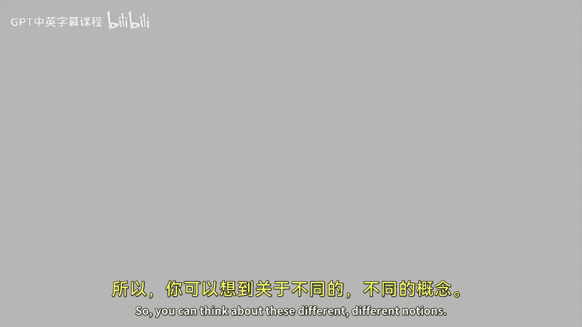

# 【计算机体系结构】普林斯顿—中英字幕 p20 19_04_superscalar-1 -BV1ii421D7WR_p20-

Now， we actually start to talking into new things and how to build superscalear processors。

 things that exploit ILP， instruction of apparilism。

 things that run at really high clock frequency or multiple cores and advanced techniques。

So before we start talking about superss， there's a piece of nomenclature we need to introduce that sort of goes hand in hand off the data hazard talk that we had before。

 but I didn't introduce it there， but I need to introduce it now before we go on to actual super scholars。

So， let's consider。Some example instructions here， where。Register I， Reg J。

 you operate on and you put it into Reg K。And we're going to look at。Different types of dependencies。

And we're gonna name them。 So the basic dependency here is a read after write hazard or read after write dependence。

So in this example here in if， if time goes down。This operation here is going to store and register 3。

And then。This instruction here is going read from R 3。

 So you need to sort of temporarily make sure that this happens before that because you need the value here。

Okay， so we， this is， we talked about this already in our data hazards。

 This is the most classic data hazard here。 I read after write hazard。

Let's look at something a little bit more。A a little bit less intuitive。

Let's look at a hazard where this instruction here reads Reg 1。

 and the next instruction writes Reg 1。Okay， that should be no problem。That sounds great。Well， today。

 we're going to give an example of a pipeline where this is a problem。

Or could potentially be a problem。So， you know， if you do everything in order and your instructions just sort of slowly flowing down the pipe and you're only executing one instruction at a time。

 you're gonna execute this。 And then that， And you're gonna read Reg  one here。

 And then like a whole lot of time later， you're gonna write register  one。 So nothing。

 nothing bad happens。But if you start to execute instructions， either out of order。

Or if you start to execute multiple instructions at the same time。

 you can start to come in some problems。 But we're going name this a。Right。After read hazard。

 So what that means is we have a right。That temporarily in the program order is happening after a read of that same register。

So when， this is usually called antidepend。And we， we need to maintain these。

When we go to execute our programs out of order and sort of throw everything into a big bucket and try to pull out instructions。

ok啊。Output dependencies。This is actually something that you could possibly even think of having happen on a simple sort of in order processor core。

If you do right back to the register file from different stages。

 So let's take an example if you have a multiplier like in your lab。

 which is going write at the end of the pipe and have a very very high latency。

 And then you have a instruction like an ad， which is let's say you try to write the register file early。

You might actually write。This instructions result to register 3 before that instructions results。 If。

 let's say this instruction here is a long laneency operation， something like can multiply。

 And this is like an ad。 So we're gonna call that a right after right dependency。

 And we need to maintain the order here that this gets written first。 And then this gets written。

Because if you flop those two results or interchange those two results。

 the next thing that goes to read R3 is and get the wrong value。 So that's， that's pretty important。

 And it's called the output dependence。Okay， so， so last question。

Is there such a thing as a read after read dependence or read after read hazard。

 So superscaler processors。So far， we've been limited to。

Processors that can only get a clock per instruction greater than or equal to one。

Superscale processors will allow us to execute multiple instructions at the same time， and willll。

Move us into a new class here of the clock per instruction， potentially below one。

It's at least fundamentally possible。 Now， there might be other things that cause our clock per instruction to actually still be above one。

 but we can get higher performance by executing multiple instructions in parallel。

 I wanted to introduce nomenclature here。 that's the reciprocal of instructions per clock per instruction。

 which is instructions per clock。 We just move them and rename it。 Sometimes people say I PCC。

And it's the reciprocal of CPI versus CPI。Fox per instruction equals one over。Instructions per clock。

So just， just be aware of that。 sometimes well using those terms different。

Interchangeably in this class。Okay， so what types of supercar processors can we talk about。Thus。

Lots of different types。 There's in order machines and out of our machines roughly。

 And what in order machine means is the machine or the the processor is still trying to execute instructions in program order。

Well， you don't have to do that。 You could actually think about sort of taking apart the program and executing them out of order as long as you're trying to sort of preserve the different hazards。

 data hazards。And something like your。Penium processor。So I'm going to pass around here。

Roughly pentium2 class processor。It's actually a Intel saron， penium。

The penium 2 version of the In pentium cellron is a out of order。3 wide super scs。

 So we could execute three instructions at a time。 For instance。

 the another example is the original pentium。The old pentium， when the original penium came out。

 that was a two wide machine。 we executed two instructions at one time， and it was in order。

So we can think about these different， different notions。

