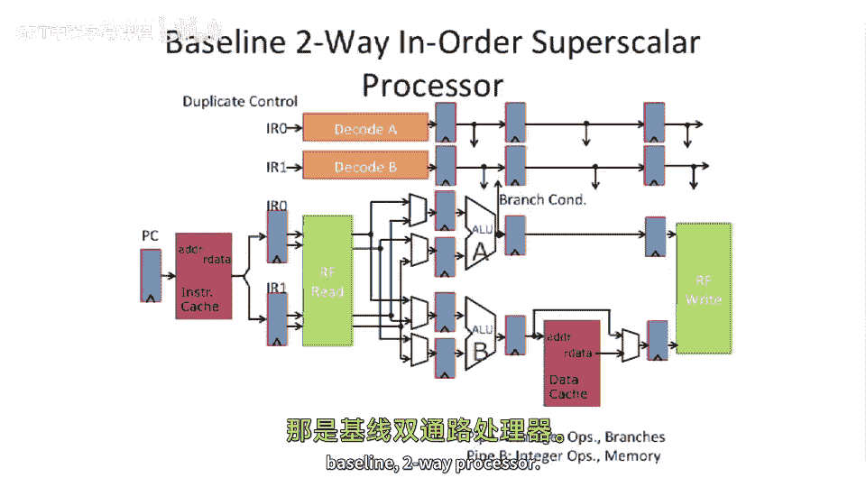
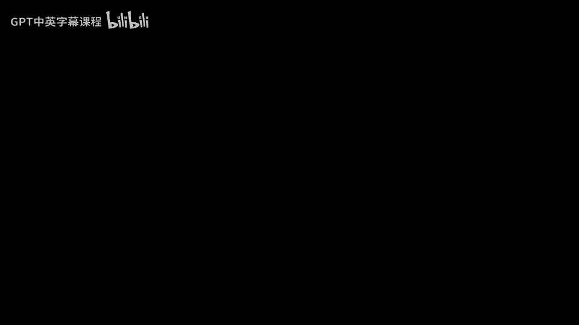

# 【计算机体系结构】普林斯顿—中英字幕 p21 20_05_basic-two-way-in-order-superscalar -BV1ii421D7WR_p21-

Let's， let's look at a baseline too wide in order supercalar。 That's a mouthful say。

 So difference than the pipelines you've seen before。We have two ALUs。It's a big difference。

 We can execute two integer ops at the same time in this pipe。Dra here。

 we're gonna actually differentiate these two pipes。

 We're gonna to call this pipeline A and this pipeline B。And pipeline A。

 let's say can do imageger ops and branches。And pipeline B can do ingerops and memory access。

But you can't。 You can't do memory up here and you can't do branches down there。

That's there's nothing fundamental。 We're just gonna look at at this sort of basic example here have two asymmetric pipelines。

An important， important point of this， first is that。Compared to our five stage， you know。

 Mips processor is that we have to be able to fetch two instructions at the same time。

If we're gonna want to actually be able to execute two things。

 we need to somehow get that out of the instruction cache or the instruction memory。嗯。Okay。

 well that's interesting。 So the program counter is are gonna sort of go in here。

 And instead of getting one instruction out， we actually get two to go in these two different instruction registers。

We also need to add more ports to our register file。

Instead of in our basic pipeline that we had talked about earlier， we had only two read ports。

 You gave two different addresses and it outputted two registers now。

 because we have two different instructions go at the same time。

 We actually have to pull out four different read ports or four different read registers at the same time。

And if we want to be able to retire or commit instructions to at a time。

 we need to add more write ports。 So I show the register file here， sort of split into2。

 But the register file is kind of。Its， it's together， but logically， I just drew it apart。

 So you could actually make heads of tails of the drawing。So that's。

 that's something interesting to think about is。You have to worry about that。 Okay。

 so the first question I have here。Is this good enough， I this pipeline diagram。Good enough in。

 let's say， the fetch stage。We stick some dress in。 We get。Two instructions out。

So that's a good question。 is， do we do PC and PC plus force， Let's say we can。

 there's some logic here which can pull out。PC and PC plus 4 at the same time。

 because we're executing two instructions。 So， so roughly， you know。

 we need to worry about alignment issues here。 We need to worry about branches in， let's say。

 the first instruction in that we pull out of the two instructions。In this next part here。

Our pipes are not symmetric。So is this， is this good enough。

So what happens if the first instruction that comes out here is a load。So instruction I R 0 here。

 The instruction register gets loaded with the bits from the load。What， what happens downstream here。

 Can the load happen here。嗯。Yeah， that's a problem。 So we're starting to go the superscalear here。

 We need to start thinking about having。We'll flip back and forth here and take a look at this。

You need something here that can take an instruction that show up here and route all the opera end values down over here。

Largely， a lot of times people call this issue logic or instruction steering logic。

 So you have to sort of steer the opera ends and you can basically swap the opera the two instructions that are going down the pipe at the same time。

Okay， so， so that's， that's， that's interesting。 And this this is could actually cost some time to do this。

 So this might motivate us to have longer pipelines。 And we'll talk about that in a second。

Another thing you have to do is on the control side is you have to actually start thinking about duplicating control。

So here we actually have to have two decoders because we're decoding two instructions at the same time。

 So the instruction register wires up to Decode A and this instruction register wires up to Decode B。

 and then they're going to drive signals down across the respective A And B data paths。

So that's something not drawn here。 is you may also， if。

 if you have to interchange the sort of instruction register 0 to the B pipe。You might have to。

 you definitely have some， you know， communication or some swapping of the instruction inputs here。

So that's， that's， that's sort of the baseline to a processor。

