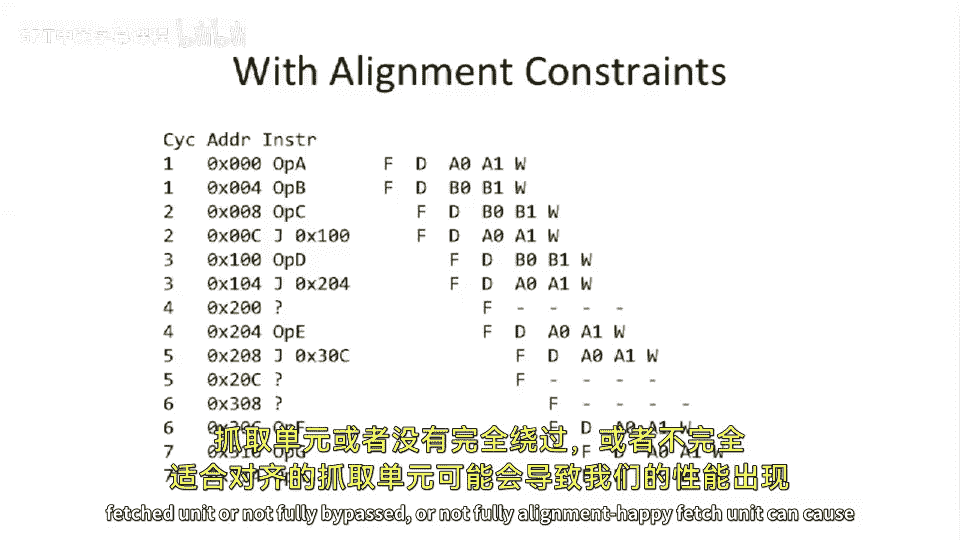

# 【计算机体系结构】普林斯顿—中英字幕 p22 21_06_fetch-logic-and-alignment -BV1ii421D7WR_p22-

Okay， let's look at the issue logic here and a pipeline diagram。So here we have app A， B， C， D， E， F。

 So we have straight line code， no branches。And we have things flowing down the pipe。

And we have our nice pipeline diagram。 And one of the cool things is now that we have a two wide super scour。

 we can actually violate a rule that we had before。

 which said two things cannot be in the same pipe stage at the same time temporarily because time time runs from left to right on this diagram。

 So here we have two things that do code stage， two opera ends or two operations or two instructions in the fetch stage。

 And we're just gonna name because we don't have a great name for these things。

 We're gonna call these A and a 0 and A 1 and B0 and B1 to represent the different execution unit stages。

😊，So in an ideal world， this is pretty sweet in this， in this， at least for this code here。

 we actually have a clocks per instruction of one half。😊，That's pretty awesome。And as I said。

 we can have two， two instructions in the， in the same stage of the pipe。Okay。

 let's look at a little bit more complex code sequence here。 We have ad loads。Its more loads， an ad。

 a load。Yu。Issue logic， that swapping logic actually will have to move instructions around in this case。

 So we have this add in this load。 Well， this is actually easy。 The ad goes to the A unit。

 The load goes to the B unit。 No problems there。Okay， so now we have the load。loads in。

 we fetched it。 and it it's in the instruction register 0。That means they wants to go to the api。

 But we need to swap these two。 So you can see here。 this is how we draw this。

 We actually say this ad is going to the api here。 And that's the opposite of what's going on there。

But there's still those stalls going on， at least in this example。And then finally， here。

 we actually are going to get a structural hazard。And the structural hazard introduces a stall。

 So we fetch these two loads simultaneously。But we can only execute one load at a time。

So we need to stall one of the loads in the decode stage and push that out a little bit。

 So it actually has a different pipeline diagram than the no。Stall or the no conflict。

 no structural hazard example。Okay， so a。Let's look at a little bit more complex example here。

 A dual issue data hazard。 What happens when we have data hazards。So unfortunately。

 when you have data hazards， you can actually， this is without any bypassing。This， this first。

 this first example， this first two instructions here don't have any data hazards。

 But here we have a right to register 5 and a read from Reg 5。 And this is a read after write hazard。

And because we're not bypassing in this pipeline yet。

We actually have to stall the second instruction waiting for that first one。

 even though we could have potentially executed them at the same time。

 But there's a real data hazard there。 So we need to introduce stall cycles into the second instruction。

This makes sense to everybody。 So we're gonna push out that ad。If we have full bypassing。

 we still need to add stalling， potentially。So now we don't have to wait for this value to get to the end of the pipe to go pick it up in the A L U。

But we can pull it back because we can bypass， let's say the ad result after a 0。

And what you see here is the same instruction sequence。

But now it's bypassed from a 0 into the decocode stage， and we can start going again quicker。

So bypassing is really helping us here。 And it's crossed with the super scourness， if you will。

So what， what I mean by order matters is that here we've interchanged these last two instructions。

So we just flipped them， and we turned what was a。Right， excuse me a。Read after write hazard。Into a。

呃。Right after read hazard。 And because of that。This actually pulls in by one cycle。

 and we don't get the stall。 So just by changing the ordering of the instructions。

 it'll change the data dependencies。 And that will actually change the ordering and change the execution length。

Does that make sense to everybody， why we can actually interchange two instructions and the data dependencies completely change。

 We need to worry very different things about the the data hazards。Okay， so。

I want to briefly wrap up about fetch logic and alignment。

So this is someone wasuding I think you were alluding to this。Let's look at some code here。

 That's going take jumps。So execute some instructions。 So this is the address。

 This is the instruction。 And we have a jump here to address 100 hexadecimal。

And then we execute one instruction optdi， and we jump to 204 hexadeciimmal， and then we jump。

 We execute one instruction and execute 2 and jump to 300 or 30 C hexadeimal。

 then we just execute some stuff。Here is our cache。 And let's say， our cache。The block size is。

4 instructions long。And we're to look at how many cycles this takes to execute。

 So let's say there's no alignment constraints。In the first， in the first case， so。In cycle 0 here。

 we execute these two instructions。And we， we fetch them from the， the instruction cache。

 and they're， they're lined nicely together。 There's nothing sort of weird going on。

 We just go pull them out。Okay。These next two instructions， A and C， those。

 those are next to each other。 That's， that's great。 And then， and then we jump。😊，Somewhere else。

To 100。 And we're gonna execute these two instructions。 theyre next to each other。Then。

 and they're at the beginning， and they're aligned。 So that's great。No problem there。嗯。Okay。

 now we start to hit some weird stuff。 Now we jump to sort of the middle of a cache line。In in。

 in this example here， we jumped to some address 204。 So our blocks size is said four instructions。

 but we're sort of jumping not to the first instruction in that block。So， when he。

Fully fleshed out fetch unit。 Let's say you can execute with any alignments。 So life is easy。

 We can just fetch， and we can execute these two instructions at the same time in the same cycle。

 in cycle 3， we fetch both of those。😊，That could get harder if we actually try to put some realistic constraints in that。

Okay， now I's jump to a3， the end of a end of a cash block。

And we're to try to fetch these two instructions at the same time。

So one is on this cache line and one is on that cache line。

Do we need to fetch two things from our cache at the same time。Yeah， we do。

If we actually want to try to execute this instruction and that instruction at the same time。

 let's say for right now， this issue logic actually allows us to do that。

 somehow it's dual ported instruction cache， we'll say。 And then finally， Op 5 here， Er3。

14 executes last and， and it's just sort of fall through there's no jumps or anything happening。

So some things that can be really hard to actually make work out， right。

 are fetching across cash lines and possibly even fetching。Randomly in the side of a cache line。

 depending on your fetch unit logic。And， and like I said， we might need extra reports on the cache。

Here， here is this， this code executing。 And as you can see。

 we don't actually get any introduced stalls。 It just sort of executes。This， then this。

 then this include execute two instructions every single cycle。Now。

 let's look at with some alignmentman constraints， so。Here's our， here's our original example。

 And let's look at like what， what we could possibly try to execute here。 So we're jumping。

For recall， we we only use these two。Instructions from the middle of the line。

So let's say we can only fetch a half a block at a time or something like that in each cycle。

 because that's just how wide our cache is。So what you might have to do in some architecture is if you have alignmentman issues like that。

 and let's say you're not allowed to ever straddle。

 You'd actually have sort of extra data fetched that you're just never gonna use。

 So you're throwing away this bandwidth。And also， the cycles of this change。So let's。

 let's look at this same code sequence。And look at what happens when we go to execute it。

So going back to this。So we execute up A and up B。 Okay， this is good on the pipe。 Life is。

 life is good。We get to this address 8 here，8 hexadecimal。Well。

 we need to swap that because the jump needs to go down pipe A。 But otherwise， things。

 things are okay。Well， now now we jump to， to the middle of， of a line here。

That starts to get more interesting。 And we're gonna basically end up wasting cycles。

 So this will take 7 cycles where before we had this taking only five cycles because we've effectively introduced dead cycles where we fetched instructions we just didn't use。

 So the three X's here。Show up as instructions we fetched。 So like， for instance。

 this instructionstruct the instruction at address 200 is that。We fetched it， and we're not using it。

And we fetch these two， and。We weren't using either of them。

So having a complex fetch unit or a not fully bypass or enough fully alignment， happy。

Fch unit can cause some serious problems in our performance。嗯。Let's stop here for today。

 and we'll talk about the rest next time。

