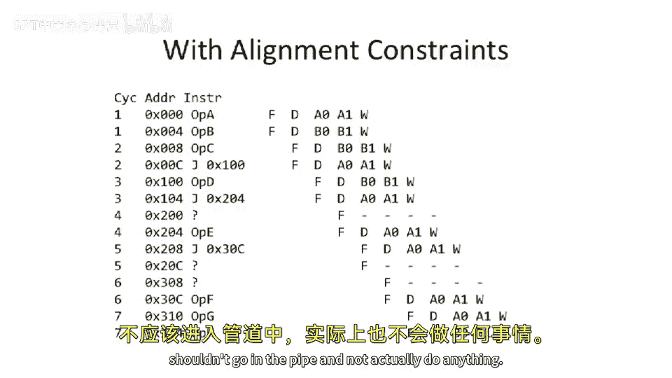

# 【计算机体系结构】普林斯顿—中英字幕 p23 22_02_baseline-superscalar-and-alignment -BV1ii421D7WR_p23-

Okay， let's， let's begin today。 So we're gonna start where we。Left off last time。

 which was talking about。呃。In order superscales。 So as you may recall， just a brief review。

 we were talking about these sort of a little bit more complex pipelines。

 We were able to execute multiple instructions at the same time。

 Sometimes instructions had to sort of be steered， if you will。

 between the A in the B pipe coming from the two different instruction registers。

 We have to double our decocode。 We need to check to make sure that there's no dependencies between the instructions are trying to issue at the same time。

 And our decocode logic will do that。 So there's gonna be some sort of cross communicationation inside of there。

 And in our previous example， we were looking at a asymmetric pipeline。 So what I mean by that is。

 you know， loads and stores went down this pipe and branches and A U ops went on that pipe and also A U ops went on this pipe。

So where we left off last time。Was was talking about alignment and how do we deal with。

Fettching multiple instructions from a instruction memory or instruction cache。 But at the same time。

 how do we not have to make this structure have many， many ports， for instance。

 or do we doesn't have to have many， many ports。So we looked at a a basic piece of code here。

 which has a whole lot of interesting alignment issues。 So at the beginning here。

 we were basically fetching instructions， which were nicely aligned into the caches。Blocks。

 and then we， yeah， this one was okay。 we jumped to the beginning of a block。 That was fine。 Here。

 we jumped the middle of a block。 And depending on how our cache was implemented。

 we might need to do sort of two fetches。 Let's say you can only read out of your cache half a block at a time。

 Then you might have to do a fetch to get this and fetch to get that。

 And then here we even have things which sort of cross cache lines or cross complete cache blocks。

 which is quite a bit harder。 So let's， let's take a look at this。

So if we have some alignment constraints， So let's say the alignment constraint we have here is that you can only fetch either from the first half or the second half of a block at a time。

And if you're trying to execute something which straddles a cache line。

 you're gonna have to fetch even more data。So as you can see， if you recall from this figure， this。

 this and。That instruction or piece of data in the Ram。When we go forward。

We're basically going to be fetching extra data with that alignment constraintsstrain that we would have been fetching otherwise。

This gets even harder。You know， it'， it's okay to sort of overfech。 It's another thing。

 if you actually have to sort of straddle a cache line here。 And because the question comes up， do。

 can you fetch those two at the same time from the cache or not。

 And we'll look through an example here。 we're gonna look with this alignment constraints and see that。

 no， if you can't actually fetch that， you're gonna be introducing was effectively dead cycles going down the pipe。

 which hurts your clocks per instruction， So here is the same instruction sequence that we had here。

And。These。Stalls or net stalls， me dead instructions that go down the pipe here or killed。

 Inions that go down the pipe are actually just these three x's。 So we've effectively overfetched。

And then， you know， when we go to over fetchch， let's say here， we fetched 2，0，8。

 but we had to fetch。20 C。And thats instructions going go on the pipe and not actually do anything。

So you can see that you can actually with when you have a alignmentman constraints。

 you basically can just introduce extra stall or extra dead instructions going on the pipe。

 And you're not actually be using that。 And that's not necessarily great。

