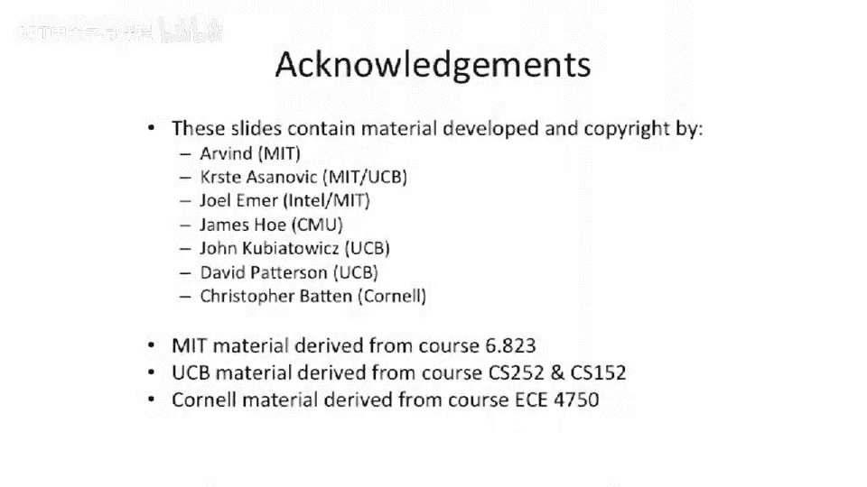

# 【计算机体系结构】普林斯顿—中英字幕 p24 23_03_interrupts-and-bypassing -BV1ii421D7WR_p24-

Okay， so an important question comes up with something like a super scholarar。

When you're execute multiple instructions at the same time is what happens。

When you fetch two instructions。And you， let's say one of those instructions takes an interrupt or an exception as is going down the pipeline。

So let's， let's take an example here。 Let's say we have a load。And then， a system call instruction。

Now， both these instructions can effectively take interrupts or exceptions。 The。

 the load can take something like a T O B Miss or alignmentman fault。 The cis call instruction。

 by definition， is effectively making an interrupt occur。

And one of the interesting questions here is this slow word， which is gonna go down the pipe。

 If we fetch these two at the same time。And they start marching down the pipe。 So this is our。

 our pipeline diagram。 We fetch at the same time。 We do code at the same time。

 The load has to go to the A pipe the load has to go to the B pipe。 So it ends up in B。

 and the cis call ends up in the A pipe。Well。What does this exactly mean if the load is in the B pipeline。

U。But it takes an interrupt， and it commits in order first。Well， actually。

 let's look about that even， let's give even a simpler question here。

 What if the Sis Le load does not take any faults and the Sis call takes a fault。

Which happened first， A or B。Okay， so which， which should happen first in program order。

 a load and then instruction after a load。The load should happen first， because in program order。

 we go sort of top to bottom。But the load is in our， our B pipe here in our A pipe， we have。

A instruction which takes a interrupt。Well， so what happens here， right， is that。

Load should go down the pipe and complete。 in order not to deadlock your basically your to code logic is gonna have to sort of either know about this or very。

 very late in the pipe。You have to have what we're gonna call a commit point。

 which we're gonna to be talking about later in today's lecture。

And you have to make some rational decision here of which of these actually occurred in order。

 And you somehow have to track that going down the pipe。

 And then you're trying to make a decision of， oh， well， the A pipe actually just took an interrupt。

 But we in program order， the B pipe is the first instruction going down the pipe。

So at the end of the pipe there， you're gonna have to make some logical decision and have to have a little bit control logic to make sure that you're not going to。

 let's say， take it interrupt for the cis call， even though and and kill the load instruction before the cis call。

 So one thing you could do is actually have both of them go down the end of the pipe。

 not kill the load。 Let it commit。And have the cis call actually take the interrupts。

And that's probably the highest performing thing you could do in this case。

Lower performance things probably would be easier， but that's probably the highest performing thing you can do in this case。

Okay， so we sort of introduced this two way superscalear in super scar。

 One thing we need to think about is。We add a lot more places that data could be coming from。

In if we go to forward data， so。We now， instead of， if， when we had one pipeline。

 we could bypass data out here， here and there。 So it was only three places。

But now that we have two pipelines， youve effectively multiplied the places that you can bypass out of。

 And now you can have six places。 So if you go sort of pull， pull a steering logic off。And then。

 you know， make your multiplexs bigger here， which are you're doing your bypassing。

 You end up with six different locations that you have to choose between for each input opera。

And this is a relatively short pipe。 So as you start to grow this to bigger and bigger pipelines。

 either in depth or in width。And you want full bypassing。

 you're going have more and more much wider multiplexors here and a lot more data being bypassed。

So this， this actually becomes becomes a problem。 And you need to start to。

 to think about this really hard。 So some， what are some solutions to this？ Well。

 one solution that people sometimes do is they don't have full bypassing。

 You can only bypass out of certain locations。That's， that's one option。 Another option。

 which we'll be talking about a little bit later today is you can actually maybe not actually have this pipeline register。

 And if you start to think of having out of order processors。

 you could start to think of committing information back to the register file early。

So this pipe here has nothing happening in this stage。 Well can we just sho it in the register file。

On first appearance， that sounds great。 You start to think about that a little bit more。 And you。

 you can start to get worried here because you start to see right after right hazards actually start showing up as real problems。

 then， because if you issue an instruction here， which write to the same register。

 which happens at the end of this。😊，Load operation will say then you could actually get out of order writing to the register file。

 So you need to be cognizant of that。Other approaches that people take to this is sometimes they will actually have what are called clustered supercals。

So cluster superscale， superscale， they'll actually have， let's say， four pipelines。

 and they'll cluster them into two pipelines of two each。

And you'll allow bypassing between two of the pipes and two of the other pipes。

 And if you're bypass between the two sets of clustered pipes， then it takes an extra cycle。

 or you have to do it through the register file or something like that。

So there's other approaches there to try to mitigate the blow up of this bypassing network。

And you have number something like a 64 B。Something like a 64 B processor。

 Each of these are 64 bit buses。Each， each one of these little wires here。

 So these things get pretty， pretty big， pretty quick。

 So you have to worry about actually running these things around the chip because all of a sudden。

 you have hundreds and hundreds of， you know，600 Bs running over 600 wires running up and over just for your bypass from this simple pipeline。

 And if we go wider， it's gonna be much worse。Or longer。So one。

 one thing that people do a lot to handle this bypassing from a critical path perspective。

 because it takes a long time or it starts to take a long time is you start to break the decode and the issue。

So we're gonna sort of get away from our five stage pipes now。Up to this point。

 we've been doing things you've seen in the first。Pattererson Henessy book。

And now we're going to start thinking about things that have longer pipelines。So one。

 one good thing to do is you can actually break the decode and the register file access into two separate stages in the pipe。

Effectively making a six stage pipeline now。And what do， what do we put， Well。

 one thing we can do is actually just break the decode into its own pipe stage。

 And we can try to figure out structural hazards， even in that pipe stage。

 And that's something people sort of traditionally do。 They'll do decode。

 And they'll also look to see if you gonna have a structural hazard。

 Let's say on a right port of the register file at the ends of the pipe。And then in the issue stage。

 I for issue， you'll do the register file， and you'll probably swizzle or cross over or steer the instructions to the。

 and the opera ends to the correct location。And， of course， you'll do this bypassing。

 if you have lots of bypassing opera coming back。So to give us sort of a brief pipeline example here。

 here we have two cycles。And each that execute two instructions per cycle。

 And we can see now our pipeline has an extra。I in here， which is just an extra front end stage。Okay。

 so this has some， this has some negative aspects。 Can anyone think of one of the negative aspects of putting extra pipeline stages in the front of our pipeline。

Yes， so branches， if you， if you。If we know that the branch gets resolved in outside of。

 out of the first execute stage of the pipe or in our two pipe here， it's out of a 0。

We've just increased the branch cost by， by one。 So now something that would have branched or a branch。

 you know， mis predictic penalty of， let's say， two cycles just became three cycles。And this。

 this can start hurting your performance。And this really starts to hurt your performance as you start to go wide。

So let's take this instruction sequence here， where we have this extra issue stage out in front。

And we have a branch in the first instruction we try to execute。

 And then we just have sort of the fall through code here， which we， so we predict fall through。

We don't realize that the branch happens until a 0。 And at that point。

 we can redirect and just sort of kill everything that we've already gone in flight。

 But look at all the things that have gone in flight already。We're， we're sitting here。

 which means we've had one to three other stages， if you will。

 or three other cycles to go fetch instructions。 So we fetch these， these， these， we decode them。

 We did， we spent a lot of power。 We spent a lot of time。

 We spent a lot of fetch bandwidth doing this。And then we just kill it all and re vector to the correct branch target。

So in this example here， we've killed7 instructions。

So this can have a pretty negative impact on our clocks per instruction， if you will。So let's。

 let's talk briefly about how to fix this。 We're not gonna fix this all today。

 We have a whole dedicated lecture to fixing this。 But what could we possibly do to。

Minimize the probability that there is all these dead cycles here。

 all these killed instructions going down our twoA pipe。Well， we can， we can hopefully。

If we're lucky， we can try to predict。The destination。With some accuracy and have a branch predictor。

 which will figure out where the destination of the actual branch is with some high probability。

 And then instead of executing， let's say， op a here， which is a dead instruction。

 which is the incorrect branch target， we can try to fetch and try to execute the correct branch target。

And we're gonna have a whole talk。 We're gonna have a whole lecture on how to。

Get your branch prediction accuracy up。 So in modern day processors， they're， you know。

 somewhere around 98% accurate， give or take a little bit。

 I actually don't know what the state of the art is on this because they keep getting better and more complex branch predictors。

 But there's some pretty simple things you can do to sort of get you into the mid80s range。

 And then to get from sort of the mid 80s range of branch prediction accuracy to the 90s。

 you have to sort of put a lot of effort and time into that。

 But we'll have a whole lecture later in todays later in the course about branch prediction。

 just dedicate to branch prediction。 But I just want to motivate here that if you have a longer front end of your pipe。

 And we're gonna look at some pipelines where there's even more front end stages than just fetch to code issue。

Before the branch gets resolved。嗯。Whenever you add an extra pipe stage in the front。

 that's going impact your performance， because even if you have a high。Prediction accuracy。

 Your prediction accuracy is not going be 100%。And if you mis predictdt。

 you're gonna have dead instructions going on the pipe。 as it gonna be wasting time。

 energy and utilization of the pipeline。

