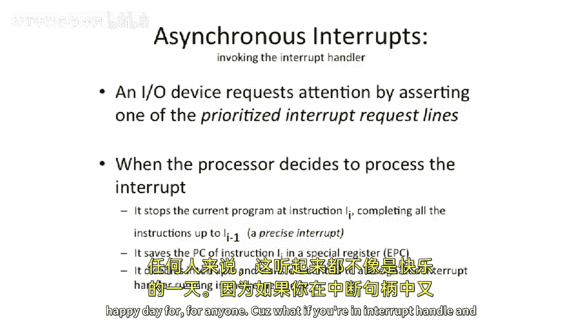
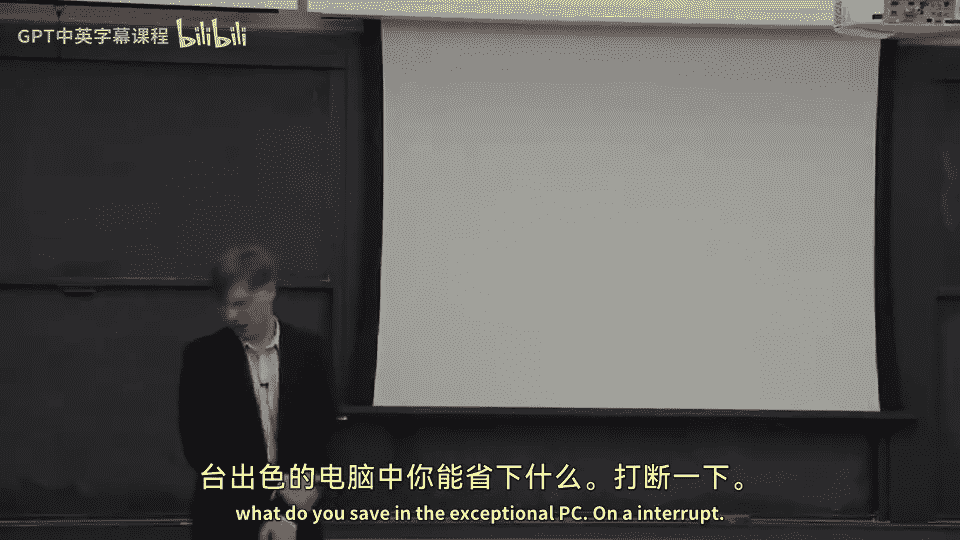
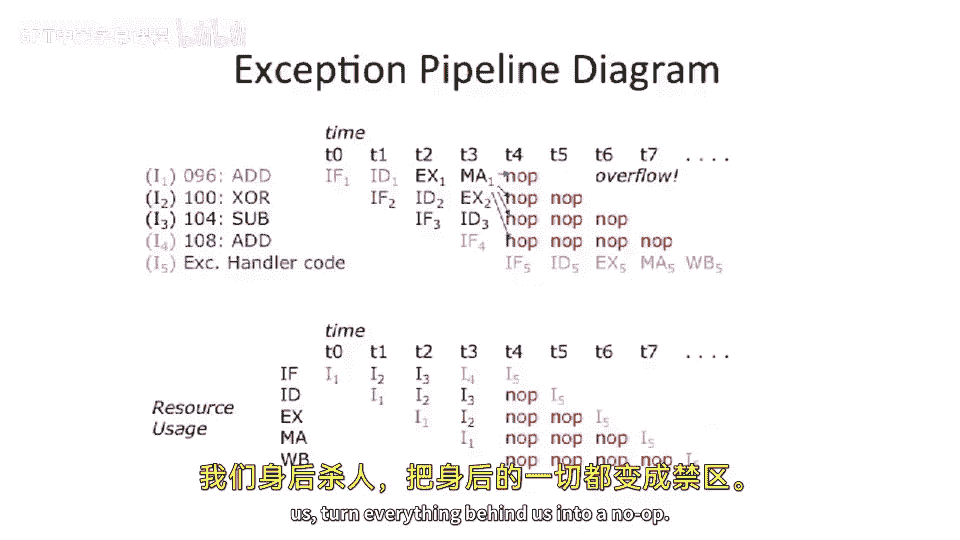

# 【计算机体系结构】普林斯顿—中英字幕 p25 24_04_interrupts-and-exceptions -BV1ii421D7WR_p25-

And let's start talking about。Exceptions and interrupts。

And then we're gonna to start talking about supercals， too。

 So we'll start talking about out of order supercals。

So how do you actually start to execute instructions when they're not in programmatic order。

 And when you first hear about this， you're say， well， how is that possible， You know。

 you shouldn't be able to execute instructions out of order， but it's very， it's relatively easy。

 You can actually just， you know， execute out of order。 Maybe you want to commit them in order。

 That may even be optional。But let's， let's start off by talking about。Interrupts。So what's an inter。

So an an interrupt is。Typically， some。External or internal event that happens。

And it may be synchronous to instruction， or it may just be some external thing that happens that is going to redirect your control flow somewhere else for a little bit of time。

 And then it'll come back to the instruction that you were at before。So here's our program。

 It's executing， happily executing instruction。I -1， and it's going to execute instruction I。

 instruction I。Doesn't actually commit。 Instead， we vector over here to an interrupt handler。

Which is also some sequence of instructions that processes some problem， let's say。

 with instruction I。And then when it's done， itll， it'll come back here。

Reexec instruction 1 or instruction I， maybe maybe not。

 we'll see why theres some cases that you may not actually go to reex this instruction if it has a fatal fault and then continue on。

Typically， I wanted to point out that a lot of times this is done sort of for system level code or operating system level code or hypervisor level code。

 that you'll jump someplace else。 So a good example of this is a timer interrupt on a processor goes off andll re vector you to someplace else where you have to sort of update the internal time of the machine。

 and then you go back to the instruction sequence that you were executing before。So let'。

 let's look at some of these causes， so。We'll name the first set of interrupts here。

 asynchronous interrupts， or some people call these external events or external interrupts。

And some good examples， as I said before， are devices cause interrupts or something like the program will interrupt timer on X 86 processor will cause a timer tick every once in a while。

 or every 100 times a second is， is pretty。You probable other devices， you know。

 your network card gets a packet in on it， and the packet needs to be processed。

 So it means you read off the network can be put into Ram somewhere。Hardware failures。

 So things like ECC memory errors。 So it's error correcting code， memory errors。

 And your main memory will sometimes cause interrupts to happen or asynchronous events to happen。

Synchronous things， sometimes people call these exceptions or traps。

I'm actually calling all these things interrupts because from a naming perspective。

 if you read different architectural manuals， they all rename these things slightly different。

 and there is no sort of common utilization of the terms。 But if you're。

 if you're using something like X 86， a synchronous interrupts is usually called either trap or an exception。

 But that's not common across all other architectures that are not X 86。

So some good examples of this is if you。Try to execute an instruction。

 which is not in the I SA manual。It's some garly。Garblely good of bits on， on the disk。

 So it was error code effectively or some non valid instruction。

 You'll get a legal instruction exception。Or if you're trying to execute。

 let's say an operating system level instruction。 We haven't talked about this in great detail。

 We'll touch on this later in the course。 But if you're trying to go execute some instruction that only the operating system should be able to execute。

 But you're executing it from your user program， then you're trying to execute something like a privilege instruction。

 That's a good way to have this happen。 arithmetic overflow。

 some architectures have it when the precision of your numbers。

EFs outside the scope of what you can actually accurately represent。

 You'll get an overflow exception or underflow exception。诶。

Similar sorts of things can happen in the floating point unit。

 So a great example of this is if you end up what are called deormalized numbers。

 So in floating point numbers， this means you basically have also lost precision in your floating point unit。

 So you， you follow the range of numbers that can represent very well and you end up in this other space that are called deormalized numbers。

 you'll get an exception。 usually other sorts of things that fall in this case are things like divide by 0。

If you try divide by 0， you'll sometimes get exceptions。 and you can do that。 That's a great way。

 If you on your X 86。 If you guys want to run a program， write a simple C program， take some number。

 divided by 0 and then go and run the program， you'll get a print out。 The operating system will。

 you'll get an exception。 The O S will print out divide by 0 fault。😊，And your program will stop。

 it'll kill your program。Unallineed memory， some architectures。

Don't allow you to access memory in an unaligned manner。 Some architectures do。

 So something like mips。 the miPS instruction said。

 if you go to try to execute a unaligned instruction sequence or unaligned load will say on the earlier versions of mips。

 you'll actually get a unaligned memory access。Later， actually， later Mips have it as a option。

 You can either have have it to take a trap or not take a trap。Common thing page faults。

 So we'll be talking about paging later in this course。

 But if you go to try to access some piece of memory and the memory is not mapped in correctly。

 So you you just can't the machine physically can't go find memory。 You'll take a trap。

 And then finally， things like system calls or interrupts on X 86。 There's an instruction called int。

 which actually causes a just interrupt to occur。 And then it takes as a parameter or a number。

 So that's how system calls have traditionally worked on X 86。

 They later replaced it with actually an instruction called cis enter。

 which does a similar sort of thing with a little bit cleaner semantics。So I think we， we， we， oh。

 actually there'1。1 to talk about asynchronous interrupts is。With asynchous interrupts。

 it's hard to know when to deliver the instruct， deliver the interrupt。

Becauseuse it's not pegged to a specific instruction。

 And if your instructions are going on the pipeline。

 you don't necessarily know whether to tag it to the first instruction that's in the pipe。

 I think it's at of the fetch stage。 I think it's at the execute stage。

 I think it's at the right back stage。 So that's， that's， that's a challenge。

 Another important thing to think about with asynchronous interrupts is sometimes multiple of them go off at the same time。

 So let'll say your timer interrupt goes off at time T equals 0。

 Your network card gets to pack it in and someone hits the keyboard。 exactly at the same time。Well。

 which， should happen， Which should you actually go handle。Typically。

 machines have a prioritized interrupt request mechanism。

 So there will be some sort of priority encoder there。

 which will determine which is the highest priority。 Some of them。

 some machines will actually have reprogrammable priority interrupt。Encoders effectively。

 which will allow you allow the system software， the operating system to decide what is the highest priority interrupt to go take in that case。

Sometimes。Machines will just sort of make a decision or the architects of the machine will sort make a decision and say these classes of interrupts are not asynchous interrupts are not very easy to handle。

 So we'll just sort of put those in the sort of lower priority bucket。 And then some smaller set。

 you'll actually be able to sort of re。Reprioritize， if you will。Oh， oh yeah。

 So I wanted to talk about this。 What actually happens。When you take an interrupt。

ItFrom a hardware mechanism perspective。 So the this is a very idealized view。

 But from a mechanical perspective， things need to happen in the machine。

 There's some state that needs to be updated。 First thing that needs to happen is you should basically stop the program at some point。

And。You should try to save the program counter somewhere。Cause if we want to come back to， let's say。

 the instruction that took the interrupt， we need to know where to come back to。

 But we're gonna go and execute some other piece of code in the meantime。

So our we can't just save it in the program counter。 We need to save it off。

 And that's typically called either an exceptional PC。 So EP。

 that's what it's called on on a MIPS processor on X 86。 And remember what it does。

 I think it actually gets pushed onto a system stack。 So it gets put into memory somewhere and。

If you look at something like Mips， one of the tricky things here is all of your registers。

Are still live from the previous instruction sequence here。 So all of a sudden， you。

 you jump into a new piece of code。And all your instructions are still。

 or all your registers are still live。 They have values you can't throw away。And you're in。

The interrupt exception handler， What do you do。Well， theres， there's different mechanisms to this。

 to have this happen。 Some architectures， something like mips actually reserves two registers that are only allowed to be used by inter handlers。

 This is actually a pretty poor solution， to my opinion。So they， they save off two registers。

 I believe it is somewhere high。 It's like maybe 28 and 29。

 Reg 20 and 29 are not allowed to be used by the basically operating system or the user code。

 And it's only used by interprs in the operating system to save off state。

And what happens in that case is you could use those registers to basically take the other registers。

 Comp some addresses and do a store because if you recall on， on mips。

 you need to have an address to do the store to。 So you compose the address into， let's say。

 register 28 and then use that as the store address and you can store off all of the other registers into memory somewhere。

And then you can unwind that back when you're， when you're going to return from the interrupt。

So it's a complicated dance。 something like X 86。 There's some hardware mechanisms there which will actually take it and take it a lot of your registers and put them onto a inmemory stack for you。

 So its typically what's either a push a， which is a push pushes all the register state onto the stack in a pop a。

 which pops it off。 That's not actually required， though there's other some operating systems don't actually do push a pop pay。

 better operating systems or more modern operating systems will actually only save off what is strictly needed。

That's something， something to think about。One other important thing here。Typically。

 when an interrupt occurs， you probably want to mask other interrupts from happening。So this is。

 this is a really hard problem to solve as who have interrupt inside of an interrupt handler。Oh。

And doesn sound like， a happy day for， for anyone。 Cause what if yourre handler。

 another extra learnnar comes in， What do you， what do you do。

 You can't save the exceptional PC into the exceptional PC state now。

 because you've already saved the the old program counter into there。

 You can't take that second interrupt inside that。 So you can't necessarily nest interrupts。😊。

Very easily。 So what， what people do for this is one solution actually。

 is to take the exceptional PC and put it into memory somewhere。And once you've done that。

Then you can turn interrupts back on inside the interruptper and can take more interrupts inside the innerpr。

Alternatively， if you know that the interrupt is gonna resolve itself very quickly。

 you can just return， you can just leave interrupts masks the whole time that the interrupt handler is happening。

 And when it's done just the return from interrupt instruction， usually turns off the interrupt。

 or excuse turns back on the interrupts， if you will。 So itll re enableable interrupts。

So you to be a little careful there。 There is with interrupts inside of interrupts happening。 So。

 so that's， that's a great question。 So what do you save in the exceptional PC。😊。

On a interruptse。 So yeah， that's， that' that'， that's。

 So if you're have instructions sort of marching down the pipe in a two way in order super scholar will say you're。

 you're gonna save the PC of the instruction。That took the interrupt。嗯。Some。

Architectures define this differently。 If you go look at something like X 86， typically。

 what gets saved in the exceptional PC is the next instruction to execute。

So it's is is really dependent on architectures。 Some architectures will save the address in the exceptional PC of the next instruction and program order to execute。

Some things will save。The address of the instruction that actually took the trap。

And as far as or took the exception or the interrupt。So it's a little bit of a trade off there。

 One of the thing that's actually hard is if you have a branch。That takes。An exception。

Do you store the target of the branch location in the exceptional PC or do you。Yeah。

 you have to sort of resolve the branch first。 So that's one reason actually。

 why lots of architectures favor just storing the PC of the instruction that took the trap and not the sort of quote unquote。

 next instruction。So I， I actually favor storing the in PC of the instruction that took the。

 the trap and not the destination of that。Synchronous interrupts。Similar sort of thing。

Sometimes the handler wants to resume after sort of an instruction。

 so it might have to add PC plus 4 if you have an architecture， exceptional PC plus 4。

 if you need to jump over the instruction， for instance。Something I did want。 So here。

 this is the next question that came up was。What does this look like in a pipeline？

And when do you know to actually process the in。So here we have， a five stage pipe。

 So it's a little bit easier pipeline。And we can see。This。

 these bubbles here are actually different types of。

Interrupts or exceptions that can come out of the pipe。At different locations。 So out in front here。

嗯。We can have， maybe。PC address exception。 What do I mean by that？ Well。

 some architectures won't allow you to execute， let's say， code out of。Certain regions of memory。

So an example of this actually is in the 64 B extension of X 86。The 64 extension of X A 6。

 There's what they call the memory hole。So， between。

What people call positive memory and negative memory。 So the top bit being set。

There's a big chunk of memory， which is no one's allowed to execute out of or it's not math。

 It's not real memory。 So they have a 64 B address space。

 but they only use 42 B of that 64 B address space。

 So if you have any bits in the middle which are not set correctly。

 you're basically gonna be executing out of the memory hole。

 And that's an example of something which can cause a PC address exception。

 So your PC sort of falls off the end of map to memory。 What do you do。

You're in some piece of memory。 You're in some address， which， by definition， is not a valid address。

Decode。Illegal， legal op code。 So it doesn't it isn't in your I S A manual。Lots of。

 lots of up coding encod space， usually。Most architectures purposely leave some space in there just for legal instructions or future expansion。

 if you will。And you want that， to interrupt。Overflows and underflows out of your A L U。

s a whole host。 If you have a floating point unit here of floating point exceptions。

 overflows underflows and deormalized sorts of instructions。🤧嗯。Data address exceptions。 Well。

 this could be if you're， let's say you have an unmapped memory address。

Or you do a unaligned loader store。 So basically， every stage of your pipe here can be generating some form of interrupt。

 And then there's also asynchronous interrupts， which we haven't drawn yet。Okay。

 so good first question here is， how do we handle。Multiple simultaneous。

Interrupts in different pipeline stages happening all at the same time。I agree。

 We should prioritize him。So what is the oldest instruction in the pipeline here。

So this is going to be the oldest instruction in the pipe。So let's， let's think about that。

 That means it's probably going want to kill everything behind it。If。

 if there is an exception that has happened here。So if we were sort of multiple things generating exceptions here at the same time。

The oldest thing， the oldest instruction in the pipe。

 instructions between the pipe longest is going to want to kill all the rest of the things。嗯。

Going forward， though， so from a priority perspective。

Which of these things are probably the highest priority。So do you think we should be。

Computing overflow errors。 if the instruction opt code is illegal。

Should we be even decoding the instruction if the address that we try to fetch from our instruction memory doesn't make any sense。

So the priority of sort of the， when you go to figure out where or which。

Exception or which interrupt is the cause of the exception should go this way。From left to right。

 And then the。You're going want to actually kill going backwards。So let's， let's。

We's skip that question for a second and look at the drawing。

So what you'll see here is we're actually going to just remember。That we took。Some exception for a。

Particular instruction。 And just pipe it forward。And then what we're gonna do is we're basically gonna to say at the end of the pipe。

 once we know everything has happened。We're going to call this the commit point。

And that's going to feedback the other way， killing everything。Now。Why do we put the commit point。

Here。Could we put the commit point， let's say。In this stage of the pipe， in the execute stage。Sos。

 let's define the commit point。 The commit point is the point at which architectural state of the machine is committed to the is committed and。

Now， that may not be in the register file yet， because by definition， in this point here。

 it's not in the register file， It doesn't get there to the to the right back stage。

 but nothing can change。 We're not。 We can't。 We can't take a branch。 We can't redirect。

 We can't take any more exceptions。Well， by that definition。

 we can't put the commit point here because further。Exceptions can happen after the commit point。

 If we pull the commit point back。There are machines which do pull the commit point back。You will。

 you will see when we start talking about super out of order superscales。

 we typically like to have the commit point at the end。Cause or or near the end。

 because then you can sort of see if everything's resolved。

 You could handle your interrupts exceptions and have exceptions going on in the pipe as long as possible。

 And if you try to pull your commit point early， that forces。

You to actually resolve of whether a exception is going to happen for a particular instruction relatively early in the pipe。

So if we want to pull this。Forward to stage。We would have to basically check whether the address of a loader store is valid in this pipe stage。

That may be possible because we finished the calculation of the address right here。

But we haven't necessarily， let's say， done the T O B lookup。

 But we could pull the T O B look up earlier or something like that that is possible。 And。

 and we'll see that some architectures try to pull that early。

 Some architectures also try to have imprecise exceptions。This is a scary， scary place。

 We're not gonna be talking about this very much。 We're gonna be talking about precise exceptions。

 mostly in this class， But an imprecise exception is one where instructions are going on the pipe。😰。

You've basically let the instruction sort of pass the commit point。

 and you tag the exception to the wrong instruction effectively。 It's not， not precise。

 You can't stop on a dime。Architectures， there are some embedded processors that do things like that。

And it's probably not the wisest thing to do if you want to run a real operating system。

But like I said， yes， So commit point being close to the end is probably a good place。

 So at least after all your exceptions are done。 So by the time we get to this red dash line here。

 So we're after。呃。The computation of the exceptional PC and everything。

 we know that we're going to be committing。Or we， or at least we have a thumbs up or a thumbs down。

And if it's a thumbs down， we kill everything behind here。One thing I did want to say is。Cause。

What does that register do， Well， that register tells us。Why did we take the exception。

So it's a priority encoder which prioritizes， as we said， this direction。

And will determine the cause， of the exception。Asynchronous interrupts。Hm。

There's different places to wire this thing。 You just sort of have to tag it to something。

 But you have to make sure you actually take it。 So the simplest thing to do is just to put it into this big logic at the end of the pipe here at the commit point and have the asynchronous interrupt。

 show up at the end of the pipe。 Not all pipes do this。

 Some pipes will actually inject to asynchronous interrupt at the beginning of the pipe allow it to go down the end and arbitrate like everything else here at the end stage of the pipe。

The simplest thing to do is to have it come in here。

 And that's because otherwise you might drop this asynchronous interrupt on the ground or not actually take theynchronous interrupt。

 You want to make sure you actually have a chance to take it。Exceptional PC。Takes the PC and。

 and pipes it forward and saves that in a register。 But this only gets loaded on。

A exception or interrupt happening。Okay， so that's， that's commit points。That's， that's important。

For。Out of our supercals， because we're gonna have to start thinking about where is the commit point of a processor。

 And it may not be。Where we want it。Or it's possible that we will not be able to put the commit point anywhere in the processor。

And actually， have the processor work。 So today， we're gonna to look at a processor where it's not possible to have precise exceptions。

 So there is no line we can cut and say this is the commit point。Let's see。 So we。

 we covered all this。Speculation。This is going back to like our example of PC plus 4。

 Do we want to assume the exception is going happen。Or the inter is going to happen or not。

So we're calling it an exception for a reason。 It is the exceptional case。 It is not the common case。

 So we want to somehow predict。When our branch picture tells us or PC plus4 or fall through or PC。

 you know， the next instruction， we do not want to just have。

 we don't have to have to wait to the end of the pipe to know whether an exception is taken or not before we try to go get the next instruction。

One thing。When we start to go to out of order pipelines。

 we're going to start to need some recovery mechanism here。

We're gonna be processing instructions out of order。So if a。

 we might be taking to interrupt for an instruction after it， it's let's say。

 subsequent instructions。Have either committed or sort of start to go down the pipe。

 And you start to get some out of order time questions。

So we're to look at a few different solutions to this for recovery。 In our， in our simple cases。

 we just basically flush the pipe。嗯。And kill everything behind us。 In more complicated things。

 we're actually gonna have extra register files that are basically going to be shadow register files。

 They're gonna keep track of everything that's going on in the processor of what should have happened。

And then we're gonna dump that into our true architectural， excuse me。

 into our physical register file。 And we'll look at that maybe today or next class。We should bypass。

 Bypassing is good。 You should not have to wait to the end of the pipe。Okay， so let's look。At。

A time diagram here of an ad that takes an overflow。Instruction 1 here。Is an ad。

And we speculate that。 It is not。Take any sort of exception。So we fetch the next instruction。

 We start sticking out down the pipe。In the in the execute stage of the pipe。

 we determine that there is an overflow。But as we said， as we said。

 we don't actually try to do anything about this until the commit stage of the pipe。 So in。

 in our simple pipe， our commit stage is at the end of this memory stage。

So we actually pipedd forward one stage。 At that point， we restart the front of the pipe。

 we start fetching。The handler code。The exceptional handler code。

 And we're going to basically kill behind us， turn everything behind us into a No op。

So。Let's say we're bypassing out of EX1 here into the。Well， okay。

 let's say you we go to this one instead。Or， we can come out of here。

' say we're bypasing out of the memory stage or the the memory stage back to the register fetch stage of instruction 3。

I think that's what you just asked about。What's gonna happen is we're gonna let that bypass happen。

 We're gonna let that data come around through the bypass network。 But what's gonna happen is we're。

 at the same time， we're sending the kill kill signal behind us in the pipe。

Or instruction one is gonna to be killing everything behind it in the pipe。

 So we're gonna bypass the data around。 It's gonna get bypas。 It's gonna end up in。

 in the pipeline register at the end of that cycle。

 but it's gonna be killed basically the end of that cycle。 A better example is actually here。

 let's say。It bypasses to instruction 2。From the execute stage to the decode stage of the pipe。

That's actually gonna get loaded into the pipeline register of the fetched operaand。

 And that's gonna go forward into the execute stage E X 2 here。For instruction 2。 So we bypassed。

 We started executing Q the instruction。 Everything was going fine。But then。We just come along。

 we kill it。So。We're speculatively executing it's called。

 So we it's a speculative execution pipeline。 We are assuming and we're predicting that everything is。

 is going fine。 and then we're gonna be killing behind us when something goes wrong。

