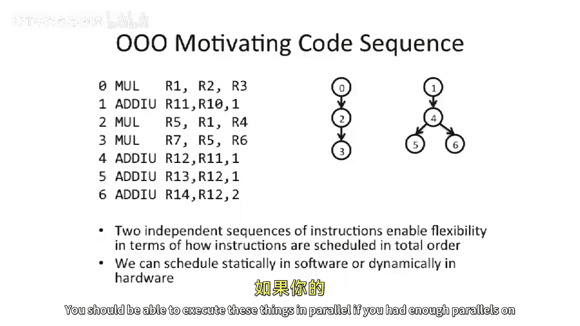

# 【计算机体系结构】普林斯顿—中英字幕 p27 26_01_review-of-out-of-order-processors -BV1ii421D7WR_p27-

Okay， so today we're going pick up where we left off and continue talking about。

Out of order processors。And things are start to get a little complicated。But that's good。

We don't want to build。Well， we want to try to build simple things。

 but we also want to build high performance things， so。Let's start talking about some。

More complex out of order processors than we talked about talked about last time。

So last time we talked about。In order order in order processors， and we introduced to scoreboard。

And then， we。Started to talk some about in order in order where the front of the machine is in order and the issue is in order。

But the right back and the commit are out of order。It also uses scoreboard。And today。

 we're going to start talking about。Things that even have higher performance。 and this is sort of。

Roughly put in a sort of order of performance and sort of what people build。

 they actually want high performance in their computer systems。

And we're gonna start talking about in order in the front end， out of order in the back end。

 And we're have to introduce things like a reorder buffer and a store buffer。

Then we're going to talk about a machine which has in order front end and all the backstages of are out of order。

 which may not make a whole lot of sense because out of order commit starts to look a little odd。

 Likewise， that's the case for this processor。嗯。And。

 and so why does out of order commit look a little odd。 Well。

 when you start to have out of order commit， it's very possible that you could。

 if you want to have a precise exceptions point。It。

 depending on how you sort of implement that processor and depending on where you put the commit points。

 if you put the commit points， let's say at the end of the pipe， it's very possible you'll。

Commit results to your register file or your architectural register file before you know that those results aren't good。

 so you've basically just executed instructions and committed information。

 which is not correct in program order and we'll show some examples of that today。And then finally。

 we're gonna talk about sort of the， the highest performance thing here， which is a in order。Ftch。

Out of order issue， out of order， execute。And right back。 And then finally， an in order commit。

 So this， you can have precise exceptions， have a commit point at the end of the pipe。 And for this。

 we need to introduce。On issue Q， which is where the instructions sort of live for a while as they are getting ready to go issue。

 and this allows us to do out of order issue。Just to recall back our motivating examples。

 example we're going to be using this example throughout today's lecture again。

Two different instruction code sequences， not dependent on each other。

 You should be able to execute these things in parallel if you had enough parallel in your machine。

And， and we talked about this all。 So I'm gonna skip past the in order， in order in order machine。

And get to in order， in order， front end and issue and out of order right back and commit。

