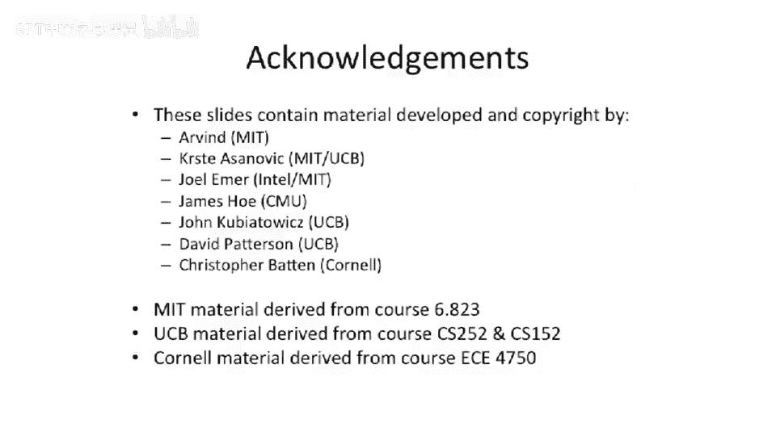

# 【计算机体系结构】普林斯顿—中英字幕 p29 28_03_i2o1-processors -BV1ii421D7WR_p29-

Okay， so now we get to move on to even more complicated processors。In order issue， or excuse me。

 in order frontend， in order issue out of order right back and in order to commit。Okay。

 so this is going to solve some problems that we have。

The biggest problem it's going to solve is it's going to solve a problem of。Precise exceptions。

 We can now have exceptions sort of all the way at the end because we we're committing data in order。

So let's， let's take a look。That should probably have a line there。

You canSribble in it on your your own drawings。 Okay， so let's。

 let's let's take a look at some other structures we've added to this diagram to。

 to make life a little bit more interesting。O， the front end looks pretty much the same。 We。

 we split the load in the store apart into two separate pipes pipes here。

 a load pipe and a store pipe。嗯。And the store pipe is shorter because it just has to basically do a store。

 We'll say maybe it's two stages。 doesn't doesn't matter that much。

 It's not that material this in this drawing。 But something interesting to look at here is we added a bunch of extra。

Boxes over here。On the right side of this foil。So let's define these things。

 So we had our architectural register file， which is our committed state to the processor。

And we added a second register file。😡，Typically called a physical register file。Or。P Rf。

Sometimes people call this a future file。And you'll see that in the literature。

 There's some papers published about future files。 And the reason it's called a future file is。

It's basically executing specully in the future。 The values in here have not been committed to the processor。

 They can be thrown out。If you take an exception， if a branch happens， for a variety of reasons。

These are speculative you're not guaranteed to actually have to keep those。

 The architecture register file， though， is committed state。Okay， we added。

 we had two other structures here。Something we call a ROB or a reorder buffer。

And we added a finished store buffer。So let's talk about the reorder buffer first。

So in this pipeline， we actually want。Instructions to basically execute。

And write the physical register file out of order。😡，Because this is out of order processor。

 We'd like that to happen。 We're， we're basically making the。

executionec and the right back out of order。But we want the commit to be in order。

So we need some structure that is going to guarantee that the right back。

 the right to the architectural register file。Happens in order。

 And that's what the R O B is going to do。 So what's going keep is it's going keep completed instructions。

And that could come in out of order。And。Are going to leave in order。So。

Things come into this out of order， and they。Go out of it in order。

 And this is a reordering structure。 It's typically a table。That is sort of。Rrit in。嗯。Well。

 we'll talk about that a second。'， it's written in different places in the pipe for。

 for a couple different reasons， but。You， you typically want to keep track of the instructions in order somehow。

 And then when you go to pull out of the reor buffer， you want to pull in order out of it。

 But the rights and the tracking of the information that happens to it can be。Out of order。

And the other thing here is this finished store buffer。 The reason we have this finished door buffer。

Is if we have a store operation？We don't want to have to have the commit points。Like here。😡。

So early in the pipe。Because once you store a main memory， it's really hard to go get that back。

 possibly even impossible。 It probably is impossible。 You wrote to the main。 if。

 if you had the old value and you write overwrite it with the new value。

 the old value is forever gone in your main memory。 You can't get it back。

So the solution to that is instead of doing the store here。

You have the store happen later in the pipe， and you just sort of remember what you're supposed to do。

 the address and the data that's supposed to be happening。

And for anybody who cares that store has happened if it hits this future store buffer。

So you probably need to have your loads check that future store buffer。

With higher priority than your cash。Because there could be a store living in that。Location。Okay。

 so's， that's， that's the sort of。Structures here，'s。

 let's talk about where things get read and written。

This was really addressing your architectural register file。Isn't red anywhere？What's up about that？

Who。We're going use the physical register file for all the intermediate values in our pipeline。

 And the architectural register file is only there if we take some sort of， let's say。

 branch or interrupt。And that's the only time we actually need to go。Take this information。

 And we probably want to dump it into the physical register file or dump it into the future file when an interrupt happens or when a branch mis predictdt happens。

 but otherwise。It doesn't have to be red。Scoreboard is the same as usual。

Read and write in your register fetch stage， written at the write back stage。

And that's no longer tracking。Architectural register file registers is now tracking physical register file registers。

Reorder buffer。This one。Has a whole bunch of different places。 It gets read in ruin。

 Pri what's going to happen is when the instruction。Is issued。

 So it goes from the decode stage to the issue stage。

 that's going to allocate a location in the reorder buffer for the entry in the reorder buffer。

And then at the ends of the pipe。Once the value completes。

 we have to change some state information in the reorder buffer saying， oh， that。

Output register for particular instruction is now ready。

And then once we actually go to do the commit。We have to basically clean that instruction out of the reortor buffer。

The future store buffer。Is written just sort of at the end of the pipe here and cleaned when the the actually post domain memory。

It's a little hard to draw this， but that information。Somehow through the memory system。

 if you have a load。That reads from that。 We'll probably read it either in L 0 or L 1 in a sort of bypassing mode。

 if you will。 It'll go check that structure。 We'll talk more about that next class。Okay， so。

Here is sort of a basic reorder buffer if you go look in some books。

 they have a lot more data stored in a reorder buffer。

 but this is kind of the minimal reorder buffer you need for an out of our pipe。

And this rottor buffer is used to keep track。Of in order， committing of instructions。

But things will be put into it out of order。So just。

 let's first talk about the sort of information in here。We keep track of state。

So what are mean by state。 So this is the state of an instruction。 So each one of these entries here。

Is a different inf instruction in the pipeline。And we're actually going to store。

In order into the reorder buffer。And we're going to keep it sort as acute cute。So this picture here。

This state is， we'll say dash dashash means free。And P means pending and F means finished。

Prochoff chose two F words there that's a little confusing。But the。Newest instruction is， if we。

 if we have a new instruction execute， it's going to end up here in this century。

 And when it instruction。Commits or retires。It's going to remove this entry， the bottom entry。

 So we basically have a sort of circular buffer running around as a head in the tail pointer。

 sort of chasing each other in this data structure。So tell head。嗯。What's interesting about this？

And why this is cool is because let's take a look at this instruction right here。

This instruction has an F， which means it's， it's finish。That it's not pending in the pipe。😡。

It's hit the reorder buffer。 The data is stored in the physical register file。And。

But instructions that are older than it， which would be these two instructions。

Are still pending in the pipe。 So let's say these are two multiplies， and this is an ad。

So this ad is basically already done。 These two instructions。

 which are these long laing instructions， are still pending in the pipe。In this cycle。

 we cannot commit anything。So we only commit instructions when the oldest instruction。

Becomes finished。And that's when we can commit and remove something from the reorder buffer。

Some other things we need to keep track of here。We have a bit here， S for speculative。

So what this means is if you have something like a branch。

You mark instructions that are newer than the branch。With a speculative bit。

So what this is saying is if that branch mispredts。

 it just gives you a convenient place to go find all the dependent instructions on it。

 to go flush and kill。 So if you have， if you have。

 let's say one branch is allowed in the pipe at a time and the branch mispredicts。

What you can do is basically look for all the entries in here that have ones。

And just invalidate them a hoc and just flush the entire pipe。

 You don't have to worry about there being some value you need to worry about。

 So it's just a commute way to figure out which instruction is speculative。

 And if the branch is mispredicted， what you have to kill。Sttores。

 we'll talk about this in a few more slides later。 But store bit。

 what we really going to do is this is going say if this instruction is a store。

It knows that we need to do something else with it。

 We need to do something with the future store buffer when it gets to the end of the pipe。

 It's sort of a place to put it。 And here's the actual business。

 the business part of the Rior buffer。V， which says that the instruction actually writes a register。

And then， finally。Once the。Instruction goes all the way to the end of the pipe。

It is going to fill in a location in here， which is the physical register file entry。

 that is the destination。Of that value。 So this。Basically allows the pipeline to know。

Where to go find the actual value， We don't actually store the actual values in here。

 We just store a pointer into the physical register file， because it's fewer bits。

And this can tell us， oh， well， go， go look， let's say。When this when this instruction here。

 which is already finished， is ready to go retire or it's ready to go commit。

Go look in physical register file number 7 or something like that。

 And it goes and pulls that value out from there。So。

 so a good discussion of this is in the Shen Lapasti book。That。

Is is sort of supplemental material for this， this class。Okay， so let's， let's talk about the。

They actually have questions first before we move on because reorder buffer is is a key data structure here。

 and it's a complicated one。Okay， great。Next next structure we added was the finished store buffer。

And this could actually be multiple entries。 But for this pipe， let's to say there's only one。

 So we're only allowed to have one store pending in this pipeline because it makes life a little bit easier。

Things you sort of need to actually have here is you need to have both the address and the data。

 whether it's valid。Probably the code maybe the app code will tell you if it's store by， store word。

Sort of data with types of things。嗯。And that's most of what I wanted to say here。If we this is。

 this is what I was saying before is if you allow multiple loads and stores in the pipe at the same time。

 you're gonna have to bypass from。The finished door buffer to the loads。And possibly even stores。

 if it has to write combine。 So you sort of stored to different parts of a word。

 you may even have to bypass that。Depending on how your pipe works。

Or you can assume that there's only one memory instruction valid in the pipe of a time。

 You can have one of these entries and you know， no loads can happen while a store happens。

 That's not very good performance。People probably would never actually build that。

 but that's something to think about。Okay， so now we get some more pipeline diagrams and run those pipeline diagrams。

And we're going to see how this is different。And what happens in the reorder buffer？

First thing I wanted to say here is this little R。That you see show up in these diagrams。

That means that。We've ridden the reorder buffer， but we're not ready to commit。So from here to there。

 we basically have this ad has we' in the rear buffer we're waiting for it to commit at the end of the pipe。

 but we can only commit in order so you can sort of seeCs are all lined up in time。

So we're only able to commit from left to right， and we can't reorder one of those。

 those C's relative to another， another C。嗯。Let's see what I want to say here。

 That was the main thing。The dependencies is the same。 It's the same code we've looked at before。啊。

That's what I wanted to say。Which one is up？Yes， it's this one。Okay。

 so here we have this ad writes register 12。Right there。This ad goes in reads Reg 12。

 so we have a read after write。Happening。What's interesting here is。

This read after write that's happening。The right happens there。 The read happens。 Let's say here。

That data is not in a bypass anywhere， or it's not in the forwarding logic of the processor。

That value is actually in the。呃。Physical register file。

So this is kind of showing an example here that data。

 when you're doing the bypass can come from bypass network locations。

 It can come from the physical register file。 and that those are sort of the two places that can come from。

 But you don't。 you can you can Everything else actually adhere surprisingly is basically coming from bypass except for that one location。

 So bypasssses end up being really important， but you can have data coming from the physical register file。

So could the C be here， could the C move over one， so it's committed order。And we only have to。

 we can only commit one thing at a time。In， in this basic pipe， more complex pipes。

 we're going to allow multiple commits at the same time when we start to mix。

Superscales without of order at the end of today's talk， we're going to be able to。

Think about trying to commit multiple things at the time at the same time。

 But we can't really do out of order。 So these has to be monotonically going that way。嗯。

Brief example here。 This is kind of kind of fun。 This is trying to show different entries in the reorder buffer。

And when those things get allocated。And largely what's going to happen is for a destination。

 so let's say。Instruction zero here。Eocs the reorder buffer。And our one becomes active。

 and it's a long lane to multiply。It doesn't show up。

 the circles here mean that the instruction is finished。 It's gone to the end of the pipe。

And it's ready to go。🤧嗯。You could have other things like this is an ad that happens to register 11。

It allocates， it finishes early， but it doesn't commit to late。

 So it has to stay in the reorder buffer。 So it takes up space in the reorder buffer。

And you can sort of see other examples of that these ads here finish relatively quickly。

 but can' they have to wait to commit in order， and they're basically dependent on this instruction here committing before they can go commit。

So it's a nice little structure that can track all of those things。Okay。

 let's look at commit points and if exceptions occur。嗯。

We're going to have the same example we had before。The mall here is going along。

And it write backs to the。Physical register file。Now you gonna say， whoa， it。

 it wrote the register file。 How can it take an exception at this point。

 I thought if it took exception， wasn't supposed to write the register file。

 But we have two register files。 So it writes the speculative state register file or the future file or the physical register file。

And this slash year means we don't actually commit that instruction。 So the commit doesn't。

 it doesn't happen。Now， we get to little look at sort of other inflight instructions to see what's going。

 what's going on here。 Can these other inflight instructions。

Potentially write information out of order。 And where can our commit point be。Well， here's this ad。

That before in the previous example， wrote。To the register file。

 And now it writes to the physical register file， but does not write the architectural register file。

 Instead， it enters the reorder buffer here to by the little R and just。

Sits there until it actually gets a chance to commit in order。

But that doesn't get a chance to commit， because a previous instruction。Kills。

 kills it and kill because it takes an exception and kills everything。

And then you can go and start some new instruction here。 Let's say that is the exception handler。

And fetch fetch that out here。One， one interesting thing about this example。

 actually that I wanted to say is。Sort of in this transition， lots of stuff。

 lots of state has to change in the machine。You've taken exception。

The architectural register file is correct。The physical register file。

Potentially has many incorrect information or many incorrect values in it。So on this transition。

 what's really gonna happen is you're gonna copy all of the state of the architectureural register file。

 All registers over on top of the physical register file。

 So you basically rolled back all of your speculative state and the machine in one file swoop。

Obviously， that can maybe be a little expensive， but you don't take get ups that often。

 You do take branches relatively often。 We'll talk about that in a second。 But what's nice。 that's。

 that's logically what's happening。 Sometimes people will actually commingle the architectural register file and the physical register file。

 and they just sort of keep pointers to different pieces of information。

 So you don't actually have to sort roll back information。 You just sort change the pointers。

 But for right now， let's model it as two complete set register files。

 We copy all the state from the。Archiecture register file to the physical register file on some form of rollback on an exception or a branch。

Brenches。So。What do how do we， how do we make the branch latency better or what do we do on a branch。

 First of all， So sort of ignore these bottom examples here， this is a different code sequence。

Then we've been looking at， this is not the multiply ad multiply ad and code sequenceence。

 instead this is a branch。So we have a branch。The branch commits。We know the branch is good。

But these instructions here are the fall through case for the branch。

This instruction here is the target for the branch。

So we need to squash all of these instructions in the reorder buffer。 Conveiently。

 we have a bit in the reorder buffer that says all the things that were dependent in the branch。

 If the branch is misspecd， just remove them from the reorder buffer and basically throw everything out of our or throw those entries out of the reorder buffer and validate them in the reorder buffer。

What gets a little interesting here is when do we start to execute the target？Well。

 let's say we compute the branch information here and。The execute stage。

And we can sort of redirect the， the fetch stage。That's okay。

But this squash is a little little bit odd because what this really says from a pipeline perspective is。

That you have to invalidate multiple entries in the reor buffer in one cycle。And this。

 to some extent， is a structural hazard on the reorder buffer。You might need know， many。

 many ports into that reorder buffer， or you need to at least keep the valid bits in some other extremely highly ported structure。

You could think about doing something even more interesting。Where you kill instructions early？

So the difference between this picture and this picture is once we compute and figure out that the。

Branch is taken。We just instantaneously squash all these instructions， and we。

Change the reorder buffer。Or we， we write to the reorder buffer killing all the speculative instructions。

Now， if you note， this doesn't actually help performance in this case。

Places where this can help performances if you have an out of order processor。

With that's a superscale processor， you could think they could try to sort of put other instructions。

In these locations in the pipe or try to restart earlier or have other things go on in the pipe。

 And you're just using less resources in the pipe。 So this is going to be the highest performance case。

This is sort going to be medium performance。Low performance。

You can have a way that you don't actually have to add extra ports to your reorder buffer。

And way you can do that is you let the inf instructions that are dead。

Continue going down the pipe until they get to the commit stage。

And only then do you clean them out of the pipe。And you clean out the reorder buffer。

So you sort of are waiting for these spec instructions to reach the commit stage and squash them there。

嗯。In this example， the performance of all three of these are the same。

 But I will say this is gonna be the lowest performance if you have a more complicated code sequence because you are basically using up a lot of pipeline resources。

 You're using entries in the reorder buffer。 You're using locations in the pipes that you could try to reuse for something else。

Okay， so as we said， we sort of have these three different cases in increasing complexity。

But you get some performance。Oh sorry， in decreasing complexity。呃。But increasing performance。So。

 so I， I think one thing that definitely comes up。 and this is probably gonna to make this multiported issue come up is if you start to have multiple branches in the pipe at the same time。

Then the simple case of just moving the tail pointer is not really gonna to work because you might mis predictdict one of the branches。

 but not the other branch。 that's gonna。Mess you up a little bit。嗯。Okay， so。What's。

Keep moving on here。Avoiding。Stalls due to storm misses。Okay， so youve got a store。In the pipe。

It takes a cash miss。And now it's clogging up the commit point of the processor。Because。

It's depending on how you want to look at this。Maybe you don't want to commit until that store has actually reached a main memory。

Because that's what you're going to call commit for that store。

 So you can't necessarily pull it out of the。Future store buffer because it's not able to actually sort of commit you。

 you try to pull it out the future store buffer and write to main memory。Or you write your cache。

 It doesn't ites your cache and takes a couple extra cycles。

 So we'll see like this here's a store word。 And let's say。It takes a few extra cycles here。

 three extra cycles stalling to actually go and write the level 2 cache， we'll say。

Or pull in the data from the level 2 cache into the L1 cache merge there。So there's。

 there's a way to solve that。And what's bad about this is because we're doing in order commit。

 it pushes out the rest of these instructions。Later。And that's kind of bad。

So what you can think about doing is adding an extra stage in the pipe。And just allowing the。

Sor a miss and。Basically， movie past the commit stage saying this door has committed。

You sort of mark it down and say， well， it's committed。 I don't have to worry about this anymore。

 And you basically can decouple the， the end of the pipe here or the store actually happening to memory until till later。

 And the what it allows you to do is you basically have commit in order。You can pull back。

These things earlier。呃。This is like a typo， this should probably be back one。And then。You can。

 you can commit in order and have that store sort of still outstanding out to main memory。 One。

 one important thing you need to do here is， as I have said before， you。

 if you let another load into the pipe。Or a store into the pipe。

 you're going to have to bypass out of this data structure and that data structure now back to the load stage of the pipe or the store stage of the pipe。

And that that adds extra wires into your out of order processor。

But we've basically decoupled store committal from。Or。

It's technically committed once it gets past this point。But it's not in main memory。But it's。

To everyone else and to the， the， the processor， it looks like it's been committed because you can。

 you try to go read the value and it's， it looks like it's committed。

