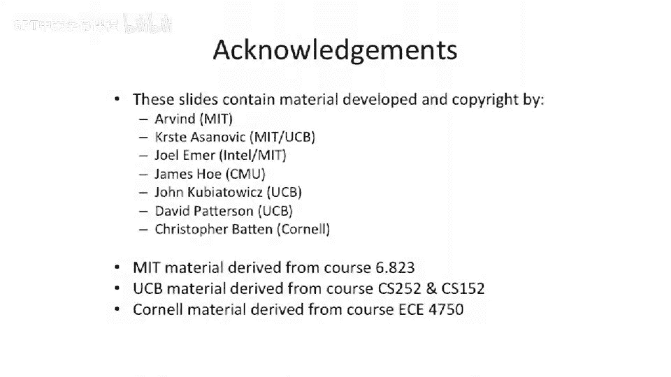

# 【计算机体系结构】普林斯顿—中英字幕 p30 29_04_io3-processors -BV1ii421D7WR_p30-

In order fetch。So we have an in order frontend， and we have out of order issue right back and commit。

So what this is going try to do is we're gonna try to fix some of the problems that we saw。Ohoops。

 here。Where we'll actually had。嗯。Let's say this instruction here， this ad。

Is waiting the issue because our issue was in order。😡，So that instruction could issue。

All of its inputs are ready。😡，Our 11。Was written in right there or something like that。

 So our 11 is ready。 It's ready to issue。But because we have in order issue， by definition。

 we can't issue out of order。So now let's look at a machine where we can issue out of order。

So we can actually move it to the execute units， do our register fetch out of order。So to do that。

 we actually have to add another data structure。In this data structure。

 we're going to call the issue Q。And this is going to be。Something like an associative fiIO。

 but it's not going to be fiIO。 We're basically going store instructions into it。

 And then we'rerere gonna put instructions into it in order because our fetch is in order or front end is in order。

But we're going to pull out of it out of order。😡，And but we have to be a little careful because when we go to pull out of that data structure。

 we have to make sure that the。All of the appropriate registers are ready。

So all our dependencies are ready， or at least somewhere in the bypass。

 or we can go pick it off the bypass by time。 it actually needs the value。Or in our bypass stage。

Let's take a look here。We still have a architectural register file。

 We got rid of all of that complex reorder buffer stuff on this example。

 So we don't have a reorder buffer。 don't have a store buffer。 We have out of order commit。

 So we're gonna have the same problems we had before with precise exceptions in this pipe。But we。

 this is gonna give us sort of easy introduction to understanding what the issue queue looks like。

So the issue queue。Gets written when instructions enter it。So sort of at the decocode stage。

 this is itself is a register structure。 So it's like flip flops in here and a bunch of logic and stuff。

So you can't just go from the stage to this stage of the pipe without having any。Registers。So个。

Written there。 And things are basically going to update into this。

So when things actually end up in the architectural register file。

 we're gonna mark bits in the issue queue saying， oh， that register you're waiting on。

 it's not ready。And if you get， let's say， two registers that are ready and youre dependent on two registers。

 you can issue。And we can issue out of order。嗯。Okay， so I have read right here in the issue stage。

Why do， why do I have that？ Well， when you actually go to issue it。

 you basically want to mark that instruction as， oh， yeah， I actually did issue this instruction。

 You want to sometimes people build this as actually remove the instruction from the issue queue in this basic case。

 we're gonna leave it in the issue queue until the end of the pipe。

 because we need some way to track the the liveness of the instruction。 But the the next processor。

 we're basically gonna。Think of it as sort of a。呃。I won't say PIFO because it's not strictly first in。

 first out， but it's a data structure where we could put stuff in and then move stuff out of So it's a buffer or a multi entry buffer。

Okay， let's， let's take a look inside the issue queue。 And this is assuming something like mips。So。

In our issue Q here， we're gonna have。First of all， we're going actually going to have the op code。

Because we're gonna have multiple instructions sort of gaining up in here。

 So it's possible that can be like。I don't know， in this case，1，2，3，4，5。

 There's five instructions sort of sitting in this， in this data structure。

So you sort of slack in is a buffer and slack in the front of your pipe effectively。

You might need the immediate values because that's sort of part of the opt or part of the instruction。

 And then then we're gonna basically have things for the three different。Registers。

And what we're going to put in here is we're going to put the register identifiers。Here。

' let's look at the sources first， because that makes a little more sense。

The V bit is going to say that this instruction。Needs the source。So it's possible that， as we said。

 you know， theres some like media instructions。 Don't read both source operas。So for an immediate。

 it's only one probably this valid that is going to be set， and this one's going to be 0。🤧嗯。The Pbit。

Is pending。 So what that means is somewhere。Later in the pipe。

There is a inf instruction that writes to that register。 So we're gonna。

Basically track that with a bit here， saying that is still pending。Now。

 the reason we actually have to keep that pending information and the validity information sort are separate。

 And why we need to keep both of them is it's possible that multiple instructions could light up。

Simultaneously as being ready to go。So if you have， let's say。

 two instructions that are both dependent only on Reg 5 and Reg 5 is not ready。 It's。

 it's the destination of a multiply。But then Reg 5 gets written。

 It's going to actually clear the pending bits。So it's no longer pending。

 and it might be in multiple places， so it might be like here and here， maybe even there。

 it's going to be clear the pending that's in whoever is trying to read Reg 5。And then。

Because we're only， let's say gonna have single issue on this processor。

 You can only pull one thing out at a time。 So you need to sort of pull one thing out and you need some way to leave the other instruction in the issue queue。

Having。All of its。Operans ready， so that's how you do that。Okay。

 so how do we figure out an instruction is ready。Well。We see if the， if it actually uses it。

 that the， the upper end。usess the particular opera end identifier。And we see if it's pending。

And then we have to check the other for two inputs， we need to check the two inputs。

And then we also have to make show there's no structural hazards somewhere else in the pipe。

 Like if we're trying to schedule right， right ports。 And we're gonna use the scoreboard to do that。

 The other thing is， if， if we want high performance。

We probably don't want to have to wait for values to get the end of the pipe。 So in reality， this。

 this is gonna get more complicated because it's going be these things plus information coming from the scoreboard。

Which says when a particular register identifier is ready。Or when a particular register is ready。

Let's talk about the destination here。This just tracks whether an instruction writes。

A destination or not。 And like I said in these， in these basic pipelines。

 we're going to leave instructions in the instruction queue until it gets to the end of the pipe。

 And when it gets to the end of the pipe。 This is where we go to check to see what other locations we need to sort of clear out。

 So if there's an instruction。 Let's say sitting here， which has the valid bit set。

 and it's rain to register 5 is a destination。When that instruction commits。

 we're going to clear it out of the issue queue。And we're going to say， oh， well， it wrote Reg 5。

 Let's scan through all these other places and look for places that say Reg 5。

 And if they say register 5， we are going to flip the pending bit from pending to not pending anymore。

And we're gonna remove。The instruction from the issue queue。Okay， so centralized versus distributed。

Issue cues in， in， in a sort of logical sense， in a perfect world， it's probably nice to have a big。

 centralized issue queue。😊，呃。You can scan over all the instructions。

 You don't have to sort of look around， but this can sometimes be harder to implement。

Because you have to put all of your instructions in one location。

And sometimes they don't necessarily sort of cross communicate very well。 like floating point units。

 They have floating point registers versus integer register files or like that。

 They don't necessarily need a whole lot of communication。

 So you could have distributed instruction cues where you sort of steer。 let's say。

 here the execute or A L U and memory apps to one of these for these functional units。

 and you have a different instruction queuee just for multiplies or something like that。

I'm gonna put a paper on the website for you guys all to reads Thomas Sulow's algorithm。

 It's a very famous paper。 And in that， they talk about distributed。Instruction cues。

 strangely enough， sort of the first place in literature that these instruction queuees showed up was around that time or in that paper。

 And they actually go straight to the distributed version and kind of skipped the centralized version。

 which I always found a little bit odd， but。Lots of people build centralized ones today。 One。

 one of the reasons that the I think the Tamaslo algorithm people went for this distributed one first is because they were actually implementing on multiple discrete chips。

 So they had a issue Q per chip。So they had like a floating point chip and a integer chip。

 and they steered the instructions。 and they didn't want to have to have one data structure that cross cross two chips。

 Today， we have， you know， lots of integration。 So don't have to worry about that as much。Okay。

 so I just wanted to briefly say this is the question that came up last time。And scoreboards。

If you have to worry about right have to write hazards in the pipe。

 the things we are talking about today， we didn't have to really worry about that。

 But this stuff we talk about next time。 we're gonna have to think about better scoreboards。

It looks the same as the previous scoreboard， but you might need to keep the functional unit。

 or you need to keep the functional unit。Number or some bits that represent the function unit。

 And then those marched down the pipe versus ones marching down the pipe。You have， let's say。

 different numbers， like 1，2，3， or you have other things marching down the pipe。

 That's only if you have to track right after right hazards。Okay。That was the quick aside？

Let's look at this in order。Fettch out of order， issue， out of order。

Right back in out of order commit processor in a pipeline diagram。

And I'm going show a new little thing in our pipeline diagram here。 We have a lowercase I。

Which means the instruction enters the issue queue。And then when it exits the issue Q。

 it just starts going down into the issue stage of the pipe。And。I think， what did I w。

 when I want to show， This is not that complicated of a drawing here。 I'm actually showing the。

 the issue Q， what is in the issue Q。 So I have two， excuse me，3 issue Q。Slots。

Because this is a relatively simplistic pipe。This first instruction， which goes to execute。

 register 2 and Reg 3 are just already ready。So don't have to worry about it。

 But an example of something that's more interesting， let's say， is。I don't know。

 where's it going one？Here we go。This will enter the issue queue。

 but Reg 12 does not become ready until late。So once that becomes， comes ready。

 we can basically start pulling things out of the issue queue and issue that instruction。

So that that shows up。 Let's see if we can show that here。Register or this 1412。 Okay。

 So this one here， we're waiting for。呃。That's to happen。 Let's see。Yeah， we， we're reading for no。

 where are the 12。This ad。Sply Niger Muslim long and wrong。Yes。

 that actually is what I wanted to show here， this is interesting。

That value actually becomes ready early。But。So it's actually happening here。

The value becomes ready at the end of this execute stage。But it can't go to issue。At that cycle。

 because there's something else issuing。 So it has to be pushed out。

 So we're only doing a single issue per cycle。 If we had multiple issues。

You can think of something more interesting happening here。Yeah， so this is， this is actually。

 this is a really complicated case， because if we pull this back。Let's say to here。

We get a right back。Hazard， the W would conflict with the other W。If we try to issue here。

 sorry if we issue here， if we try to issue here， we get a structural hazard on the issue。

 so it actually gets pushed way out there。So it's kind kind of a bummer。 So sometimes you just lose。

Okay so。Here's an interesting case。 So let's assume。

That all the instructions are preloaded into the issue queue。 So showing this。

 we have fetched to code issue issue issue。 And basically。

 these these just sort of singing in the issue queue。And then we start looking， what happens？

Does the performance get better than the previous example？So interestingly enough。

 even if you sort of issue everything into the pipe early and then just sort of fill up your issue queue。

 pulling out of the issue queue can still be a limiter。

 and the number of A L Us can still be a limiter。So ass other structural hazards。

 the performance of this code and this pipeline does not actually get any better。

Which is sort of interesting。 Youd think， oh， well。

 I don't have to wait for things to sort of dribblel into my instruction queue。

 I just sort of preload my instruction queuee。But the performance really really doesn't end up being better。

So this motivates us going to both out of order， mixed with duplication of structures。

 like maybe we can issue two instructions at the same time， and maybe we can have two ALUs。This is。

Motivates us having a super scholar。

