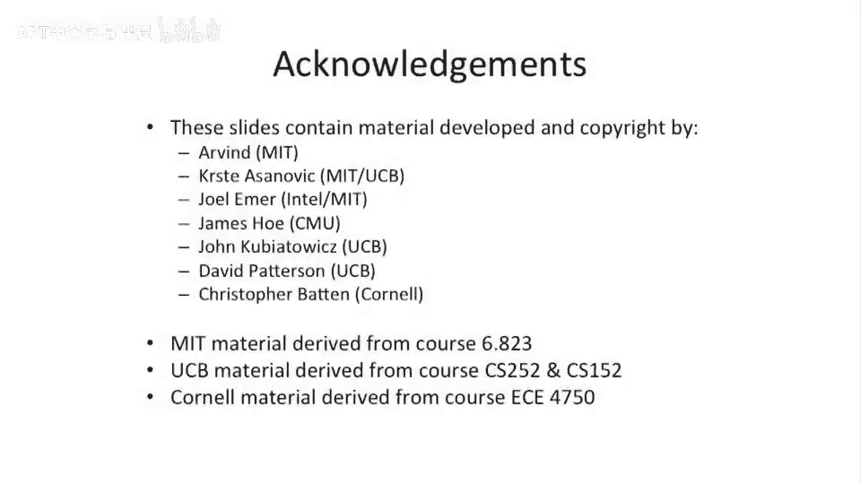

# 【计算机体系结构】普林斯顿—中英字幕 p32 31_01_speculation-and-branch -BV1ii421D7WR_p32-

Okay， let's get started。So today we're going to be continuing our venture into out of vote processors。

And supercals。 and we're going to be start talking about how to fix。Right after right dependencies。

And right after read dependencies in， in a processor pipeline。

We're also gonna talk a little bit about one of the questions we had last time about on a branch。

 What do you do to the。Reorder buffer and how do you clean up the state in the reorder buffer？

So let's， let's start off so， so a little bit about what we're doing today。

 We're gonna to talk about speculation branches。 as I said， we review about that and then answer。

 answer the question we had last time about what happens to the reorder buffer when you have a speculative branch and what are good strategies there。

Then we're going to talk about registry naming and how to break right after write and right after read dependencies。

And then we're gonna talk about memory disambiguation。 if we have time。

 and memory disambiguation is basically figuring out how to have。

Loads and stores execute out out of order relative to each other and figuring out how to get the right data for a particular load after a store。

 And we call that memory disambiguation。Okay， so let's。

 let's start off by looking once again at our in order in order。

 in order in order pipeline or I 4 for short。And let's look at what happens on a branch。

So here we have some code。 Instruction 3 is a branch。Branrenchches to target T here。

And it's executing long。 And because everything is in order， we don't actually have to worry about。

Any form of control hazard really happening here or or any form of really bad hazard happening here。

 if we can just basically reach behind us and kill all of the instructions behind us。

 None of them will have committed any state at that point。So this is， this is， this is pretty nice。

So none of the， we did have speculative instructions here。 These three ads。

 and they started doing stuff。But they don't have a chance to get to the right back state of the pipe。

So they don't even touch the physical register file。

 So we don't have to clean up physical register file。

 We don't have to clean up any the the the state here。

 We do need to reset the scoreboard when we take a branch。

Mis predictdict here in the speculative instruction， speculative state is wrong。 But otherwise。

 everything， everything is okay。Okay， so life gets a little more complicated。

When we start to look at。In order。Ftchback in order。Instruction fetch in order， instruction issue。

 out of order， execute and right back and out of order， commit。So here's our pipeline diagram。

And what's interesting to see here is here we have our branch Note that the sort of。

What is happening in the instructions moves around a little bit。But besides that， nothing。

 nothing much else is really changing here。 We're still able to catch our speckulative instructions。

Before they write back。And what's key here is that we're doing in order issue。

And it's because we do the in order issue。That be subsequent speculative instructions。

 while they are speculative， they're not going to run ahead。And right back early， if you will。

 And what that would basically mean is you'd have like like a for this ad instruction。

 there's no W sitting here before this branch hits the branch resolution spot in the pipe。

And let's say we resolve our branches in x0。And then so this branch here can just redirect the front of the pipe。

 It can squash all the subsequent instructions and reset the scoreboard。

 So life life is relatively easy。In order issue。Ex excuse me。

 in order to fetch in order issue out of vote right back in order commit。

Gets a little more complicated here。But what's nice here is。We can prevent instructions from writing。

The physical register file， for the same reason as the other pipe， because we did in order issue。

These subsequent speculative instructions cannot go execute any earlier。 And we know that， you know。

It's pretty， pretty quick to go actually issue the。

 or it's pretty quickly after we issue the branch instruction that we can resolve the target。

 So there's maybe a little bit of a shadow there。 But if it's one cycle。

 nothing is going to be able to get to the right backstage of the pipe。🤧。Now。

 we do need to clean up the reorder buffer because this pipe。Starts to have。A reorder buffer。

 So it's not just a。Scoreboard that we need to clean up。

 But we need to actually clean up the reorder buffer here。 And， and we have， we have an option。

 We can either remove from the reorder buffer immediately or we can wait until these other instructions sort of get to the commit stage to remove from the reorder buffer。

 And this is the question we had last time。 And I'll address that in two more slides in a little more detail。

😊，Okay， so now we start to get to out of order issue processors。 So here we have。In order。

 fetch out of order， issue， out of order， right back and out of order commit processor。

 And if you recall， this is the processor that we looked at last time。

 which we said could not have precise interrupts。Because you can have things basically right early。

Well， for that same reason。You can have。Instructions that write the register file or write the physical register file early in a pipeline like this。

 Or actually in this pipe， there's both architect register file。

 the physical register files altogether。But if you take a look here， let's look at this ad。

 This ad writes the register file。Before the branch， which is dependent on the multiply。

Has been resolved。Oh。But we just wrote。The architectural register file， we wrote。

Non roll rollbackable state， if you will， or state that is not able to be rolled back。

And we actually committed the wrong state。 And this speculative instruction was not supposed to have executed in correct program order。

So this is the same problem that we see with。Imprecise exception is showing up here。 So， you know。

 one thing you could do is you could have a pipeline like this。

 you could try to fix this by not having any form of control speculation。 You can basically stall。

All these subsequent instructions here， these three ads and。

 and actually potentially all the rest of these question mark instructions here until the branch has been resolved。

But that's going to limit your performance。 So， there's a problem with this form of pipeline of out of order commit here is that you have no way to sort of。

Roll back any state。Okay， so this takes us to the our pinnacle pipeline that we had last time。

In order。Issue。Excuse me， in order， fetch out of order issue， out of order。

 execute and write back and in order， commit。And let's， let's， let's take a look at this。

 There are sort of two。嗯。Competing questions here that we have to think about。

First thing is we see that this actually doesnt right。Right here before the branch is known。

But conveniently， it's writing a different data structure。 It's not running our architectural state。

 It's running our physical register file。And just like on a interrupt of some form。

 we can roll back the architectural register file into the physical register file。

 We can do that for a branch here， also。So one of the interesting questions that comes up is。

Where do we resolve。The branch。 And when do we try to kill subsequent instructions。

Do we try to do that right when。The branch gets resolved。Oops，Or do we wait till the branch commits。

嗯。Okay， so this， this is actually goes back to the question we had last time of how easy is it to go clean up the reorder buffer and how easy is it to go clean up the physical register file。

So let's take a look at this example here。 Now， having said this is all all doable。

 People have built pipelines， where they actually do go clean up sort of all these inf flightlight instructions。

But let's look at the complexity of that。So， here we have。

Right when we know the branch gets resolved， we actually。Kill all of these instructions。

And we redirect the front of the pipe to go fetch our target， our， our true target。Well。

 let's go look what's happening in the physical register file for this case。So in this case。

 for the physical register file， this mall。Has written the physical register file。

 That's a good value。 We want to keep that mall。This ad here has also ruined the physical register file。

We don't want to keep that。E， life starts to get a lot more complicated here。In a pipeline like this。

 what were really have to do is we're gonna have to clean up speculative state in the physical register file。

 and we're gonna have to do selective rollback。So instead of just taking the entire architectural register file and overrun the physical register file on rollback。

 we're gonna have to figure out which of these things were speculative。

 which of these things were not speculative。That's doable。

But you probably need some extra structures to go do that over we've over and above what we've already talked about in class。

Or rather you going have to track。Which。Physical registers need to be rolled back on a speculation mispredict。

Something a little bit easier。Is just to wait to the commit stage。So if we waits to the commit stage。

We can see here， as we commit， well。We know that all of the previous instructions of this branch have committed now to the architectural register file。

So we know the architecture register file is up to date relative to the branch。So we can。

 and and these other speculative instructions may or may not have ruined the physical register file。

 They， the physical register files is just completely outdated at this point。嗯。

So we can what's nice here is we can copy the entire architectureural register file to the physical register file and effectively roll back everything。

Okay， so this this brings us to the question。That we had。

During last class about the reorder buffer and， and what do you do with reorder buffer pointers。

In this branch， mis speculationulation。Case， so the question really here is。Well。

Do we have to wait for these instructions here to get to the end of the pipe， these。

 these speculative instructions to get all the way to the end of the pipe to go clean up the rear buffer。

 or could we just just a pointer。Of the next instruction in the reorder buffer。And the answer。

 I spend a much of time thinking about this is， is we should just be able to adjust the pointer in the reorder buffer to say where the next location is and just fill that in with this target instruction here。

 And that will effectively clean out all of the state here。ButWhere this gets tricky。

 that works great in this case。But as I said， if you go look at this other case here where you actually have。

 you're trying to preemptively sort of kill things。This is not gonna work in this state。

 in this case， because what's really gonna happen is we have。Selective rollback。

 we're gonna have to perform here And just changing the pointer in the reortor buffer is not enough to go do that。

 We're gonna have to sort of individually clean up entries if we want to go do that。

 And that gets a lot more complicated。One other thing which we haven't talked about yet。 and one。

 one motivation for why you may want to wait。To actually clean up the reorder buffer until if you wantan to wait till the spec instructions reach the end of the。

 the commit stage of the pipe， if you will， to clean up the reorder buffer。

 is there's other structures， if you have a registry name。

 which you're gonna want to clean up in that same manner。

So when we talk about register renaming in this。In this lecture。

 and what happens is if you sort of think about these inf speculative instructions。

If you have more physical registers than architectural registers。

It's possible that if you have to abort these instructions， these speculative instructions。

You have other structures like a free list of physical registers。Which have to delocate somehow。

And if you sort of do a bulk D Lcate， but it's a convenient place to sort of Dcate when it tries to commit。

 So let's look at that。In， in a minute。 But that's， that's basically I to get across is， yes。

 you can just adjust the pointer for the simple case。嗯。Trying to do something more aggressive。

Gets quite a bit harder because you have to speculatively roll back the physical register file in addition to the reorder buffer。

 Well， the rear buffer you can just adjust the pointer。

 But the the physical register file you can't just do that with。And if you wait。

To the end of the pipe， you can get。You can deallocate physical registers a little bit easier。

