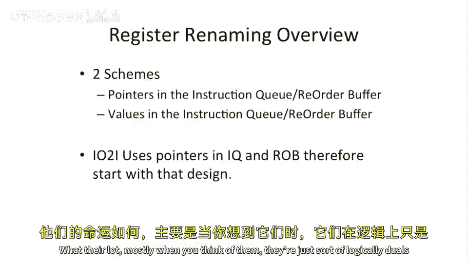

# 【计算机体系结构】普林斯顿—中英字幕 p33 32_02_register-renaming-introduction -BV1ii421D7WR_p33-

Okay， so that brings up the， the question of。Regisistertry naming。 What is regitry naming， Hopefully。

 some of you skimmed the Thomasmasulu algorithm paper that I signed。

Because were be discussing that and the motivation for that work。Okay。

 so what is looing our performance in these pipelines。

 these out of order pipelines that we've discussed so far。Okay， a couple things。

Right after write and right after read dependencies。 Let's， let's talk about these。嗯。

Where have to write dependence， you're going to write to one register。

I you're write to the register again。And in our pipelines that we've talked about so far。

 you're basically gonna stall a pipe while you're waiting for the first right to commit。

Because we're not able to handle multiple rights in， in the pipeline at the same time。

But these are not fundamental。Depenencies。So computer architects put on our thinking cap。

 and we came up with ways to break these dependencies。A read after to write。

And that also is true for a write after a read。 So if you do write to。

 let's say register 4 after a read from register 4， well， there should be nothing wrong with that。

 But if you try to execute the instructions out of order， you need to think about that。

A read after to write is a true dependence because you actually need the data。

 You need the value to go execute the subsequent instruction。

And we're gonna to call right after read， right after write and right after read dependencies。

 name dependencies。And we're going to call a read after to write a true dependence that we can't break。

Okay， so let's， let's look at a some example code here and see what can go wrong if you just ignore all the name dependencies。

 Like I said， they're not true dependencies。 So maybe we just don't need them。Okay， so we have。

A different code sequence here。 We have a mall， mall。And then two ad immediates。Let's。

 let's identify some important things。In here。First， let's identify the true。

Read after write dependencies。 So I， I put some circles and some arrows here。

 So let's take a look here。This writes register  one in the mall。

 The second mall reads the result of that。O。Let's see here。

 This ad reads Reg 4 in the previous instruction writes Reg for。 So that's a true dependence。

We can break those。We may talk at the end of class at the end of the term。

 maybe about some ways to break those， but they get pretty， pretty crazy。So let's。

 let's look at the right after right dependence。So the first right after right dependence is here。

 we rain register 4 and then we write register  four again。But in an out of order processor。

 if we try to break all these dependencies。We can see。

That we're actually writing to register for here。呃。And then we register for。Here。

 and that's like out of order。 Whoa， what just happened here。 Well。

 we said we just broke the dependence。 We're not gonna stall the front of the pipe on this。

 So if you go to execute this on one of our out of order issue pipes that we've looked at so far。

 let's say this is executing on the in order fetch out of order issue out of order execute and right back in out in order。

 commit pipe， we can see that。We will write to register for。

In time before we wrote to register for here。 Now that's going to cause some major problems。

 We just wrote the wrong value。Oops。And the other one here。Is a right after read dependence。

 So here we have a read to register for。And here we have a right of register 4。And because。

This ad got pulled so early in the， in the execution order。 we actually wrote。

Before this instruction had chance to read the value。

And the reason this instruction got delayed was because it was also dependent on a true dependency here。

But it's dependent on two things。 But all of a sudden， we wrote register for。

With the value from this ad。 and then we went and read it。And we read the wrong value。So。

 we can't just go。Change and break。Right after write dependencies and right after read dependencies very easily。

 We need to think a little bit harder about this。One last interesting thing that happens here。

This is， this is kind of fun。We do commit in order in this pipe。

But look what happens to register for。We wrote Reg four。Here， that we rate register for again。

And then we commit。From physical Register 4 to architectural Register 4。

 So we just committed the wrong state also to the architectural register file。

So we're hearing lots of， lots of problems。 But here。 it's not just basic things。

So what's the solution to this。Well， solution is we can start thinking about how to add more registers。

 So at the top here is the same example I had in the previous slide。 So nothing， nothing new there。

 But I wanted to compare this to。Let's say our conservatively stalling pipeline from a performance perspective first。

 So here we have our。In order， in order， fetch out of order issue， out of order right back。

 And in order commit pipes。 This is our most advanced one from last time。

But it conservatively stalls on。Right after， write and right after read。Depenencies。 And that's。

 that's drawn here of these， these arrows。So we can't even issue this instruction until we know that。

 let's say these。2 instructions here， which have something to do with register for。Commit。

 and then we can go to issue this。Now， this might be a little bit conservative。

 This might be even a little bit over conservative。

It might be possible to pull this back one or two cycles。

 maybe to sort of the point where this instruction does the right back。

 But one of the challenges there is you don't necessarily。

 you can't necessarily track that very easily inside of your reorder buffer unless you have something there that scans for the exact case。

And it's not going to save you that much performance either。What， what I'm trying to get across here。

 though， is that the performance of。This。Instruction sequence is actually worse。

 It takes longer than are incorrect， but we'll call ideal case here on the top。So let's。

 let's do one little change to the instruction sequence highlighted in red here。And see what happens。

To our execution。So we took。This ad， which wrote to register for， and changed it。

We added another register usage here， and now we write to register 8。And lo and behold。

 it breaks all the right after right dependencies， and it breaks all the right after read dependencies。

And all of a sudden， we get to our idealized performance。

 exactly this is the exact same case as that。But we required another register。H。Well。

Can we just add infinite numbers of registers。So what is what's。

 what's a con of adding infinite numbers of registers。 Anyone have ideas。

 So we're trying to use more registers here， we might use up all of our architectural registers。

Can we just add more architectural registers to our instruction set。Yeah， so， so it takes up space。

 So if we look at our registers， we could have a larger name space for our registers。

But if we have 32 registers， it takes 5 Bs。 If we have 128 registers， that's gonna to take， you know。

7 Bs。If we have an infinite that will take infinite number of bits。

But what we're gonna talk about in today's lecture is how to do this in hardware。

 So you have some more registers in your physical register space。

 but not more registers in your architectural register space。🤧嗯。And this is， I should point out。

 this is not only a register problem。This could also happen with memory。

 If you name your memory inappropriately， if you have very small amounts of memory and you try to reuse the memory very aggressively。

 you can get name naming problems in that also， but。For today。

 we're gonna mostly be focusing on register renaming。

And so I'll define register name as we' change the naming of the registers。

In hardware to eliminate these right after right。Name dependencies。

 and the right after to read dependencies。Okay， so we're gonna be talking about two major schemes and。

They， they are mirrors of each other and have slightly different。Hardware requirements。

But theyre lot mostly when you think of them， they're just sort of logically duels of each other。

 And there's different ways to think of the same problem。

So the first scheme we're going to be looking at is。We're going to add。

Pointers are in our instruction queue， and our reorder buffer。

To allow us to have different register names in them and not actually just have architectural register names in those data structures。

The other option， which is， if you A and read the Tasua algorithm paper。

 is to actually store the actual value。The data value in these data structures。

 in the reorder buffer and in the instruction queue。And， and they look。

 they look very similar if you sort of think about it。 and they're gonna have the same performance。

Ill， I'll， I'll give you the sort of。End of the novel at the beginning here。

 They're gonna have the same performance。 Theyre， they're， they're doing the same。

 doing the same thing， but they're， they're slightly different in the mechanics perspective。And。

 and we're gonna to start off by looking at this first one here。

 We're gonna to have pointers in the instruction queue and the retor buffer。

Mainly because we already have pointers in our design that we looked at last time。

 this in order issue out of order， or in order fetch in out of order issue， out of order。

 execute and write back and in order， commit design。

