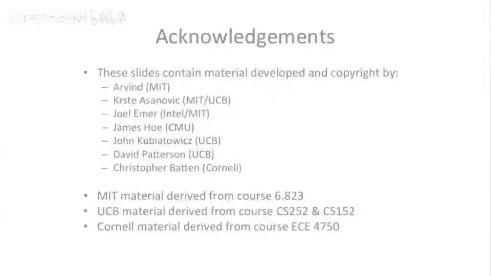

# 【计算机体系结构】普林斯顿—中英字幕 p35 34_04_register-renaming-with-values-in-iq-and-rob -BV1ii421D7WR_p35-

Let's move on to our second scheme。So， our second scheme。If we go back to the， the earlier slide。

 we said that we can either store pointers in the instruction queue and have pointers in the reorder buffer。

Or we can distort the values。And if you go read the original reservation station paper by Tamauo。

He actually stores the values in the。Reservation station or we're calling an instruction queue and the reorder buffer。

Okay， so a couple things change when you do this。One structure is missing。First of all。

There is no physical register file。We removed that。

 We're going store inf flight instructions in merge reorder buffer physical register file。

 effectively。Second thing that's changed here is we no longer have a free list。

 And we'll see in a minute why we don't need the free list。 But instead。

 we're basically just going to use different reorder buffer entries to keep track of our free list。

And we're gonna have to modify， modify a bunch of stuff here。

 We're gonna actually keep values in our reorder buffer instead of a pointer。

Our renaming table is going to be modified。 Our instruction queue is now going to be able to keep track of actual data values。

And our physical British policy 74 has gotten merged into our reorder buffer。For completeness here。

 let's take a look at the。嗯。Where things get red and ruined in the pipeline。 And one。

1 notable change I wanted to say here is the architectural register file。

Which in previous architectures， was only written。We didn't do reading of it， except on rollback。

We now actually read from it because we might need to go go find some canonical state there in this architecture。

So we， we add an R there to denote that。Okay， so let's look at how we have to modify the reorder buffer。

Still looks like our rearor buffer from before。嗯。We need to know for the same reason， in the。

Pointer based design。We still need to know the architectural register number for the particular instruction。

 So this is when we go to write to the architect register file， Where do we write to it。

 Because we did reming。 So we have more physical registers。

 We can't just have an identity map there anymore。And now。

We got rid of a lot of that other complexity we had。But we， we added a bunch more bits to go do this。

 We now actually can store。Values。In our reorder。Buffffer。

So what this is is instead of values waiting in the physical register file to be committed。

They're gonna store They're just gonna stick around in the reorder buffer entry。

Whihich is interesting。And so it's gonna stick around in here while it's waiting， while it's pending。

And then it's actually going to write the architectureural register file when it gets D。

 when it gets committed。Okay， so we also modify the instruction queue。

So this is going tell us where to go get the values when we're gonna go execute。

 It's also going store the values now。So what's， what's interesting about this is if you go back and look at the Tasu algorithm paper。

They broadcast。Commits that are happening。And those commits end up in the reservation station of the actual value。

 So we're actually going to store in these two source opera here。The values。

If we get a instruction which commits。If the instruction is pending， it's in flight。

 we can't go and just。Get the value because the value doesn't exist。 It's being calculated。

And we have this dependent instruction sitting here waiting for something。So instead。

 if it's pending our source field， we're not going to store the value in here。

 but we're going store a。Identifier into the reorder buffer。

And that what it's going to do is it can name the exact instruction that has to complete in order for this value to be ready to execute。

So if you think about this from sort of Thomas Su Z perspective。

 there's these sort of broadcasts coming back。And what this is gonna allow us to do is say， oh。

 is a broadcast reorder buffer entry 7。Just committed。Or actually， we probably don't need that。

 We probably just need to get stopping pending。 We just need to get to be finished because then'll be deposited in reorder buffer。

We can go pick that value out at that point and store it here。

And then we could basically re have the other instructions that are renaming and executing。

 which go and blow away that value。 But because we stored the value here。

We have the most up to date value for that register， and we know it's no longer pending。

 and it's valid， and it's ready to go。 at least this one。

 and we might have to wait for both these to get ready in order for an instruction to leave the instruction queue。

Okay， so the renamed table。Also changes a little bit， not as much as the other one。

OfThe other structures， it's still indexed you know， by the register。 we're looking for register。

 too， we'll say。It'll tell us。Whether where， where to go look for that。

 There's a couple different places where it's going to tell us to go look for it。

 It's going tell us either it's in flight。And it's gonna put it。

 the identifier into the reorder buffer。 So it's gonna say when that value gets into the reorder buffer and the instruction transitions to finish。

 but maybe not yet committed。It's going to tell us to where to go get it。

 And that's important for subsequent instructions that I' are going to read the renamed table to go the value。

Or it's possible that the most up to date value is actually in the architecture register file。

 and we need to go look there。So let's say the reor buffer， you haven't written in。 let's say。

 to register。2， in a very long time。And lots of other instructions execute。

 And the rotor buffer gets filled up with other things for other instructions for different destination registers。

 It's very possible that the canonical place to go look for the value。Is in the。

Architectural register file。 And we need to track that。

 So we sort of have two bits here to sort of just say where to go look for it。

 either it's in the architecture register file or whether it's in flight And then if it's in flight。

 we have to go look down here。 And if it's in flight， that means that and if P is， let's say one。

 it's actually in flight。 And if it's， if it's 0。 Well。

 it's sitting in the reorder buffer w to retire。This is just going tell us where to go find the actual value for subsequent instructions that want to go read the renamed table to go find the value。

 Okay， well， we'll move on。 and we'll look at the， the eye chart here again。嗯。

What's interesting about this is we no longer have a free list。 We got rid of that structure。

 So don't have to worry。嗯。Our renaming table。嗯。Instead of having。

Actual physical registers is going to have。Reorder buffer entries。 We。

 we'll call that a physical register。We've basically merge of physical registers and a reorder buffer together。

And similar sorts of analogs happen to when something becomes free。

But it looks a little bit different。 So when something becomes free。We're going to actually。

Change the valid bit。In the renamed table to a 0。 And that's。

 that's effectively the same thing as becoming free。 And there's。

 there's analogs there between these two designs。 They。

 They're almost exactly the same from that perspective， from a logical perspective。 But when。You be。

 you become free。 You basically can remove it from the。呃。The table步。So。

 so how do we do the mapping from the。Architectural register to physical register。 Yeah。

 it could be random。In， in this design is a little bit different because you're basically going to。

We pulling out of the。Reorder buffer in order。 to some extent， you're going to。

 your physical register number is going to be your reorder buffer entry slot number。

 And because we want to retire in order， we're basically gonna allocate from that in order。

 So it's not really random。 Its sort of the next。Reorder buffer entry。

Let's see any other points I want to make here。Actually， okay， I， I want to make a point。It's around。

 okay。I think what I， okay， what I said was a little bit。A little bit confusing。

 So I want to clarify this。When do you delocate。A reorder buffer entry。

Ca it's a little bit different than delocating a physical register entry。You。

 you apply the same algorithm we applied before when you go to actually commit the instruction to the architectural register file。

That's when it's becoming free。It's basically stopping， stopping being used here。

It's a little bit different than the。There's analogs， to before。

 but we're effectively moving it out of the reorder buffer into the architectural register file。

 And at that point， it becomes free。 So I I want to actually strike what I just said before about it it's。

 it's exactly the same。 It's it's different but subtly that when you go to write。

When you go to actually commit the instruction。You're moving it to the architecture register file。

 and you' effectively decate that reorder buffer entry， and you've updated。The， the rename table。

So that's， that's， that's subtle。 That's actually。A subtle there。 So actually when it。

 when it commits， it stops， it stops being used， which is different than a later instruction actually writing that。

 So that that is quite bit different。Sorry about that。

