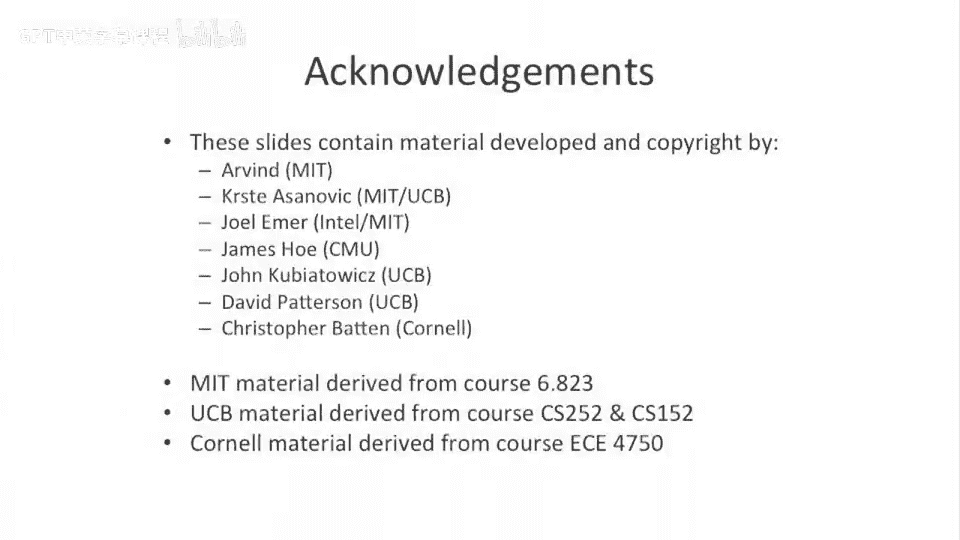

# 【计算机体系结构】普林斯顿—中英字幕 p38 37_03_introduction-to-vliw -BV1ii421D7WR_p38-

So this is where some people got the idea that maybe maybe there is a better way。And。

I wanted to point out that。There's only this is only the tip of the iceberg of what we'll call better ways of having better instruction sequences or better encoding standards between compilers and the hardware。

 This is actually a open sort of research topic now。

 very long instruction word processors or V I W for short， is one take on it。

 Theres been if fair amount worked done after this。

 which we're not gonna be talking about this in this class， sort of in the last5 to 10 years。

 that has looked at this a little bit more detail， especially given sort of multiple cores and can you schedule across multiple cores or there's a project there was a project out of University of Texas in Austin which tried to schedule across something that sort of looked like core wasn't quite core that was sort of we'll call a super V I W but has some dynamic aspects and some static aspects。

But for right now。Let's talk about very long instruction word processors。🤧嗯。Okay， where does。

 where does the name come from？ Let's start there。Well。

 these things were actually originally called long instruction in word processors。

The name kind of fell out of favor at one point， people made a differentiation between long instruction word processors and very long instruction word processors。

 and was kind of on how many instructions were packed together the differentiation is largely sort of falling out of favor now。

 And people mostly call all of these things V I Ws or very long instruction words because it's。

 it's hard to say what is long， what is very know， it's kind of just that extra term。 it's also。

 it's kind of like people talking about large scale integration versus very large scale integration versus ultra large scale integration you know。

 people to sort of keep tacking on extra letters in the front。

But let's talk about V I W instruction sequences and what is。

 what does one of these things look like。Well。A V I W instruction。Willll actually have multiple。

Operations within one bundle。So typically， this is either called a bundle or an instruction。

 which with multiple operations inside of it。So in this example here。

We have six operations that can be executed in this one instruction or in this one bundle。And。

 typically。There is sort of fixed format。So we， let's say we have， you know。

 you can execute two integer operations， two memory operations and two floating point operations。

P cycle， and that's what you were allowed to do in code。

So instead of having on the disk a sequential sequence of instructions， now we have a sequential。

 We still have a sequential sequence of instructions or a sequential sequence of bundles。

 But each one of those instructions， each one of those bundles will actually encode multiple independent operations。

So let's look at a sort of an example code sequence of this。So， for instance， you could have。

Something looks like this。Let's say。嗯。So what's interesting about this is we can see that there's actually。

Two operations in this first。Instruction of this first bundle。The second one only has one operation。

And this multiply and this ad will actually execute。Semantically。

 at least they can execute in parallel。Now， what's interesting？As you look at this， I。

 I purposely wrote this to show a what looks to be a read after write or write after read or some sort of dependence between these two registers and these two instructions here。

 this mall in this ad。But that's not what's actually actually going on here。In a。

Very log instruction word processor。Within one instruction， within one bundle。

 these sorts of dependencies are ignored。So。Just because this reads R 3 and this writes R 3。

 they're not dependent on each other。The subsequent instruction is dependent。On our three， let's say。

If this was R3， then that would probably read the result there。But。Within one bundle。

It doesn't actually matter。 So the semantics of the instruction set are everything within one instruction or everything within one bundle are parallel of each other。

 And there's not dependency checking。What's nice about this is we just took all that piece of hardware that we built。

 We took all that instruction checking， all the dependency checking， all the scoreboarding。

 And we just threw out the window。 We don't need that hardware anymore。😊，In this instruction set。

Or in this architecture。So that's pretty cool。So we actually took out a bunch of hardware that we didn't need。

 And we we basically let the compiler do that checking for us。Now， there's a question of this mall。

 this mallply takes multiple cycles。Whether this instruction here picks up the result of our three。呃。

Sorry， should we drawn the other way？Or let's say if the ad had longer latency if it doesn't pick that up。

 and we'll talk about that in a minute。There's sort of two different choices there in VIW designs。

Well let's look at our slide here。Typically in sort of traditional VIWs。

Each operation has a certain amount of latency。So， and it's， it's guaranteed。Unfortunately。

 because of this， the architecture of the machine is very tied to the compiler。

The compiler needs to know how long each operation takes。 So that's sort of a downside。嗯。

And in a typical VIW。There's no data interlocks。So we don't even have a scoreboard。Now。

 there are some architectures which do enforce interlocking that are V I Ws。

 But in sort of the traditional， most basic V I W， you don't have a scoreboard。

 You have no interlocking。 So if you were to have， let's say。This subtract operation。We to read。

Register one。Which the mall wrote。And the mall。Let's say it's a Fing point mall， it took four cycles。

In the most basic operation， this mall here。Would actually get the old value of R one。

 So it would not get this value。Instead we get the original value of R 1。

 But we'll talk about that in more detail in a second。There's a sort of choice there in VIW designs。

But yes， so we， we reduced our hardware。We don't have a registrynameer。We don't have an issue window。

We don't have a reorder buffer。 We don't have a scoreboard。

And we let the compiler do a lot of the work。Downsides of this。

We're not able to react to dynamicynamism very well or dynamic problems。 So cache misses。

 branch miss predicts， things like that， because we're not going out of order。

 because we don't all have all that extra hardware in there。

 We can't go schedule around those problems。So that's，'s a downside to these architectures。Now。

People have thought really hard about how to make V I Ws have some of the benefits of superss and out of orderness and out of order supercals。

So at the end of lecture today and probably in the next lecture。

 we'll talk about some of the techniques that people added in the back in the V I Ws that bring us somewhere between an out of order processor and a V I W processor and get some of the benefits of both。

Okay， so  two， two models。This goes back to。When you have。

An instruction which writes to a register and the laency of that instruction is coded to be longer than one。

Which value do you pick up， Do you pick up the old value or do you pick up the new value。

 if you have an instruction， which is effectively in the， the shadow of the other instruction。

So the first V I W model。 this is， this is a sort of classical naming scheme。

 I did not come up with this。 It's called the equals scheduling model。So the equals scheduling model。

You have。A instruction。And the latency the instruction is specified。 The compiler knows it。And。

If you have an instruction which tries to read a value that gets written to。Before。

The first instruction actually does the right。 It'll get the old value。So let's。

 let's go through an example。Over here。So we're going to have our multiply again。

Okay， so here we have a mall。And an ad， which are bundled together。

 so they're going to execute concurrently。We have an and instruction or and operation in the second instruction and the second bundle here。

 I should say that I'm using brackets and semicoons to delineate sub operations。

Or the brackets deinate the entire instruction or entire bundle。 The semicolon is just there to。

Delineate between two instruction or two operations within one instruction。And here we have an ant。

We have what looks to be a read after write dependence here。Something like that。

And let's say our pipeline looks like this。We have x0 which does AU ops。We have Y 0。Yhy one。Why2。

Why 3。And then we have， let's say， a two stage memory pipeline。And somewhere over here， you know。

 we have sort of。Right back。So this looks similar to user pipes we've looked by before。嗯。

But now comes the question， let's say multiplies go down this four stage pipe。

 very similar to things we've looked at before。 Los and stores go into the memory pipe and A U operations go into the X pipe。

Should。This end。Get the results in the multiply。 if it's scheduled one cycle after it。

 or should it get the old value of R 1， the previous value of R 1。So we're going to define。

In the equals scheduling model。That the multiply value for our one is not ready until。The end of Y 3。

So in the equals model， this and the， the compiler is not trying to express a read after write dependence。

This does not actually exist。It gets the old value of R 1。 And the compiler knew about this。

 and everyone's O with this。嗯。Now， if this and was， let's say。Three more cycles later。

 it would actually get that value。 And there would be a read after write dependence。

So in the equals model， we're just saying that the operation。Takes effect。

Exactly if the specified latency， and never earlier。

Some positives to this is you get some pretty cool register usage。😊，So if you think about it here。

 Register  one was live after。This multiply。 So effectively。

 this gives us a little bit less register pressure。 you have a little bit more registers in flight。

Without having more physical registers or having more architectural registers at all。

 we can basically just have more registers because it doesn't go。

It doesn't go dead when we overwrite it。 It goes dead when this multiply takes effect。

So they said we don't need a register renaming。But the compiler really depends on not having the registers visible early。

Unfortunately， this causes some problems。 This sort be sorts of architectures。

 This is actually the sort of first formulation。A very long instruction where processors looked like this。

 There's these equals architectures。The major problem with these actually comes around。

 If you have things that are unpredictable， mixed in with this very predictable code sequence。

So let's say you take an interrupt。Let's say we just put some。Unimportant instruction here。

 some subtract operation。The subtract takes in interims。Now， semantically， this multiplication。

 this ad complete。Because the interrupt doesn't happen until the instruction after it doesn't happen until this。

Subtract operation。嗯。Okay。are you。Fall ins the inner handler for the subtract。

What happens when the and goes to execute？ Does it actually pick up the correct value of R 1 here。No。

 it picks up the new value of R1。 It was supposed to pick up the old value of R 1。

 So that's traditionally a problem with E Q or equals scheduling model architectures。

 People have solved some of these problems。嗯。Or sometimes when people build these processors。

 they don't have interrupts。So some of these V I W equals processors were not able to handle interrupts at all。

So that's something to think about。That's sort of the first case。

Now I also look get a little bit more。Forgiving case。 We'll call it the。

Less than or equals model or L EQ scheduling model。So， here in this model。

A value is allowed to become value。 A register value becomes。Valid with the new。Register value。

Any time between when it issues。And the scheduling latency。

So what this means is the compiler still can't schedule an instruction early。

So you can't go and try to read the value early， but you're guaranteed not to have a problem when there's an interrupt。

 if， let's say you come back and you filled in the right value。

So the compiler sort of schedules around this and knows not to schedule something too early。

 So you still don't have to implement interlocks。 You still don't need a scoreboard。

But you can now have。Precise interrupts， some other positive things pop out of this。

 You end up with binary compatibility preserved when the lane seas are reduced。

 So let's make a faster processor where you multiply instead of taking four cycles。Only takes three。

That's that's a positive here。 You may not get more performance from it。

 but at least you won't get incorrect execution。So that's， that's， that's a positive。

Positive outcome here。Okay， so a little bit of history。Usually。

 I try to not make harp on history too much in this course， even though I really enjoy it。

 But's this， this， the V I W processors is。I wanted to make one point that a lot of this research is relatively recent。

 recent。So if we go look at sort of the dates on this， you know。

 these first processors and the first real V I W processors was done in like the late 80s。

 So this is not going back to the 60。 This is like a portion of computer architecture work。

 which is actually very， very recent。The， the first。

The long instruction word processor was actually floating point systems， FPS。

 That's what it stands for processor。 And this was actually a coprocesor to vax machines。

 So something that could speed up your floating point on a vax machine。

 This was very much the most basic V I W processor。 It was no interlocking。 didn't take interrupts。

 It was really sort of for hand coded vector arithmetic and floating point math。

Probably when people talk about V A W， the thing that pops in the head to their head first is actually the multiflow trace processor。

 which was made by a small startup company called Multiflow。This was an outgrowth， actually。

 of a bunch of research that was done at Yale。By Josh Fisher。And a bunch of his students。And。

I won't go into too much detail here， but one of the interesting things is。They really。

 really did have a long， very long instruction work here。1024 Bs， long instructions。So， so this is。

 this is like a beefy instruction。 This is， and you can have anywhere from 7。

14 or 28 operations per instruction。 And this was not dynamic。

 What this actually was is this is how they made different configurations of their machine。

So they actually had wider machines that were more expensive and narrow machine。

 narrower machines that were cheaper。So it sort of a family of processors。

 And they customize the compiler to this。Josh Fisher actually is。Much more of a compiler guy。

 probably than an architect by training。 And you can sort of see that in his group's work and the PhDs that have come out of that。

 He now works for H P H P labs and sort of semi retired at the same time， actually。

There was also another company that was commercializing very， very similar idea。 This was the。

Sideroom。Cra， Sra 5。 This was Bob Rao， who's another very famous computer architect。

 He was a a professor at the University of Illinois。

 and he developed a lot of these things then sort of left and started Sdro。

And some of the interesting things in that processor is they had this cool thing。

 Instead of having a registering namer。 They had a register file that the naming of the registers sort of changed。

As you did for function calls。We'll talk more about that later today or maybe tomorrow or in maybe next lecture。

But more really wind Calals， this is very recent。

