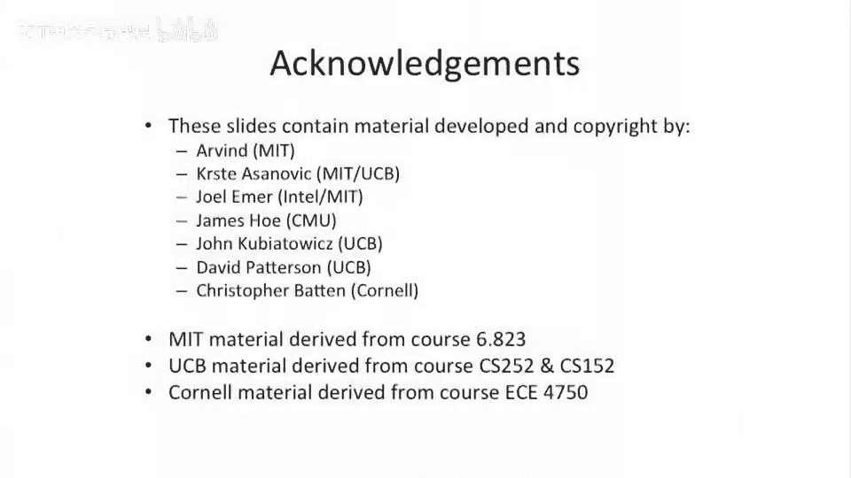

# 【计算机体系结构】普林斯顿—中英字幕 p40 39_05_classic-vliw-challenges -BV1ii421D7WR_p40-

This is a。Rich， rich。Field of in the compiler research world。And。

There's been a lot of problems with VO I Ws or classical VO IWs。And people have sort of built。

Things that are somewhere between superscales and classical V I Ws to solve some of these problems。

 People come up with fancy compiler optimizations to solve some of these problems。

 and some of them are sort of still open。First one， on our list here， objectject code compatibility。

In a super scour， because we came up with one serialized instruction sequence。

And the architecture came up with all the scheduling。

You could change the number of functional units under the hood in your micro architecture of your processor。

And no one was ever the wiser。 It would still execute the piece of code。 may not be optimal。

 but it would still execute。 That's not necessarily the case for classical V I Ws。So， you know。

 you have to recompile the code when you change the micro architecture。

 So it's a very tight coupling between the architecture and micro architecture because our instruction encoding now says there's exactly。

 let's say， two integer。2 multi two memory operations and two floating point operations more like that。

 But all of a sudden， if you build a machine which has a different mix。

Your schedule is completely wrong。 So it's going to have bad performance。

 And it' is not going execute because you probably change the instruction encoding standard when you go and make that different V I W。

Another big problem is code size。As you can imagine。There's a fair number of。

 no operation instructions in， or no operation operations inside of a V I W bundle。

If you can't fill a slot。On a super scar， you just don't put the instruction。On a Vla W。

 if you can't fill the slot， you have to put a no op there。Because you've got to put something there。

So this， this， this causes some serious problems。 Also， things that hurt this even more is。

These fancy techniques that we talked about， loop unrolling。

 software pipelinelining that blos the code size。 We're replicating code。We've unrolled the code。

We were using more space。This hurts our instruction cache size， and instruction cash footprint。

We'll talk a little bit more about this in a few slides。

 but variable latency operations are very hard to deal with。So if you have a load。

 you don't know whether it's going to take a cash miss or not。So your schedule may be wrong。

If you guessed wrong， you can do it some high probability。 You can say， oh。

 I think this load usually takes a cache miss。 or you can say， oh。

 I think this load usually doesn't take a cache miss。But you can guess wrong。

 And there's similar sorts of things with this， with sort of branch mis predictiondictions。嗯。

Scheduling。For statically unpredictable branches。This gets very hard。

There are some techniques to solve this。There is something called predication。

 which we'll talk about in a few slides that helps to solve this。

 So you can add things back into the architecture into your V I W architecture to deal with sort of short branches that are very hard to predict predict or data dependent branches。

And as I said， depending on your design， precise interrupts can be challenging， to say the least。

 if you're actually using the E Q model。You probably have a hard time figuring out what to do on a single step。

 or if you actually have a branch sort of in the middle while you have a pending operation going on。

 sort of undefined。 It's icky。 It's sort of similar to having like branch delay slots and having a fault in your branch delay slot。

 What do you really do with that。Also， this is an interesting point here is that。Does the fault？

If you have a fault on， let's say， one operation in a bundle， does the entire。

Bundle fault or just the operation fault。Or take an interrupt。Typically。

 the way people implement this is you have the entire bundle or the entire instruction be atomic。

 So if anything in the bundle takes a fault， you actually don't allow any of the sub operations to commit。

That's kind the most rational thing to do。 People have done things in the middle。 I。

 I probably don't recommend you building any of those machines。 the V I Ws that I've always built。

 an entire bundle is atomic that makes traps a lot easier。Because actually。

 but people have not always done that。 One， one of the interesting cases， if you think about this。

 if you have， let's say five instructions in a bundle and only one of them falses。

 maybe you handle that one。 But you let the other ones commit。

 And then when you come back you some sort of mask to say， which ones you need to re executeecute。

People have built things like that。 They get tricky。Okay。

 so start the rest of today's lecture and next lecture。

 we're gonna talk about techniques to solve a lot of these problems or solve a lot of these challenges。

Some of them are compilers， some of them are hardware， and some of them are both。

First thing people try to do is they try to come up with compressed。

Instruction encodings or fancier instruction encodings。But when you go to do this。

 it makes the front end more complicated。So here we have， let's say。Some instruction。

 but inside of the instruction， we can have different groups。

 which inside of the group executes parallel， But between groups are is not parallel。

 So something like the itanium processor， which was the or the I A 64 processor from Intel actually looks something like that。

Other things you can do is you can have compressed instruction formats。

And then when you go to actually execute it， you uncompress the noops into your instruction memory。

 maybe。That's what multiflow trace processor did。This marking per groups is what I was talking about before。

Syrome had an interesting solution to this。 They actually had a single operation， V， I W instruction。

So to save space， they sort of had their wide instructions。

 But if you had a case where you were only going execute one operation in an instruction。

 there was a special encoding format just for that case。 And that saved a lot of encoding space。

Or a lot of instruction in space， if you will。Another example of this actually is processor I worked on called the Tylerra T 64 processor。

 We were three wide V I W。 We had an encoding standard or we have an encoding standard。

 which allows you to execute either two instructions at a time or three instructions at a time。

 And that can when you're executing two instructions at a time。

 You have a richer palette of instructions， you can execute。

So sort of something in the middle gives you some better code density benefits。

But not with not without not with the sort of complexity of having sort of compressed formats and things like that。

Okay， so that's one way to to deal with the instruction en codingd challenges。

 One thing you can think about， though， is you just have a bigger eye cache。

Or at a wider bus from your eyec out to your memory system。That does solve a lot of these problems。

 That costs hardware。But it's sort of a simple， stupid solution to the problem versus a smart solution。

 These， These sort of things on this list here are are complex smart solutions。 Simple solution。

 Just have a bigger instruction cache。And if you have bigger code sequences， you won't feel the， the。

 the performance hit as， as much from that。

