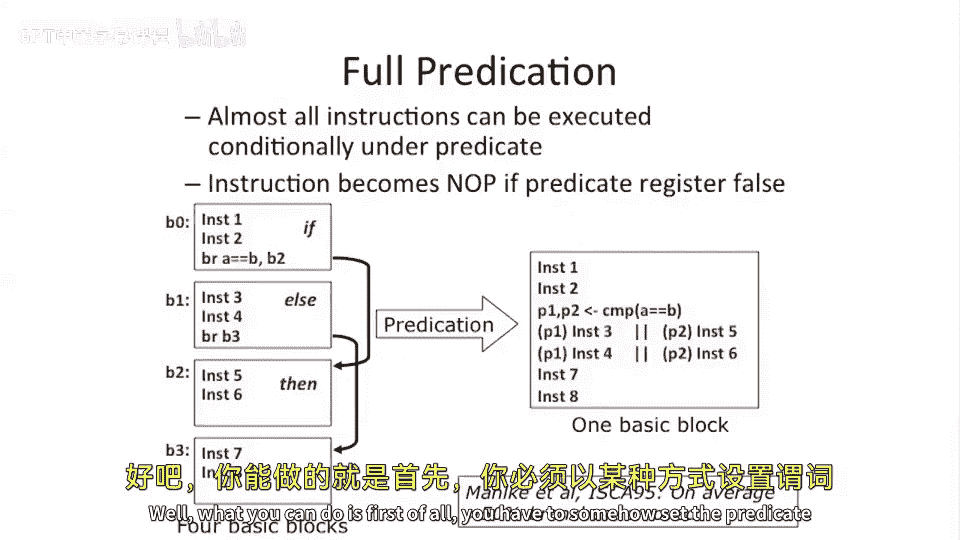

# 【计算机体系结构】普林斯顿—中英字幕 p41 40_06_introduction-to-predication -BV1ii421D7WR_p41-

Okay， so now we're gonna go through different problems with V I Ws and different solutions to that those problems。

Sort of the top one on this list is。A problem of。Hard to predict branches and how that can limit。

Instruction level perilism。So。You just remove the brush。And we're going to call that predication。

So we're actually going to add。Instructions to the hardware。

Which we're actually gonna add two instructions here。 because this， this is。

 this is limited predication。 or we' add two very simple instructions。

 And if you look at these instructions， they're very similar to the。Question mark。

 colon or select operator in C。So what does that operator do？If we have a equals。A。I don' know。

C question mark。呃D。Colin Yi。So I call it。What does this do well。It loads A。If， if C is true。

 it loads A with D。 If C is false， it loads。A with E。Well。

 you can think about actually doing this with。Some sort of。If then else piece of code。

 which is pretty common。If a is less than B， so you can sort of put that here。

X gets A versus x getting B。That's our select operator。Well， we can add to。

 two special instructions here for our limited predication。Move， if0。And move， if not 0。Well。

 what does this do， Well， if。This opera around is equal to 0， then。This R D gets Rs。Else。

 and that's all it does。 That's all that instruction does。

 And the flip one here is it checks if it's not equal to 0。Why is this cool。 Well。

 this allows us to transform control flow。Into a data instruction。So we taken a branch out。

 So if we look at this piece of code， if we were doing it with branches。Set less than we do a branch。

 So this this computes our condition co flag here， branch equals。

 And if it's the one way branches here， If not， it jumps over it。 So we have a bunch control flow。

 We have two control flow operations， the branch in the jump。When we add these instructions。

We can basically do that， if then else， in。In an instruction。And。Basically。

 every V I W processor you're gonna look at is going to have predication。

 or at least limited predication。 This is， this is not full predication。 This is limited predication。

 We'll talk about full predication in a second。Okay， so' let's think about that for a second。

We just took。Control flow， we turned it into something which is never gonna take a branch mis predictdt。

 That sounds pretty cool because branch mis predicticts， you know， were pretty， pretty bad。

 If we had a branch， which was hard to predict， we didn't know with high probability if A was greater than B or not。

We can just sort of stick this code sequence in here and just be done with it。

And what is really important for very long instructional processors is because whenever you take a branch。

 mis predictdt， you're basically having a bunch of。Dead instructions。

 you can't schedule something in， in that point。But if out of our superscaler can attempt to sort of schedule things in there。

 can try to schedule non dependent operations。But our compiler has to come up with some code sequence and has to make them parallel at compile time。

Okay， so a few two questions here。 What happens。If the if then else。Has many instructions。

This was a very simple case here。 We just sort of had one thing inside of each of these if and else。

It's not the end of the world。What you can do and typically， what people do with partial predication。

 which is what this gives us is they'll actually execute。Both sides。Of the if statement。

Interleave them in your V I W， somehow。And then， choose。The result。

 at the end with a predication or a move Z instruction。

 or this is these typically called conditional moves。 If you go look in something like X 86。

 I think these are actually called C move。嗯。If you go look in MiPS， it's called Mzy。

 but people sort of name these things slightly differently。So it's not not the end of the world。

 But when you go to do that， you're actually gonna execute extra instructions that you may not have to have executed。

that's a bummer。Because you could very easily， if， if。

There's a lot of code in here and a lot of code in here。And you're executing both code sequences。

 You're basically doing twice as much work。And if， if it grows large。

 you're doing lots of extra work and you may not have enough open slots to sort of fulfill that。

 At that point， you have the choice you actually put a branch in。If it's unbalanced。Also。

 not the end of the world。 It's probably actually a little bit easier。

 you're probably not going execute twice as much code。 at some point， though。

 you may want to actually， if it's super unbalanced。

 like 1000 instructions on the one side of the branch and like two instructions on the other side of the branch。

 you may just want to put a branch an actual branch there and not try to predicate it because if you took the side。

 which only has two instruction or the the two instruction case。Well。

 all of a sudden you've bloated that by an extra thousand0 instructions kind of in the common case。

 And that's not very good。So that's， that's partial predication。Let's talk about。Full predication。

 which is kind of the extension of that。 Instead of just adding an simple instruction， which moves。

Data values dependent on another value。 it being 0 or not。

Let's say every single instruction in our instruction sequence。

 except for maybe let's say branches or something like that。Can be nullified based on a register。

What does this look like well。Here we have some little bit more complicated piece of code。

 We have four basic blocks。It's roughly an if。Then I see。

 if else then and then sort of some code at the end。嗯。And let's see how this works with predication。

Well， what you can do is， first of all， you somehow set the predicate registers。 So typically。

 these architectures have extra registers， which we call predicate registers。

The predure registers get loaded with some values， sort of early。And then。

Let's say this instruction and this instruction execute in parallel。Different notation。 you'll see。

 there's a semicolon here and there's sort brackets around that。And。

This in front of the instruction here， in parentheses， we have a predicate register。

 which says whether this instruction was supposed to execute or not supposed to execute。Now。

 you can do even more complex things than our partial predication。 Instead。

 now you can basically execute everything and not have to do any moves at the end。 You know。

 if do any bookkeeping。 and you can only ex， You can execute just the sort of side of the branch。

That you need to execute。Scott Melkey in Isca 95 showed that if you do this and you sort of have a fancy enough compiler。

 He was working at UAUC and the impact compiler， you can remove， let's say 50% of your branches。

 A lot of these branches sort of short little branches in your programs。 and a full predication。

 you can do some pretty fancy stuff。 This showed up in the Plato compiler。

 which was H P or Plato architecture by H P and the sort of compiler for that。

 which was the when may whoses。Project at UAU C， the impact compiler。 So you can sort of see that。

 you know， you can get a lot of benefit from this。嗯。So we're gonna， I'm gonna stop here today。

 but I just wanted to briefly wrap up and say。We started talking about how to deal with。

Dynamic events。And how to get a lot of the advantages of speculative execution from out of our supercals。

But in a statically scheduled regime。And we're to talk more about how to do some of this code motion。

 how to move instructions across branches， how to move memory operations across other memory operations。

And then we're going to talk about how to deal with some dynamic events。

 which are hard to deal with in a statically scheduled environment in the next lecture。Okay。

 let's stop here for today。

