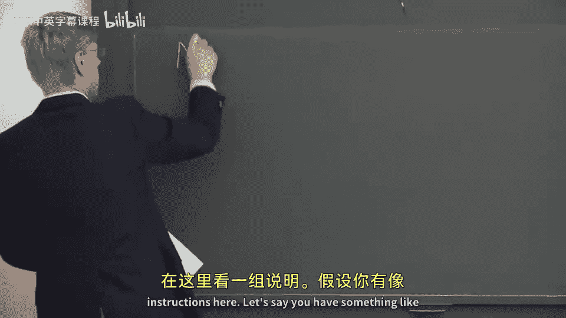

# 【计算机体系结构】普林斯顿—中英字幕 p42 41_02_scheduling-model-review -BV1ii421D7WR_p42-

So today we're going to continue our discussion of very long instruction word processors and we're going to。

Start talking about how do you。Change a classical VIW processor into a processor which can actually get a lot of the perilism and instructionable perism you can get inside of out ofor superscales。

 And to do this， we're gonna have to add a lot of extra features to a traditional or classical VIW。

 And we're going slowly work through that。 And we're going basically list out or nuerate all of the possible different types of instructionable perism and where that comes from in something like an out ofor superscalear。

 and we're going to systematically add features into a very long instructional processor or VIW processor to get us to that point。

 but I'll give you a hint that not all the things that out ofvo superscales can get are easy to get in VIW processors or even possible in the realm of things that people built up to this point。

So before we we do that， I wanted to take a step back and review something from last class and also review something from I wanted to clarify something that I said about how the EQ model and the LEQ model or the equals model or the LQ model work from a scheduling perspective。

So let's， let's back up to slides way， way， way back。At beginning。

 and more I want to say I just a comment that the equals model of V I W scheduling。

And the less than or equals scheduling model are just scheduling models。That's all they are。

 They're not actually something that's in the hardware。

They may influence what the hardware has to do or what the hardware has to provide。 So， for instance。

 if you have an equals model and you have an instruction followed by another instruction in your very long instruction word processor and。

Let's say the instruction reads the value of some register in sort of the shadow of while that value is being computed。

 You're gonna get the old value in an E Q bottle。 So as， as a。Quick code example here。

We can take a look at a bundle of instructions here。 Let's say you have something like。

Multiply。Our1， our 3。A four and in the same bundle or in the same V I W instruction。

 We have some other。Random thing here。We're going to use the curly braces here to denote that it's one。

Instruction or one bundle。Then this multiply， will say， has a latency of four cycles。

So you can't actually go read the result。 And if you look at something like an E Q model。

We're going end up with， let's say we just have some other instructions in here。

 But this one here is important。 We have an ad。Which reads R1， note this multiply write R1。

But as we said， the multipier has a latency of four cycles。 So this in EQ model。Is going to get。

The value before the multiply。So it's not going to pick up this result。And then。

Let's say we just have some other random stuff。I know， maybe some nondependent ads and some tracks。

 And I'm not going to write the registers here because they don't read anything or write anything。

 which is read or in in these two bundles。Maybe you have a no op。And then finally， down here。

We have something。Which does a load。Of R one and gets the result of this multiply。So。

 I'm trying to get across here is this is a scheduling model of what the compiler needs to do and where it needs to place code that we're talking about in these scheduler models。

 It's not a hardware。Problem， if we were to try and take the same piece of code and run up in an L Q model。

The main difference is。This ad here， which reads r1， would not be allowed in the shadow here。

So what would the shadow of this multiply or the delay of the multiply， Because if you were to。

 for instance， take an interrupt or someone like that。And this ad were to get moved later。

 moved later than this load。Or move more than four cycles later you or three cycles later。

 you would actually pick up the new value， and you'd basically change the semantics of your program。

So if you were to do this in something like a L E Q model。

 this ad would have to be above the multiply， and you'd have to replace this open no up。

But more of what I'm trying to get across here is that these are just scheduling models and not actually scheduling models that the compileilr wants to use and not models or not hardware models。

 The hardware has to implement something which makes sense for the scheduler model。

 But when we talk about these different concepts， they really are just a software scheduler model。

Okay， so now we're going to go。Back forward here， and move on to。New content today。

