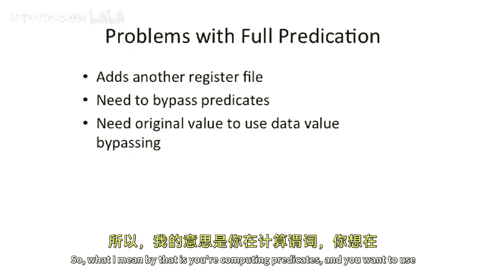

# 【计算机体系结构】普林斯顿—中英字幕 p44 43_04_predication-implementation -BV1ii421D7WR_p44-

Okay， so let's take a look at our data path here and see where predicates fit into the data path。

 And we're going focus actually just on the conditional move predicate。

Or predication instruction here。 We're not going to look at full predication just yet on the data path。

 but it follows a similar idea。Okay， so what， what do we need to。To do。

What do we need to add to our sort of boring？Mip style five stage pipeline to add this instruction。嗯。

instruction comes in， moves down the pipe。Oh， this is interesting。

 I know this is a really cool trick。Let's just。If， if。This condition is not true。

Let's just kill the right back to the register file。It's brilliant。 We just have。

 We just suppress the right back。 We don't have to actually。Change your day path at all。

 We of put a an gate in here。 And this an gate depends on， you know， this condition。Simple。

 it's easy， maybe this is what we should do。Looks simple we just add an end gate with the big x's。

And life is done。Okay， well that looks good， can we bypass this value？

So can we have an instruction that directly follows this move。0。

 this conditional move 0 and reads R D。Well， where are we changing R D？Or not changing R。

 Where are we making that decision。 Well on this pipeline， because we did it in the right back stage。

 it doesn't happen until down here。Down here at our right back stage or this wire。

 thats the right back wire runs all the way back into into the right enable on a register file。Okay。

 well， that doesn't really help us a whole lot。Especially if we're trying to bypass。

 and we're trying to bypass out of。Here are ALU back around。Because at this point。

 we haven't figured out any way to suppress this。 So we don't actually。

 we're not able to actually suppress that。嗯。So what do we， what do we think about this？ So how do we。

 how do we go about doing this？ So let's， let's think about how to actually bypass out for this conditional move instruction。

Because condition move， it's a simple。Comparison with 0。 we should do that in one cycle。

 we don't really have to wait to the end of the pipe to do that。

 And we want to bypass it into a back to back instruction。Okay， so how do we， how do we do that well。

Bypassing doesn't work。What if？😮，We somehow。Pippe forward。D。Original？Value。Ands the new value。Okay。

 so what do I mean by this？ So this， this instruction is very interesting。

Its much more interesting than your standard， like ad instruction。So why is it interesting， Well。

 let's look at the semantics very closely here。Move。0。Is going to write R S to R D。Or。

It's going to write R D to R D。I can say， why do I need to write RD to RD？Well， in the bypass path。

When we provide this value around back to our bypass registers， or our forwarding logic here。

 or bypass mues or our forward forwarding logic， we need the old value of our D。

So the traditional sort of。Some sort of risk pipeline here， we're only get a fetch。Our two sources。

 and we only write one location。So we're going to fetch Rs or Rt。

 and then we're going to write to RD。Now， all of a sudden in this instruction。We need to read ours。😡。

Okay， we need to read that because we need to overwrite R D with R S if we need。

 if the condition is true and we need to read the condition， R T。But aha。

We may also need to read RD here。😡，And this is because。When we get to this stage here。

 and we want to use this bypass path to forward the value。Of。What R D is going to be in the future。

 We need the original R D。So sort of to draw this。A little bit more。Sucincly。

 because this is pretty important。We have if。The register value of R T。Equals zero。We have。R。Of our。

D。Gets。Rs。That's the easy one。 We can count the registers here， one source， two sources。

 one destination。They're like simple。 and everyone always forgets， is there an else case here。

And what does this else case say？Well， the else case is going to say register RD。Get。Register。R D。

You might say， well， RD already had RD， that's true。😡，But our bypassing or forwarding logic。

Didn't have that。So we need to actually read this RD， so that means we need to read one，2，3。

 and we need to write one location。Okay， so that's going to cause us some problems over here。

Because all of a sudden， we had our register file， which had two read ports。

And we need to now have three read port， so we need to add an extra read port on our register file。

And this could be expensive。 So if we actually want to build predication， it's gonna have some cost。

 We might， if we want to build predication and actually bypass。

Something like a predicated conditional move， we're going to have to add another readport to our register file。

And that， that actually has some costs。 And this is especially costly if you look at something like a V I W。

 So let's， let's take， for example， a three way V I W， something like the， the Tlerra processor。

 So it's a three way three wide V I W。Each of those is going each of those ways or each of those pipelines is going to read。

2。If you don't have conditional move， we'll say。And it's going to write one value。

 so it's going to have six read port。And three right ports。 So it's a 10 port register file。 No。

 excuse me。 that's a9 port register file to begin with。And all all of a sudden， we add。

Something like conditional move here。 And we need to add these extra。Readports。

 we're gonna go from a 9 port register file to a 12 port register file where you have。

 let's think about。 I're gonna have three write port and 9 read ports。 That's， that's hard to do。

 It's， you know， it's hard to build these really heavily ported register files。Okay。

 so to sum up here。Our problem， problems with full predication is that you need to add another port to the register file。

You need to bypass the predicates。So what I mean by that is you're computing predicates and you want to use it in the next instruction。

 So if we go back to this instruction sequence here。

We compute these prediccateates， and we want to use it very carefully or very， very quickly after it。

 We don't have to wait to the ends of the pipeline for those predcateates to be computed。

So effectively is going to make make it so that we're gonna have a predicate register file sitting somewhere here and we're gonna to have bypassing around the predure register file or forwarding of the predicates。

To， to get the。The predicates there faster， get the predicates to be used in the next instruction。

And。You'd have to add extra pipeline registers to pipe forward the old value。

Because you might need to keep the old value in the bypass。And in fact， actually， a lot of times。

 when people do these things， they actually always write the register file and just pipe forward both。

 And at the end， make the decision or along the way。

 they make the decision to go into the the bypass or not。

 But then sort of when the instruction finishes that make the decision。

So we're going actually have to add more pipeline registers to pipe forward the old value that was in in this case。

Rdi。

