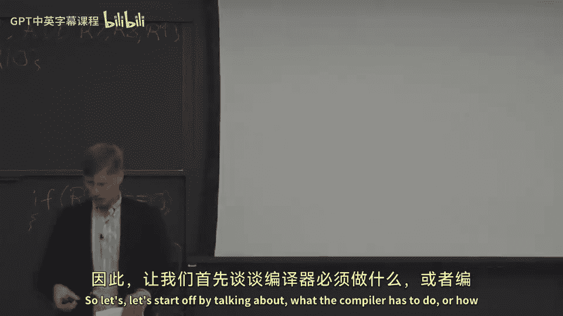

# 【计算机体系结构】普林斯顿—中英字幕 p45 44_05_speculation-execution -BV1ii421D7WR_p45-

Okay， so now let's start talking about how to。Leverage different more techniques to get a lot of the performance that we received。

In a out ofvo supersourer， but in a VIW processor setting。

And we're going to break this sort of into two different things。Dynamic events。

So things that happen in the processor that you can't necessarily。

Or you can't really do anything about statically。 It's really hard to do anything statically about You just don't know what's going to happen。

 You know， something like a interrupt or an exception happening。

How can a compiler know where the exceptions are going to happen？ It's just not really possible。

And then， we'll talk about。Speculation。Which A of our superscaler does。

 And a lot of the things that fall into this case， actually。

 we can add things to classical V I Ws to get us closer to getting。That those。

 those performance improvements or the instruction level app perilism improvements they can get from speculation。

 And we're gonna talk about sort of two different types of speculation today。

 We're going to talk about how to move or specully move instructions over branches。So in particular。

 this guy gets really interesting loads， moving across branches。Because you。

 you have a load and you want to move the load as early as possible。

 You want to pull the load up early into your program so that it misses in the cache。

Or it has to go out to main memory。 You can hide the latency while you're doing other things。🤧嗯。

We're also going to talk about speculation of speculating that two memory addresses。One of a load。

 let's say， one of a store， or you could also think about this as loads with loads and stores with stores。

 but were going to reorder those。Similarly， because we want to get sort of loads started early and stores started as late as possible。

 So we have enough time to do the computation we have when we do the scheduling。And remember in VIWs。

 we're doing all this scheduling statically in the compiler。And as you may recall。

 from an out of voter supercalar perspective。When you try to do load store speculation and try to reorder loads in stores dynamically in a out of our superscale or some sort of superscalear processor。

You're actually， you need an extra structure to figure out when you made a mistake when you reordered something that was not a valid reordering。

 And we're gonna to have to add that same structure into our V I W processor or a very similar structure。

So what's。

Let's start off by talking about。What the compiler has to do or how the compiler even starts to think about this speculation。

So I wanted to introduce a topic here from compilers。

And this is sort of an introduction to how we schedule for V I W。

 the nitty gritty of what the instruction schedule or the back end of the compiler is going to be doing。

So here we have two pieces of code。 We have before code motion。And after code motion。

So what is code motion， Well code motion is reordering of instructions。In order to。呃。

Tolererate the latencies of the instructions or to do something good。

 So it might might not just be toing laency latencies of instructions。

 It might also be reordering for alignment issues。 Sometimes sometimes branches can only happen on certain alignments or the performances better。

 So， but， but roughly。We're trying to reorder the code。Or p。Do valid reorderings of the code。

 We can't just move a read after write dependence and move it someplace else。 We can't say， you know。

 instruction A， reading instruction， the result of instruction B。We can't move a。Before B。

 because it just wouldn't make any sense。A lot of times。

The compiler has some flexibility in what it can move around。Okay。

 so let's look at this example case here。We have a garblely good of code。

And what we're going try to do here。Well， two things to note， one。

 this branch at the end is dependent on Reg 16。Register 16。Where does it get computed。

Did actually get compute anywhere in here。No， we're also saving away Reg 16。Okay， so。

Does Reg 16 get compute maybe not， but we probably want to give it as much time to be computed as possible。

Some of the things going on here， we have a load。Okay， well， the load。Wor the load cash misses well。

Well， this next instruction here is directly dependent on that load。

 So we probably want to give it as much time as possible to execute。So traditionally in code motion。

 you want to sort of push the loads up。And push the stores down。What we're going to do this。

 if we were to push the loads as high up as possible and the store is down as possible。

 we're going to move。A load and a store past each other。 And the question comes up。

 what if this value and this value， these two addresses are the same。嗯。Well， so let's。

 let's assume that they're not。 And let's assume the compiler can somehow prove the not。

So you should be able to do code motion here where we're going to rejumble all the instructions。

 we're going to push the load up and push the store down。Leave the branch at。Excuse me at the end。

 So we've done， we've done some code motion。The next thing we're gonna want to do is we're going want to。

Bundle or schedule the instructions。 So when I say bundle， we're gonna take。Several operations。

And pack them together into one V I W instruction or one V I W bundle。 And we denote that here。

 with these。Braces。To say these execute parallel or at the same time。

So first you're going to of want to do scheduling， then you're going to want to somehow bundle nondependent instructions together。

There's been a couple algorithms that've tried to do sort of scheduling code motion。

 scheduling and everything and bundling together。 Those don't always work out as well。

 So most of V IW pro most of V IW。Compilrs now will actually do the code motion and the scheduling first。

 and then they'll do the bundling at the end。Okay， so let's look at our first technique here to get it at instruction level parallelism and our first type of。

Speculation in a VIW processors。So what's our challenge here， what's our problem， well our problem？

Is the branches or the presence of a branch rather， is going to restrict。

The forms of code motion the compiler can do。So we have a branch。There some code after the branch。

If you have， let's say， an ad instruction， that's pretty easy to move it before the branch。Okay。

How about an instruction which can take a fault or take an interrupt？

Loads are a good example of one of those sorts of instructions。How is that possible， Well。

 a load can take a。Page miss or a page fault， it can try to access some value。

 which is not mapped in by the operating system。So let's say we take this load and we move it above the branch。

Okay， it's not too bad。Now， what happens if that load takes a trap or takes an interrupt？都。

Was never supposed to happen in correct program sequence order。

 The branch was going to branch around the load。So the load was never going to execute。

 but all of a sudden。The load got moved up， and the load executes。And it takes an interrupt。Ah。Well。

 your program crashes。 It takes either a second or a bus error。

 if you're on like something like a spark system or you know。

 you're basically taking a segmentation fault。Even though nothing， nothing went wrong。

This branch was supposed to protect this load from never executing。 So our one here， let's say。

 just gets load with some bogus value If the branch is taken and the the compiler knew that and the programmer knew that。

 but。All of a sudden， the compiler decides to reorder things and has moved the load up now that because it wanted to try to get more performance。

This is something that you can do in your out ofvo superss。 Also。

 outvo superss are going pull nondependent loads up in the program and try to move them across branches。

But out out of our super scourer， if you pull load up and it does something wrong， you just。

 it was speculative state。 You just don't， don't care about it。

 So we need some way to have loads that don't hurt the system。 So it's a similar sort of idea， but。

 you know。We can't move this load above the branch because it might cause some sort of。Exception。

So our solution to this is we're going to add。Special instructions。

Special versions of the instructions， which don't take faults。So。If the fault were to happen。

 it sort of remembers that the fault happened。But it doesn't actually interrupt the process。

 And this is this allows us to pull some of these instructions before branches or reorder perform code motion statically at compile time。

Okay， so let's take a look at this example here。 How would we go about doing this。Okay。

 so we're going to move the load up。So let's say we move the load as high as possible。

 we moved above these two instructions， In 1 instruction 2 here。🤧And。What do we need to do， Well。

 if you know， we don't have the word load here anymore。 We have load dot S。

 So thiss a speculative load。 which has different semantics。 This load dot S。

Never causes an exception。 even if it has like a page fault or a null point or exception or unaligned memory reference or anything like that。

 it's not going to actually take that fault。Instead， it's just going to sort of remember that。

And this is typically done。 If you look at something like ittanium， which is the， this。

 this is a sort of code sequence out of ittanium processors in itanium。

 what they're gonna do is they're going to the， the destination of a load。 In this case。

 R 1 is going to be set with a poison bit。Itanium is actually called not a number。😡。

And what that means is the destination register of the load is marked as。Not there。

Or that's not a thing or not a number。And what's important about this is when you go to use that value。

That's when you take the exception。So let's， let's take a look at example of this。

 What we do is down here。Where the load originally was， we put in a check speculative。Instruction。

And it uses R1 here。 So what this is going to do is it's going to check the value of R1。

And if our one was。Took a trap or exception， and there was some problem with it。

We can jump to fix up code。So there'll be some other piece of code somewhere else we can branch to。

 And that fix up code is going to reexec the load and make sure everything is okay。

And then then jump back to the use。 So it's speculation。

We try to prove and we try to make sure that the common case， when we pull this load up。

 nothing bad is gonna to happen。But we put a check in just to make sure that this is the case。

One other thing I wanted to point out here is these poison bits or these not a。Not in numbers。

They propagate。So why is this important？What that means is。Actually。

 I want to correct something said a little bit here。

 If you try to use our one somewhere else before you do a check。The not a number propagates。

 It doesn't take a trap。 It only takes a trap or only jumps to fix up code when you go to actually do the use or when you have a special check instruction or a there's another load you can put there that will reexute the load if the。

 if the original load didn't work a non speculative load to the same， to the same value。Okay， so。

 so why is this propagation of not a numbers important， Well。

 this allows you to pull code down here up。And aboveve this branch also。

So we can put the pull the load up。 We can pull dependent instructions up。

 And then just as long as we do the check at some point。And check to make sure that the load was not。

Didn't take an exception or not a problem。We can basically speculate that the load is fine。

 We can speculate that the instructions dependent on the load are going to be fine。 but if。

Any of the dependent instructions？On the load are not fine that we've also speculated。

When we go to at some point in our code， we need to introduce this check instruction here。

 which sees if this value is not a number。 So if it propagates all the way through your code。

 you have a low to add， to add a subus which all reads and writes。

 let's say register or somehow reads from Reg 1 and there's of a dependy tree from Reg 1 through those that code sequence。

At some point， you want to check after the branches has actually happened。Whether everything's okay。

And because it all propagates， you can basically do work early and then check later。

And when you do the check later， you can say， oh， I get it， everything's okay。

 and it has a value in it。 It has not a number in it， or it has this poison bit set。

And it's propagated all the way through。嗯。At that point， and you can jump to fix up code。

 which you can re executeecute the load。And all of the code you've pulled up。

 all that speculative code。 And that's why you need fix up code and not just re execution of load。

Because the fix up code might have to re execute more than just the load。

 It might have to execute the load and all the code。

 the other code you pulled up in front of the branch。Okay， so let's， let's move on to another。

Type of speculation， and this is data speculation。So in data speculation， our problem here is。

We have memory hazards。That are going to limit our scheduling。

 especially if we have to do all the scheduling statically。

So if you're conservative in your compiler and you can't prove anything about the different addresses。

All of a sudden， what you have is every single load is dependent。

 every single other load and every single store is dependent every single other store。

 And I might say wire are loads dependent on other loads。 Well loads and loads。

 you might be able to reorder pretty easily， you have to worry a little bit about if one takes a trap before the other。

 I guess we could have already talked about how to solve that problem。

But once you reorder a load in a store。Then you start to have problems because or retor a store in a store or anything with a store。

 then you start to have problems because all of a sudden you have some state that changed in your memory system。

That you have to make sure that the in original program or the later instructions actually pick up the result of that。

 So later loads or stores somehow honor the results of that。

So it's really sort of focused on moving loads and past stores。 So what's our solution， Well。

 our solution is to add。Some hardware check。To guarantee that the pointers or the two memory addresses。

 when you do the reoring of load in a store or a store in a store。

That these addresses are not the same。 And this is actually the same thing that we did in our load store queue or our load store dis memory disambiguation that we talked about in out of order processors。

So it's the same sort of thing going on here。But we need to actually change the instruction set。

To handle this in a VIW setting。Versus in the superscale was all micro architectitectural issues sort of below the instructions have no one ever had to look at。

Okay， so let's look at how to do this。We have a code sequence here。Some instructions， a store。

 and then a load。Compilr can't prove anything about these stores and this load。

 But out of our superscaleer， it could guess or speculate that the load in the store don't share the same address。

 And if they did， it can basically roll back the code and re-execute the load。

 And we want to emulate something like this。But using doing it all statically with the compiler。Okay。

 so how how do we do this。 Well， this is something else that Itanium added and was also talked about in previous。

Research VI W processors。Or explicitly parallel instructions set processors。🤧嗯。

What you're going to do here is you're going to move。The load up above the store。

And this is basically speculating that the load in the stores don't hit the same address。

And much the same way that we。When we reordered loads of both stores in an Audvore superscale added the load address to a load store queue and a memory disambiguation queue。

 we're going to do the same sort of thing here that were when we move this load up。

 we're gonna have a different instruction here of load and add。

So what this is going to do is it's going to add。It's going to do the load。嗯 응。An ad。

The address to a special table， which we're going to call the address。

 what does A last stand for address load advanced load address table。

 The AAT is what ittanium calls this。So it's a structure that's a。

Associative structure where you can put addresses in it， and then check other。

Instruct other addresses from other instructions against it。

 And if you get a hit or something like that， you know that something bad happened。And you can reex。

 So we're gonna see here that we're gonna have a load。

 which is going get the load out in the memory system。 we could overlap。

The time in the memory system with executing other instructions。嗯。We have a store here。 Now。

 the store is going to take the address of itself， and we've changed the instruction set here because we added these two new instructions here and changed the semantics of a store。

 And it's going to check in the Alas or the advanced load address table to see if the other see if the address that the store is happening to is already there。

 And if it is。It's gonna going to change the table somehow。

 And we'll talk about that in a second of what exactly happens。 But roughly。

 it's going to take this address out of the table。And then when this load check happens here。

This checks to see if the address is still in this table。 And if it's been bumped out of the table。

It jumps to fix up code， which is basically going to re executeec the load。

Or reexecute the load and all the dependent instructions of the load。So， we can。

Effectively do data speculation， but all in software。But this is going to require us to have。

An associative。Hardware block or some sort of content addressable memory a cam that we need to add that all load addresses and all store addresses。

R are。Passed across， and this is similar to how we had our memory disambiguation queue in our out ofor supercal。

Okay， so let's look at the Alat， the advanced load address table。Okay， so what do we have in here。

 Well， three things。We store the address。We store the size， this is important。

 so we know was it word。Double word， half word， byte sort of thing when we go do matching。And。When a。

Load dot a happens。😡，It adds one into this table。 And we。

 we denote the register number that is the target of this all。

 So it's kind of kind of useful to know。 And we go to do the check。

 This is to match up to make sure that the same load is the same load from before。

 and we can effectively remove the address in the table when we do the check。Okay， so we added。

An address。Okay， we're running along。 And no we execute stores， but the stores。

Don't hit on the address。😡，So when a store executes， what is it gonna do， Well。

 it looks in this table and cams or， or does a comparison against all the addresses with size matching and everything against this table。

 And if it's in the table， it removes it from the table。So， by the time。

That the check or the load check happens。That address is not in the table then。😡。

So when the load check happens， it's gonna look in here this table again and say， oh。

 I'm not in the table anymore。 This address is not in the table anymore。 So at that point。

 you can know， let's go re executeecute that。Load。But if it's still in the table。

 that means no stores hit it， bumped it out of the table。😡。

So those stores in the inter leaving time bumped it out。 So the speculative load was fine。

 So we've effectively done what out of our supercals can do。 We can move now loads。😊。

Above stores and three a。Change to our instruction set architecture by adding these special check in load check in and check instructions。

And by changing the semantics of load and adding a load。Add or load A instruction here。

 We can change。We we can have data speculation into our program。Okay。

Couple other things that are fun to add to classical V I Ws to improve performance。

 I kind of want to breeze through these these next two ones a little bit faster here。 First one。

 multiway branches。😊，So problem， you have brand of V I W architecture or very long instruction architecture。

 And if you have， let's say，10 things in one。Instruction or 10 operations in one instruction or 10 operations in one bundle。

But you have sort of short branches， or maybe you have multiple branch decisions happening。

 You want to have sort of a branch every three instructions。Well， you have lots of wasted slots。

If you can't somehow have one instruction， branch multiple directions。😡。

They might say branching multiple directions。 that's a really weird idea。

 How do you have an instruction go multiple ways。 I thought branches could go one， two places。

 they either fall through or go someplace else。Well。

 we can actually change the instruction set to have a branch that can go multiple directions。

 So let's look at this with a full predication example here。So we have two bundles of code here。

This first one here is three instructions in it。 these are all executing in parallel。

 And what it's gonna to do is it's gonna do。Three different compares。So this is similar to。

 this is our full predication example here。 It's going write to these predicate registers in with the the logical。

 positive and logical， negative sort of versions of， of the the prediiccate comparison。Okay， so that。

Sort of stages us to do three different branch comparisons。And then。Down here。

We have three branches that all branch based on this predicate。

these different predicates that we already staged are set up up here。

And they can branch to three different places。 label 1， label 2 and label 3。

 And as also could be fall through code if none of the branches are taken。And you know。

 one little wriggle here that you have to sort of figure out the semantics and I should say ittanium actually supports this。

 so you can buy real chips with this in it。

If you have three branches together， you need to somehow order these branches because let's say they all say taken。

Well。Or they all all resolve to actually being taken。 Well， which one do you take。

Becauseuse you could branched all three different places。 and we want deterministic execution。

 So typically， when you have an instruction set like this of multi way branching， you。

Define some order。 Maybe the first one has priority over the second one。

 which has priority over the third one， et cetera。

