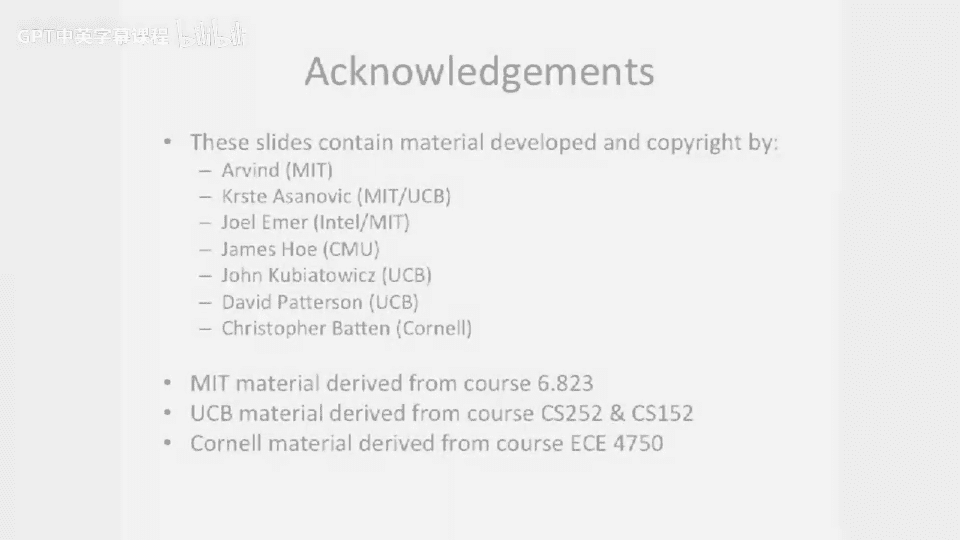

# 【计算机体系结构】普林斯顿—中英字幕 p48 47_02_branch-cost-motivation -BV1ii421D7WR_p48-

Why is branch prediction important？So let's talk a little bit about motivation。

 that we're going to move on and start talking about branch prediction and the two things we need to predict when we're predicting branches。

And。The top thing that jumps to mind is， is the branch take or not the outcome with branch。

That's only half of the story。And today， we're also going to talk about figuring out where you actually go when you take a branch。

 When I say a branch， we're gonna loosely put all forms of control flow into this。

 So it's not just a branch。 It's branch， a jump。You might even think about trying to put something like a interrupt because that changes your control flow of your program。

 but most people try not to predict their interrupts hypothetically possible。

Let's start off by talking about why， why branch prediction and what is the big motivation for branch prediction。

So as I said， longer pipelines and more complex pipelines。

Require us to have relatively good accuracy trying to figure out when we take a branch or when we don't take a branch。

 So here we have our。In order issue or me in order fetch， out of order issue， out of order。

 execute in order， commit pipeline。And a couple of things you should note here is， you know。

 we added this extra stage out here。 We added this issue stage。

 but we also added this issue queue or instruction buffer here or issue window depending what book you read in the front here。

Well， instructions pile up into this。And if you don't actually figure out if the branch is taken or not。

 let's say until somewhere here， in the execute stage。Then you're gonna have more。

 basically instructions you need to kill。When you take a branch mis predict。

 So when you start to go these out of order processors。

When you sort have this seemingly short pipeline， seemingly easy pipeline。

More instructions can get sort of queued up into some of these structures。

 especially if you have a queuee。 So this effectively blinks the front of your pipeline and makes it such that if you mispredict or you fetch the wrong instructions relatively often。

 you're just going be out in the weeds。 You'll be killing lots of instructions and have done a lot of extra work that you didn't really want to do。

So。Also。If you wait all the way to the end of the pipe in sort of these out of order processors to resolve your branch。

That's also going to make life even worse here， because that makes your mis predictict penalty even longer。

Most people don't actually do that。 I mean， you might say， oh。

 I don't want to actually kill instructions until I know the branch commits。

 And that was sort of our simplistic example we had when we were talking about these out of order processors as we waited all the way to the end of the pipe and then sort of cleaned out things。

 You can wait for it to go to the end of the pipe to actually fully clean out things。

 But you want to redirect the front of the pipe or redirect the fetch or the PC in the front of the pipe as quickly as possible。

 because you just don't want to be fetching off into the weeds because then just wasting cycles。

Here we have going back to our super pipelining lecture that we had before。

 And we look at the for some real processors， the， the pentium 3 and the pentium 4。

 what their branch mis predictdicction penalty is。And。You know， in this penny of four here。

 you have 20，20 odd cycles here of branch mis predictdict penalty。

That can be pretty painful if you take branch mispredts quite often because you're going to be taking branches and the branch penalty is going to be quite。

 quite high if you don't have the correct subsequent instructions after you。Now， you know。

 we talked about some techniques。 You you could just stall and wait so you don't actually predict the branch。

But then if you have to wait for every branch to get to， let's say。

 the 20th stage of the pipe before you go and fetch the subsequent instruction。

 that's pretty painful。 So we talked about speculating。The next PC or the PC plus4。

 we'll say in a MIPS style architecture or architecture where each instruction is 32 Bs long。嗯。

But that doesn't really help you when you're trying to predict。Or when it doesn't really help you。

 if with high probability， you think the branch is going to be taken or you think the control flow is going to be taken。

So you need to start thinking about how to actually deal with that in a pipeline。

 And up to this point， we've only talked about speculating the fall through case。

We talked briefly about speculating the nonfall through case。

 but we didn't say how you could possibly do that。 And today。

 we're going talk about what the hardware is to do that。Also making。

 making life worse is if you start to go。Wide。This hurts also。 So if we start to go wide here。

 let's say we have a dual issue processor。 But if you go wide here， when you go to kill instructions。

 you're killing twice as many instructions in flight in the pipe。

 If you take a branch the wrong direction or mis predictedd a branch。

 So showing that from our pipeline diagram perspective here， This is just recapping。

 We had seen this in the previous lecture。But here we have a fetch for this branch。

And we're fetching two instructions per cycle here。 So even if we're relatively short。Pipeline。

You end up with 1，2，3，4，5，6，7 dead instructions on a mispredict。

So what this really comes down to here is you have the pipeline width or or approximately how much stuff you end up getting killed is the pipeline with multiplied by the branch penalty。

So， it's。With times， length before you can resolve the branch。And if you can shorten。

The time it takes you to resolve the branch， that's good。Or if you can make the processor narrower。

 that may be good。 It's good from， you know， fewer instructions being killed。

 But we like to execute multiple instructions at a time because that improves our performance。嗯。

So this is really the motivation for thinking about。

Trying to put something useful in this time here and also trying to reduce the probability that we start fetching incorrect instructions at all。

