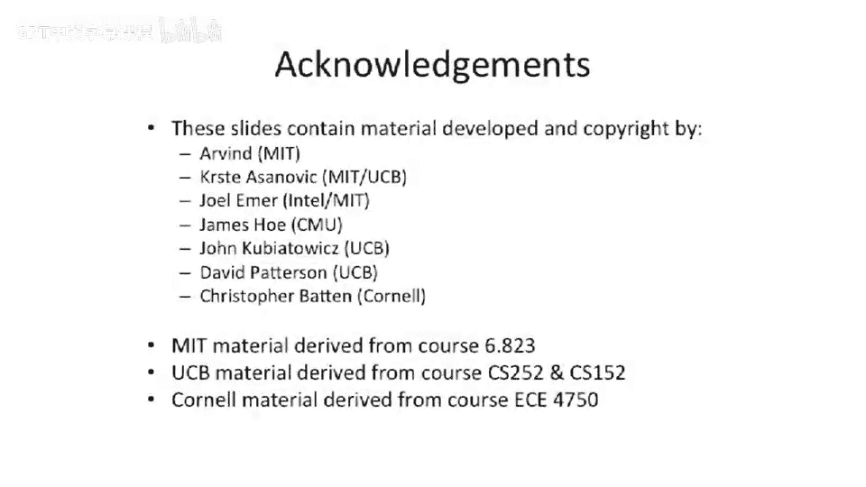

# 【计算机体系结构】普林斯顿—中英字幕 p49 48_03_branch-prediction-introduction -BV1ii421D7WR_p49-

So this brings us to some techniques。 So we're gonna to start off by talking about。

Prediction and how we can use。French prediction to determine two things， the outcome。

And the target address。So branch prediction。Everyone always thinks that it means this first thing。

That's not what it means。It encompasses both things。 here have to predict。The outcome。

So that's whether the branch is taken or not taken。And you also want to predict。The target address。

Now， if you think about that。The first one sounds relatively trivial。I could sort of pull numbers。

 I could pull something out of a hat。 take it， not take it you， just sort of choose randomly。

It's going do okay， Probably， I could probably try to correlate it somehow， use some heuristics。

The second part here。I forget the number exact。So if I choose at random for my branch prediction outcome。

 I'm going get a 50% right。Or if I just always choose， I don't know。

ll say we would just always choose not taken or something like that。

 We're probably gonna do pretty good。But。Getting the actual destination correct。You have to be exact。

 You have to choose a number out of， let's say， if you have a 32 B instruction pointer to。

 you have to choose some random number out of 2 to 32 locations and get it right all the time with high accuracy。

So we， we'll spend some time about this talking about this and some strategies to， to getting the。

Prediction target and predicting our branch target and our jump target， correct。

But you to think about both of them is all I really wanted to get get across here。Okay， so this。

 this is something we is a little bit more review from something we had talked about in lecture。

 I think 2。We talked a little bit about figuring out。Where we can resolve a branch。

So here's a little bit longer pipe。1，2，3，4，5，6，6 stages， not quite our five stage pipe， but put a。啊。

Issue stage in here。And。Let's look to see where everything gets known。So we know that our。

Target address for branches， jumps， and jump in link。Will likely be known。Here。

But that's not really helpful unless we know which way。The branches。

 rather let we know which way the branch is going or the branch outcome。

Because even if we know fe for jumps and jumping links， we know the outcome it's taken。

But for conditional branches， we may not know that until somewhere over here。

 So we can't necessarily use that information。Until later in the pipe， for branches。To。

 to do something useful in， in the naive approach。In the execution stage， we know the branch outcome。

 We talked about a trick in。MPS， at least， where we can try to pull that forward a stage into our decocode stage。

By having some sort of special comparator on the output of a register file， comparing you of 0。

But it doesn't work for all branch types。 So if you have something like a branch equals。

 we you're actually trying to compare two real registers。 You need to wait for the full bypass。

Doing a 32 bit compare is sort of the equivalent of doing a full 32 bit subtract。

You're not really going to know that until the end of the execute stage。 That trick doesn't。

 doesn't really hold water。It holds water for comparing with 0。

 You might even be able to do it if you have lots of extra time in your decode stage。

 But let's assume that you don't。Also， target addresses for jump registers and jump and link register。

Jump Pres， jump a link predator。You need to read the actual address that you're going to out of register somewhere。

So this， you can't I mean。Have a chance of trying to predict it out here or the destination。

 It's pretty hard， because。I know it's somewhere in the bypass， you just compute some value。

 Then you jump through it。嗯。So the the the we don't， at least out in here。

 by the time we are done in here， we have one of two addresses。 excuse me。

 we have the both of the addresses that the branch could potentially go to。

 go to either the fall through address or the branch target。

 And we know that's sort of at the end of the decode stage。

 for jumping link registers and jump registers。We don't even have that information。

 It's not encoded in the instruction anywhere。 It's encoded in a register。

So we need to go fetch something from the register。 We might have to go through the bypass network。

So we're going to have to wait。

