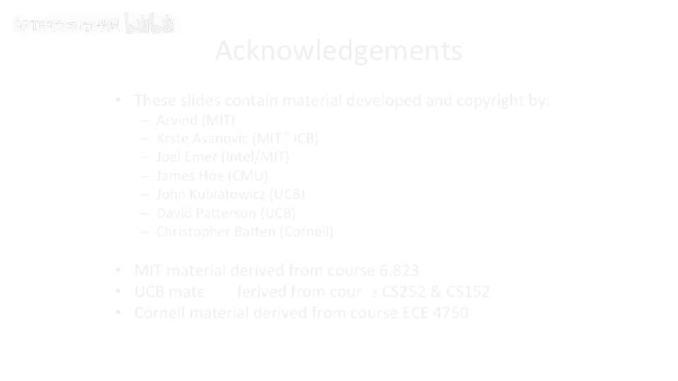

# 【计算机体系结构】普林斯顿—中英字幕 p50 49_04_static-outcome-prediction -BV1ii421D7WR_p50-

So， what's。Look at some techniques。To deal with outcome protection。For branches。

 And we look at this mostly， first of all， in the static domain。

 So things that are not trying to watch the dynamic instruction sequence。

 but instead are can basically statically analyze the instruction sequence and。

With some high probability， we'll say， try to predict the location。

The first technique is actually not a prediction at all。The first technique。

 we had talked about this a few lectures ago。 or we actually， we talked about this in lecture 2。

 adding delay slots。So， instead of。I don't know。 having that time just be dead cycles when we're trying to resolve the branch。

We will say we put a， if we don't resolve the branch to here。We have， let's say， one delay slot。

 two delay slot，3 delay slots。And we have three instructions， we'll say。Or maybe you can。

Redirect at this point out of X。 And you have two branch lace lotss。

 depending on how you sort of wire that in。 if you can make the cycle time。

Let's say you have two branch lace slots。What ends up happening？Is you have instruction。B， E。

 Q Z here。 Let's say that is that address 100。And then you have two instructions which execute。

 no matter whether the branch is taken or not taken。That follow it。

So these instructions are in the delay slots of the branch。 And you know。

 you can have architectures which have things like load delay slots and other things like that。

 But for right now， we'll talk about branches。And we can force these instructions always to execute。

 Unfortunately， if you go look at this sort of percentages of probability。

 you can actually fill these delay slots， it's pretty low。It's always not easy to find work to。

 to shove down here because you're basically taking work that was above the branch。

And in the compiler， reordering the code to put the。

Instructions that were before the branch after the branch。Hm。Okay， well， this is good。 I mean。

 if you could actually make this work out， this， this is great。😊，One of the problems with this。

 though， is。The probability of filling one branch lace slot， let's say， is 70%。

And the probability of filling two branch delay slots is even lower than that。 It's maybe。

50 ish to 40 ish%。As we said before。If you have a monkey pulling out of a a hat or just some random process pulling out of a hat。

 you're gonna do 50%。Correct。So。And as we'll see today。

 if you use some more fancy branch prediction or the outcome prediction。Techniques。

 you can get the prediction accuracy of a branch all the way up into the sort of 95，96。

97% probability。 and all the way and people have built。

 like if you look at your sort of out of our superscale it on your desktop。

 your core I 7 these days from Intel， that's probably somewhere in the neighborhood of 98 to 99%。

 correct。So。Being able to fill these glace lotss with some probability。Which is less than 98%。

Is not a good， good trade off。You would have better been served。

 possibly by allowing some fancier prediction mechanism trying to fill it if you care about performance。

Now， if you care about complexity or reducing complexity in area。

Aesthetic prediction might be a good， good way to go。So let's， let's look at some。

Basic rules of thumb here about static prediction。So the， the overall probability branch taken。

 let's say， out of something like specint is 60% to 70%。But it's not equally distributed。Backwards。

 branches have a much higher probability of being taken than forward branches。Okay。

 so we got a question coming up here。Why is this， Yes， So。

 so loops with high probability or by definition to be a loop， you're gonna have to jump backwards。

If you jump forwards， it's pretty hard to loop。So if you jump backwards， it's a loop。And， in fact。

 people like to execute loops loops and stay in loops for a while。

 because that's where a lot of work is done。So if you're seeing a loop and you're just spinning in this。

 this is increasing the probability that the backwards branch is taken。

 and that has a high probability。So let's this half forward branches。50%。嗯。Can we。What's。

 what's going on there， For Bra，50% going forward。These are usually some sort of data depending branches。

 like if then else clause。So that's why the probability of this is much， much lower。

You sit in loops for long periods of time。 For branches， typically sort of are if then else's。

 And theres you're checking some data value。 And then you're either executing or not。Now。

 this gets a little trickier of some more advanced compiler techniques。

 becauseuse sometimes with advanced compiler techniques， you will actually。

Effectively convert a loop with， if then else into it or a condition。 check at the end into a。

Unconditional backwards branch。And then a little sort of branch that goes around the， the。

PC code which checks the loop Sentinel or or checks whether the loop is completing or not。

But even that's actually not a horrible thing， because at least that backwards branch will always be predicted。

 Take 100% because it it's turned into a jump。So that's， that's not bad for performance。 It's just。

 you know， might change these percentages a little bit。

But things do like to sit in loops is what you should take away from the slide。Okay， so what's。

Think about a technique to try to take advantage of this。

So one technique that you can take advantage of this with is actually to add。

Extra bits to your instruction set。And allow the compiler to hint to the architecture whether the branch is taken or not taken。

Now， this is still a hint。 If it gets it wrong， we still' the correct execution。

 So if it takes a branch。We still want still want to go correct。

 We still want to execute the right piece of code， but the performance might just be worse。

So let's take a look at two branches here。 We have branch。Dot T in branch， dot N T。

Branch do T is a branch which is taken or predicted taken。

 and branch do NT is a branch that has predicted not taken。嗯。So who I say about this well。

Archiectures do have this。 I was gonna say the itamium architecture actually has static branch prediction completely。

 Some things have sort of intermediary things with this。 For instance。

 the Motorola 68 K kind of has something like this， but not you can do with all branches。

So this does exist in in real architectures and。One of the things is that this can actually be very accurate。

Especially if you profile your code。So if you run the code once and you allow the compiler to see which way the branch was taken。

It can do quite good。 And， and some of the insight here is there's a lot of branches in a program which are there just to check error cases。

And the probability that they actually are taken or not taken one way or the other or someone that can basically almost。

Be statically determined。At compile time。And definitely。

 if you have feedback information of execution the program once。That's's a very good indicator。So。

 for instance， if you had a loop， you would the compiler would denote that the backwards branch is taken。

 So it would put a B R dot T。 And if it's， let's say some piece of code which just jumps over an error case and it checks an error condition and 99% of the time that it never falls into that。

 it would predicts that taken because it just jump over that little piece of code。

So you can actually have very high prediction accuracy。 Now， we're not。

 we're not up into the 99% here yet or something like that。 This isn't， this isn't great。

 We're still doing static things here。 And， you know， at this point。

 it might actually make sense still to have a delay slot because we're still not over our。70th per。

 we're sort of a close trade off here。 You have to get the stack prediction correct。

 and your delay slot might actually still be a better approach at this， depending on sort of how。

 how this accuracy compares up to how many times you can fill the delay slot。

ButLet's take a look at what happens in the pipeline here。So here we have branch taken。

And it's predicted taken to this target。We still end up with a dead cycle here because we do not know where that target is until。

We've effectively decoded the instruction。So that in this sort of intermediate time here。

 we just to fetch， let's say the fall through case or something like that。But。

Because we predicted a take in， we could。 We can do better here。

 We don't have to have two delay slots or two dead cycles。 We can fill it。 We can actually get the。

 the correct next instruction in here。For the target。This branch not taken。

 Let's say we speculatively execute the fall through。 We， we don't actually have。Any。P for。

A correctly predicted。Branch here。 So if we predict this branch not taken。

 that's the fall through case。We can just fetch PC plus 4， PC plus 8， and just keep executing。

 And we have no， no penalty there。Okay， so if we get the hint wrong。What are we gonna do， Well。

 we've effectively taken a mispredict penalty here。

And if you look at the branch taking case and you take a mispredict penalty。

What's going to happen here is you're actually going to end up having two。

 two dead cycles because we don't actually determine whether we took the mis predictdict or not until this execute stage。

And that's the suit is we can go redirect the front of a pipe。Now。

 if you look at this and squint really hard。You can see that we actually fetched up a twice here。

 This was the fall through instruction。It is hypothetically possible。That you might be able to not。

Hold off killing this instruction， if you will。And in this case。

 sort of have the pipe do something special and actually end up。

Getting the instruction after op A or op B here， if you will。 But that's pretty hard to do。

 So for the， for the base case， we'll just say that you end up with an extra cycle of mis predictict penalty when you mis predictdt。

Yeah， so just to reiterate that， what I was trying to say here is that。With a branch taken。

We fetched the subsequent instruction， the fall through case。We fetch the target of the branch。

We try to kill this。But lo and thehold， we actually end up fetching the exact same instruction and getting。

So you could， if you really wanted to try to optimize around that and not fetch this twice。

 But then you're kind of having things out of order in the pipe here。

Because you'd have this instruction， This instruction is dead。

 and you have to figure out how to kill sort of sub portions of your pipe or things out of order in your pipe。

 that gets pretty， pretty hard to do。But this does really quite well。

 If we do static software based branch prediction。Okay， so let's look at hardware branch prediction。

Now， when we say hardware branch prediction， that does not necessarily mean dynamic hardware branch prediction。

This could just mean。That you have the hardware。Doing the prediction without any hints from the software。

And we have a couple different cases we can try to implement。Huristics， if you will， in hardware。

The first one here always predicts not taken。 This is what we've done so far on all of our pipelines that we've designed。

We predict， we predict fall through effectively， and we just fetch PC plus 4。

We didn't put a name on it。 but this is actually what we were doing。

 We were doing spec execution with a static cover branch prediction of PC plus 4。嗯。

It's pretty simple to implement。Its what you guys have done in your labs so far。You know。

 the fall through early。 accuracycy is not very good。 You get all your loops wrong。

All your backward branches or your loops just are always predicted wrong。Okay， let's。

 let's do the inverse here。 Pre taken。 Let's have that be our static strategy in hardware。Well。

Kind of hard to do here because we don't really know the target of this branch in decode。

So it's like going back to here。If we predict everything taken， what do we。

 What do we fetch this cycle。Well。I don't know。 It's a big question mark there。

It doesn't do super well on if then else's， because a lot of times those are sort of forward branches over things。

Or， or some depends how you structure it。 Some architectures。

 which have things like these stag prediction techniques， will actually restructure their code。

 such that the。Compilr will figure out the probability of a branch being taken or not taken and then work the code around it。

To make it work out。That's actually pretty common。 The。

 the Motorola 68 K had something similar to that。 And they the compilers there actually try to work around it。

So， well， this is definitely a bummer here。Maybe we can fix that。 like we said。

 this is the second part of today's lecture is trying to fix this problem。Okay。

 how about we use a heuristic。That all backwards branches are taken。

And the forward branches are not taken。Okay， so this does a lot better。

This is are heuristic of what we were saying before that loops and things like that will get caught up in this。

 So a forward branch is not part of a loop。 It'll willll predict that not taken。

ll predict the fall through。 backwards branch will predict taken。 This does pretty good。

It's better accuracy。 It's still nowhere near the sort of 80% accuracy that we had if with the compiler could get involved。

 because that's effectively us the compiler case that we were talking about before could actually implement this entire algorithm。

In software。Or something much more sophisticated。 And that's usually what ends up happening。

