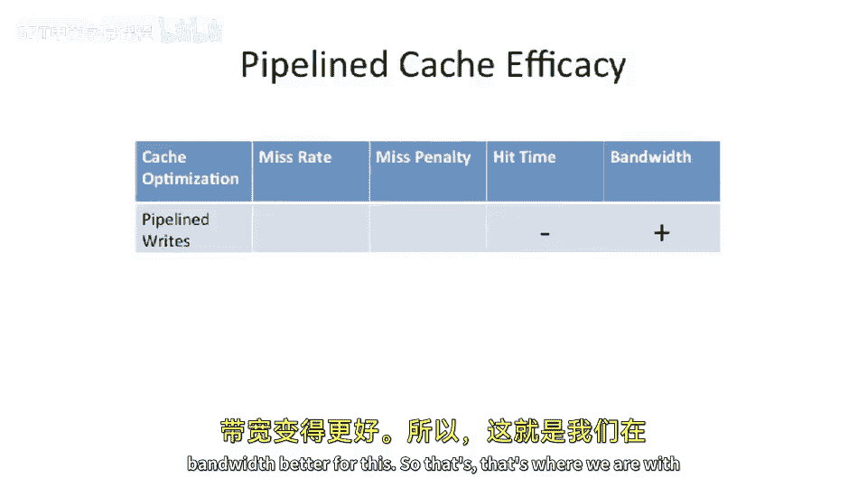

# 【计算机体系结构】普林斯顿—中英字幕 p54 53_03_cache-pipelining -BV1ii421D7WR_p54-

Now we begin the meet of today， today's lecture。 And we're going to talk about all these different advanced cache optimizations。

 starting with pipelining the cache。Okay， so here is our。Sketch of what happens in a cache。

In the cache， we have a tag。And we have the data blocks here。

 And we want to go do right into the cache。 So forget about the read for a second。But instead。

 let's focus on the right。So in the right， you're gonna do a tag check。

 So you're gonna index into here with the index into your tag array。 It's gonna spit out。The tag。

 you want to check the valid bit also， and you're going to do a comparison here。If it matches。

That means that the data is already in the cache and you're doing it right。

 So you can just write the data。Into the cache。So that sounds good。

Some challenges here is it really is sequential。You need to absolutely do this first。

Before you do the right。Because if you have a different address stored in this location here and use。

Blindly do the right。 You're going to overwrite the wrong data。

And then you're just gonna be very unhappy because you overrote some data， which wasn't。

 wasn't a portion to this。This particular right， or was that the wrong address。

So that' that's definitely a bummer。So do we think we want to try to do this in one cycle。

And to wait our guess here。Do people build machines where they do this in one cycle？Well， sure。

Original machines did do this one cycle。Possible to build。

You have a nice combinational path that sort of comes through out of the index， through here。

 through all this logic， and then through the right enable into here。It's buildable。

Not great for your clock performance。So， the first。Optimization， were so。

 so how do we reduce the hit time for right。And there's a couple different strategies to this。

We can think of this as trying to do this over two different cycles。 The first cycle checks the tag。

 we'll say。And the second cycle does something to the data。That's， that's。

 that's kind of our problem statement。 What are our solutions。1，1 solution is kind of innovative。

Is you can build a。Mulipported cash。Or a cash which can simultaneously do a read and a write to the same address。

And you do that。So you have a cache， You're doing it right。 You blindly do the right。

Not checking the tag。😡，But at the same time， you read the old data that was there。

And you save it off。And if you took a tagmus for the right。You go back and actually fix it up。

By filling that back in。That is an option。People have built such things。

 So you just restore the old value on atmus。Works perfectly fine。 You need a side buffer。

 This kind of looks like a victim in cash， which we'll talk about later in today's lecture。

But you can do it right。And a read at the same time。 And it's kind of like you're putting the。

 the new data in speculatively pulling out the old data， the victim。

 And if the right hits in the the， the tag check， then you just let it go and everything's great。

 If not， you have to basically pull that back out and undo it。It's doable。

Not a lot of people do this， but people have built machines like that。Another solution is。

Trying to build a fully associative cash。Now， what do I mean by fully associative cash。 Well。

 I mean a cache， which has。Lines such that you can store to any location in the cache。

And in those structures， typically。The tag check。And the access are kind of done in parallel。

 So because because you don't know where to find the data。There's no index operation。

 The index operation is the tag check or the cam operation or the content addressable memory operation。

You're basically doing it in parallels。 or， you're basically doing the tag check。

To do the read anyway。 and doesn't really hurt you。

 to sort of do the tag check first and then do the right。 So the it just doesn't really hurt you。

 It's not necessarily a great design。 If you have a very large cache。 But for small cache。

 you can definitely have a content addressable memory for the tags and then just have it so you can write anywhere。

 if you have a fully associative cache。That is one way to solve this right problem。

And then we're gonna to look at， but this is what we're going to focus on in today's lecture is pipelining the right。

So to pipeline the right， instead of actually doing the right in the cycle in the M stage of your pipeline。

We're going to do tag check in the M stage。And then， hold the store data。For some time in the future。

Now， you' going to say， did we actually do the store then， Well， yes。

 we're going to call that committed state。So this is what we're gonna focus on today is how to。

 how to do。A pipeline memory access to reduce our right。Hit time。

So here we have our five stage pipeline。嗯。And what we're going to do is we going get to the M stage for a right。

We're going to check the tag。And we're not going to fire up the data array at all。Now， you might say。

 where do you put the data？Well， we put a nice little buffer here。Which is a。Basically。

To be stored buffer， it stores the data that's going to be stored in the future or a delayed cache right buffer。

 as what we'll call this。So in parallel， you check the tag and you store the data here。And then。

Sometime in the future， you want to move this into the cache。

But youd need a convenient time to do that。So one option is you wait for a dead cycle on the cash。

Okay， that sounds， sounds good。How do you you're going to get a dead cycle。

I can't guarantee that I can write a piece of code。

 which does store after store after store after store after store after store after store after store after store after store。

In a really tight loop。 So you'll never have a dead cycle。A。Cool little trick here is。

A subsequent store。Only has to use the tag array。So if you have a store after a store。

The first store。We'll check the tag and not use the data。 We'll store the data here。

And then when the second store comes down the pipe。It know。Check the tag。

 but the data iss open so you can do the store at that time。So it's a cool trick there。

 if you have a store after a store after a store， you can basically decouple the tag from the data for stores and use the port on the cache to do the data array of the cache to do the store later。

And we can look at this a little bit more detailed drawing here。And。

This is just kind of to reiterate what's what was going on。 You do the store。It checks the tags。

And it's going to store。The address and the data。And at some point in the future。

 when there's a idle cycle。Or another store going on。

 It'll actually transition this data into the data array。That sounds good。Okay， so。

Popquizs question here。What happens when you do a load and there's data in the delayed right data buffer。

You have to bypass it。 Yes， you need to go check it。

So you need to have something which is going to check。 And that's actually drawn here。

The delayed right address against a future。呃。Load。And if you get a hit there。

 you need to have this data come around and come out。So we basically need to go check this buffer。

One， one thing I did want to play is this is kind of the naive way to do this。

 More advanced processors will actually typically have a multient version of these delayed right data buffers because caches are sort of usually pipeline inside the cache to。

 It might take multiple access multiple cycles to actually access the data array。

 So you might not do this till the end of the pipe。 So some of the processors that I've worked on。

 These are sort of on the these delayed right buffers are sort of the end order of maybe two to four entries big。

So you can abstract this and make this into a bigger data structure。 And when you do loads。

 you obviously have to do a content addressable match against all of those entries。

And see if the data is in the delayed right data buffer。Okay， so let's go see how well this does。

Piplining our cache。Buts so， so we're gonna to use this throughout today's lecture。

Ways that it makes life better。You can either reduce the miss rate。So do something good for misrate。

 You， do something good。For reducing the missed penaltyal。You can reduce the hit time。

 And this would be like， for instance， having a smaller cache reduces the hit time。

 or we can increase the bandwidth to your cache。But all these things are going to factor into performance。

And not all of the techniques， optimizations we're going to talk about today。Touch all of these。

 In fact， most of them only touch sort of one at a time or two at a time。Okay， so。Pippeline。

Cash cash is， what do they do for us？Are they going to reduce the miss rate？

I see people shaking their heads。 No。 Yeah， we didn't make anything bigger or smaller here。

It's probably not gonna touch the， the miss rate。Is it going to affect our miss penalty。

So this is when we miss in the cache。How long it takes us to go to let's say。

 the main memory of the next level of cash。No， it's not， it's not actually going anywhere different。

Effectively， this is implementing the exact same thing。Hit time。Does this affect the hit time。Well。

 it's gonna affect the hit time。 And it's kind of hard to see whether this does it in the positive or negative direction here。

If you compare to having the。Let's say tag access and data access all in the same cycle。

Pipikelining is actually going to make the hit time。Make the hit time a little bit。Better。

 because you're doing less in a cycle。 So that that would have us put a plus here。

But if you compare to， let's say， not having to cash or just having a big Ram there。

 It actually makes the hit time worse because we need to muck in multiple extra stuff here。

 We need to basically do this extra check。We need to do the associative check against our delayed right buffer data。

 So that actually hurts us a little bit there。So， okay， that might be a plus or minus。The bandwidth。

 though。Is actually going to be better through this cache。

Because before we had to sort of wait for this cache。For， let's say。

The whole time you go through the tag check and the data check and the data right。

But now we can actually have two stores sort of happening at the same time or the tag for one store and the data for a different store。

 So this is really going make the bandwidth。Better。For this。

So' that's where we are with pipeline caches。

