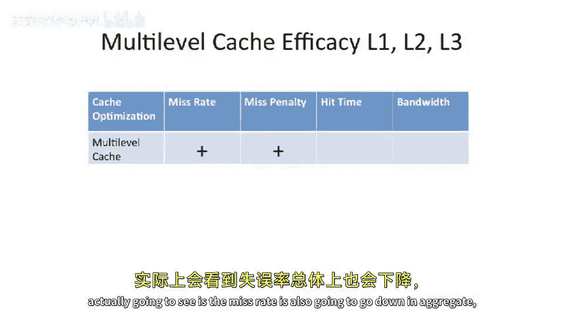

# 【计算机体系结构】普林斯顿—中英字幕 p56 55_05_multilevel-caches -BV1ii421D7WR_p56-

So the next memory optimization or the cache optimization we are going go look at is。

Adding multi level caches。And you probably see this in sort of any modern name processor you have。

 There's level 1 caches， little2 caches， maybe level 3 caches， maybe even level 4 caches。

 And we're gonna talk about why this might be a good idea and what the effect of this is on the different parameters we've been looking at throughout this lecture。

So what's the basic idea here， Well， a basic idea is you have a CPU and instead of just having one cache。

We say， let's add two caches。 And why do we want to do this， Well。

 it comes from the insight that it is both difficult to have a very large cache。

And a very fast cache。So how do you solve this problem？Well， you know。

 you could think about trying to fill this entire room with Ram。That would be a very large。

 let's say， cache for something。 And if you think about this， they。

 they actually do have sort of notional caches like this。

 If you go look at something like a Internet scale data center。

 there will be basically a room full of mostly just Ram。

 And they'll use this to cache things like lookups。

 And there's a sort of you might see something like Mecash D。

 which is something which caches queries to databases。

 or is a key value store that typically cache is very queries to databases。

 which people store in large Ram。The problem with having a very large cache is， by definition。

 if it's large。And you don't want to violate the laws of physics to get to the farest extend to the cache。

 you might have to go very， very， very far。 And， you know， if you want to wire very， very， very far。

 it's by definition going to be slow because you can't violate the sort of physics law here that you need to travel at maybe the fastest you can travel is maybe at the speed of light。

 So the farther you go， the the distance becomes a factor。

So our problem here is that you can't have something that's both large and fast memory。

So what can we do， Well， we can actually add multiple levels of cash so that if you have a certain sized working set。

 you can try to store that， let's say， in a small local cache， which is both small and fast。

And then you can have different levels of cash here， say a level 2 cache。

 which is a little bit large， So has a larger capacity。

But its a little bit slower and a little bit farther away from your CPU。

 And this can mitigate the cost of having to go all the way out to DRA。Okay， so。

 so I wanted to introduce some nomenclature here， because this is important that you're gonna see sort of over and over again throughout caches。

 And it's important that we introduce now when we start talking about multi levelvel caches。

Because just because you see， let's say， a low cash mis rate does not mean a cash is performing well。

 especially when you get into the multi levelvel cache domain。 And why is that， Well。

 let's say we have this level 2 cache here。And I say it has a very low miss rate。That sounds good。

 But this level 1 cache is filtering aes to it。 So just because the level 2 cache has a low miss rate doesn't necessarily mean that the level 1 the level 2 cache is performing well。

 or vice versa， let's say the level 2 has a very high miss rate。😊，You might say， oh。

 that level 2 cache is doing a really bad job。 Well， to some extent。

 all of the easy misses are being filtered by the level 1 cache。So all of a sudden。

 in the miss rate out of your level 2 cache might look very different。

 So we need to come up with some way to sort of discuss these different misses in a with the with correct nomenclature。

 So I'm gonna introduce 3，3 notions here。 So I' going to call local cache miss rate。

And this is just going to be the。Number of misses that you have in a cache versus the number of aes in a cache。

 And this is local per cache。 So if you're to look at， let's say。

 a level 2 cache here and you have a certain amount of aes coming into level 2 cache。

 a certain amount misses coming out。 It's all local to the level 2 cache。

 So this is gonna be the actual miss rate of a particular cache。Now， that's not the same thing。

 It something like a global misr。So global cash miss rate here。

Will take the number of misses in the cache relative to the number of CPU memory aes。

And this might be a better metric。In a multi level cache hierarchy。

 because you might want to say in our level 2 cache here。

What is our mis rate out of the last level cache or out of our L2 cache relative to the number of actual aes that the CPU is doing。

 And this will help you encapsulate sort of level 1 level 2 together。

So that might be a better metric。 And you'll see your book sometimes use these two different metrics in different ways。

 And then finally， something that's useful to think about is the number of misses per instruction。

Now， why do we bring this up， That sounds pretty similar here to like a global mis rate or something like that。

 Well， the difference here is the denominator changes。

Instead of having either accesses per cache or CPU memory accesses， instead。

 we have per number of instructions。And why is this useful？ Well。

 if you have misses per instruction and takes out of the equation。

 how many loads in stores you have as a percentage of instructions in your program。 So if you have。

 let's say， a program which has very few loads in stores。

 but it has relatively high miss rate per access， you might say， oh， this is bad for performance。

 So if， if you just look at the cache miss rate。Like the local cash miss rate。But in reality。

 it may not be so bad for performance because if you never do a load or never do a store in that particular program。

 maybe it doesn't actually affect your performance very much。 So this last metric here。

 this misses per instruction encapsulates that。 So encapsulates both the percentage of instructions that are。

Loads and stores mixed together with the number of。Cash misses in the program here。

 So it can give us。 and this can either be local or global， but usually this。

Its considered a sort of global ish。 but it could be either， you could also use this。

 this metric for a particular cache。 So we can say this and。

 this cache misses once every thousand0 instructions。 That would be pretty good。

And depending on the number of loads or stores per。Set of instructions。

 So let's say you have a load or a store once every， I don't know，5 instructions。 So maybe 20% of。

Or a little bit less than 20% of the instructions are loads or stores。

 which might be typical in in a typical processor or a typical program for a typical processor。

 So then you could say you can make some notion here about how the cache is performing on aggregate。

 And you'll see actually a lot of the numbers in in the Patterson Hennessee book actually use Mes per thousand instructions。

 which could be a more useful metric， or is typically a more useful metric。Okay。

 so let's take a look at how adding a level 2 cache。Influences the design of level 1 cache。

 And this is pretty common that when you add multiple levels to your cache hierarchy。

 it actually influences the lower levels of your cache hierarchy。

 So how does adding a level 2 cache potentially influence the level 1 design。王。

One interesting thing you can do here is just by having a level 2 cache。

 this might allow you to think about having a smaller level 1 cache。

So if you have a relatively close level 2 cache。For the same performance。

 you could actually have a much smaller level 1 cache and have level 2 cache。

 Take care of these things。 And this can actually even help performance maybe even more because you can potentially move the level 1 cache closer because it's be out smaller or increase the speed of the level 1 cache。

But the misrate from level1 cash is going to go up。Because you made it smaller。So what about energy。

 Well， this can actually be a really good energy win。So how does this energy win well。

You were able to take your level 1 cache and make it smaller。Because you now have a level 2 cache。

 So the common case thing is that now youre accessing your level 1 cache and this level 1 cache is smaller。

 so you can be accessing it relatively frequently。 And each access you do to it is itself going to be less energy。

 So something to think about here is that。Our level 2 design is going to influence our lower level design。

 So it's not in a vacuum。 So it's not like we can just slap on a level 2 cache or level 3 cache and say the lower levels of the cache hierarchy don't change。

Another thing that another way that the level 2 design or the presence of a level 2 can really influence the level 1 is you might be able to have a much simpler level 1 cache design because you have a level 2 cache。

 So what does this look like well。Let's say in your old design。

 the level 1 cache was a right back cache。 So it stored dirty data and when a cash conflict occurred。

 It had to find an eviction and evict something out of level 1 cache and wait for that eviction to occur。

 or at least find the bandwidth for that eviction to occur。🤧In， in。

Something like a level 2 cache that backs a level 1 cache。

 you can actually move to a right through design。Now， how， how is this possible， Like。

 why would you be to do a right through design when you weren't able to do a right through design before？

 Well， if you only had one level of cache and you had to do right through。

Every write you did have would have to have gone out to main memory。 And largely， that's not。

 you don't have enough bandwidth to go do that out to your main memory store or out to your D Ram。

So because you now have a level 2 cache， you can use that as a buffer， if you will。

 to absorb right through traffic。And that traffic doesn't have to go off chip。

 So you're right back cash。You you can have a right back L2。

 which tracks all the dirty data and makes sure that it actually does invalidates out to。

 and it has to do evictions on invalidations， for instance， for dirty data。

But the level 1 cache can just write through all data。 Now。

 this requires you to have enough bandwidth between level 1 and your level 2。

 but that's typically a lot easier to come by because your level 1 cache and level 2 cache are usually。

 to some extent， located near each other in both on chip and modern day processors。Let's see other。

 other reasons that this is good well。It really simplifies your level 1 design。

If you have a right through cache in your level 1 design。

 you don't have to worry about having dirty victim evictions。 The control becomes easier。

 And a lot of times this becomes easier to integrate into your pipeline， which is a good thing。

Something we haven't talked about yet， but we'll be talking about the end of this course is how something like this multi levelvel cache can actually simplify your cash coherence issues。

 So something we haven't talked about yet is how。Cash coherence deals with caches can deal with coherence。

 And by having a smaller L1， which is right through backed by an L2。

 you can really think about simplifying the cash coherence issues。 So what is cash coherence。 Well。

 we've talked about compulsory misses， capacity misses and conflict misses。

 What we get the end of this class。 not not this class， but at the end of this course。

 we'll be talking about cash coherence， which is keeping multiple processors with caches and keeping the caches coherent between those different caches so that the data does not become stale between those different caches。

 Well， one of the the questions that comes up here is by having right through and simplifying the L1。

 does this become easier from that perspective。 And it does。 Now， Now why is that。 Well。

 something we're going to learn about is these coherence misses。

 And what coherence misses are going be is basically a different cache is going to reach across a bus or maybe network。

On chip connection and tell a different cache to invalidate something out of its cache。And。

If you only have one cache per processor， if you only have a level  one cache we will say or something like just one cash level。

 when you go to reach across the bus and this cache is tightly integrated into your pipeline。

 you now have to deal with these sort of external requests coming in to do invalids or to do something like snoops。

 which we will also be talking about in a few classes when we get to the end of this course。

But if you have a level 1 back by level 2， you can have the level 2 service a lot of that complexity so you can take complexity and push it from the level 2 or the level 1 into the level 2。

 Now， you're still gonna have to figure out how to do invalids in the level 1， but。Before。

 when you actually had to do invalid， you could potentially have had dirty data。

 and you would have had to。Determine a victim and evict that line in the invalid and actually generate the eviction。

 But now because level 1 is， let's say， a simpler right through level 1。

 you don't have to generate the eviction。 Instead， you just have to invalidate。

 it's a lot easier to sort of blast away lines than is to blast away lines and actually figure out how to take that data and evicted。

 And this is a lot less disruptive to your main processor pipeline because you don't have to stop to do the eviction and you have to block further loads in stores coming from the main processor pipeline。

Last， if you have a right through cache in level 1， this can really simplify error recovery。

And when I say error recovery， I mean from a soft error perspective。

 So if you have your chip and it gets struck by radiation。

And this is actually a relatively common occurrence。 You have a chip and you have a alpha particle。

 something coming out of the sky， Some highly energetic piece of radiation hits your chip。 Well。

 that flips a bit。😊，And， you know， how do we protect against this。

 Well theres a couple different solutions， we can use error correcting codes。

 or we can use some simpler ideas like pary。And if you have something like a right through cache。

 because you never have dirty data in the cache。You can get away with maybe just having parody bits and not full ECC or something like that。

 And if you were to detect a parody error now in this right through cache。

 you just have to basically invalidate the line。You don't have to declare it as being corrupt in memory。

 because you know that the L 2 has an up to date copy。

Which is up to date and has the most up to date version of it。

So the L 2 might have more protection on it， but the L 1 can basically just invalidate if it gets struck by an alpha particle。

 So something to think about there that are level 2。

 the presence of having a level 2 can really influence our level 1 designs。O。

 how else does this occur， How else does level1 and level 2 design commingle together？ Well。

 there's a question that comes up of， what is the inclusion policy。

So now that we have multiple levels of cash， we can actually think about having。The lower down level。

 let's say to level 1， having。Having a certain piece of data and level 2。

 either having that same piece of data or not。And we're gonna call caches， which have the level。

 anything which is in a level 1 cache being in a level 2 cache or anything in a lower level cache being in a higher level cache。

 We're gonna call that an inclusive cache。So the inner cache holds copies of the data in the。

 the farther down cache。And。The external snoop access only need to check into the outer cache notes we were talking about before。

 And we're going to call that in inclusive cache。And they were to contrast that with an exclusive cache。

 So a exclusive cache。 What you're gonna have is the different layers of your cache。 for instance。

 your level 2 cache is not going have the same data or may not have the same data that is in your level 1 cache。

嗯。What does that， What does that mean， Well， that means if you evict something out of your level 1 cash。

You probably want to put it back into the level 2 cache。In an exclusive design。

Because that's kind of the idea behind caches。 You want to have a certain amount of working set in your cache。

 So if you evict something out of level 1。That's probably still a relatively useful thing。

 It Still would probably fit in your larger working set of level 2。

 So you just don't want to throw it away。 You want to keep it around。 So in exclusive caches。

 there's typically a swap operation that occurs。 So you're actually going to swap lines between the lower level and the higher level cache。

😊，When you move data， So the low， the higher level cache or the farther away cache from the processor is going to go access main memory。

 and it's gonna bring it into itself。And then when level 1 cache goes to bring it in。

 you're actually gonna swap two lines。 And this adds complexity to your hardware design。

You have to add something which actually does the swap。 It could potentially be bad for power。

 But people have actually built these。 If you go look at the original AM M D athlon。

 they had a 64 kB primary cache of a 256 k secondary cache， and they were exclusive。Now。

 you might say。This sounds like a lot of headache。 Why would ever go build an exclusive cash。 Well。

 it has one really big benefit。You get more storage area。

Because you're not keeping two copies of the same piece of data。

You now can store effectively more data in your cache。

 So if we had a this like this AM M Dathon here， we have a 64 k primary cache back by 256 k cache。

 You have the sum of those two values to store data。 and it's all unique data。In contrast。

 if we had the same sort of cash hierarchy， but we were an inclusive cache。

 you would only have strictly 256 kb， the larger cache or the farther away cash is amount of storage space because。

The lower level cache or the primary cache here only keeps copies of what is in already in the farther out cash in。

Inclusive， in the inclusive cash design。Okay， let's take a look at a few examples of caches in modern day systems and see what sort of trade offs people have made。

 So let's start off by taking a look at something like the itanium 2 processor here。

So the itanium 2 processor， you're gonna see we have our chip。

 And the first thing you're gonna notice about this die photograph here is the level 3 cache。

Its very large。So this has a very large level 3 cache。But this is， this is a big iron processor。

 So the titanium 2 was an Intel chip or is an Intel chip that actually is Intel and H P together。

 I guess， because they were collaborating at the time on this project。

 But the has a big level 3 cache。 And it's kind of funny shaped。

And the reason it's funny shaped here is they just took all the extra space they had in their dye and filled it basically with cash。

And， you know， this was good， but it didn't quite matter the shape and size， the shape。

 because it was so far away from the processor that it didn't have to be like a regular。

 regular shape。 But let's take a look at the different levels here。So we have a level one cache。

Small，16 k，4 way set associative，64 B line size。嗯。Heavily ported。

 they can do a lot of loads in stores at the same time here。

 So it has two loads and two stores concurrently。 and it's fast single cycle access。

 So 16 k is will be small by today's standards。 in 2002。

 that was probably a little bit on the large side。 This was a large processor。 But in you know。

202013 time。 That's， that's not， not that big。Forour level1 cache。If we step up here。

 we can see that typically， as you step up， you increase your size。Otherwise。

 what would be the point， But the laneency also gets worse。

 So we have single cycle laneency for level 1。 We have five cycles worth the laneingency for level 2。

And we're a lot bigger。We're 256 kB of cash。The associivity stays the same and still four ways said associative。

And as we get farther away here， we'll see we have a 3 MB cache with 12 cycles latency。

 So that's this big cache on the outside of the chip here。But we actually increase our associivity。

 So it's a 12 way set of asciative cache。 And the line size in both the level 2 and level 3 cache is larger。

s now 128 Bs instead of 64 Bs。 And that's pretty common。

 You'll see that as you get farther away from caches。

 people go and put larger line sizes and deal with larger chunks of memory at a time。

 And to some extent， this is because you have more capacity in these caches。

 So it doesn't hurt you as much。 if you call back to our。Earlier lecture。

 when we plotted the capacity， or assuming， the line size that you have and the block size versus performance。

 If you recall， it hurts you more for smaller cache because it's just not that many lines。

 you can fit into something。 let's say， a like a 4K cache。

 But as you start to get to something maybe like a 3 MBbyte cache。

 you can be a little bit wasteful with storage， if it helps you with your potentially spatial locality。

Okay，1，1 point I wanted to make here is was a rule of thumb that people typically use for cache design。

 And this is just an empirical rule of thumb。The empirical rule of thumb is usually when you go from one level of cache to the next level of cache。

 you want to step up by a minimum of a factor of 8 in size。Now， where does that come from。 Well。

 it it's， it's totally empirical， but it's based on how much extra laency you have to add when you add another level of cash hierarchy。

So if you add another level of cachearchery， it has some extra latency。 And if it。

While it's going to decrease your cash miss rate。It also is going to make your time out to main memory。

 Let's say， a little bit worse。As a trade off thereof。

 does it make sense to add the extra cache layer and go check the extra cache layer。

 or is it better just to go out to main memory。At that point， And the question is， how much benefit。

 How much larger does that cache have to be to have any useful benefit。Eically。

 when sort of people have built these processors， usually you have to step up by something like a factor of 8。

 If you step up by a factor of 4。The benefit that you get from the cash。

Due to the extra size does not outweigh the extra complexity and cost and time that is added by adding extra cash。

 But that's just a empirical rule of thumb。 But if you go analyze enough processors。

 you'll see that basically every cache level steps spot by minimum of， of 8。 So we'll。

 we'll call this the the 8 x。The， the the eight times rule， if you will。 this。

 this cashier steps up by。A factor of 16。 So it's a little bit more than a factor of 8。

 But let's look at another little bit more modern processor here。 So this is the IBM Power 7。

So with the IBM Power 7， this is a eight core machine。

There is private level one caches per processor。And then there is a big level 3 cache sitting in the middle of this processor。

Well， what does this look like， Well， we have relatively small level 1 caches。 We have 32 kB L1， I。

 a 32 kB L 1 D cache。 And Lane C is higher than our previous example。 It's a three cycle cache。

Layency。And as we go further out， we can see we actually have an8x step up in cache size here from our at least data cache size perspective。

 So we go from 32 to 256。 and the latency is is worse。

 So we have eight cycles worth the laency to check on a level 2。

 And then finally here we have eight cores sharing this data。

 So it's a lot of core sharing this cache。 We have a 32 meby unified level 3 cache。

 that's actually built out of embedded Dram in this process。

 So IBM has some pretty impressive technology here where they can actually embed Dra on a logic process。

 This is not common in most other processes。 is typically only IBM trait IBM foundry design of trait。

 But some other people do also have embedded D now， but IBM is really the forefront leader in there。

 But latency here is quite higher。 So we have 25 cycle la C to the power 7 level。Fe cash。Okay。

 let's pull the scoreboard。 So we've been building a scoreboard here throughout this and seeing how。

Adding these different techniques， these advanced cache techniques help with performance。

 So what is our scoreboard gonna look like here， Well， we have multi levelvel cache。

And the first question is， what happens？For the。Level 1 perspective， well。The missed penalty。

What is adding a level 1 cash due to the miss。When you take a miss。

You have to go out to the next level。And before we had to go out to main memory， which could be far。

 far away。 So the misspelity was quite high。But if we have a multi little cache。

 let's say we have a level 2 cache。Just a few cycles away， maybe five cycles away。

Your miss Peli now goes down as seen from the level 1 cache when we add this multi levell cache。

The okay， so that's， that's the level 1。 What about if we draw a box around all of the levels of our cache。

 So let's say level 1， level 2， level 3， what happens。Well， in aggregate。Our。

Mis penalty for each particular level is going to go down。 So that's a plus。

As you go to look at farther away going to main memory。

 what you actually gonna to see is the miss rate is also going to go down。

In aggregate， because you're not going to have to。Miss out of your last level cash as often。

So the miss rate here goes down。 So you're not gonna have to go out to main memory as much because now you have a larger。

 but not as big as your main memory or big as your D Ram cache sitting in front there。

 So the miss rate goes down。So you have lower overall miss rate。

