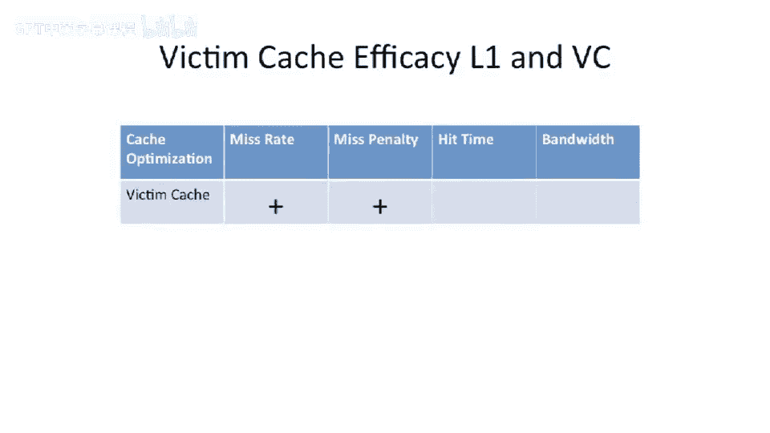
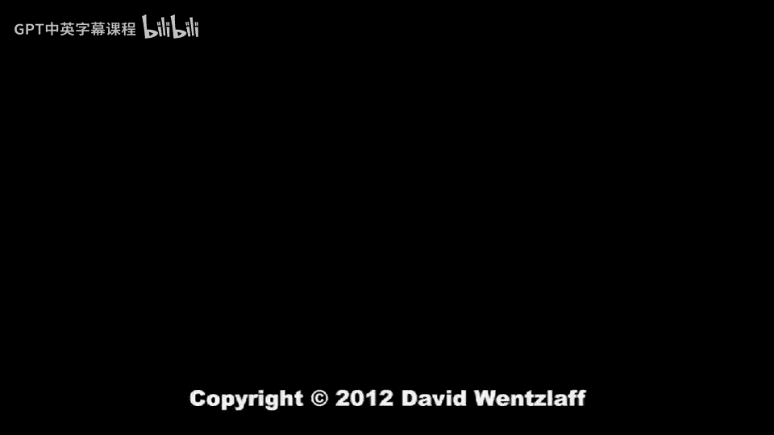

# 【计算机体系结构】普林斯顿—中英字幕 p57 56_06_victim-caches -BV1ii421D7WR_p57-

So let's go on to our next。Cash optimization technique。So we've talked about multilevel caches。

 Almost all processors today have multilevel caches。 And this is good。

 It's going reduce our miss rate。 And for at least the lower level cache。

 it's effectively going to miss the reduce the miss penalty because it's gonna to be able to go to a closer cache versus having to go out to main memory。

😊，What's our， what's our new technique here。 Well， the next technique I wanted to introduce is what we call a victim cash。

And why do we call this thing a victim cash？ Well， a victim is a cash line which is being evicted from your cache。

Okay， so this victim or this evicted line or evicted cash block。Typically， it's going， if it's dirty。

 it has to be written back out to main memory。 If it's clean。

 you can just invalidate it and not have to write it back。

 But what the insight of the victim cash is is that we're going to keep around the most recent victims or the most recent。

啊。Cash lines that we've casted out of our cash。And keep them in a special little size structure that we're going to call a victim cash。

And the size structure， this victim catch is going to be very， very， very small。Now， why is。

 why is this useful well。One of the things that is pretty common is that you're going to have a piece of code。

Which， for instance。Rights。The same。Set in the cache。 So let's say we have a four way。

 let's say we have a two way set associative cache。 So its only two sets per index。

Or two ways per index， excuse me。So we go look at the， the， the two ways。

 And let's say we have a loop where we read。2 values from a an array。

 And we write it to a third array。 So let's take a look at a piece of code that says something like the following。

For。I zero， I less than some big number。I， plus， plus。And then let's say we have three arrays。

 which are all large。 So let's say we have an array， an integer array。A。And this is， let's say。

 a million，1 million。We have aure array。B， which is also 1 million。And it is your array C。

 which is also 1 million。And we'll say that this is 1 million。 the 1 million。

 which is basically 1000 by 1000。 So it's， it's a power of two。Okay， in our for loop here。

 we're gonna have a simple loop。 The loop is gonna say。C。A I。Equals a of I。Plus， B of I。

And that's our loop。 Now， we have a two way set associative cash。WellThat's that that。

 that sounds like a problem here。 So if you go look at this。

 what we're actually gonna do is we're going to pull in。A， we' gonna do a load of a。

 And this is going to have， let's say， the same index in the cache because we have the same index into this array here。

 And if those cat， if these。3 arrays， A， B and C are all aligned or naturally aligned。

 They're gonna basically hit the same place。 And you're gonna to have conflict。With B。

Which is going to have a conflict。With C。 So C of I。

 A of I and B of I all want to fight for those two ways in our cache at the same index。

 At the same time， every loop iteration。No eyes is bad。We're iterating here based on integers。

 where our cache line is bigger than integers。So what we're going to do is we're going to pull in the cache line。

 let's say that has。A of I on it。 Then we're going to pull in the cache line that has B of I on it。

 And then we're gonna evict one of these two to fill it in because we need to do a right to see a I。

Which is in the same index in our cache。 So we're gonna to fight there。

 We have three things trying to fit into two locations。And to make matters worse here。

 the next time we go around this loop。We could have actually just hit on that same cache line， A。

 B and C's cache line because an integer is smaller than let's say our 64 B cache line here is。

 let's say integer is， let's say 4 by and our cache line is 64 B long。

 We could have gone spatial locality。And temporal locality here。 But instead， we got nothing。 We。

 we just lost。Because we have three things trying to fit into two。

 And if even if you use something like lease recently used。

 it's actually gonna do the wrong thing here。 Le recently used is gonna continually kick out the least recently used thing。

 But the next time I allowed the loop， you want that least recently used things。

 So you could actually have done better here， if you didn't use lease recently used。 But instead。

 just let's say， kept A And B and always cache missed on C or something like that。

 or pegged one of the two into the one of these three into the cache。

For a two way set Asciative cash。Okay， so how do we go about solving this。

 So let's go back and take a look at the the slide here。 and we're going see that。

What we can do is we can have a victim cache， which is hooked up to our level 1 data cache。

 And this victim cache is going to have。Effectively extend our sociivity on a very limited subset of the lines or a very limited subset of the indexes into our cache。

So。If we take a look at this， let's say we have a fully associative cash here for recently eively lines。

 maybe four entries。 in fact， actually， the， the original paper would showed this。 they had even。

 let's say， one cash line worth of victim cash。 and it helps performance。

But this relatively small number of entries here for victim cash can extend the associivity of any index in the cache line。

 So it's a fully associative cache added into our cache miss design。And how is this go about working。

 Well， now， when you go to access the level 1 cacheier， if you miss。In your level1 cache。

 you pull it in from your level2 cache。But you first go and check the victim cash。Now。

 how do things get into the victim cash in the first place。Well。

 when you go and try to invalidate something out of your level 1 cache。

 instead of just taking that and throwing away that data， you transfer it over into the victim cache。

So it's a little cache of most recently evicted lines from our level 1 data cache or most recently invalidated lines from our level 1 data cache。

So it adds some extra asssociivity。Now， you can check this either in parallel or in serial with your level 1 cache。

 And there's a couple design questions that come up here is on a level 1 miss。

 And let's say it misses in the victim cache。 What， what goes about happening here。 Well。

 you're gonna be bringing a new line from level 2 cache。

 You're gonna take what was in the level 1 cash。 And you're gonna move it into the victim cache。

 And you want to go check this on future cash aes that miss in the level 1。Cash。But the question is。

 what happens with the victim cash， well。Just like a normal cache， if it's dirty data。

 you probably want to go right that back to the L 2 cache。Alternatively， you can make。

The victim cash， effectively right through。And in fact， usually sort of victim cash designs。

 they typically try to make the victim cash right through because then you don't have to worry about when the victim cash gets something has to get removed from the victim cash where it has to go。

 You don't actually have to go and do the right back to low the farther levels of cash instead。

 you can just basically throw it away。 So， but that's a design decision。

 You can decide whether you want that level of victim cash to always be clean or dirty。 thankfully。

 usually if you're doing the evicict， you might have enough extra bandwidth in your L2 here to actually just do the right into L2 at that point and leave the victim cash completely clean。

So to recap basic idea here is you can add a couple extra。Ways， if you will。

 or a little bit of extra sociivity for a very limited set of the indexes in your cash here by adding this victim cash。

The downside here is you might have to go check this victim cashh。 If you do this serially。

 it might add to your lane C out to the L 2， or you could think about checking in parallel。

 which would potentially increase power or the energy used， but not hurt performance。Okay。

 let's pull the scoreboard and see how our。How adding you victim cash helps， so。

First thing we're going to see is that the miss penalty to our level 1 cache is going to be decreased here because。

We've effectively added an extra structure here， which is going be closer， let's say。

 than our level 2。So our missed penalty is going to be lower。

But the other advantage of victim cash is that the miss rate out of the aggregate level 1 cash plus victim cash together is now gonna be lower。

 So thiss gonna be better from a miss rate perspective。

