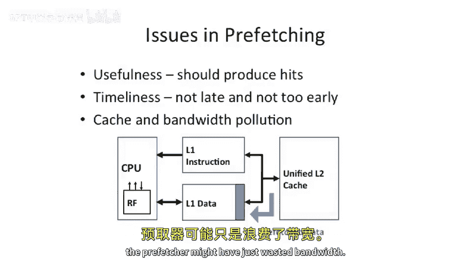
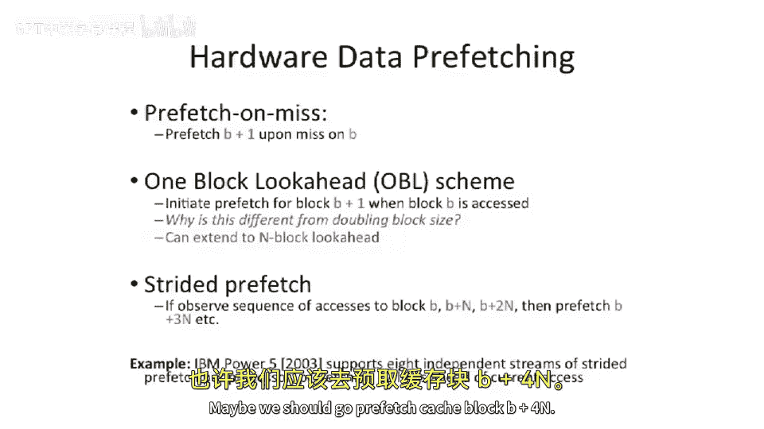
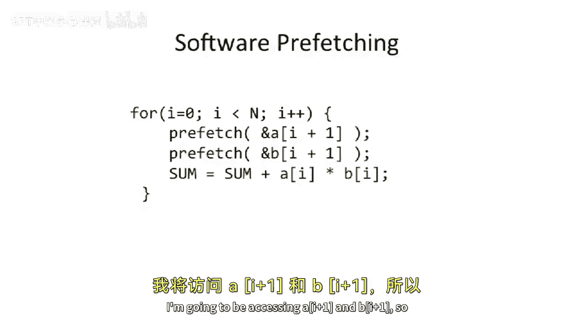
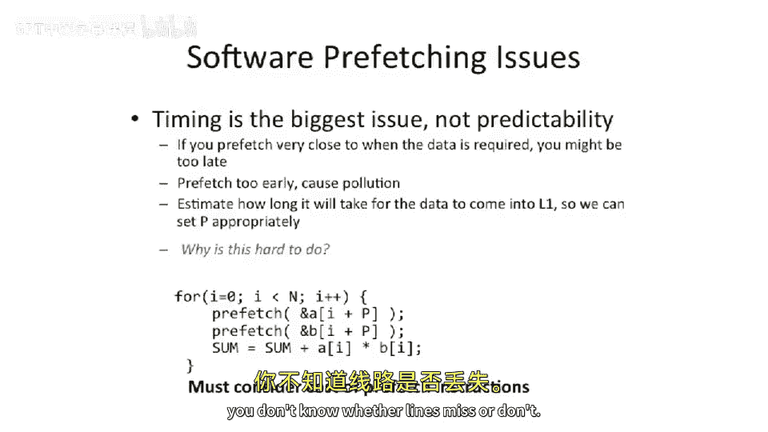

# 【计算机体系结构】普林斯顿—中英字幕 p58 57_07_prefetching -BV1ii421D7WR_p58-

So last thing I wanted to talk about in today's lecture is。Prefeing or the technique of prefeing。

So what is prefetching well。You speculate that you're going to be using some。Let's say。

 either instruction or data。In the near future。So you can say， I think I'm going to be accessing。

Some cash line in the near future。 Now， you haven't accessed it yet。

 The processor hasn't gone to initiate this transaction yet。

But because you have some reason to believe that it's a good idea to go do this。You。

Spectulively go and fetch that data from either memory or a farther out level of cache and bring into a lower or a nearer level of cache。

So this is the basic idea of prefeing。 Well， what is， what does this look like？ Well。

 there's a couple different varieties of prefe we're gonna be talking about today。

So we're gonna talk about hardware prefeching， which is a complete hardware based solution where the hardware tries to detect what is a useful thing to go。

Bring in。Were going to talk about software prefing。

 where the compiler or the programmer decides what is a useful piece of data to go get early。

And we can talk about mixed schemes， where software hinting the hardware。

 potentially about when it's a good idea to go bring in data。Okay。

 so important question comes up in the slide here。What types of cache misses does prefeting affect。嗯。

What is it， What does it affect， Well， we're bringing in data potentially before it's actually used。

But so that sounds good。 This sounds all good。But we're actually polluting our cache potentially with data we don't know that we're gonna need yet。

 So there can be downsides to this。So let's go through the three Cs。Capacity。

Does this affect capacity？Well， yes。It actually affects capacity。In a， in a。

 was effectively a negative way。You effectively polluted your cache because you've prese something into your cache。

 and you could potentially make the cache have a smaller， effective capacity because of this。

And this actually trades off。 This is， This is a sort of similar sort of thing with conflict misses。

You're effectively putting data into your cache that if you'd have a really bad prefeture。

 a prefecher， which actually goes and brings data in， that is。Not accessed， ever， we'll say。

 or not accessed in a short period of time afterwards。

 you may actually be both polluting capacity and creating more conflicts。

 You can bring it into a line。 And because of this。

 some other piece of data that gets brought in has to go evict that now and takes time to go evicted or at least it has to make some decision and it might even mess up the least recently used policy or the replacement policy。

Okay， so why would we do this， We said this is bad for conflict misses or increases our conflict misses。

 Where does prefeting help？ Well， it can actually really help with compulsory misses。

So misses where you just miss on effectively cold data。 the days is not in your cache。

 You have to go get it and bring it in。 So let's say a first touch data， a compulsory miss。

It would be really great if the prefetch system or either hardware software prefecher could bring that data into your cache preemptively。

 And by bringing that data into your cache preemptively。

 either reduce the latency or remove the latency completely of compulsory misses。

 So how do we reduce that that， that miss cost。 Well。

 let's say you go to take a cache miss on a line。 and the prefeeter already has sort of started to go get that line from the main memory。

😊。

The mis status handling register could detect that there's a mis already in flight for that line and not actually send out a subsequent request and just wait for that data to come back。

 And this can decrease the lane of a compulsory miss or decrease the miss cost of compulsory miss。

Alternatively， the compulsory miss could just go away。 If the prefeture is really on its game。

 It could bring the data into your cache。 And by the time you go to access that data。

 It is like it's clairvoyant， if you will。 It already knows that the data that you were going to access in the future and is already pulled it in when you go to access it。

 it's already there。So prefeing can have some pretty big benefits there。But in， like all things。

 including cache caches in general， you need to make sure that what you bring in。

Is used with high probability。 Otherwise， you're just going to pollute your cache。

One less thing I wanted to say is that we're going see this is that instruction caches are usually easier to predict for prefeing purposes than data。

Why is this？ Well， instructions are very well behaved。 Typically， you execute one instruction。

 Then you execute the next instruction， Then you execute the next instruction after its and。Yeah。

 there's branches and programs do have a fair amount of branches。

 but there a decent chance you're just gonna be executing straight line code。

 especially in something a loop。 We're gonna be executing straight line code for a while and hit one branch at the bottom and go back up to the top。

 So your prefeer can many times be very effective for that data， on the other hand。

Usually data misses and data aes are a little bit more randomized， but not always。

 sometimes you're just gonna be accessing， let's say， straight line data。

 something like a mem copy or something like taking an array and reading the whole array。

 and a prefecher can be very effective there also。So let's take a look at some of the issues with prefeing。

We already touched on some of these things。In order for prefetch to， to be good， it has to be useful。

 So it should produce hits in the cache。If the prefecher is actually producing mostly misses in the cache or bringing in stuff that the either instruction。

 if it's on the instruction side it never executes or on the data side。

 it never tries to go do a load or in store on。It wasn't useful。Now。

Things get a little bit more complex here when you start to think about usefulness。

You have to start thinking about timeliness of the data。 So what do I mean by timeliness， Well。

 if you prefetch a piece of data into your cache。But you do it too early。

 It's very possible by the time you go to go read the data。It might have gotten evicted from a cash。

So if you breathe it in too early， the prefeer might have just wasted bandwidth and wasted energy going to the next level cache or going out to main memory。

And that data may not end up being useful because it wasn't timely。

 It might have gotten the address right， but gotten it there too early。

 or it might have figured out that it was too late。 So how does this happen。

 So let's say you determine that， you know， this one line is really good。 And， high probability。

 you're gonna need it。 So you specly want to go pull it in what you， the prefechure decides this。

 the cycle after the load happens to that line。Well， it didn't help。 Maybe even the cycle before。

 it just wouldn't help because you'， you， you're too late effectively。And as we've already discussed。

 you can have significant cash in bandwidth pollution here。

 So you can pollute the both pollute the capacity of the cache， and you can waste a lot of bandwidth。

And this is a problem if， for instance， you're on a multi chdship or mini courtship and off chip memory bandwidth is really important。

And it's a really limited resource。 You may not want to actually have any prefetch turned on because you might just be wasting bandwidth。

 So it's a speculative execution sort of thing。 So you're gonna be trying to pull in data。

 but it's speculative。 You don't know 100% that you're gonna to be using that data。

 And any time that you bring something in that you don't use。You've effectively wasted bandwidth。

 So this is a， a big challenge here。From the bandwidth perspective， usually。

A good place to put a prefeture is maybe somewhere between， let's say。

 a level 2 cache and a level 1 cache。Especially maybe on the instruction side。

 But you can think about this that you want to basically pull in data。

 And this bandwidth here is relatively inexpensive from your level 1 to your level 2。

 because it's an on chip bus。 It's directly connected。 You can make it relatively large。

Coming out of level 2 cache， though， usually or or going out of， let's say。

 the last level cache out to main memory。 That's usually expensive bandwidth。

 So sometimes people come up with prefecher is the only prefetch。

 let's say from a level 2 cache to level 1 cache。 But if it's not in level 2 cache。

 the prefech just gets dropped。So that's a pretty common strategy here。Okay。

 so let's start off by looking at the simple case here of instruction prefeting in hardware with a basic example。

 something like what they had in the Alpha 21，0，64。

So。It was a very relatively basic。Processor。And we want to look at what they。

 they did for performance， well。They actually added a extra little buffer here。

 they're to call a stream buffer。And the stream buffer。The stream buffer here is going to store。

The next。Line。That is likely to be used。 So if you take a cache miss。

 this is on the instruction side for a particular。Instruction， cash block。Let's say walk。

 I in this example。You decide， the hardware decides with high probability block I plus 1。

Is probably going to be used。But instead of polluting。Our instruction cache in their design。

 What they did is the。Subsequent cash block is actually stored into the stream buffer。

So they didn't actually pollute their cache。 This is kind of like extra。

 a little bit of extra sociivity here， but only for the next predicted line， if you will。Okay。

 so in this example here， what would happen is you'd be executing out your level1 cache。

 And let's say you fall through。 The code just falls through。

 There's no branch at the end of the cache line and you fall through。 Well。

 the predictor actually did really well here。 And it overlapped effectively the cost going out to the level 2 cache' going on to the main memory for that subsequent cache line。

 So it hits in the stream buffer。And the stream puff gets moved into the cache。

 And the hardware system says， the hardware prefeing system says， aha， I went and just， I'm。

 I'm now executing block I plus 1。Maybe a big good idea to go and prefech block i plus 2。

And effectively， what you're doing here is you're overlapping the execution of block。

I with the fetch of block I plus1。So you you can be doing two things in one time。

 You can be using the CPU fashion executing from block I。

 and you can be using the cache moving data this way into the stream buffer for block。I plus one。

 and likewise， when you go to fetch， when you X Q， let's say， block I plus1。

 you might be fetching block I plus 2。Okay， so that's the instruction prefech side of the world。

 Life gets a little more complex when we start to go look at the data prefeshing。Now， why is this？

 Well， it's not as well structured as instructions。 Inions you just typically blast through the code。

 keep falling through。In the data world。You don't necessarily know because you've went and accessed。

 let's say。Address。A that you will go access some other address because of that。But you can try。

 So people have implemented a bunch of different prefes that。Help， to some extent。

The most basic thing you can think about doing is actually just doing something very similar as we had in the instruction example。

If you go and you take a cache miss on， let's say， block B。

You go also fetch block B plus one into your cache。And to some extent， this helps。

 You has to be a little bit， to be a little bit careful here because you might be wasting capacity in bandwidth。

 But in some cases， this is helpful。 So if you're streaming through an array。

This helps if you're doing a meme copy， this helps this prefech on miss。Now， note。

 we say prefech on miss here， but we don't say prefetch on hit。

 which is a little bit different than our example in the instruction space there。So prefech on miss。

 is's only when you take cache miss that you go， let's say， fetch B plus one。 Now。

 there's different strategies here。 prefe on hit prefech on miss。

 You might think about doing either of these depending on the heuristics of what your hardware comes up with。

So that's prefet。 I miss。 Maybe you actually want to do。One block。 look ahead。 So this is much more。

 this is basically the same thing we were doing on the instruction side here is if you go access。

 let's say， block B。And this means not necessarily cashm。

 You go and actually fetch from your next level out of cache， B plus one。嗯。Okay。

 so a question comes up is， is this the same thing as just doubling。Your。Block size。Well。

 that's interesting because you effectively go fetch。Whenever you touch B。

 you go pre fetchch B plus one。This kind of looks like just making your block size bigger because this is just doubling the block size。

 you' always bring in two blocks。 But is， it's only a prefetch operation。

 So you could think about having it， for instance， just load from your L 2 into your L1 when you have this example and not actually have to go out to your last level cache。

 So you could think about having different trade offs there。 Also。

 the downside of this is that it's not just making your block size bigger。

 You effectively have two sets of tags here。So that's the downside of having something like this one block look ahead scheme。

But you could think about taking this， this example and actually extending it to an end block。

 look ahead。 So if you go to access block， let's say B or cache line B。

 you go fetch a couple after that。 And the name of the game here is you're trying to hide memory latency。

 main memory latency。 So what would be really great is if you go to access let's say block B。😊。

And you know， that the hardware somehow determines of heuristics。

 typicallyyp how you implement these things as little watchers that watch what aes you're doing and then decide that's fruitful to go and actually do a prefetch。

 You could say， I'm accessing block B。 I should start taking start。

 trying to read from main memory block， B plus 1， B plus 2， B plus 3。

 B plus4 all the way up to it say， big N here。And by doing this。

 you can overlap the laneency so that if you go try to access that next block。

 it'll have already been there。 And you don't have to wait for the lanes seat going out to main memory。

 This actually can increase performance significantly。Okay， so that's the basic examples， but。

Thats don't always work well。 Sometimes you might have something like an array axis where you're not touching。

 let's say， every bitete in the array。Maybe you're accessing every nth byte in the array or some offset。

 Well， how does this happen， Well， this is actually really common if you're trying to access。

An array of structures or array of， let's say， class objects。Why is this， Well。

 if you have a structure， you have different fields in the structure。

 and they are at different offsets inside the structure。 So if you have an array of them。

 they're packed densely。And if you are reading， let's say。

 some subfield of a structure and you're reading every element of that array。

 you're actually going to have what's called a strideed axis。

 So you're not going be accessing by one and then by two and by 3。

 what was called unit strideide instead， you're gonna be having some offset as you move through the array。

 And if the structure is large enough， what might end up happening is you may not actually want to go and fetch the next line。

 the next line of the next line。 instead， you might want to fetch just the lines that contain the portion of the structure that you want to go access。

So what does this look like， Well， you need something like a strideed hardware prefecher。So， if you。

啊。See a pattern happening。 typicallyypically， that's when you fire up something like a strideide prefeer。

 So if you go look at a modern day Intel processor， they actually have stride detectors。

So it was little pieces of hardware which watched the cache access pattern。

Or the processor access pattern。 And we'll say， aha。

 I see that the processor is accessing cash block B， Ca block B plus N， Ca block B plus 2 N。

 Ca block B plus 3 n。Maybe we should go prefetch cash block。B plus 4 n。

So， but n is the stride size。So you may not be pulling in every block in series。

 but instead of pulling out in blocks that are spaced out through memory of some spacing。

But with everything， you have to be careful that this does not。Pollute your cash。

 both from a bandwidth or a capacity perspective。So let's take a look at example here。

 We have the power 5。 The power 5 has pretty sophisticated。

Hardware based preor or hardware based prefe and prediction schemes。

 So they actually have 8 independent stride prefes per processor。

 which can each prefetch up to 12 liness ahead。Of the current axis。Wow， so that's pretty impressive。

 They basically have little pieces of hardware they're seeing what what is。

 what is a likely thing to go access based on what the program is doing and try to bring it in early to improve performance and reduce the cash miss laency。

And reduce the cash miss。time。Or rate， if you will。Okay， so that's hardware prefeting。

We can also think about having software based prefeting。So the compiler can figure out， aha。

Or maybe the programmer who's writing code can say。

I know that I going to go around this loop many times。So， instead of waiting。To take a cacheist。

 when I really， really need it， which is what I have to go do is add here。

 Let's say of A of I and B of I。 instead， we can say， okay。I know the next time around the loop。

 I'm going to be accessing A of I plus  one and B of I plus 1。

 So let's tell the memory system that I'm going to be accessing a of I plus1 and B of I plus one and get that。

Operation out there early。So we can effectively have the software help the hardware here by doing a complete software prefetch。

And there's。Sort of two ways you can think about doing this。

 One way is that these prefetes are basically just loads thatll bring the line in early。

Alternatively， some architectures have a more hybrid hardware software approach where you'll actually have a prefech instruction。

And the pref instruction will tell the hardware hint to the hardware that's likely that you're gonna go be using this data。

 but maybe。You don't want to waste off chip memory bandwidth for this。 So only pull in， let's say。

 from the L 2 to the level 1 cache， but don't go to a cache miss for this because this has some probability of not being correct。

And shouldn't take priority over true cache misses。 And。

 And if you had just a normal load in operation for your prefetch。

 you wouldn't be able to detect that case。 So in some of the hybrid hybrid solutions。

 prefetches will actually turn into special instructions。

Software prefedges will actually turn into special instructions。Okay， so what。

 what are the issues with software prefessioning。Well。

Software timing actually ends up being the biggest challenge here， not predictability。

This loop here is very predictable。 We know we're just going stride through array A and array B。

 But what we don't know is。We might end up being too late or too early。

 So you have to get sort of the the， the right time。

TheYou have to get the time right when you actually go to access these different things。

 So what we're gonna， what we're gonna do here is we're gonna say。Instead of accessing I plus one。

 we are gonna access maybe like I plus P here。 And this is a setable parameter where you can say this is a few cache lines into the future。

 we can pull it in。 And we want to set that correctly so that we pull in at the right time so that we can cover the cache mis latency time out to the next level of cache or maybe out to main memory。

 but not early enough that we actually pollute the cache and actually cause conflicts somewhere else。

 So if we set P here， huge。We be pulling in data way， potentially way too early。

 So if we set this to， let's say bigger than the array size， A And B。

 it's very possible that we'd actually be polluting the cache with wrong， wrong data， if you will。

Few other things that come up here is， how do we go about trying to estimate P well。

This is a tricky thing。Why is this hard？ Well， we don't quite know what thelasy is。

 and we don't quite know。Whether A and B are gonna hit or miss or whether the hardware prefeer is gonna fight against our software prefecher and things get a little bit complex here。

 And it's really just because you don't know the memory load。

 the actual congestion at the memory controller， you don't know。Whether lines miss or don't。

 So you effectively have a piece of dynamic。

A dynamic number here， which is being。Determined at static compile time， we'll say。 And then also。

 you don't quite know what architecture you're gonna be on。 So different architectures， let's say。

 or different micro architectures for the same instruction set architecture architecture might have different cache mislatencies。

 So if you want to write one piece of software that works on all of them。

 there may not be a correct value of P。So you have to have to think about that。Finally。

 I wanted to say is that you must consider the cost of the prefetch instructions。These are not free。

 You have to add these two extra instructions here。 And if your performance benefit。

If the performance benefit of having prefion instructions does not outweigh the cost of adding two extra instructions。

 It's probably not a good trade off。 You probably shouldn't be doing something like this。

So next lecture， we're gonna talk a little bit more about different software。

 prefeing issues and other ways to rearrange code in the compiler to effectively bring data in in a more structured manner。

But let's take a look at the efficacy of。Prefetching。So which of these things does this help or hurt？

Well， what we're going to see is。First of all。We're going to actually potentially help the miss penalty。

So when does the mis penaltyal help。When is the miss penaltyal。

Made better。 Well， if you have a cache， its gonna if you have a prefech in flight to a piece of data that you then have a demand missed for。

You effectively cut the lane C for that demand miss or the miss penalty down to just finishing the currently inf prefetch。

So， you can take that。Cost make it a little bit shorter。Missrate， miss rate also is better。

Why is miss rate better？If you had a prefetch curve and it brought it into your， your cache。

 and then you hit on that data。You just have fewer misses out of your cash。

 so your miss rate is better。A couple other things here。 hit time in bandwidth。Prefeing。

 if done poorly， might actually hurt your bandwidth。 So there might be a negative here。

 if done poorly。And hit time， typically is not really affected by prefeting。Okay。

 we'll stop here for today。

