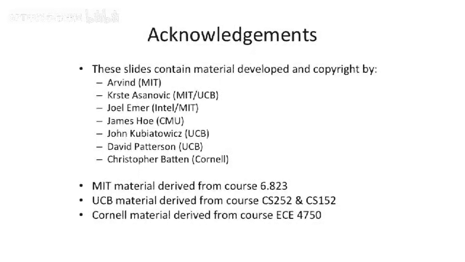

# 【计算机体系结构】普林斯顿—中英字幕 p59 58_02_multiporting-and-banking -BV1ii421D7WR_p59-

Welcome to our next installment of ELE 475。Today， we are going to be continuing our discussion of advanced cache techniques。

 And one of the big things we're going to get into is talking about how to build out of order memory systems。

So what I mean by out of our memory systems， basically I mean you can have memory operations out at the memory system。

 but they execute out of order， and you can mix this with the in- order processor pipeline or an out of order processor pipeline。

 it's the designer's choice。 both both sorts of designs have been built and have been successfully built。

But where this is important is it allows you to effectively get more memory parallelism because you can have transactions going out at the memory system in parallel and the processor could continue an overlap computation with the memory。

So we just to recap from last lecture。We have a。Revised agenda here with now， if all of our。

Different cash optimization techniques or advanced optimization techniques。

Where we talked about pipelining caches。 We talked about adding a rip buffer and a coalesing rip buffer last lecture。

We talked about the reason and the motivation for multi levell caches。 So two level caches。

 three level caches， maybe even four level caches backed by main memory。

We talked about having victim caches， which were extra little highly associative caches that you could put next to a low associative cash or something like a direct mapped cache。

 and effectively this can increase your performance quite a bit because once you sort of miss in your direct mapped cache。

 you can go out to your victim cache and if the victim cash may have the data you're looking for and this gets over small numbers of lines which are highly contended and might blow out。

 if you will， the number of ways or the amount of sociivity you have in your cache。

We talked about hardware and software prefeting。 And this is where we stopped last time。

 We stopped hardware and software prefeting。 And today， we have a couple， couple extra topics。

We're going to talk about how to bank your cash。As a technique to get more bandwidth。

The easy technique to get more bandwidth is just to put multiple ports on your cache。

 but that gets quite expensive because you have to duplicate possibly your sendAs。

 you probably have to duplicate the right logic and in the worst case you maybe have to duplicate the storage space。

Were in today's lecture， we're going to talk about some software optimizations that the compiler can do。

 We're going to start off by talking about some software optimizations that are。

Easy to do about transforming the code too horribly。

 And then we're gonna talk about some that actually require some pretty heavy lifting with respect to code transformations and what you have to do to reorganize the code still in valid ways。

But by doing such， you can actually have better memory performance and better cache performance。

Then we're going to get to the meat of today's lecture。

 we're going to be talking about non blocking caches or sometimes called lockup free caches or sometimes called out of order memory systems。

Then a couple potri at the end here。 we're going to have。Critical word first。

 which basically means that when you go out to the memory system。

 you ask for the word that you need most urgently， and the memory system will give that back to you first。

 And this allows you to restart。Quicker。And then there's a very similar idea。

 but possibly easier to implement called early restart。

 which instead of asking for the memory system to return the data in a specific order and taking advantage of that。

 instead what you do is you the memory system gives you back the data in order or whatever the canonical order is that expects to give it back to you with。

But when the word that shows the word shows up that you need or you're stalled for。

 you just restart the processor Pyth so if you're。Asking for one word out of a huge cache line。

 and it happens to be the second word in the cache line。

 You don't have to wait for the whole cache line to get loaded into the cache。

 But it has some extra complexity。And finally， we're going to talk about wave prediction。

Way prediction， we touched on a little bit when we were talking about some of the instruction issues and supercals。

 but we're going to talk about a little bit more in detail here where weight prediction allows you to predict。

Where to go find either the next piece of data you're going to go access or the next instruction you're going to go access。

 And this is important if you have a multi way cache in a direct map cache is only one place to go find it。

 And a two way cache is two places to go find it。And if you t both。

You can try to do that in parallel。 They probably waste a bunch of power。

 or we can is you can predict that。 let's say it's in way one。

 or you can predict that it's in way way  zero and using that prediction。

 if you have high prediction accuracy， you may only have to fire up half your cash or if it's on your critical path。

 you don't actually have to do two comparisons or three comparisons or four comparisons。

 however however high the associiivity of your caches。So let's go take a look。At banking strategy。

And multiporting our caches。This is a little bit of recap。 I think we。

 we talked about this briefly during。Last lecture， but we're going to continue on with that。So。

 here we have our。Two way issue processor pipeline。

 You have a program counter reason the instruction cache。 you have your instruction registers。

And what's interesting about this is that this pipe。

 we could only execute one memory operation per cycle。Well， that's a limiter。

Let's say you want to execute two memory operations or three memory operations or four memory operations that are all independent of each other。

What do you go about doing in our two issue pipeline here？Logically。

 what you want to do is you want to somehow put the data path on both pipelines。

And remove this restriction of where you can execute memory aes in which pipe you can access memory aes from。

Okay。That doesn't sound too horrible until we go look at the implementation of this。

So we can go and have a true multiported cache。So if a true multiported cache。

If you think about the decoding logic on a read， we're going to have to at least duplicate that decoding logic。

Likewise， if we want to actually execute two rights at the same time。

 we're going to have to duplicate the road decoderrs for that logic。

And a lot of times how people actually go to implement this is they basically duplicate the entire cache to get an extra port。

For a variety of reasons， it could know。The area increase could be large and it could even be double for a two port Reed and a to write port。

Sorts of cash。 So they don't even share the storage data。

But that's like only a little bit of the problem。 The other problem here is that it also increases your hit time in your cache。

 and no one likes increasing hit times in caches。No， why does it increase the hit time well。

Unless you。For instance， duplicate everything。 If you try to share some of the logic。

 you're basically going to increase the loading on the readout of the cache share。

 And by increasing the the load， or this is going to have slower， slower drive strains。

 you will probably increase， increase the time。And and you can go look in something like cacti。

 which is a tool from H， which has different cache configurations。 And you can see that， you know。

 adding a second port is usually the last thing in the world you want to do when you're doing a processor design。

 It really ends up being really quite expensive。Mostly in terms of area and somewhat in terms of timing。

So can we do better？Well。Maybe， yes。 Maybe no。So one thing you can think about doing is instead of actually having a true dual ported cache。

 can we have a pseudo dual ported cache or a cache， which has the same external interface。

 So if we sort of。Cut out here in the middle。 We have two addresses coming in。Two data is coming out。

 it looks the same。But instead， we actually put something else in the middle here。

What do we put in the middle？We actually put。Two banks they're called of our cash。

And the first bank is half the size of our cash， and the other bank is half the size of our cash。

 and they're both single ported。What this is relying on is if you have statistical memory aes that。

Have some good pattern to them。 The probability that you'll actually end up routing to。

Memory addresses to the same bank and get what's called a bank conflict will be quite low。

And instead， the probability that you actually go to two different banks will be high。

Now you might say， well， big conflicts。So I'm pretty， pretty。Possible to happen。

This is sort of the naive drawing here。When people go to bill these things for large caches。

 you'll actually have many banks。And then let's say you you。

 and if you have more banks than the number reports you have。

You could make a decent argument that the probability you're going to get a bank conflict ends up being quite low。

Or the probability that any two random addresses will end up going to the same bank will be low。 Now。

 let's talk a little bit about addressing and how we do this。Assignment addresses to banks。

 The most basic thing is you can just， maybe low order inter leaveve it。

Or you could try to hide leave it。So， one of the questions。

That logically comes up here is which is better， low order or high order interleaving our banks。

And we want to take a guess on this one。So when I say low order， I mean。

 use the low order bits to hash into which address bank or which bank you go into high order leaving use some high order bits or maybe middle order early use some middle order bits。

 What would， what would you choose if you're a designer。 So this is a good insight。

 So if we think of something like we're accessing。An array。

And we're trying to strive through the array。So we're string through the array。

 the high order bits of those axes are all going to be the same。

So if we have high order interleaved bits， all the high bits are going to all be the same and we're going to get bank conflicts。

 they're all going to go to， let's say， big0 all the time。 and therefore， our cache。

 which we were trying to have more or higher throughput， didn't get any higher throughput。Okay。

 now I'm going to give you a counter example。Coer example is。

 let's say you are striding through an array。And you have an array of structures。

 a pretty common thing to do。And the structure is， let's say，100。 No， yeah， it's 120 B long。And。

We go and access the first byte in that 128 byte structure in a loop。

Are the low order bits of the address the same between all of those。Yeah。

So that can be problematictic。 Now， our high order bits are the same and our low order bits are the same。

😊，What's changing in that example。Some medium bits。

 some bits a little bit higher than the low order bits。

 So more of what I'm trying to get across here is that you have to be very careful about how you do the bank guarantee leaving。

 if you have naive hash functions。Or naive functions which assign address to a particular bank。

 and you may not want to even have you could think about having more sophisticated hashing functions or assignment from address to bank。

 but if you go to do that， this is on your critical path of your memory load。

 so you may not want to have a complex hash function there。

So you might want to just take some middle order bits。

 You might want to take some low bits and some high bits for your bank assignment。

 It gets gets a little challenging here。 You probably don't want the highest order bits definitely。

 because in most systems， all those are always， let's say0 or something like that。

 Thiss very unlikely that your higher order bits are something important。

 usually unless you're sort of accessing the stack where those are usually one， all one。

So I have another， I think we talked about most these on a slide。 benefit。

 we're trying to go for high throughput here。Ba conflicts。 we。

 we talked about how you can get a bank conflict。We talk somewhat how you can avoid bank conflicts by having more banks than you have ports into the port structure。

 And that's just from a statistics perspective， if you have， let's say， a 32 your cashs。

You have a 32 kilobte cash and each bank is one kilobyte or something like that。

 then all of a sudden you have the probability that you have two ports trying to access one particular bank。

It's it's kind of like the birthday problem。 So it's not the the trying to find if two people had the same birthday because it's not quite the easy probability to go figure that out。

 but it's quite low because it's roughly， you know， one。What is this。

 it's probably 32 times1 over 32 times one over 32。 So it's not the lowest thing in the world。

 but it's possible to actually reduce the probability that you have a obey in conflict with random axes。

And if you have a better hash function， of course， you can do better。Extra wiring。

So what do I mean by extra wiring？In our previous design。

 we didn't have these sort of crossover paths。So what this really turns into is is the mus here。

A multiplexer there。AAmongs here and amongst there for the address paths。So this adds extra wiring。

 extra delay by banking。And one of the bigger， bigger challenges of the extra wiring for going to multibanked memories is。

It'll shrink the bank size or shrink the memory size。

 And if you traditionally sort of look at memories， they like to be larger。

 you can amortize the overheads a little bit better of the， for instance。

 the send amplifiers at the bottom of the memories and the row decoders and the column decoders if it's bigger because for instance。

 the row decoders and the column decoders will roughly grow as the log or the log of the number of bits or something like that。

But if you make each of your cache is really small and you have multiple of that overhead gets gets worse。

 So you have to have more sense amps， more row decoders， more column decoders。

So it's something to think about。 But usually that's， that's relatively small。 And。

 and you're willing to pay that unless you get some really funny aspect ratios。

So what I mean by really funny aspect ratio is if you want to have your。

 if you shrink the cache too small。 So if you have， I dont know。

256 B caches and the readoutub width is， let's say a by， you get this very long and narrow cache。

 And you can try to sort of use column addressing or something to sort of squished that into a more square form factor。

 But sometimes if you shrink your bank size too small， you get very funny aspect ratios or very long。

 skinny Rams that don't fit well into the designs。Okay， uneven utilization。

 So what do I mean by that？ Well， what I mean by that is。Just like you can have bank conflicts。

Due to the addressing of the hashing scheme， you can also have a pathological case where all of the interesting data is stored in one of the banks。

So let's say going back to that example， you used low order interleaving to the lowest order bit of the address。

 which is not the offset， we'll say to choose between bake zero and bank1。

But just so happens the program。Pads out all its data structures such that that bit is a constant of 0。

 Basically for all the useful arrays you're trying to access。 Well。

 that what thatll do is itll locate all the data lines in bank 0。Well we just took our。

Big cash and cut it in in half because we've effectively placed all of our data over in this bank。

So we're getting uneven data utilization。 So we get uneven。Bandth utilization and bank conflicts。

 But we can also get uneven data utilization。 These sometimes go together， though。

 the the bank conflicts and the uneven utilization because if you're accessing something a lot。

And it's in B0。 you know， that means it's probably stored there。

 So you have uneven storage patterns also。Questions so far about。Baanking， why we want to bank。

This is a pretty common thing to do。 So a good example of this is if you go look at the Niagara processoror。

 which is a sun microprocessor。That has the first Niagara had eight cores。

And if you go look at their cash structure， they had eight banks of the cash。

So it was a relatively heavily banked cash in their last level of cash。

 If you go look at something actually， like the multico Intel chips out there。

 they even have more banks。 Actually， I think I saw one once where it was the 32 MB last level cash for the Intel titanium  too。

 had some incredibly large number of banks。 I think it had it was either 32 or 64 banks in their cash。

And they were wide。Also， so they had lots of bandwidth going through that cash。Okay。

 so if we go look at our， our。Cash banking， this really， really helps here is we're just。

We're increasing the bandwidth。We might actually be hurting some things。

 We might be hurting the the hit time a little bit。 M rate， miss penalty shouldn't change。

 The cache size is the same。We haven't effectively increased or shrunk the cash size。

 even if you get lots and lots of bank conflicts or even you have poor utilization that's still not actually affecting your miss rate。

 because you would have been。Conflicting in the same size cash。Logically。

 you can draw a box around it。 It would be the exact same， same thing。 It's just that happens that。

 you know。In if you were to have it not be a banked cash。

 you would have every other line be the contested ones or something like that。

So just having better memory layout is， is good all around。

