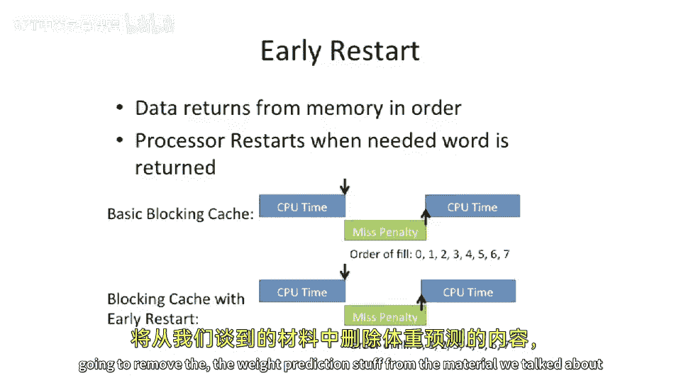

# 【计算机体系结构】普林斯顿—中英字幕 p62 61_05_critical-word-first-and-early-restart -BV1ii421D7WR_p62-

I'll just skip weight prediction because I don't think it's that important。

But I did want to say one or two words about。Critical word first and early restart。

So critical word first。Basic idea here is that you can express to the memory system。

Which word is the most important word， and usually rama arrays。

 the buses are oriented in a way that they'll actually allow it takes multiple pumps or multiple cycles to transmit the data across the bus。

And usually these arrays don't care。At least like main number like DRA arrays， big。

 big things on your chassis or on your system server motherboard。嗯。

They don't really care if they return the data。In this order，0，1，2，3，4，5，6，7，8， probably 7。 sorry。

 Or if you return it in a different order。Because they just want to use the bus as much as as possible。

 So we can do， as you can say。🤧嗯。Addre three is the most important one。 please return that first。

So what can happen is it'll return the data。 and right here。

 address  three comes back and it comes back first， always。

 because that's the address that we're trying to access for this load miss。

And you can start the CPU executing again， while。The rest of the cache line is filling into the cache。

So you've basically done a little bit of overlapping。 but this doesn't help that much because。

 usually， you know， there's not that many。A cache line is not that long。

 So it might help you a little bit。 So， you know， if it takes8 cycles to fill the cache。

 you might save  seven cycles if you were going to the last， if。

 if you were trying to load the last word in the cache line。But if you're trying to。

 let's say load the second line in the cache line， it only saves you one cycle。

 And there is some complexity in actually building critical word first。Systems。

Early restart is another way to do this， which a little bit less hardware。

 Instead of having the memory system rotate the memory that returns back to you。

 It still returns the the memory in。The canonical order。But we just wait。

Until let's say we want to address3 here， comes back， and then we restart there。

 So you can see there's a little bit of time here， which we can overlay it。 W the fill in with。

Executing in the CPU again。In the canonical case， if we don't have early restart。

 what's going to happen is we have to wait for the entire cache line to come in and then we can restart so we。

 we lose these， these cycles there。 and we don't get that overlap。Okay， let's stop here for today。

 and I'm going to remove the wave prediction stuff from material we're talking about because this is not that important。

