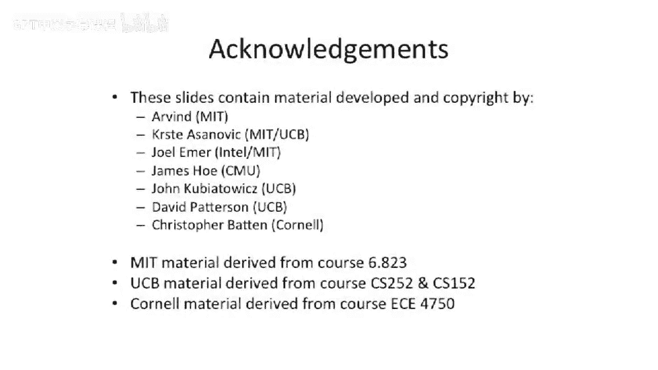

# 【计算机体系结构】普林斯顿—中英字幕 p64 63_03_base-and-bound-registers -BV1ii421D7WR_p64-

So looking at our dynamic address translation slide here。我。What was the motivation for this， Well。

 we wanted to start running multiple programs。We wanted to build overlap computation with IO。

And this really leads us to。Some form of multi multi programminggram here。

 So we're gonna run around two programs at the same time。 Now。

 note these two programs might be run by the same user at this point。

 We're not really talking about multiuser multiprom。 That's you probably want protection to do that。

 But right now， we'll just talk about translation。And one of the big challenges here is so you want two programs to run。

What happens with those two programs？We're linked。At the same location。

 So they both want to run at the same location in memory。Or the data they want to access。

When you statically link these things， are is at the same location in memory？Well。

 that's kind of inconvenient。So。One， one thing you can start to think about is actually have some notion。

Of relocation。You may not do this on a sort of chunk by chunk basis。

 but instead you do it on a program by program basis。So what we can do is you can have。

A base register so that all addresses that come out of， let's say， program1。

Get added a certain offset。To it。All addresses out of program2 get added a certain offset to it。

And all addresses that come out of the operating system have zero added to them。Okay， well。

 then we can just change this base register and'll effectively move where our programs are。

And we're going to call the address we， when we start out that comes from our program。

 the virtual address。 And the physical address is where it actually is in physical memory。

You could extend this a little bit and even actually add some notion of protection。So you could add。

Something which says。Program2 here is only allowed to access up to this location or this offset in itself。

And past that point。It is not allowed to go access anything。Well， that's actually pretty easy go do。

 And we're gonna call that。A bound register。Now， these base and these bound registers。

 we're going to look at it in more detail in a second， but it's。

You don't want the user program to go be able to change the base in the bound register。

Because if the user program goes and changes the base and bound register。

 it can basically remap itself or it can possibly make its bound big enough to go look at the other program。

So what is， let's go look at the hardware of a basic。Base in bound translation。

So we have a program here。 and it' going to do a。Untranslated。Address。

The address is going to get added to it some base。 And that's going to be the address you actually go to access your caches and your memory with。

This address is compared to。A bound register。And if it's bigger than some bound。

It gets slapped on the hand， or it gets killed。 You get some sort of。Violation。Now。

 this actually still shows up in modern day architectures， yet it's not super widely used。

 But in X 86， you actually have segments which have base and bound registers。

So there's some problems with base bound registers， which we'll talk about in a second。

 But otherwise， you， this works O。 You can have different segments。

You can have programs that are basically relocatable by the operating system。

 by setting this base register。You can protect memory。By setting the bound register。 and if。

 if the application tries to do anything outside of those parameters， it'll get killed。

Questions so far。Sound pretty， pretty good。One of the cool things you can do is you can have not only。

One set of base boundary registers。But you can actually think about having。Actually， before we home。

 before I move off slide， I wanted to say。Something， something interesting here。What happens？

If you have two programs。That want to share some data。Can we do that here？

That's definitely an option。 You might want to share data and not code。

 or you might wgle the other way， which is actually more common。you want to share code。

 but not the data。So for instance， if you。Modern Mu systems do this。 They don't necessarily use this。

 They use it more of a page based approach。 But if you launch 100 copies of L S at the same time。

The code for L S will be the same between all00 different versions。

So what we can do is you can actually point the base register at the same location and use the same piece of physical memory。

So that's a nice little trick here。 is you can basically share the same code segments between all your programs。

 and modern day systems actually do do this。 They share the code segments between。

All the same versions of the program。Obviously， if you have。Someone who's running version 1。2。

7 of something。 let's say L S and someone else is running version 2。3。9 of L S。

 You can't share the the code segment， but your O S will know that those are different。Cos。

But if it is the exact same code， you can save a lot of memory by just。

Only having one copy of it in RamM and not。I don't know，1 thousand0 copies of it in random。So that's。

 that's the big advantage of this separation。 And， in fact， this is actually used。Pretty recently。

 this is still。To someone send vestiges of this I said is an X 86。

 But the old crray vector supercomputers actually did not have a more advanced。Memory system。

 but more advanced memory system， but instead just had base and bound registers。

And this was actually， to some extent， O for something like a supercomputer because supercomputers don't typically run lots of programs at the same time。

They typically run one really big program。So it was a little bit easier in that setting than using an architecture like this。

For something like general purpose。Operating systems like your Linux desktop or something like that or Windows desktop。

Okay， so let's take a look at how this fits into the pipeline here。

So here's our pipeline and we want to add base and bound reishs。 It's actually not so bad。

We have to adder here。😡，To add in the base into the program counter。

 And we have to add a adder for the。Database register。Into all of our loads and stores。

And then we need to add a comparator。Here a comparator there to check to make sure we don't fall outside of our bounds。

Now， one of the interesting things about this， though， is we're adding an extra adder。

 So you think this would slow down our clock frequency a lot。 We're adding a whole not， let's say。

32 B wide adder。😊，But conveniently， we already have an adder in this path。

We already have an adder in this path。So the adder in this path is basically our PC+4 calculation。

So while we do the PC plus 4， we can overlap that with the next edition。

 And you can actually have the the carries basically happening at the same time。

 And the cost of is only one extra carry delay out of a full ladderer。

Similar sort of thing over here。 It's kind of the same way that you would build a。

Multipliier or something like that。 where you actually overlap respective additions in the multiplier concurrent。

So it's kind of nice that， you know， you can do this relatively low cost to some extent， you know。

 just sort of。Melts away。 You could even go faster。 I think this note here， we talk about carry。

 carry save adders。 You also do carry select adders， which are even faster。

 where you just have basically  one bit that tells whether the last bit carries or not。 But you can。

 you can go quite faster。Okay， so let's， let's talk about。The challenges of base bound。So。

 let's say we have。Memory here。And we start off with。Three processes， user one， user  two， user 3。

User 1 is 16 kiloB user。2 is 24 kB。 Use 3 is 32 kB。 And this is just some open space。

Free space here and here。So all of a sudden， more users show up。

 and they start to run some processes。User 4 goes here and fills in this space here。

User 5 goes down there because it can't fit in this 8 kB segment。

So8 kilot segment or a kilom bytes free space here and has to go down here。Okay。

 that's all well and good。2 and 3。Kill their programs。They stopped running their programs。So。

 all of a sudden。This goes away。Or 2 and 5 goes away。 And， and this one goes away。

So we start to get some holes showing up here in some small holes。

And if you repeat this serve thousands and thousands of times at some point with relatively high probability。

 you end up with lots of little chunks of memory， which are hard to go reclaim。And this is， this is。

Memory fragmentation。If， this is if you go look at something like a。Modern day garbage collector。

 it'll actually try to res squish all this data together。

 but that's hard to do when a programs running。It's hard to go take these other pros and go res squish them。

It's also possible that， depending on how the addresses are laid out。

 you just may not be able to go do that。 If you have base bound。

 it's possible that you might actually be able to go move the data。

 you have to go copy all of the data。 that that takes time。 If you have to copy your entire memory。

System， this is why something like garbage collectors。

Can be pretty inconvenient because some of the garbage collectors actually require you to go copy everything。

There's a couple different techniques you probably talked about in your data structures class about how to go do efficient garbage collectors。

 But let's say we just want to avoid this completely。So can we go avoid this？

