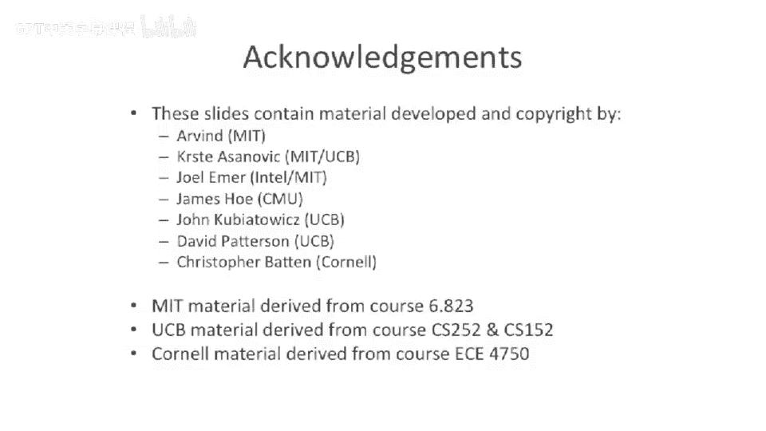

# 【计算机体系结构】普林斯顿—中英字幕 p66 65_05_translation-and-protection -BV1ii421D7WR_p66-

Okay。Now， we get to look at the hardware we have to build in order to do this。Just to recap。

 we have a virtual dress。The offset just goes straight through。

The virtual page number goes through some sort of address translation through our page table。

 And we come up with a physical page number， and this is our physical address。

Just like with the base in the bound register， we have a bound。

 We want to actually take the virtual address number and stick it somewhere into something which does a protection check。

So what do we want to check in our protection？Well。

 we want to check maybe whether it's a read or a write。

 because you might want to have some pages that are read only or some pages that are write only。

You may want to have some pages that maybe only the the kernel can access。

This is what I was saying about how you can map all of the kernel into your address space。

That's at the same location。 But maybe you don't want the user to be able to access that unless you're in kernel mode。

 So a lot of times there's a bit that says， is this a kernel。

Access or is a or an OS access or user access。🤧嗯。And。

One of the challenge here is that you really want。This address translation to go fast because you don't want to take every single load in store and turn something that was a one cycle operation into a。

 you know， 10 cycle operation。 or however many levels。 unfortunately， you know。

 you could cache miss on your page table access and have to go out to main memory Could even make it worse。

So。We came up with a。Nice little structure。To be able to solve this problem。

And its nice little structure here is。A translation looka buffer or TOB。And what this is。

 is this is a cache。Of page table translations。So you shove into it a virtual address。And outcomes。

 or excuse me， you sho into a virtual page number， and outcomes comes a physical page number。

So it is the direct map， but it's a small set of these。

Instead of having the entire all all of memory。 So the most recently used。

 you might write in the sort of most recently used algorithm or some other algorithm on this。That。

When you have a hit in your T， O B， all that happens is it's a single cycle。

 You stick it and dress in and dress comes out。 If you have a miss。

Then you might have to go to some sort of。Slower case。Which has to， let's say。

 go walk the page table or multi little page table， for instance。

Let's look at what's in this structure。You have a valid bit。

You typically have a bit that says whether it's readable。

You have a bit that says whether the page is writeable。This allows you to have read only memory。

 If you， for instance， only have the read bit turned on the right bit turned off。

 it allows you to have right only memory。You might say rightly memory， is that possible。 Well， yes。

 actually， this is a thing。 if you have， let's say two processes that are communicating。

And you want to have one process be able to communicate and only write to the other process。

 but not to have the other process communicate back the other way。 So one directional channel。

 you can do this with rightly memory。Sometimes these， these emerge different architectures。

 not all architectures have right， right only memory， but。For， for completeness。

 you want to have that。You have a D bit here， which is the dirty bit。Yes。

 this is like the song by the Blackeyd peas。3ir0 bits。Yes， so its a dirty bit here。

TheThe dirty bit allows you to know if the page has been accessed or not。

 So let's say you have a writeriable page。And you want to know。

If that page has been accessed or written to。😡，You can use this bit。

 this is similar to the dirty bits in caches to know whether the data has to be written back to a higher level。

Of cash or not。 Well， if you think of。Memory， excuse me。

 what we have mapped into memory as a cache of stuff that could possibly be on disk。

 We have to know whether to write it back out to disk。 So we can use a， a dirty bit to do that。

 And that's usually in the T， O B structure。Now， there's different ways to go build these caches。

 The most common way is to actually have them be fully associative。So if it're fully associative。

 you have to do a tag check。 There's a tag in here， which gets matched against。第。Virtual page number。

 and it's associative。 So convenientve any location in this T， L B。 And then finally。

 this is the data payload。Or the physical page number， which comes out。So this is our base。

Translation look aside buffer。And it's basically just a cache of the page table。

And we want to do is at some point， when you take a miss in here。So the opposite of our hit。

We're going to pull in a page table entry from our walk the page table。

 possibly do that multilevel resolution。 We have to go do multiple loads at a time and take that data and put it in here。

 And now， the next time we go to access that same page。

 it hits in here and doesn't take any more cycles。So these are usually fully associative。

 They're usually relatively small，16 to maybe 128 entries。

Sometimes youll see multi levell versions of these where you have a fully associative one at the lowest level and then some sort of level 2 T。

 O， B that backs it。That's a lot bigger and possibly not fully associative。

Couple different designs in here for how to go about replacing。

Having something like true L R U can be hard if this gets large。

It's possible that L or U is not even a good approach。Unlike caches。

This is a very different access pattern。 It's not necessarily。Spatcily。

 there's not necessarily any spatial locality really going on here。

You probably have temporal locality。 So you that might say that L or U might be good。

 but it's not like there's spatial locality of because because you access one page。

 there' any probability you even go access the page after the page before it。

 So lots of the techniques from caches， prefeing， etc cea doesn't really work here。

But from a replacement perspective， people have tried lots of different things。

Something that actually works surprisingly well is just random。You just randomly choose an entry。

 kick something out， and you replace it。Random is actually hard to do， sometimes。Believe it or not。

 So a lot of times what people use is what's called a clock algorithm。Where you basically have a。

Free running。Counter。Which says。Where to go access。In your T L B to go evict in every cycle。

You go and you somehow change this counter， maybe increment it by one。

 And there's a little hardware counter there that will actually do this。 And that's not quite random。

Because。It's correlated somehow。And that actually can be a good thing。

 because that actually can make it so that you can somehow test your processor。

Having something that's truly random。 If you're trying to pick up like random noise from the atmosphere or a true random number generator。

 that can be very hard to test。So instead， what lot of times people will do is they use a clock algorithm such that on every instruction that executes。

 you increment the T O B replacement location by one。

And it rolls around when it gets to the full size of the TLB replacement size。

And what's nice about this is if you reset that register to let's say B 5 and you execute 100 instructions。

 you know what it's going to be。Hre0 cycles in the future。 So you have some predictability in that。

 but it looks like random。Because it doesn't。It doesn't increment， let's say。

 with every memory reference。 Instead， it increments with every execution of an instruction。

First and first out， has some notion of locality。That works OK， true LRU。

 some people actually do here。So one of the good questions that comes up is。

If we're trying to access a big array。Can we map enough memory with our TLB to access that big array without having to take a TLB miss？

So we'll call this the reach of the TLB of all the things you can map with the TLB。

So let's say we have a relatively decent sized T， O B here。 We have 64 entry T， O B。F kill by pages。

How much can we go access？Well。We can go access。256 k。 You， that's not small， but it's not huge。

So this actually does。Boode for having more T U B entries。

 It also bodes for possibly having larger page sizes。Now。

 this is the traditional sort of trade off here for caches with block size that having larger page size。

Makes you have larger reach， makes you have fewer TLB entries。

 but it can increase your internal fragmentation and you might have to pull more data off the disk if you go to sort of start up a new process and has these large pages and you don't have to use it and you don't want to use all it。

So something to think about is that the reach of the TOB is important。

If you don't want to get the O S involved。So a couple extensions to the TOB。

Something we haven't talked about up to this point is what happens？

When you have multiple processes running at the same time or time multiplex between them。

What do you have to do the T L B， So we talked about changing the page table base pointer when you change to a new process。

Well。The TOB is a cache。Of the page table。So when you go to change the page table base pointer。

 you're going to have to invalidate your entire TLB。And if you're doing this。

 let's say 100 times a second， like you do on modern day Linux， this can be pretty painful。

Or maybe a thousand0 times a second。On some faster systems。

 you're going to be trashing your TOB pretty quickly。So that could be， that could be quite painful。

 So a solution to this is you actually add。Extra bits into your TOB。

Which say which process a particular entry in your TOB？Belongs to。

And we're going to call this an address space identifier。

 So're going to be a little bit more general than a process identifier here。

Sometimes some operating systems will actually use the same。

 some some bits of the process identifier as the address space identifier。 some， some people don't。

 Well you you can leave this as a something which will uniquely identify the address space。

So now what we can do is we can commingle。Different processes， TOP entries。

 and this address space identifier takes part。In the Associative lookup。In the TLB。

 so our match operation checks the tag。And it checks to make sure our address space identifier is equal to a special register。

 which is on the side， which is added， which is the address space I D for the currently running process。

So we're actually going to check。This and that。Now。

 sometimes you do want to actually ignore the address space identifier。 So a good example。

 this is like operating systems pages。So if you have the operating system mapped into every single process out there。

You don't necessarily want to be polluting your TOB with separate copies。

Of the page table entry for all the different。Operating system pages。

So a lot of times if you add an address space identifier。

 you also add a global bit that comes into the match。

And the global bit basically says ignore the address space identifier and turns it back into the case we had before。

This is traditionally only used for operating systems pages。And then finally。

 something I wanted to say is sort of a neat extension here is to have variable size pages。

So instead of our basic。T O B， which has， let's say，1 page size，4 k or1 MB month that。

 You have some bits in the page table entry， which actually say this is not part of the matchsh。Well。

 actually， this is part of the match。 I guess。 you do have to little look this up because this is going to change how many bits of the tag to look at。

But you're going to use this and you're going to say， oh， the output is a different page size。

 so we can have 1 MBby pages and 4 k pages at the same time in our page table。And you can use。

TheLarge pages for large。Pieces of memory that you know are going to all be there。

 and then small pages for。Something where you're worried about internal fragmentation。

So you can think about having the page size that most architectures do have。Page size。

 a lot of architectures have something like an address space identifier these days。

And some architectures will actually have an address based identifier that's hidden from the operating system or hidden from the programmer。

 and it tries to figure it out itself。So it's not architectally visible。

 but the micro architectureit effectively has addressed space identified。

