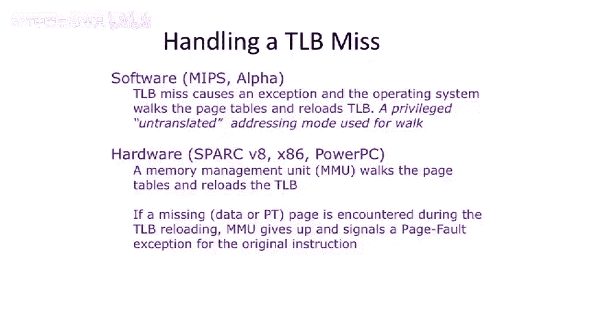

# 【计算机体系结构】普林斯顿—中英字幕 p67 66_06_tlb-processing -BV1ii421D7WR_p67-

So， if you。Hit in the TOB， life is good。You get the address you need。If you miss。

There's two major approaches to figuring out。Where to go look for the data or where to go look for the page tables。

The approach that something like X 86 uses。Is to use a hardware page table walker。

So it was a little steep machine。In the main processor， which says， oh， page table mish。

It stalls the whole processor。 And then what it does is it in physical memory， will walk。

That multi level page table for you。And we'll do index into it in another index in another index。

 If it's a multiple page table。 and finally， come up to the actual address。 It'll refill the T， O B。

This is like the mis case of your cash。Another common approach。Which is what MIps and alpha do。

Is they'll actually use software to do that walk。And effectively what this is。

 this is similar to having the mis case of your cache be done in software。

 or it's done in the operating system here。And why this can work out and not be too horrible。😡。

Is because TLB misses are relatively infrequent。So because the TLB miss is relatively infrequent。

 you can try to do it in software。Something I did want to say is that you can also。

 because it's being done in software， you can。Have different layouts of your page tables。

 You don't have to have one very rigid page table layout because if you do it in hardware。

 that means the layout of your page table has to be known。Between the hardware and the software。

 and they have to be agreed on。That can cause challenges。Let's one other thing I learned to say。

Power PC is actually a little bit interesting here。We have it put under hardware。But it。

 to some extent， can sort of straddle these to a little bit。

 Some implementations of power PC do this completely in hardware。

 and some actually have some software assist for the harder， hardware cases。

 And you can also think of the， the software one， sometimes having a little bit of hardware to assist。

 So， for instance， in mips， there's a special hardware register that gets loaded with。

The address of the first level page table index。If you're doing a multi level page table and the software can elect to use that register or not。

 So it's like a little bit of hardware boost， but it doesn't do the actual cycling of the page table in hardware instead it's done in software。

