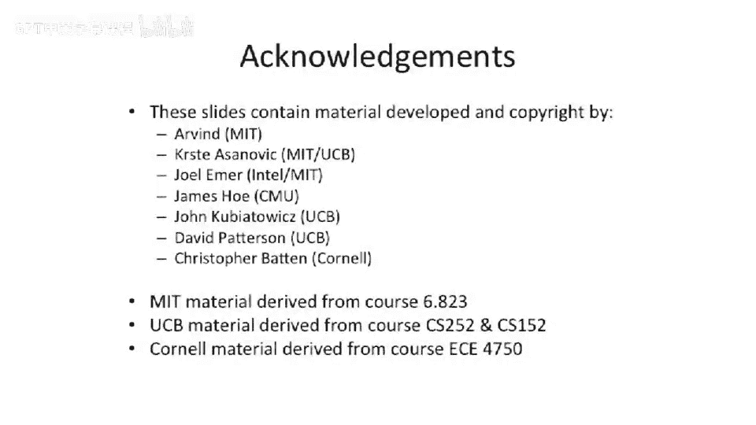

# 【计算机体系结构】普林斯顿—中英字幕 p69 68_03_cache-and-memory-protection-interaction -BV1ii421D7WR_p69-

Okay， so one， one technique to do this is to。Let's say。Take the T， O， B。

And instead of having a T O B in front of our cache。Put our TO B， let's say。

 in parallel or after after our cash。So what this means is the addresses that go into our cache。

Our virtual dresses。This has some。Pretty big implications。

Lots of processors are doing this these days where they'll actually put the T L B in parallel with the cache。

 And this picture is a little bit confusing because it looks like this is after the cache。

 to some extent， it is and isn't depending on how you sort of squint and look at this。

If the cache is completely virtually indexed and virtually tagged。

 it would look something like this because you only go fire up the T L B when you take a cash miss and you have to go out to。

呃。F out layers in memory。Now， if you have a virtually。Indexed， but physically tagged cash。

What that means is the address that goes into the index of the cache array is。A virtual dress。

 But then you do the TOB。Access in parallel and outcomes of physical address。

AndThen you do the compare the tag match on the physical dresses that makes a lot of lot of things a lot easier in life。

 And we， we'll look at that in a second。So。One of the major。

 major challenges that you end up with here of virtually indexed caches that I wanted to point out is you start to get some aliasing problems。

What do I mean by this？Before when you were to go put something in the cache。

It could only be basically one place in a direct map cache in a end Associative cache could be in。

Then different places。 So two way set associative cache give in two ways。

 But you knew where to look for it， at least。But all of a sudden。If you start to have。

Bits above the minimum page size in the address。Feed into where it is in the cache。

It can actually be in multiple places， in the cache。So brief example here。We have a 32 bit address。

We have our cash offset here。We have， let's say。A page size of four kilobytes。

So that's going to be what， 12 bits。And let's say， our cash。Index。Or our cash rather has。

I don't know， more than four kilobytes in it。So all of a sudden， we have a direct mapped cache。

Which has 8 kilobytes。Oh，So this bit here。So this this is our index。Sorry。Our index into our。

Cash has one bit here above the page boundary。And the O could elect to have this bid here。Be a zero。

41。So what that means is all of a sudden， when we go to index into our cache。

The same physical piece of memory might be in two different locations。

 or depending on how the operating system sort of lays out memory。

 you might look in the wrong spot or you might need to check both places， so。

We just start thinking about this， that the bits above the minimum page size。

 If our cache is bigger than our minimum minimum page size， the bits are not going to match。

And we'll walk through example of that in a second。Also， virtually。Addressed caches。 have some other。

 other challenges here。Because。Two applications can have the same virtual addresseses。

And let's say your time multiplex between application 1 and application 2。 All of a sudden。

 these two applications are going go into your cache。

And you might have one application hitting on the data of another application。

So if two applications are trying to go access， address 5 and they have different values started to address 5 and our virtually index cache。

 All of a sudden， you might start to get something weird here。 You might actually end up where。If。

 if you don't protect against this， one process is reading another processes data out of the cache。

 So you need to protect against this。As a couple different approaches。

 one approach is actually just to flush the cache on every context swap。

 So every time you change processes， flush the whole cache。That sounds really expensive。

 but believe it not， that's actually done with non， non trivial。

Probability or actually is done in some actual real systems out there。

A little bit nicer way to do this is to have address space identifiers。

So you actually taggged the cache with address space Id， and it's part of the tag information。

 So it's not just the virtual address that matters。

 but it's also which process Id or which address space Id。 So it's another sort of thing。

 but that increases your tag bits。So you got to be a little bit careful about that。

So this is mostly about having a virtually。Indexed， virtually addressed cash。Or virtually， excuse me。

 virtually index， virtually tag cache。 And if we look at this how this fits into the， the pipeline。

Life actually gets a lot， lot better from a hardware perspective。

This is sort of summing up what we saw before。 You really to do only have to do translate on cacheshm。

So your matn processor pipeline looks the same as what we've been drawing up to this point。

But on cachemist， you have to go through either your instruction。

 translation buffer or your data look aside buffer data translation look aside buffer。

So to sort of sum of this。A little bit more pictorially here of what's happening with virtually addressed caches。

What's。Take a little bit of a gander at this example here。So we have two virtual dresses。

 virtual dress 1， virtual dress 2。And the operating system elects to map those to the same physical page in memory。

This is something that virtual memory systems do many times。

 Sometimes you want to have a memory hole where you have memory map twice or you want to have a piece of memory map between two different applications to share data。

 Prety common thing to have happen。 So you want to share some physical memory。Unfortunately。

If you go look at our virtual。Addressed cash here。 We actually end up with it in two different locations。

 This is going back to that example there。 You have a first copy here and a first copy there。

And it depends on where it actually was located in the virtual address space。

 which has no mapping to where it actually should be located in the physical address space。

 So the bits don't match。The bit of the virtual address here and the bit of the physical address in this bit here does not match。

And that， that causes a， a world of， of problems because all of a sudden， you can have。

 let's say that even the same application right。To address， let's say。10， and right to address。

4096 plus 10， And they're supposed to be mapping to the same location。

 It's supposed to be the same address。 but you could write 5 and then the other using the other name for that same location。

 It'll read， let's say，1000 or just some random number out of there。So there are。

 theres a couple techniques to， to deal with this。 And I don't want to go into too much detail。

 Your book goes into some more detail。But just to give you。A little bit of a insight on how to。

 how to， how to go about solving this。There are some systems out there which actually require that the virtual indexed piece of memory or the resides in the same location。

As another page， that same address in the cache。Now。You sit there and you scratch your head。

 and you might say， well， is this effectively。Decreasing our associivity of our cash or。

 or moving things around in our cash。Well。A little bit。Is the answer。

But these are sort of the trade offs。 And the O S can， to some extent， manage this。

 this different layout。And that's what I was saying here。

 And early Sps actually used a system like this where it ensures that the virtual dresses， accident。

The address in the P will not conflict in a direct map of cash in in a bad way。 So， so youre。

 guarantee youll always go to the same location。So。That's sort of the beginning point。

 If you have virtually indexed and virtually tagged。But you can have other mixes of these things。

 and not all of them make sense。嗯。You could have physically indexed， physically tagged。

 That's what we've been talking about at the beginning of， of last lecture。

 That was sort of the simple case。Virtually indexed， virtually tagged。 That has lots of challenges。

 we'll say。Virtually indexed physical tags。 Now， this is actually a really good trade off here。

 So you do the translation parallel with the cache axis。And then you do the tag check。

 You don't actually need to have aids in this case。Address based identifiers because。

You're guaranteed to have the correct physical match。 You know， you might be accessing， let's say。

 the wrong location in the cache。Or you might be accessing the wrong location。

 So we don't get around this virtual physical problem and being in two locations。

 We'll talk about that in a second。 You still need to handle that sort of the the sparkway。

 But at least you don't have to have address based identifiers。

 And at least you don't have to flush your cache on every process swap。

Because you're guaranteed that the， the check that you do on the cache miss or hit is exact because you're doing a physically indexed。

 assuming， physically tagged cache。And then you can have something we'll call both indexed and physically tagged。

This is a cute little trick that a lot of。Architectures play is they just want to ignore all these problems。

 and they want to make something looks like a physically indexed， physically tagged cache。

 but they still want to have a cache that's bigger than their。Minimum page size。

So you have a four K room page size and you want to have it in a kilo byte cache。

You have a direct maps cache， this bit here。The one above the page size is going to be part of your tag index。

But it's not。It doesn't fall into。So it's part of your tag index。

 but you're not going to be able to control it。Bo you can do。

I let's say you take your 8 kilobyte cash and you make it two a set associative。So all of a sudden。

 it's 8tbytes。But it reduces the number of index bits you have。And it fit's within your。

Index into the cache。So it's a cute little trick here that you have。It's virtual and physical。

 the virtual and the physical addresses below the page size are the same。So， the index。

Into the cache。Doesn't get changed after you go through a dress translation。

So you'll see this where people actually add associivity to their L1 caches just to avoid having to do a dress translation。

 and then you do a dress translation in parallel， and you do physically tagged and do the tag check physically。

There's this other one down here that had to have a X through。

 I I don't think I've actually ever seen one of these built。 You can。

 cause it kind of doesn't make sense。 having a physically indexed virtually tag cache。Yeah。

 not sure why you'd want to do that because usually the hard part is coming generating the be addressed to stick into the cache。

 So I have， I've never actually seen one of these， but。It's always possible to go。

 go build something like that。But it's something to think about that， having。If， if all of a sudden。

 your cash size or the amount of index bits that go into your cash is more than the amount of bits in your minimum page size。

Your addresses are going to show up in multiple places。

 And you have to either deal with that or at least understand what's going on there。

 And it's usually done by the operating system。1，1 final note。

 we've mostly been talking about multi levell page tables where you sort of index it。

 And then you have a tree of pages that come out of it。

This is only one approach People have built stranger things out there。And still implemented paging。

That's only one structure to hold all the pages in。

 So one thing you can think about is if you have lots and lots of page tables。

And they're all mapping， let's say， to the same。 They they all look similar。

 You can try to share different portions of the page table。

 Well many times the operating system does that。 But another way to look at it is you can try to have a table which takes a physical page。

And maps it backwards to a virtual。Address。These are actually usually called inverted page tables。

And on first appearance， this sounds weird because it's the map in the direction you don't want you would think。

But to make up for it。What。Usually， architectures due to solve this problem。

 this architectures that have had inverted page tables do to solve this problem is they have a fast hashing。

Function in a really small hash map， which does the correct direction。

 And then if they have a slow direction， they basically sort of walk the page table and say complicated hashing scheme。

 But basically， it's kind of one of those linked list hash functions。 So you。

 you check one location in the physical to virtual table。 If it's not there。

 There's a link to another location and another location。 then if it's。

It actually ends up working out， not， not too， not too bad。 but that's not very common today。

 So I just wanted to point out there that you can actually have the idea or you can have different arrangements of pages and the canonical page table we talked about today in class last time。

 theres only one way to go about doing it。Okay， so questions on。Virtual memory caches before， yep。

AhThat's a good question。So when you see page relocation。

 you' think the operating system takes a page and。Deciidedes to move it in physical memory。

 someplace else。So。You're saying because， yes。You're saying the cache could get stale。Yeah。

 so the problem is that。Z be draws。Here we have a linear page table。We put in address。5000 hesimmal。

And that。Maps to。Some location in our physical memory。

Let's say to make life easier of maps to address。8000 hecks that small。Now， the O S comes along。

And swaps this page out to disk。Sometime in the future， it decides to pull it back in。

And it pulls it back in down here。At。A 0，0， hexadeadeciimmal， A 0，0，0， hexadeciimmal。And updates。

The page table points there。Now， what Guva was trying to say is。In our cash。We had some data。

That point to this physical memory that was in the cache。Now， all of a sudden， we。

 we go and we move everything around。Is this， is this a problem because we're basically going to do a。

Index。And。The physical address that comes out is not going to match what was in there for that data。

That's actually okay。 We're just going to get a miss on them。That location。

So we're just gonna get a miss。 And then it's basically going to evict it。

 They go pull with that exact same piece of data。That's actually not so bad。Now。

 there are other subtle， subtle or subtle challenges with these virtually index virtually tagged sorts of things that will many times require you when you go to do rebing to actually invalidate all the memory that you kick out。

Because。You actually might get a hit。Even though it's pointing to the wrong location。

 So let's say the other， the other cases is you're in a virtually indexed， virtually tagged cash。

And we did this remapping。 This is the exact same remapping here。Well。

 there's different physical memory underlying， underlying address 5000 virtual now。

And we want to make sure we don't take a hit on the old data， which is still in our cache。

So typically， the scheme to go handle this is you actually have to invalid all that memory out of your。

 actually， it's typically flush and operation out of your cache。

And depending on what architecture on， some architectures actually have instructions that flush the entire cache。

So X 86 has something called right back and invalid invalidate。

Which will actually flush the entire It'll， It'll write back all of data。And flush the entire cache。

Other architectures， who something more like MIPS， does it on a line by line basis。

 and it's basically an operating system only instruction where you can actually access an address and given that address。

 excuse me， you present an index into the cache and given that index， it'll flush that data cleanly。

Now， then there's something sort of in the middle。 If you want to actually have the user be able be able to do this sort of flushing。

 you need to think a lot harder about this because。

You want some way for the user to be able to present a virtual dress。

 but have that name something about the cache。So there are some ways to do that， but it's kind of。

That， the quarter cases there get pretty tricky。 But so， yeah， does that answer your question。

 So you。You， you get a miss when you go to access it someplace else。 And that's actually okay now。

Trickier thing is， let's say， the O S decides。To。Pointted this some other way。

And let's say DMMA or use another processor or something to overwrite this piece of memory。Now。

 your cash is stale。 but this is sort of a。More involved question going to。

 if you have multiple processors， How do you keep memory from multiple processors coherence。

 which we're gonna to be talking about in two lectures about cache coherence between different processors。

 If it's on the same processor and it's the same way。The cache is gonna pick up that change。

 If it's accessed， let's say。Some other ways， that same address。The operating systems。

Going to have to be very careful。 And this is why these virtually indexed， physically tagged address。

 caches usually require some way。For the operating system not to have those bits differ。

The bits match， you know， you'll take it out。So。And because it's physically tagged。

Even if you have a， let's say， fourway set associative cash。

You're gonna get a hit on the physical address bits after the translation。

 So it's not like you can actually have， let's say。

 way 0 and way  one having the same piece of physical address data in it that just can't happen in a cache because。

 on a physically tagged cache， because the physical tagged information is gonna to be the same。

