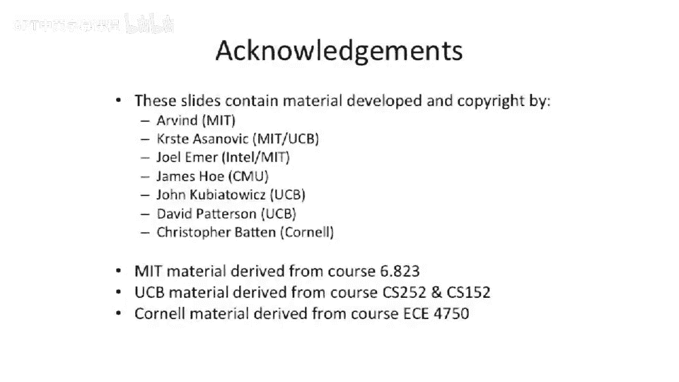

# 【计算机体系结构】普林斯顿—中英字幕 p70 69_04_vector-processor-introduction -BV1ii421D7WR_p70-

Today we move on to our new topic。Vctor computers。So a little bit of introduction when a vector。

Vectctor Mach is or a vector processor。Broadly， it's a way to get at having。Data level perilism。

Many times for， let's say， array operations， you're going want to take one whole array and add it to another whole array。

And let's say these arrays are large。Does it really make sense to have？

A processor sit in a tight loop。Doing load， add。Store， load add store， load add store in a loop。

And that's the insight that comes out that if you have computations that work on vectors or matrices or multi even multidimensional matrices。

You can think about building architecture where you don't have to have as much instruction， fetch。

 instruction， decode bandwidth。 and you don't have to sit there and。

Ftch new instructions and continually operate on those new instructions。

 You could just have an instruction， which encodes。Some large amount of computation。

Because it's all the same。Is the insight？Also， in today's lecture， we're going to be talking about。

Single instruction， multiple data architectures。This is kind of a degenerate case of vector architectures。

And a good example of this is something like multimedia extensions or MM M X in the Intel processors。

Or Alveec in the Power PC architecture。The newer thing that Intel has added。 and they all call SE。

Streaming something extensions。 I actually don't know if the second S stands for。

 And then they also now have something they call A V X， which is even wider。

 but they can basically have continually added more instructions to make the。

Short vector nature better。 And then finally， today， if we have time， we'll be talking about。

Graphics processing units。So I have some examples here。This is the AI。Figer Pro 3D V 7800。And then。

 we have the。NviDdia equivalent or the Nvidia competitor here， which is the Nvidia Tesla。

 I think this is C 0，75。 Both these are both very fast processors。 And what's interesting is。

He started out as graphics。Processors， so they started out。

To play video games effectively or to do some sort of rendering of three dimensional data。

So you take in some data， you operate on it and theres massive per in there。

 lots of different triangles in， in a three dimensional image， for instance。

 in three dimensional rendering。And people had this insight that。

That same processing architecture that is good at rendering triangles might be good at。Doing。

 let's say， dense matrix operations also。And we've seen this outgrowth in。

 We've seen a whole programming model come up around this。 And this is， this is very recent。

 to some extent。These architectures don't come from the same lineage as in sort of normal processors。

 They come from really come from fixed function hardware that was there to design there to render video games and three dimensional sorts of scenes。

So the， the architectures look quite a bit different， and the naming is very different。

 So if you go pick up the manual It tells you how to program one of these things and you come from a computer architecture background。

 you're just not to understand any of the words。 Your book actually， the Henessineterson book。

 has a very good table， which translates from sort of traditional computer architecture words to GP words。

And that makes life a lot easier。Okay， so let's get started looking at。Vectctor。Processors。

 and let's look at the programming model first before we look at the architecture。

 So this is the software model， not the。Not what the hardware looks like， yet。So， to start off here。

A coupleup things to note is。In a traditional vector architecture， you're gonna to have。

Some scalar registers。And these are the registers， like in a normal micropocessor。

 They just hold one value。There may be， let's say， 32 bits or 64 bits in width。

And then you have a second register file。Which holds。Vectctorors。

And when you go to access one of these vectors。It's the same thing as a register file here。

 If you go to access， let's say。Vectctor register 3。Or something like that。 You're going to。

 that doesn't denote one value instead， it denotes。Many values。At one time。And。Typically。

 we have a fixed width here drawn， but typically， these things have very long widths。 So。

 for instance， something like the cr processor， the crray 1 processors had a maximum vector length。

Of 64 elements， where each element was 64 Bs。So it's a lot of data that you're。

 you're of moving around at one time with one operation。

And an important piece of sort of architectural， or at least programming model。

Hardware here is the vector length register。The vector length register says， how many。Of these。

Elements are actually populated。 And we'll see why that's important。 But for right now。

 let's just think of having the vector length register be equivalent to the maximum。

Number of elements in the vector。 So think of it as having 64 elements。

 And the vector Las Reg just says， there， you're always operating in all 64 entries of data in parallel。

Now， if we go look at the。Programming model connected to this。

 We need to add some extra instructions now。In our scalar processors or all the processor we've been talking about up to this point。

It operates on one register， with one other register， and that still exists in this model。

 but it operates only on these scalar registers。 Now。

 the reason we must to still have the scar registers around in this model is we want to have things like branch conditions。

 address computation， things like that are not vectorizable。 don't， you know。

 you don't have 64 addresses。 Maybe maybe you do in certain cases。 But typically。

 you're not gonna have that laying around。 You're gonna have an address。

 And you need to a load from address and sort of for branches。

 You need to do the branching based on some value and not all 64 values。

But we now add some special extra instructions。 So if you go look in your book。

 they develop this architecture they call V mips or vector mips。

And they add some extra instructions here， which look very similar to normal mips。

But all of a sudden， they put some V's at the end here。 So V V。

 which means it operates on a vector with another vector。They also developed some instructions。

 which have a V。And a S。Which is the scalar。 So you can do a vector plus a scalar。

 which would be something along lines of if you were to have。

 let's say a add vector scar where you're adding one vector with a scalar register where the scalar register。

 let's say is loaded with one。 You could do this add and itll increment。

Every element of the vector by one。You also have loads and stores。

 which can pull out very large chunks of memory and put back very large chunks of memory from as in memory。

But if we look at what's going on in one of these instructions， We're taking one vector。

 another vector， putting it into。Some sort of arithmetic operation。

 and then storing it into another register。 This is a register register vector architecture。

 There have been some register， memory and memory memory vector architectures out there where instead of naming registers。

 vector registers， you can name places in memory， But the the vector vector， excuse me。

 the register register variants are are the most popular。Just like the register register。

 our scal or computer architectures are now the most popular。

One thing I did want to point out here is we've said nothing about how many A L U are in this architecture。

 This is just the abstract programming model。 So don't get this confused with having 1，2，3，4，5。

6 functional units or something like that。 This is just an abstract model right now。

 We have not talked about the hardware。So this brings up。How do we get data。

And we have an instruction here that we'll call load vector。Load vector。Has a destination。

Being a vector。And the source。Is a register， and you might have another offset in the register。

 But let's say there's only one register in our， in our basic load vector。Operation here。

 and this is the address that points to the base of the vector in memory。

And when you go to do this load， it's actually going to pull in from memory into our vector register。

You could also start to think about having。Interesting offsets or strides here。😡。

So that's what this picture here is trying to show is we have a base pointer pointed to by Reg 1。

 It's a scala register。 And note it has different naming。 This is these have V's and these have R's。

And then。We have a stride here， which says。Where're in memory to take from。

So you could think about having something where you can do basically multiple locations in memory。

 but you want every fifth element or something like that。 So you could load， register 2 here with 5。

 register  one here with the base address and then do this。Load vector instruction。 and it'll take。

Each fifth。Piece of memory of some data size and load it into the vector register。

 And this is our abstract model， but。At the， at the beginning here， let's。

 let's assume what's called unit stride， which basically means this here is always one。

 So it's always getting the next。Value in a row。 we'll talk。

And more complicated cases about having non units stride。Okay。

 so let's look at what this does to code。Here we have a basic code example。

It's gonna multiply element in Y。Different elements of， of a vector here， A And B。

 and deposit it into。Vector C。 Now， this is in memory because this is C code。

 So these are actually arrays。Now， obviously， this is not a。You know。Array multiplication here。

 because array math is much more complicated。 This is an element wise multiplication。

If we go look at the scalar assembly code。Well， first of all， we need to have a loop。

We have to load the first value。 load the second value。 do the multiply。 do the store。

 This is showing code for floating point， double precision multiplies。

Then you have to increment a bunch of pointers。Check the the boundary case and loop around。

On your vector architecture。Life gets a little bit easier here。

Because we can do all 64 of these in one instruction。 we don't have to loop。

And all we really have to do is load， load load vector， load vector， multiply and store。

And this instruction on the top here loads the vector lengths register。

And we load the vector rent lane register here of 64， because we're trying to do 64。

But if we were to load the vector length registergi assay say with 32， we would only do the first 32。

Mulplications。And you can set that vector length register all the way up to the maximum vector length。

So， the vector length register。There's this value here we call the vector lengths register max。

Which is。TheWith the， the， the， the largest。Excuse me， length of a vector。

The vector lanes Reg says for the given operation， we're about to compute。

How many of those operations we should do。So you could very easily have something with a vector length of 1000。

But you only want to do， let's say， the first 64 operations。

 So you can load your vector lane register of 64 and only do 64 operations。

 A good example of this actually， is some of the supercomputers。

C cray machines have relatively short vector length maxes。

 But if you go look at something like the N E C， the Japanese supercomputers。

 the N E C S X 8 or 9 or something like that， which is I think actually now probably the fastest computer in the world or the S X 9。

 I think is or whatever is the the newest， actually， I think it's the S X 9。

 the new Japanese vector supercomputer， They have very long vector length。Maxes。

 so they can actually have a vector length of 1000。So in one instruction。

 they can basically encode 1，000 operations。Which is pretty， pretty fancy。 But they can。

 you still need to be able to set the vector length because maybe you don't want to do all thousand。

All the time。 Okay， so why， where does this vector stuff come in。Has some advantages。Well。

 if you go back to sort of the early vector machines。

 So something like the control data corp 6600 or the Cray 1。诶。They very deep。Piplines。

And if you think about our architectures we've been building up to this point。

 we've had to add a lot of forwarding logic and a lot of bypasses。

To be able to bypass one value to the next value。Well， if you very deep pipeline。

And you have sort of back to back。Multipies something like that。 You're going to stall a lot。

But in a vector computer， because， you know， you're operating on， let's say，64。

Operations at a time anyway。This actually allows you to take out a lot of the bypassing。

So a lot of these vector architectures have no bypassing in them。

Because if you're gonna be operating on 64 things and your pipeline length is 6 anyway。

 there's no possibility that you'll ever actually have to。Forward data。Back to， let's say。

 itself or something like that early。You can do all the bypassing between different operations in the register file itself。

Also， you know， deep pipelines are good because you can have very fast clock rates。

 So to give you an example， the。Old Cray1 had an 80 MHz clock。 Now， you might say 80 MHz。 that's。

 that's not very fast。 But， you know，80 MHz。Back in the。Probably late 60s。

 early 70s was very fast cock rate for a processor。And mean these were supercomputers。 Mind you。

 but they were very aggressive， and they could do that because they had deep。

 deep pipelineing it had lots and lots of logic。 And these things were physically large。

I mentioned the memory system， and vector computers have some interesting changes that you have to think about in the memory system。

One of the things you can do is because you have so many memory operations going on when you do a vector load。

You could actually overlap。Going out to main memory with doing the next load effectively。

 even if you're doing them sequentially。And most of these vector architectures have many。

 many memory banks。And what's nice is if you have unit stride。You know that your one operation。

 your one load is gonna go to this bank。 The next operation is go next， that bank， that bank。

 that bank， that bank， and could basically have very good bank。Distribution or bank utilization。

And this is assuming right now that we are actually only doing one memory load at a time。

And I have a little note up here， that says。Okay， well。Each load takes， let's say， four cycles。

Busy bank time。And you have 12 cycle laency to get out to memory in this crray1 machine。我。

On a normal architecture， this would be pretty bad because you'd be stalling 12 cycles。

 Let's say to go out to your memory system。I mean， that's， that's not the end of the world， but's。

 that's not great if you like have a load and then a use。

 a load of use and you just keep going back and forth。Between those load and use。

 But in a vector architecture， because we have a long vector length and we're loading 64 different values。

 And we know that they're gonna have good distribution over many different memory banks。

We can effectively do this one load， and we can overlap the latency in the memory banks with each other。

So we'll start one load here， then one load here， one load here。 And， you know。

 it has four cycle occupancy on the respective bank。And we have a 64 entry vector。 Def。

 by the time we wrap around and get back to using this bank again， that first operation will be done。

So it's a relatively effective way to increase the bandwidth of your architecture and guarantee that you're not going to have bank conflicts。

