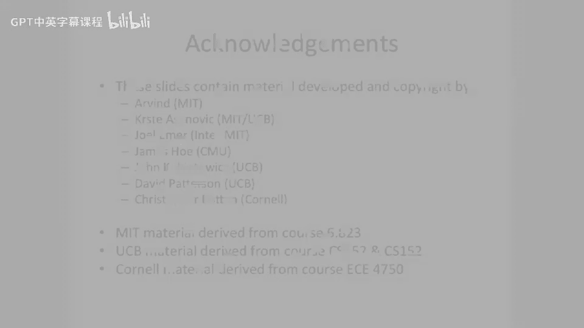

# 【计算机体系结构】普林斯顿—中英字幕 p72 71_06_vector-hardware-optimizations -BV1ii421D7WR_p72-

诶。So one of the first optimizations we're going to look at is what we call vector chaining。

So vector chainning introduced in the Kray1。The idea is that you don't have to wait for the first。

Operation to complete or the whole vector to complete before you start the second vector。

Because if we went back and looked at this picture。Here。This load。Creates the element。Of the vector0。

 we'll say。This operation here looks at the third element of the vector。

So it cannot execute after this load is done。 It has to wait for this one， but。This。

Multiply here can execute right after this load happens。So chaining in vector architectures。

Is to some extent the moral equivalent of register bypassing？And what this looks like。Is， is。

 first of all， you don't actually have to add。Intra functional unit bypassing。

The most basic notion of chain is you bypassed just between functional units。

So what will happen here is we can actually do a load。

 and we can take the value of the load as it's heading for the vector register file and also sort of feed it in through our bypass network into a different niche。

Pipline， so， for instance， the multiply pipeline and our example that we've been looking at。

And you can take the result of the multiply when it's done and feed that into the like store pipeline or something like that。

 if you have a sub broken apart stall store pipeline。 or this example here。

 we're actually feeding a multiply into an ad。So the the advantage here is， as I said。

 instead of having to wait for load， multiply and the next instruction and wait for completely complete。

 we can actually overlap。Portions， some portions of the dependent instruction when they become available。

So let's look at how this works out here。Where we're dream chaining。But through the register file。

So chaining through the register file， what I mean by that is。

We're not going to have a bypass directly from the output here to the read stage。

 We're actually gonna to have to wait for it to write and then read it。 But at least we can overlap。

And our previous example， we were not even going to do this overlap。 We had to wait for the entire。

Register to a vector register to be written。 So weve effectively pulled this forward from here to there。

But what you might notice here is， well， this value is ready here so we can even try to pull it a little bit farther forward by actually adding bypassing。

Or more traditional bypassing。 But this is just chaining through the register file。Okay。

 so now let's add chaining。Through the bypass network。And。It didn't change。Well， what happened？

That's， that's a bummer。 Nothing happened。 I was expecting this to go faster。 You know。

 I want to make my architecture go faster here。 Well， what happens is。These R's you start to get。😡。

Structural。Hazards on the readport of the vector Reg file。So to make this go faster。

 we're actually gonna have to add more read port and more write parts to the register file。

 And if we were smart into the vector register file， If we were smart。

 what we really want to do is we want to add。1 per pipeline。

 or basically as many as we need ports per pipeline。

 So if you have two input opera end and one output opera end per pipeline。

 you're probably going to add one output opera end and two input opera end。

Or two read reports to your register file and one write report to your register file per pipeline。

And this actually lets things go execute faster。 So now we have bypassing。And we have more。

Register file bandwidth。So more ports to our。Vector register file。

So what you'll note here is now we have multiple things in R at the same time。

 multiple things in W at the same time。 And we can do that because we have multiple ports to our multiple read port and multiple write ports to our vector register file。

And the other thing you should note here is。This multiply here。😡，Which is on element 0。Needs the。

Result here of the load。And it gets created here， and gets bypassed down to here。

 then it goes and executes。And then。They just step in in lock sequence here。 And similarly。

 the store here。Needs the output of the multiply in Y 3 of the first element。

So it can bypass it there and then start doing the store。So we're able to get some perism here。

 even without having multiple copies of the same execution unit。

 But we are able to get parallelism in our vector architecture。

 And what's really cool is really had to issue three instructions to do this。😊。

So very low instruction bandwidth。🤧嗯。And I wanted to make the point here that this is。

A kind of a contrived case， because our vector length is very short。 It makes no。

 It almost doesn't make sense to actually use vector instructions to do this。

But here is a picture of the same sort of thing happening in the overlap you can get when you increase your vector length。

So here we're going to set our vector lanes registered to eight。

 and we're going get much more overlap。Of the executions of this。

 And you could basically have this instruction here starting three the element zero operation here。

 starting three cycles after that first load。 and this would be as if you had， let's say。

8 independent scalar processors sort of running in parallel。

 But we could do almost no encoding space。So questions about that so far are a little technical with the。

Pictures。Lots， lots of bypassing。Happening here。Through the bypass network。

 But the bypassing is relatively restricted。 We only need to bypass one value at a time。

From one location to another location， we don't。 And if you do it through the register file。

 only sort of pushes this out one cycle。 So it's not so bad。Or pushes each bypass out one cycle。Okay。

 so this brings up the question。 what happens if your vector length or the size of your array does not equal。

A nice power of two multiple of。The vector length register。

 or let's say the vector that you're trying to multiply is much， much larger。

Then the maximum vector length register can be。So we introduced this notion of strip mining。

And the idea is that you do big chunks， and then you do the remainder。

By resetting the vector lane register。Now you can either do this one in two ways。

 you can either do the remainder first。And then do the big chunks。

 or you can do the big chunks and then do the remainder。

 And both our designs have actually been used。 to some extent， this is a software technique here。

Because the architecture is。Just allows you to set the vector length。But doesn't have any special。

Harvard support this。So if we look at a piece of code here。This added a lot of stuff to our loop。Now。

 all of a sudden， we still have load load load， multiply store。

 This is our old instructions that we had before。We have all this other stuff here， sort of。

Bumping pointers comes back into the it。 And we also have to write the vector lengths register every single time through this loop。

And the reason we're writing the vector length register here is we're going to write it with。

The this is actually coded right now that we do the remainder first and then do the big chunks。

So we're going to write the vector lengths register with the remainder first。 So N mod 64。

Do that chunk first。 And then we're gonna do the rest of them of 64。

What I really want everyone to get get take away from this is when you actually have to do strip mining and you。

 you know that the array size is not a nice， even multiple of the vector length。

You actually have to do more work here。 You have to do more work in your loop。

The other thing I want everyone to take away here is the vector lengthth register allows you to do this。

But you actually have to， have to change it。 And you can't just set it to one value。

So let's look at a code example here。 Oh， oh， yeah， I wanted to say。

A lot of this stuff here is overhead。It's sort of extra overhead。And for short vector lengths。This。

 this can be a problem for longer vector lanes， this starts to， to go away。

So here we have vector strip mining。And we have a。Same piece of code that we saw before。But now。

We sort of have load， load， mall， store， and then wed have just some junk down here。

And this junk is that extra code you need to basically handle the loop around。

And the checking and the bumping of pointers。 and to be able to handle that n may not be a fixed number。

One， one other thing I wanted to point out about vector strip mining is this allows you to handle variable length arrays that you don't know a compile time also。

Because you can just use n here and this code snippet will do the right thing。One。

 other thing I want to， yeah， point out here。 I didn't draw this because it was actually very hard to draw and wouldn't fit in the slide is。

This overhead。Is substantial。When looking at a small vector length， like 4。

If we make our vector length 64。There's a lot more work up here。 And this sort of starts to。

 to be small and and and unimportant to some extent。 So this is the overhead of this loop。

Checking and then the maintenance of the loop starts to get small when you have very long vectors。

Okay， so now we're gonna。Start to look at perism。A little bit more deeply。 So here we have。

An instruction。 we have a deep pipeline A L U and。We're gonna have multiple things flowing down the pipe at a time。

 multiple results。 And we're gonna take you know， A of 3 and B of 3。

 And it's going to take six cycles to do this multiply。

And this is assuming that we have one pipeline functional unit。What all of a sudden。

 we started to have multiple copies of the same functional unit。Well。

 we can actually start to think about executing these things in parallel and interleaving。

The respective operations。 So we have results C of 0 here， C of 1 here， C of 2 here， C of 3。

 and then modular around it。It wraps around。So this is effectively going to decrease our。

 our chime because we're gonna add more functional units， more parallel function units。

 more copies of the same functional unit。 And that allows us to speed up our execution。

So here is an example of that same architecture were looking at。 But now。

 instead of having one copy of everything， we have two copies。 And typically。

 these things are called lanes。 So we're going to call this lane 1 and this lane 2。

And take a look at the same piece of code of this vector stripm loop。With a vector length of 4。

With two lanes。And we can see。Is this basically pulls forward。And we can overlap。

Multiple loads at the same time。So all two things are in L0。And also in this multiply here。

 we can have basically two multiplies going on the pipe at the same time。Like that。Now。

 one thing to note here is。Different architectures can do the interleaving， in different ways。

This is one possible way to do the interleaving。 You could also think about having these two pulled forward and these two delayed or something like that。

 both， both of those architectures work and。But， I will say that typically。

 youll try to interleave your lanes。In a。Low order or interlea matter。

So what that would mean is not this picture。 This is a sort of。Higher order interlea matter。

 But a low order interlea matter would be elements 0 elements 1， element 2， And then you 0，1，2，3。

 and then you wrap around。This is a picture here showing an architecture which has four lanes。

And one of the things I want to just point out here is you can actually partition your register file from an architectural perspective。

 from a hardware perspective。You don't need to have one monolithic register file。Because you know。

That you will only ever access。Let's say element 0，4，8 dot dot dot of your vector registers。

 or excuse me， this is elements of the vector register。 So if you have a 64。

Elements in your Becky register。O1，0，4，8 of those can go here。 So you're basically doing。

Interlieving of the respective。Subports of a vector register across these different lanes。

 so you can partition the register file。Is the key takeaway point here。

I drew this sort of show two different things going on。 Let's say like in our examples。

 we've been looking at one of these is the multiply pipe。 One of these is the ad pipe。

 And here we have our load store pipe or something like that。 So you have multiple things。In ala。

And then， you know， functional unit sort of runs the other way。

 So this is all of the adder units we'll say。And， in fact。嗯。This is。Basically。

 exactly the architecture of the t0 vector processor from。Berkeley。And。

As you actually see their layout here。They striped over the lanes。

The respective elements of the have one register in the vector register file。

And then they actually mirrored the data path here。

 they actually have two copies of the same thing on either side of the lane。

And then up here is their scalar processor。The control processor， if you will。

 And this is where they execute。The scalar operations。

 like the shifts and the branches and things like that。Okay， so to recap here。

Vector instruction sets have quite a few advantages。Main one is the very compact。

One instruction can generate lots and lots of work to do。And they're relatively expressive。

What I you expressive is that they。Very concisely， say。

Exactly all the constraints between all the different operations they generate。 So， for instance。

 each of the different operations are independent。 This allows us to stripe the registers。

 It allows us to know that we don't need to bypass。嗯。

It allows us to sort of access all these registers in a strike manner in a disjoint way。

 our memory pattern。At least for。Unit drive operations is very well understood and very easy to plan for。

 We know that it's going to bank very well。 So if we have a cash， for instance。

We can actually bank our cash。Becauseuse we know if we're doing unit stride operations and we have multiple lanes。

 For instance， here， we know that we're only going to be accessing the zeroth element of a vector here。

 the first element there， the second element there， etca。And this is。

 this works out very well from a banking perspective that sometimes may not always work out。And。

Finally。These sorts of architectures can be scalable。

 What I mean by scalable is you can add more lanes。

And as long as you don't add more lanes than your maximum vector length。You're probably doing okay。

Or you might want to be off by a little bit。 you know， your， your depth of your pipeline。

 But you can add more and more work。 And， and in fact。

 people actually build families of these processors where they have different numbers of lanes in the same architecture。

 And this is actually common in our GPs today where they will have multiple copies of the same units and they'll actually build different variants of the same processor pipe or same pipe processor pipeline where you'll have ones that have。

 let's say， one。Lane versus。I don't know。15 lanes or something like that。

 And you can sell a high end part， which has 15 lanes and a low end part that has one lane。

