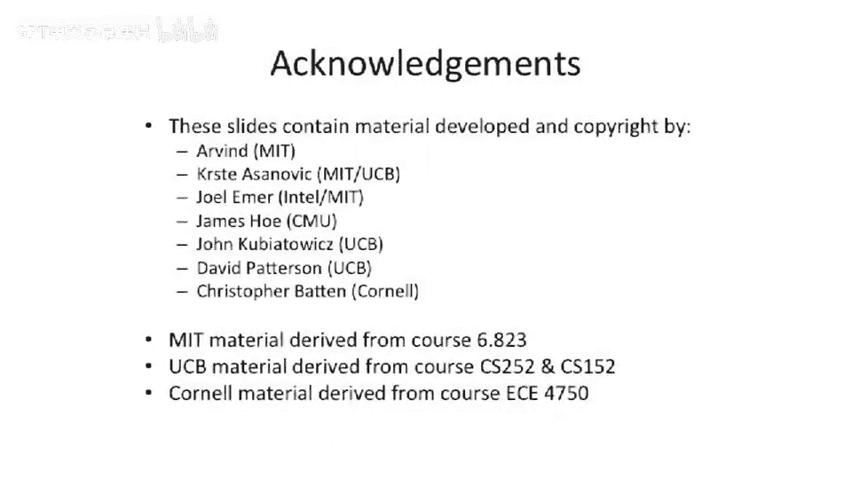

# 【计算机体系结构】普林斯顿—中英字幕 p73 72_07_vector-software-and-compiler-optimizations -BV1ii421D7WR_p73-

So there's an important aspect of all this vector work of how do you compile for this， well。

Thankfully。We actually have compilers that can do automatic vectorization。

 And one of the challenges here， if you look at this element wise multiply is you have a loop that's running in another loop that's running。

 And your compiler needs to figure out that it can merge those loops and run them at the same time。

And compilers actually have gotten pre sophisticated。 If you go look at the， the cr compiler now。

 it can basically do outer loop parallelism。 It can do certain types of parallelism with loop carried dependencies and vectorize all of this。

But it requires。Some pretty deep compiler analysis。

 This especially works well for things like fourran codes。

 where you don't have random pointers point in different places。

 C code this gets a little bit harder。So what if you don't want to execute。

The same code on all the different elements of your vector。Well。That could be a problem。

 So here we have a piece of code， which。Loops over some big vector。This is a C code。

 and it checks to see whether the value is greater than 0。And only if it's greater than 0。

 does it do this next operation。So there's been extensions to vector processors that have allowed effectively predicates。

Or mask operations on a per element basis of the vector。So。

The way you would do this is you would actually。Load the entire vector。

Set a mask register where you have one or 0， which is the result of this comparison on an element element basis。

And then do the operation。 And you can basically。Put this together with these bit by bit comparisons and have slightly different control flow。

For the different。Elements within a vector。And to sort of showing the implementation of this。

 If we looked at how to actually implement masking， one way to do it is。

You actually do every operation。So also say you're doing。Multiply your。Vectctor length is 64。

 You do all 64， but you just。Disable the right to the register file on the ones that have the mask bit turned off。

Or。You can have a much more fancy implementation， which takess out the work that doesn't have to be done。

But the control in this is is quite a bit harder。And I would say this is probably more common。

 just the simple implementation。And the， the。This is， this is harder。

 largely because if you have the resources anyway。 So if you have multiple lanes。

 it might just make sense to go execute and sort of anll the operation later。

Some other things that are pretty common in vectors is you w to have reductions。

What you mean by reduction is if let's say you have。This array。

 and you want to add all the elements in the array。Into a variable。

This is sort of a vector to scalar operation。You can't really do this on what we've discussed so far。

 You can't do a vector operation， which will actually operate in all these values and。

 and try to do something useful with it。 But what you can do。

Is you can try to do some software tricks。So one of the software tricks is you can take。

A whole vector。And instead， call it two vectors， sort of cut in the half and then overlap them and do parallel ads。

And they take the results of that， you take with someplace else in there。

 and you take those two parts and you overlap them。 you do ads。

 So you can do lots of parallel ads and effectively build a reduction operation by building a tree of ads。

So if we have our vector here， we would cut it in half。And add this part with this part。

 And then the result。Would be half the size。We cut it in half， we add this part with that part。

 And the result is half the size。 We cut it again。 we do keep doing ads So we can use our vector arithmetic to effectively do。

A reduction。So we're about out of time here。Talk about scatter gather。 This isn't that deep。

 The implementation of this can be very hard， though。A of D of I。So。We want to。

Index based off a index of the vector。This is called Gaer Scs the other direction when you're doing the store。

With a。Doubly in index of an index。And。In the instruction set in your book。

 they actually have an instruction to do this。L V I here。

 that basically does is it takes each element of vector D here indexes into vector C。

 And then that is that result。 Pro with this is， of course。

 your memory layout is not gonna be all nicely laid out in memory。

 You're gonna be sort of jumping around in memory。Let' let's stop here for today and we'll talk a little bit more about vectors and GPUs next time。

