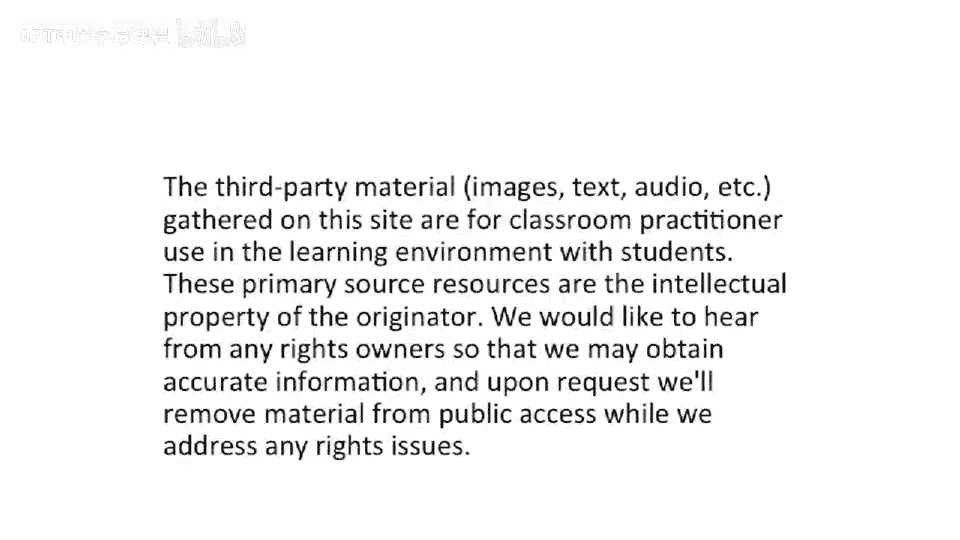

# 【计算机体系结构】普林斯顿—中英字幕 p74 73_02_reduction-scatter-gather-and-the-cray-1 -BV1ii421D7WR_p74-

Okay， so we're all here， let's get started。So we're continuing our EOE 475 experience。

 and we're going to continue on where we left off last time talking about vectors。

And vector machines。And just to recap because we went through this really fast at the end of lecture last time。

 when you have a vector computer。One of the things that you want to do or the easy thing to do is to add vectors of numbers。

But what if you want to do work inside of a vector。

 So you want to take a vector and you want to sum all the elements in the vector。

 So we call this a reduction a vector reduction。And if you're trying to do this with a vector machine。

 unless you have some special instruction， which。Looks at all the different elements。

 which is probably a bad thing to do because if you were try to do that， then you would lose all the。

Advantages of having lane structures， because you wouldn't be able to partition the elements。

Cause if you had to do a reduction， you would actually have to have， let's say。

 one A U use all of the elements from these different lanes。 And that would be， that would be sad。

 So if you want to do a reduction。One of the ways to go about doing this is actually have。

Use vectors， but use them sort of temporally。And you can use a， if you will。

 a binary tree algorithm here。To you start off with。A big， long vector。That you want to do。

The sum of all the sub partss of this。 And the first step is use cut this in half。Okay。

And you take this half of the vector and that half the vector and you add it， and you end up with。

The partial sums here， which is half the length。K again。At this half with that half。

 you can use vector instructions to do that。And I put something half the length。 continueue。

 And at some point， you end up with。A scar。Which is the sum。

So this is pretty widely used to do vector reductions。At the end of last class's lecture。

 we were also briefly touched on more interesting addressing votes。

So the vector addressing modes in lecture load loads and stores we've been talking about。

Up to this point， you could bank very well。And you could assign， let's say。

 different regions of memory。To sort of different lanes。

 And you would always be able to do a load and actually just read out from your bank that was sort of attached to a particular lane。

Well， that works well for very well structured memory aes。 But all of a sudden。

 let's say you want to do an operation where you have C of D of I。So you have a vector D。

And you want to index into that vector。 So it's a vector of addresses。

 Then you want to take or or a vector of indexes。Then you want to take that index and use that to index into C。

So this is something you commonly want to do， but you need special support for it。

 and a basic vector architecture may not have this。But you can add it and the VMPS architecture。

 which is developed in the Henessim Patterson book as this instruction here called Lo vector indirect。

Where you can actually have。Two vector registers。And the one will index into the other。

 and then you have a destination vector to register。And we call this gather。But your memory system。

 because you don't know the a priori， if you will， the addressing。

Your memory system might get pain in conflicts， and you need to be able to have all all the lanes in your vector processor be able to talk to all the memory。

That's probably a good thing to do anyway to make your machine a little bit more flexible and to allow sort of vectors that don't have to align to a particular address。

But you have to make your memory system much more complicated to be able to do these sort of。

Gather operations。 And the scatter operation is the， the inverse of this。 It would be。S VI。

 a store vector。Indirect， which would do the store where you have an indirect a store。

 So if this would be on the left hand side of an assignment operation。Okay。

 so now we get to talk about a couple examples。Or we'll touch on one example， actually。

 right now of a vector machine， and this is what I was trying to say whenever it was coming in。

 that if you're going to build a really fast computer and make it cost millions of dollars。

 you should make it look cool。So the picture on the right here is the Cray1。And。

I've had the pleasure of seeing a couple of these and sitting on a couple of these。

 And it has a nice little seat built into it。 You can actually sit down on it， and it's warm。😊。

Because this is a water cooled machine。 And it a lot of this is water cooled。

 They later went to something called floorert to cool these machines。

 The cr  one was never floorner cooled。 But the cr 2， I think， was。

 and the crate did3 definitely was。 But the the idea is that you。😊。

Use water and you can have a nice place to sit。 So the operator has a nice place to sit down while he。

 you know， he or she is working on the machine and it's heated because theres these machines are quite hot And the。

 and part of the the power supplies are actually under the bench here。😊。

The other fun thing about these is you'll notice they're shaped like letter C。For Cray。

 no one really knows if that's true。 I think actually Seymour Cray claims this to somehow make the the distance of the backplan shorter。

 but it is， it is shaped like a C and Seymour Cray， whos the the founder of Cray。Does have a C。

As the first letter of his name。 But from a little bit more from a perspective of what's actually inside of here。

The Ke1 did not actually have lots of different lanes。Instead。

 what it was it was a vector computer that。Had very long pipelines。Or long for the time pipelines。

 it had a couple pipelines for different different functional units。And。It was a register。

Register vector， register， register style machine and。Some of the， the。

 the interesting things about this is it didn't have。Any caches？And well。

 didn't have any virtual memory any of that other stuff because this was really sort of a supercomputer using this to solve some big problem。

So you didn't need all this fancy， fancy multitasking or virtualization。

 you ran one really big problem on it if you were trying to， I don't know。

 somehow model nuclear weapons or use it to crack codes or something like that。

Here's the micro architecture of the Cray1。And what you see is they have 64 vector register excuse8 vector registers with 64 elements each。

 Their vector length is 64， or the maximum vector length is 64。

And they also have a bunch of scourour registers and made a separate addressing address register bank of registers。

 and you can only do loads and stores based on these address registers。

What I was trying to get at here is you can see that they basically had。

Only one pipe for each of the different。Operations， but these pipes were relatively long。

 So to give you an idea here， something like the multiply was six cycles。

 floating point multiply took six cycles。Which？Today sounds like， well。

 things are pipeline pretty deep。 We have lots of transistors。 But， you know， it's 1976。

 there weren't that many transistors。 This thing was physically large。

 So building a pipeline that long。Took space。Or and another example here is I think the reciprocal took about 14 cycles。

 and that was pipeline。 And this did not have interlocking between the different pipe stages and didn't have to have bypassing because the vector length was so long。

So you didn't have to bypass from some place in the pipe to someplace else in the pipe。

 They did have chaining and they did have。Inter。Pipline bypassing。

 but intro pipeline bypassing wasn't really there。A couple other things。

 This machine ran really pretty fast for the days。80 MHz was I'm sure it was the fastest clock tick of of the day today。

 That sounds pretty slow， but。That was pretty good for 1976。

