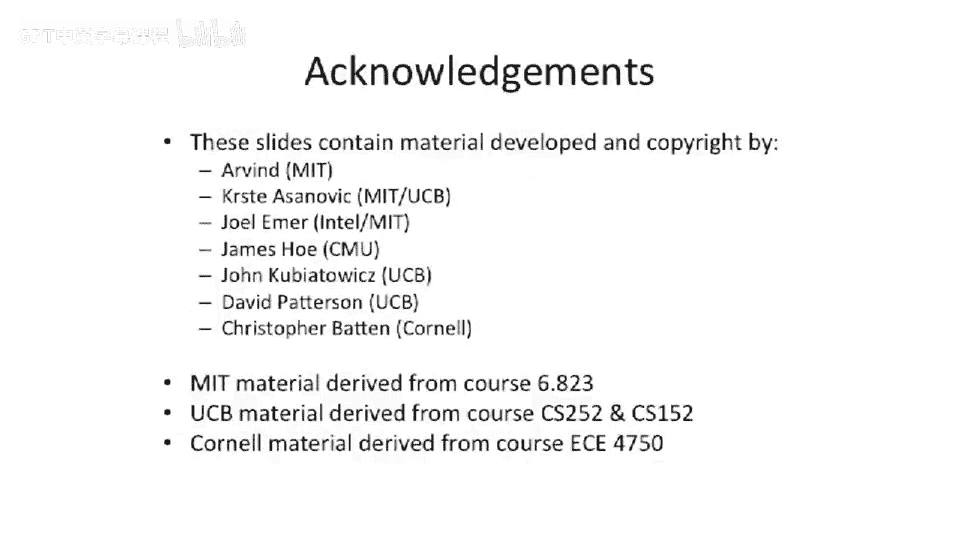

# 【计算机体系结构】普林斯顿—中英字幕 p75 74_03_simd -BV1ii421D7WR_p75-

Okay， so now we're going。Move off of vectors and talk about sort of a near cousin of vectors or how you can deal or have vector computing in your desktop today。

So this is actually a lot of this was。Done actually by Ruby Lee here at Princeton。

 She added a lot of multimedia extensions to the。HP，PA risk architecture。

 there's a couple other people involved in this， but the too was actually pretty influential to do this。

The idea here is that if you have a wide register。So if you're doing， let's say，64 B additions。

And you don't want to have to do 64 B additions or don't actually have 64 B data laying around。

 You could cut it in half and do 2，32 B operations at the same time。

 or you can use that same A L U and try to do 4，16 Bs。Or8，8 bit operations。

So this is called Sdi or single instruction， multiple data， so。

You have or short CD instructions here。Typically， the vector length is pretty short。

Or multimedia extensions。 and。You have an instruction which says， I want to do。2。

32 B ads we'll say at the same time。This is was popularized in X 86。

 at least by M M X was the first implementation of this。 And it's。

 it's sort of gone on from there to SE， SS E 2， SS C 3， S E 4， and now Intel A V X。

 And the difference is between。M M， X and all the different Ss。

Largely has to do with the length of the register and how many instructions they had。 So in A V X。

 we've gone to 256 bit registers， So wider registers。

 and it's extensible to I think 1000 B or 1024 Bs。One thing I did want to point out about this。

 which is。Interesting is this requires changes to your data path。If you have an adder。

And you have a  three， two B ad。And now you want to do eight， eight bit ads need。Cut。The carry chain。

In seven places。Now， that's if you have a basic adder。

 this gets a little more complicated if you have something like a。Proroppagate D area， Carrie。

 look ahead at her or something like that， because you may not have a simple place to go snip the carry chains。

嗯。There is still some place to cut it， but you might， your original design。

 you might propagate across where now you need to cut the boundary。

 So this this is definitely a challenge。 Also， for things like multiplies， if you want to do 8。

8 bit multiplies the structure looks a little bit different there。

 But the big insight here is you had that logic anyway。

 you're just effectively adding muxes on the carry chains。To the， the。

 the data path and some operations， you don't even need to add。 Obviously。

 if you're operating on something like。E， eight bit values， you want to do the logical or of them。

You don't need to add a special instruction for that。From a implementation perspective。

 this is what I was trying to get at here。 You， You have independent ads going on。

 They all happen in parallel。So why why do we like multimedia extensions or these vector instructions。

Or short vector instructions。And let's compare them to our big vector machines。

 So one of the major differences is that you can't control the vector length。The vector length is。

The weight， the length of the， the。Native data word or the length of the instruction set。

So or the the length of the native data type for your instruction set。And。Stried， scatter gather。

 these other operations are hard to do because typically you just have a single load in store and you use the processor's load and store instructions because the processor doesn't care。

 It's just like the same way that unary operations or logical operations don't need special instructions to do。

Shor vector or single instruction， multiple data operations。

 you don't need special instructions for CD data to be able to do loads in stores。

 you just load the data。And store the data。This is actually starting to change a little bit。

 Some of the newer versions of SSC actually do have some。Scatter， gatherer。Modifications， it's。

 it's a little bit harder if you think about， because。You can't hold a full address， if you will， in。

诶。Vectctor， so it's not like you can actually do sort of indexes of addressing。

 indexes of addresses because you can't necessarily hold the full address in there， but。In S。

 they've sort of come up with some way to do scatter and gather operations。Couple呃。

Things about having the。Vectctor register length being limited is that you can't do as much work in one operation。

So you can't necessarily do a。64 operations and one instruction。

 like we did with our vector length of 64。 So that's just justice is， is a problem。

 And and unfortunately， what happens here is you end up having to do more operations and issue more instructions。

And you're effectively increasing the bandwidth out of your fetch units。 So not。

 it's not not as good。And finally， I just want to say that processors are starting to move these multimedias extensions are starting to move a little bit towards vector processors as they add more rich instruction sets。

 So as we get to SS C 4， for instance， or S C 4。2， there's more instructions in there in X 86 that can do fancier things。

And。The vector length is even getting getting longer up to 124 bits。Or me10，24 bits。

