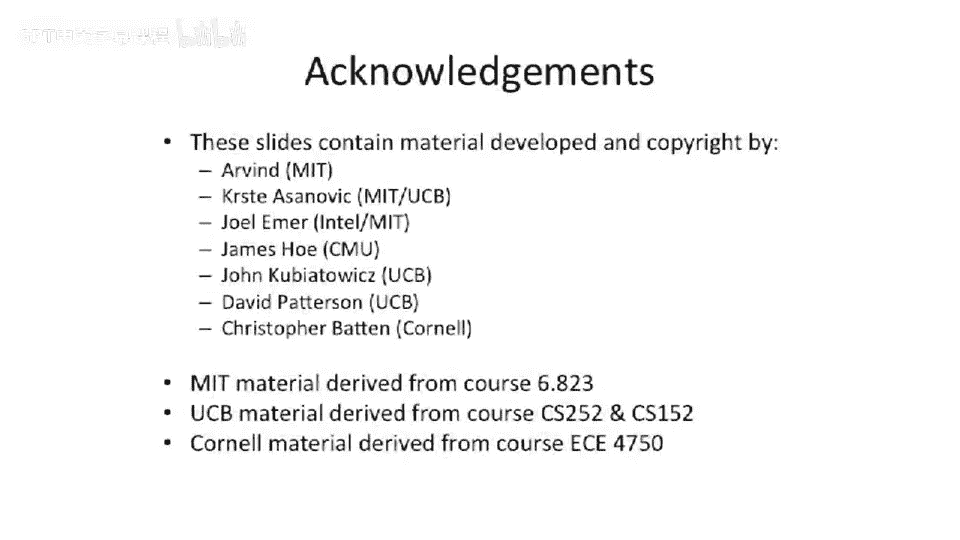

# 【计算机体系结构】普林斯顿—中英字幕 p77 76_05_multithreading-motivation -BV1ii421D7WR_p77-

Okay， so let's switch topics here。Finished our vector processors。

And we're going to start talking about technique。That's looking at how to。

Exploit different different forms of perism or thread level perism than we were looking at up to this point。

So this is not data level perism， but this is actual threat level perism or process level perism in your machine。

So what's the motivation for changing our computer architectures to run threads？Very effectively。

So we've talked about threading or multi programminggramming in the past where you time slice between different processes。

That's not what this is about。About either this is about executing multiple programs at the same time or time multiplexing between processes on the time slice of an instruction at a time。

So where this really came from is that。Sometimes you can't really extract parallelism。

In the instructional thearism。 So this is what our out of order processor is。Try to exploit。

And super scholars try to exploit。And sometimes you can't necessarily exploit data level app perism in a program because data level parallelism will say。

Doesn't necessarily work out or you don't have dense matrix sorts of codes。

 which is very easy to find data level perism。Instead。

 sometimes your workloads have thread level perism。

What we mean by threat levelablearism is that either。

There's independent sequential jobs that need to happen。 And an example of this would be。

You have to operate on a million things。But the control flow for each of those million things is wildly different。

So the most efficient way to go about doing this is just to actually have a process。Or a job per。

Work unit that you need to work on。 So a good example of this is network processing。

 You are trying to build a firewall and a packet comes in on your network card。

And your firewall wants to inspect this packet， and look for。I don't know， malicious attacks。

 when it looks for， looks wants to look for something like viruses or wants to look for attack code sequences or Trojans or or something else like that。

This isn't data level parallelism because you can't try to have。

Each of the operations working on these packets be the same thing。

 So depending on the type of packet， you're going to make wildly different control flow decisions。

 So， for instance， if the packet is。TCP versus UDP。Is is like a big choice at the beginning。

 And then is it what port is it on， Is it SSH， is it H TTP， iss it web traffic， you know。

 you're gonna to do lots of different processing in your firewall based on that decision tree。

 So typically the most efficient way to go out and try to attack this is that you actually just have a job or a process or possibly a thread per。

Data element that comes in。Another reason you might want to do this is。

There are examples of applications where you actually having parallel threads will solve the problem faster。

So believe it or not， the traditional traveling salesman problem。If you throw threads at that。

You can actually have this problem get。Super linear speedups because you can have basically other threads sort of parsing off the search tree faster。

And then the threads can share data between each other。

 And when another thread comes to a certain point， it doesn't have to recompute a certain location。

 It can just use the previous result of another thread that already got to that point and know that it doesn't have to go down a certain path。

 So this is kind of like dynamic programming， if you will。 But for some sort of large search thats。

One example is a very pooignant example of having threads。Get you super linear speed up。

But you can also just use threads to go after certain types of parallelism that are hard to get at data little parallelism also and you could actually hide latencies by using threads。

So an example of hiding latency using threads is。Let's say you have a program that you know。

 typically misses in your cache。But you have parallelism in this program， one way to attack it。

Is to cut up the problem and have a thread per different problem。 And when one of the programs。

Blocks on the cache。Switch to the other program。So while you're waiting for memory to respond back。

 you can do some useful work。Okay， so let's。Look at this from a pipeline perspective。

And look at ways to recover cycles。So here we have。Some loads。Load， load。

 something that's dependent on。 we， we have a load that's dependent on another load and the ad that's dependent on the second load。

And then finally， a store， which is dependent on the app。So the downside of doing this is。

You got all this sort of dead time， all this purple time here is dead time on the processor。

We could throw。And I before a supercalar at this。It's not going to do any better。好 yeah。So。

You're right。 if we're doing bypassing， we could pull these one cycle earlier。

 but we still have a lot of dead time。And if you were to have an out of our super scholarar。

Out of order would not actually help you out in this case， either。Because。

There's that actual dependency string through all these instructions。嗯。That's not great。So， Kim me。

Can we come up some ideas， to cope with this？ So one thing we said is we can add bypassing to。

 to decrease the time here， But having an out of our superscalear is not going to make this go faster。

So that technique doesn't work。 what other the techniques we talked about， vector processors well。

There's no vectors of data here。 We can go wide。Well that doesn't help。

 we're still going to x one instruction per cycle， so we can try to do a VLIW。

 doesn't help without of our superscale can't do it， the VLIW probably can't do it。

So we have all these dead cycles， and we want to try to recover some of these dead cycles。

