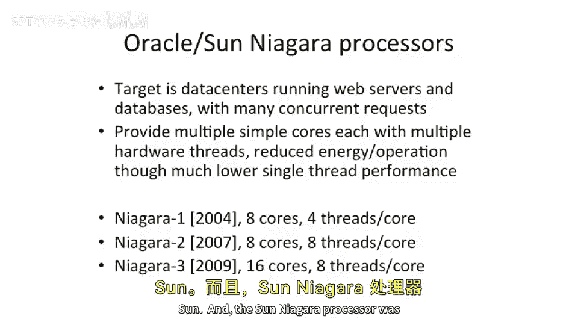

# 【计算机体系结构】普林斯顿—中英字幕 p78 77_06_coarse-grain-multithreading -BV1ii421D7WR_p78-

So the idea here is if we can guarantee。That there's no dependence between the instructions。

We can think about having。You can execute those instructions in parallel。

 And one really good way to have guaranteed independence is to have completely different programs or completely different threads。

And the naive approach here。Is。We interleave。Instructions from different threads。To cover latency。

 So we send a load out here。And while this load is off resolving in the memory system。

 this was our thread one that we had here before we did load into R1。

 And then we went to go use the result here also from thread1。Well。

 by the time the data comes back from memory， we know it's all all ready to go。 we put other work in。

Our processor pipeline， and this is called multi threading。Now。

 one of the big insights here is you need to have enough other work to do。And。

These other threads add some complexity to your processor design。And。

They may cause some locality challenges。 So if you have。

If you're trying to exploit temporal locality in， let's say， a cache or a translation。

 look aside buffer or some other buffer。And you start putting other data aes sort of in the middle here or other operations in the middle。

 this might destroy your locality。But。If let's think about this in a happy， happy wave for right now。

If you can find。Other work to do， you can just shove it in。

The slots while you're waiting for this load to come back。The most basic。Version of multithreading。

Is going to be some sort of very basic interleaving。So we run。Thread 1， then thread 2， then thread 3。

 then threadread 4， threadread 1， threadread 2， thread 3 and thread 4。

So we don't pay attention to the latencies or dependencies of the instructions when we go to schedule。

And if you come around to a thread slot and there is nothing to do。

 let's say this load missed in the cache and took 1000 cycles to come back。

 You just don't schedule anything。 you have a dead cycle there。

One of the nice things about multithing that you can take advantage of is that you don't。

Have to worry about bypassing anymore。Because if you know that you're not going to be executing。

An instruction from the same thread until a couple cycles later。

Why do you need to have a fast bypass from the ALU back to itself？You just don't care。So， you。

Let's see， do we actually have an example of that？So here's an example of this that you have a right to R1 and then a read of R1。

 What value does this thread to get here？So the first。Versions of multithing machines。

Triryed to partition the register file。So this wouldn't happen。

 so you compile pile up your programs differently。That's not really common anymore。We。

 we'll talk about an example of where they actually did that。 the， for instance， the。

That was actually also a limiter to threads for a while until sort of people came up with the idea of what you just suggested。

 which is somehow change the namespace of the registers。

 And the way that that was actually changed was。Well。

 the first implementation we'll talk about in a little bit。

 but the first implementation was on Spark actually and they used the register windows on Spark。

 which gave you different namespaces for different registers and then that finally evolved into actually having a thread identifier and having copies of the entire register space so each thread had a different register set and that's what we're going to show in this picture here。

So。As shown here， you have to copy the General Pur Reg file four times。

And you have to copy the program counter four times。And then， you have。A。

Incrementer out here in the front of the pipe， which chooses。The thread ID or the thread select。

And in our simple case here， we're just gonna keep incrementing this and choose。1，2，3，4，1，2，3，4，1，2。

3，4。 and just continually does that。 And likewise， that's an indexing into which general purpose register file we're supposed to be accessing。

Or which logical general purpose register file， because most of the architectures will actually put this together in one larger general purpose register file and then have this just be some addressing bits。

That are architecturally not， not visible。 But you pick up good points that there are a couple。

User land threading libraries out there。So it introduces this notion of threading。

 but not on a multithreaded computer architecture。 So where you don't have this and this。

 And there's still some advantages to that because you still can swap between different threads and actually try to cover memory latency because your load to use will be longer and those threading libraries largely。

 they do try to partition the。Register file space still。

 so you can actually go download one of these on。You get Linux and go run it and people still use these threading libraries to go do that these userMthread libraries。

 the other way to go do that is actually to swap out the entire register space。

 but people typically try to do that because if you're trying to define fine grain interleaving and you want to save your entire register space to memory。

 that's very expensive。But the， the， these thread libraries sort of work together with the compiler and telecompilr don't。

Don't use all the registers for threadhread one， use half the registers for threadh one and half the registers。

 let's say for T2。So this is our simple multitrain pipeline。Thatly small changes so far。呃。

Replate the register file， replicate the PC。And this can help us recover。Utilization on our ALU。

 for instance。And one thing I wanted to point out that to software。

 what this looks like is it looks like multiple processors。

So if you go use something like a modern day core I7。Those have two hardware threads。

But when you go to look at it， it'll look like there's twice as many cores in the machine than you think there are。

 So， for instance， if you have a four corere core I 7 and you open in Windows， the little。

See process management， sort of dialog box。You'll see that there's eight little bars in there。

Because there's one thread or one virtual processor。

 or to be two virtual processors per physical core in the machine。

So they actually look like there's multiple。Slower CPUs。Okay， so what are the costs， the easy costs。

Under replicating the program counter。And the journal Purpose Regs。

Things that start to become harder to replicate， but you're going to have to replicate also is if you want to do full isolation of these CPUs is you're going to have to have replication of。

System state。 So things like page tables， things like page table based registers。

 all the different system state about where the inter handler is， So things like the exceptional PC。

And this actually gets a little bit hard to do。 And some processors have a fair amount of system states。

 If you look at X86， there's a lot of system state。

 MIPS is relatively minimal because there're sort of exceptional PC and the interrupt mask register。

But。It can be hard and。Because the TOB software maintains you don't even have one of these。

 you don't even have a virtual memory page table based register。

So this is something to think about is that you have to replicate all this state per threat。

So there's some cost to it， but you still get to hide latencies to memory。

 You still get to reuse AUs and increase the efficiency of your AluUs。Personally。

 I think these are the smaller， smaller things。So this is very small。 This is smaller。

 It's bigger than the first one， but harder to do。The big things out there。

Orre when you start to have temporal locality conflicts？And spatial locality conflicts。

So if you have four threads。That are all executing。And they're fighting for space。

 they're fighting for capacity in your cache。 This can be a problem。

Or let's say you have 16 hardware threads and you have an eight way set associative cache。

And they always want to access， let's say。Index zero in the cache， it is that common thing。

 your stack always starts there or something like that。Well， you only have eight ways sociivity。

 And if you're time multixing thread 1，2，3，4，5，6，7，8，9，10，11，12，13，14，15，16。

 and then you hoop back around to one。You're guaranteed by the time you come back to one。

Because you only have an eightway set associative cache that you've bumped out the data that you needed。

 So you get no temporal locality。 By the time you come back， it's not in your cache。

 So you had a conflict， you'll have a conflict miss going on there in your cache。 Okay。

 so this is the negative side is that they can conflict of each other。

 But if two threads are working together。You can actually get positive cash interference or。

Positive interference or constructive interference in the cache。 And that definitely happens。

 And that was actually one of the reasons that people originally did this multithing was that if you have a program where you have different threads that are working on roughly the same data。

This is actually， very good because they'll be prefeting data for each other。

But you have to make sure it's a fine line to sort of walk there。

When do the threads fight for shared resources and when do they。诶。

Collaborate on pulling in the shared resources and exploit the locality structures in the processor。

 So the the cache is one example。 Another example is translation， look inside buffer entries。

One solution to this is you can actually partition the cache or partition the TLB。

And then you can guarantee that you do not fight。 Unfortunately。

 if you go to do this and you have a fixed size cash。You effectively cut the cache。

 let's say in half or however many threads by n by n threads。

 So typically people don't try to statically partition these things but。

You could think about doing that if you want no interference between the different threads。Okay。

 so let's look at a couple different。Ways that you can try to schedule threads。And they've gone from。

Simple to a little more complicated， even more complicated over time。

So simple as what we've been talking about to this point is that there is some fixed interleaving of N hardware threads。

And you basically execute one instruction from each thread and then change the next thread。

So that was our first case。 So This is a fixed interleaving。Dates back to the 60s。 And this is。

Pretty simple。 What's nice about this is you can remove。

Some of the interlocking and some of the bypassing from your processor。

Next thing you can think about is。Well。You can try to allocate。Different locations in your。

Scheduling quantum to different threats。 So， for instance。We know that the。Syan thread here。

Is the highest priority threat and needs the most number of slots。

So we can do an uneven distribution and we can say。Overarch。Slots here。

 we can actually interleave and say， well， the can thread gets。Every other one will say。

And then we can say， let's say， the orange one gets。

A smaller percentage and the blue  one gets a smaller percentage。

 So it's still a fixed interleaving to some extent。Or fixed ordering， but。It is。

Controrollable by software， depending or the operating system。

 depending on the priorities of the different threats。

So it's a little bit more flexible in hardware than the completely fixed interlea design。

 and this does require a little bit of change here because you can't just have。

This counter here just sort of incrementing your thread I D。 Instead。

 you need to have something else here， which sort of is， is a picker for which thread to go execute。

But still relatively simple。And because it's software programmable。

 you can actually choose a time and then reallocate so the O S can change the allocation for a different time here。

 And let's say， make orange。Higher priority instead of the can。

Then we start to go something a little more complicated。

 So this is still what else we fixed priorities。 You can think about something where you actually have。

The hardware。Making decisions about which one to go execute。

And you could actually even have it go as far as， let's say。Determining if you're executing a thread。

 which then has a long laency operation， it'll switch to another thread at that point。

So try to fill in backfill work from other threads purposely when one thread gets swapped out。

Or one s thread goes to do something that's long lane inency operation。

And you can think about designs like that。 And that is something like the。HeEP processor。

 which we'll be talking about in a minute or two。Ha it was one of the first early examples of that。

So just to recap here， we're going to call this。Carse grain， multi thread。

The reason we're calling it coarse grain is because。For any ones cycle。Only one thread is running。

You might scratch your head ahead and say， how do you have multiple threads running in one1 cycle？

 Well， we'll show if you go to a supercalar or multi issue processor。

You could think about having the different pipelines。

 executing instructions from different threads simultaneously。

That's called simultaneous multi training。 and we'll talk about that in a second。

But in our core grain approach here， just， to recap， you can swap threads on harbor misses。And。

You can take advantage of bubbles in the processor to do other work。Okay。

 so a little bit of a history lesson here。HeP processor。Was Bton Smith， who's now Microsoft research。

He was the chief architect of this。Back in the 80s。

 And this processor is actually pretty interesting because。There was lots and lots of threads。

And a small number of processors。 So there was 120 threads in this machine。Per processor。

Relatively modest clock rate for the 80s。But what they were trying to do here is they were trying to。

Deal with memory latency。So this machine had a very high bandwidth。Memory system。

And what would happen is。Effectively， you were allowed to have a load or store every instruction。

 and your performance would never degrade if you had a load and a store every instruction。

Because in this machine， they had 120 threads per processor。

 and the memory laency was less than 120 cycles。So if you had to load every instruction。

And you have enough bandwidth to be able to feed all those loads。

 You could execute a load from each different thread。

 And none of them are each thread was independent of each other。

 You could basically go out to the memory system。 wait the laency。

 have it come back and pipeline the， the latency out to memory， pipeline the memory access。

And by time you were to come back and execute the next instruction from that thread。

 which would be 120 cycles later， the memory result would be there。

So this insight was carried forward。 Burden went and started this company called Terra。

Or terroristce systems， which later went on to buy Cray。Strangely enough。Cause。I always thought。

Cray was a beer company in Terra。 and it definitely was。 But we'll call it a merger。

 But I think that's what they call that。 But in reality， Tara acquired Cray。

And Tara had a similar sort of idea here。More processors， this was sort of。

Further evolution of the hep processor。128 active threads per processor， lots of processors。

 256 processors， so lots of active programs。 So you had to find enough thread level perilism in in your program。

And this architecture has， no caches。Because they don't need it。

If you have enough bandwidth to your memory system， you can have a load every cycle。

And you can cover the laency with other threads。WWhy do you care？So some。

 some interesting things about this is this may not be good for power。You are not exploiting。

Loocality in your data references at all。 And you're going out to the memory system every cycle。

And that could be far away， and it was far away in this machine。So that's， you。

 to be a little careful about these machines。 And then the second idea here is you have to come up with lots of threads。

Now we're talking about having similar numbers of threads in something like modern day。

 many core machines。But， there's still。A fair number of threads to be able to effectively use the machine。

To its best performance。I wanted to say about this， actually。

 this architecture where it got mostly used was in applications that had no locality anyway。Or no。

Temporal or spatial locality in their data references anyway。

 And good examples of this were things like data mining。Huge data sets。

 arbitrary access to the data sets。Not you couldn't have a prefecher predict where your next memory reference is going to be。

 So if you were just going basically not going to be able to effectively fit in a cache or use a cache anyway。

 remove the cache and go multi threadreaded。What the idea behind these machines？

And they actually saw some。Big speed ups for applications that had data sets like that。

This still actually lives on today in the Cray XMT。The extreme multi threaded architecture。And。

You can go buy this machine from what's nowadays called Cray Comp Corp。

 which was Terra eating Cray or buying Cray。And。It's minus clock speed by modern day standards。

 It's only 500 MHz， but they can intermix these with sort of optronons and other processors because they standardized on the AMD bus protocols you can plug in。

AM D chips and these。XMT chips in the same system。Just a。

Recap here of like what their memory system looked like。Their instruction pipelines were very long。

 and they didn't have to bypass because you could never execute instruction and a subsequent instruction。

 which would use the results。And the memory operations， the memory latencies。呃。Were about 150 cycles。

 and they had 128 threads。 So the probability they were typically not waiting for their memory system。

 and they could effectively pipeline their memory operations。Another little tidbit of history here。

 So this is the machine I was talking about that。Is。My academic lineage a little bit here。

When I first showed up at MI T， there was this machine in the corner called the MIT Lwayve processor。

 which was a。Multi processor machine。 It went up to 128 nodes， which was a lot at in 1990。

And one of the， the little tidbits about this machine is they had spark processors。

 and a spark processor had this notion of a register window。

What a register window is is every time you do a system call。

You basically change your addressing into the register file。

 so there's a larger register file and you have a smaller window under the register file and you kind of slide this window across the register file on function calls and function returns。

And the MIT Lwife processor used this， and they extended this register window idea such that they could have a special instruction which would actually change how much the register file they were looking at at a time so so they could actually swap the entire register file。

Very quickly。And this actually allowed them to multi threadread。Very effectively with four threads。

 And this was one of the early multi threaded processors。

 And they introduced this notion of thread switch on remote memory access。So， if you had。

A memory access that had to go to one of the other nodes in this machine。

 So if you were on this node here and you had to go down to this one and you had to send a message over there in a multi processor notion。

You actually had to send a message and get a response back。 It took a long time。

So you would actually switch threads at that time。Multi training lives on today。

 especially this and this course green multi training lives on today。

 A good example of this is the oracle and what used to be sun。 and before that， afra。

Niara processors， Afo was the name of the。St a company that made this and then Sun acquired them and then Oracle acquired son。

And the Sun Niagara processorors was designed for throughput computing。

Such that you can have。Lots of。Threads running， and they were all independent。

 and it was a multi threaded processor。So the Niagara  one had eight cores and then four threads per core and。

Turn that up over time。 So nowadays， the Niagara 3。So this is what was called the Sun T1。

This was the sun T 2。 This is the sun T 3。 Now， they have 16 cores where they have 8 threads per core。

 a lot of。Pilism going on here。 And this course screen multi threateninging goes on。

 So here's our dive photo of the Niagara 3 processor。 You can see。The different cores。

 you might look in this picture and say。There's what looks to be 16 cores。

And I say 16 cores on the slide here， but one of the interesting things is they actually sort of conjoin two cores together internally。

So it's a strange sort of design idea that they do is that they they mix the threads and the cores together and they share。

 I think it was a floating point unit between the two cores。 So these two cores are to some extent。

 conjoin cores together。

