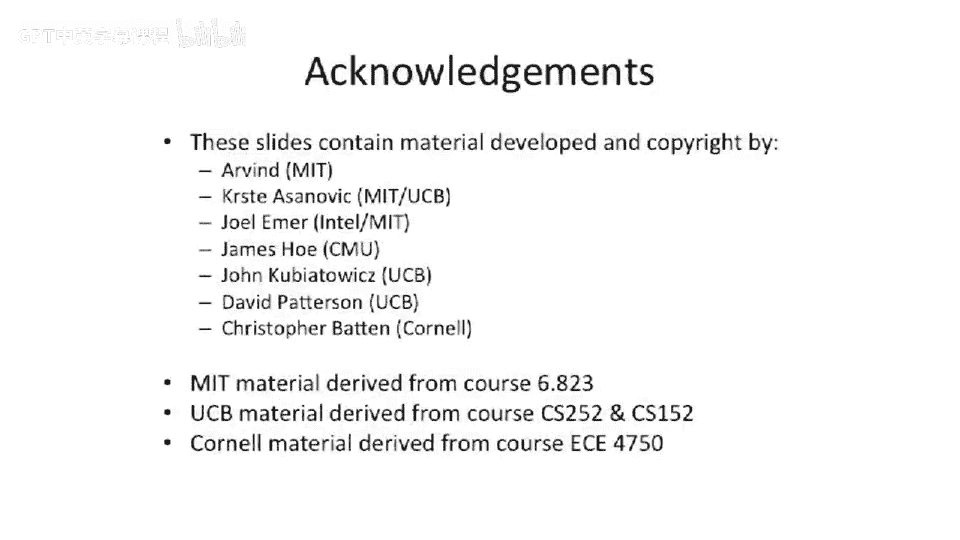

# 【计算机体系结构】普林斯顿—中英字幕 p79 78_07_simultaneous-multithreading -BV1ii421D7WR_p79-

Okay。That was coursese green multi thread。We're going to move on to。

Figuring out how to mix instructions of different threads。In the pipeline。

At the same time and mix them in the same and issue two different threads instructions at the same time to different pyths。

So the idea here， this is called simultaneous multithing。 And actually。

 let me start off of a picture of what this looks like。

 It'll let's work backwards in the slide deck here for a second。So we have a four issue processor。

This is our issue with， and this is time increasing going down。

Each of the different patterns represents a different thread。

And the idea here in simultaneous multi spreading is that you can execute。

Instructions from different threads。Into different pipelines simultaneously。Now。

 this gets quite a bit harder。Then this basic design here， because now we actually have to。

Read from the register file。4 different threads simultaneously。 And we have to fetch。

Different code from different program counters simultaneously in this processor。

So simultaneouslyimultaneous multi threading， where it came out of was people were building complex out ofor supercals。

And these complex aivvo superscales had all this logic。To be able to track。

Different dependencies between different instructions and to basically restart sub portions of instruction sequences。

 So this is like you take a branch mis predictict。 You had to kill all of the instructions that were dependent on the branch misprodict and leave other ones that were not there alone。

And when you have this out of order mechanism， you have all this extra logic there to figure that out。

Dean Tulson， Susan Eers， Jim Levy came up with this idea that。Well。

What if we try to utilize all the dead slots in our autoivvore superscalear。

 but intermix different threads in there simultaneously to fill the time。

 So they did this study back from Isca 95。And。We read a bunch of different applications in this。

Right most bar here is our composite or our average here。

And what you should figure out from this is this black bar in the bottom here is how long the processor is busy。

 actually doing work。 And the rest of this is different reasons the processor was stalled。

 So we are installed on instruction cache misses， branch mis predictiondictions， load delays。

 just pipeline interlocking， memory conflicts， other other sorts of things。And。

We were really using this processor less than 20% of the time。So to show this a different way。

We have our multi issue processor， we have time here。 We have all these purple boxes。

 which are just dead， dead time。And we might be able to use subsets。 you know， this is very good。

 We actually issued four instructions in this cycle。 but here we only issued two。 here we issued one。

 here we issued two to these two pipelines in the middle。 Maybe these the two ALU pipes。

 and there's like a load pipe here and a branch pipe there or something like that。

This is kind of a disaster from an IPC perspective， can we try to reuse that hardware？

And we had talked about our coarse grain multi threading。

 which was effectively temporal slicing up the cycles here。So you run one thread。

 switch your different thread， run a different thread。

 and you could temporarilyly switch between the threads。But what would happen in another approach。

 And this is actually done in the。Feled sun。Millennium processor， what was going to be Utrapark5。The。

 they had this idea that they actually had a clustered V I W see a clustered supercalar。

And they had a mode。 You could flip a bit， and you could basically cut the two clusters separately and run them as two separate processors or two separate threads。

So you can actually decrease。 let's say you had this。With four processor。 And instead。

 you split it in half。And you have。2 functional units running one thread，2 functional units。

 running another thread。Well， this has some good effects。You don't actually have to have。Really high。

IPC。Or really high instructions per clock， you don't ever have to reach four。In this design。

 because we've narrowed the two pipeline widths。And you could think about trying to put them together。

 This is what the millennium processor， the Ultrapark 5 tried to do is you could actually switch between。

This mode and this mode。But。You still have a lot of open slots here that you can't go use。

So still leave some vertical waste。Another downside to this was you can't have one thread using。

All of the resources very easily here in this mode。 you can have， let's say。

 thread1 use this functional unit over here in this very static design。

So this brings us to full simultaneous multi threading， or SMT。And in SMT。

 we were able to mix and match all these different instructions。

But this is going to change our processor pipeline quite a bit。Okay， so let's， let's look at。

What this does to a processor pipeline。Well。All of a sudden。

 we need to be fetching multiple instructions at a time。That's。

That's definitely a harder thing to do here。From different threads。Conveniently。

 we can actually use our instruction queue or our reservation stations， if you will。

 to go find different。Instructions to go execute at the issue stage of our outer border processor。

So what we can do is we can tag。The different threads independently。

 And they have that be part of the instruction。Issue logic。

Such that you can't issue or you know that thread1， Reg  one is different than thread2 Reg 1。

And then you use the same logic that we've had in our Aivvore superss。

In our issue queue or to go find different instructions from multiple threads to go stick down the pipe。

Or the respective multiple pipes。And conveniently， we have most of this logic already。

And what's also nice about this is if you're only running one thread at a time。

When you go to look in your instruction queue or your issue window。

That only that one thread will show up。So you can know that you don't need to go look around to other threads and you can use the full machine。

And this allows you to use the same machine， such that if you have lots of parallelism。

You can run different threads and fill all the different slots。

And then if you don't have the parallelism and you want to exploit instruction level parallelism。

 you can use the slots in different allocation and just have the dead slots， the purple slots。

And you can see here。Here we are issuing three instructions from the checkered bore Blue。

 And here we're issuing four， well。Let's say it's the exact same program executing on the same cycle。

 You could actually have the machine such that it'll issue different amounts of perilism。

 of instruction level perism from a thread。Depending on if there's multiple threads running。

And this is what these truly multi thread machines， simultaneous multi thread machines attempt to do。

See this's one other point I wanted to make here。You have to worry。

When you're doing this simultaneous multi running here。About priorities between threads。

Because you want to make sure that they you have some sort of equal progress guarantee or some and round Robins probably not good enough。

So you need to somehow figure out。How do not have one thread hog the machine and have some。

 some fairness between the different threats。So I wanted to show a few examples here。

 So here we have on the top， we have the power for。IBM Power 4 processor pipeline。

 And this was a non multi threading machine。And the power 5 architecture actually looks very similar to the power 4 architecture。

 except they added。A second hardware thread。So what they had to do here is they actually had to。Add。

More fetch。Bandth。And then， they headed。This notion of group formation。

And this group formation was the picking out of the two threads。

So they could figure out what they could actually execute simultaneously at the same time。

And they effectively had extra pipe stages out in front to go do that。And at the ends here。

 you have to commit two different program counters at the same time。

 You can see there's definitely some complexity in building this that all of a sudden。

You have to be able to basically， in your reorder buffer， kill a subth。

 what it branch mis predictdts， but not the rest of it。

 And we already have talked about how to do that in a super sc。 we can。Kill a sub。

 a subsection of the instructions。 then't have to kill the whole instruction sequence。

Here's a different view of the， the power for。And a physical chip。View here， and。

One of the interesting things to see is that they won have two threads because they went't to four threads。

They figured out that they would actually be using the resources too much and be bottlenecking in different locations of the pipe。

 It was basically。They didn't have enough resources sort of over here to have it be filled。

 It would be filled if you had more than two threads executing on this anyway。

 So there was no sort sort of diminishing returns past that point。We're almost done。

 but I think we're out of time。 Let's。Actually， before we do that， let me skip forward here。

And just summarize with all the different。Types of multithing。You have your superscale processor。

You have your。Very， very fine grain， multi thread。 where you're doing it on each cycle。

 you have this coarse grain， coarser grain， where you sort of。Do it every few cycles。

You can think about cutting the processor in half and using some of the functioning units for one。

Thread and some of for another thread。 And then we have our full simultaneous multi thread。So we'll。

 we'll pick up on this next time and， and。Finish up about some of the implementations of the penium  for and how they did multi training。

But we'll stop here for today。

