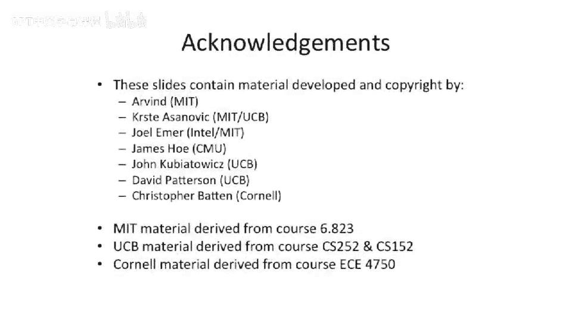

# 【计算机体系结构】普林斯顿—中英字幕 p80 79_02_smt-implementation -BV1ii421D7WR_p80-

We left off last time。Talking about some implementation issues around multi training。

So a little bit of background on what we're doing today is we're going to be finishing up multiread。

We're going to be using cutlery， and you'll see why we're using cutlery in a minute。That's right。

Whole box of forks。And we'll be talking about synchronization。And synchronization primitives。

So let's， let's go back to multi threatening。And look at。The actual simultaneous multith。

 which is where we left off。So just to recap。We talked about different types of multi threatening。

We talked about。Not multi threaded processors。 So you have a super scour。

 We're trying to fill in the empty slots here。So we can do some fine grain。

 but not the simultaneous multi throwing。We can do。Carse grain， multi threading。

You can even possibly think about trying to do this in some fast software layer。

You could think about just cutting your processor in half and using half your A use for one thread and half your a use for another thread。

 That is sort of technically a version of multi threading。It's just not executing。 Well。

 it is executing at the same time， but it's。Not necessarily using all the resources。

And then you can think about actual simultaneous multi throwing， where you're issuing instructions。

From different threads。Into different functional units， at the same time。

So we talked about this last time。 And we， one of the things that came up was。

How do you go about getting at perism so。If you have thread level parallelism。

 you can mix and match different instruction slots from different threads and get parallelism that way。

And one of the great things about simultaneous multithing is that if you have。

A fast superscale machine。 And you try to use it for simultaneous multith。

 You could think about trying to reduce the number of threads if you don't have enough thread level perism and actually go at instruction level perism。

So here we see this blue Cross hatched。Blocks or instructions。

 And this is the same thread running in the same sort of time period。

 And if you have lots of threads running， you could actually intermix the different threads and run the blue cross has threads slower than if you were to try to use parallel resources to run。

One thread faster。 And this is one of the big insights here that symmetric multi threading lets us go after。

So we briefly talked and flew through this at the end of lecture last time。

 as we talked about what is the cost of implementing symmetric multith。So。Conveniently。

 there is actually a really good example of this。 The power 4 by IBM and the power 5 by I IBM。

 They're very similar architectures。Except the power 5 has two a simultaneous multi string。

 and the power 4 is almost the same architecture without two a symmetric multi string。

So you look at these two pictures。 One of the big things they added is they added more fetch bandwidth to fetch from two different program counters at the same time。

You can decode more instructions， and then they add an extra pipe stage in here， which they。

 they do what we call what they call group formation。

 which is basically the scheduling of the two different threads instructions together。

By the time that reaches the execution units。Also over here， they as， as we talked about before。

 even without symmetric multi training， it's pretty useful to have。

More registers or more physical registers， Regs and more architectural registers。

 you're minimally gonna to need more architectural registers。

 More physical registers probably is a good performance thing。So。

We're talking about implementation details。 So one of the questions that comes up is。

 what is the cost of actually going to implement this symmetric multi thread on this processor。

And one of the questions that also comes up here is why two threads instead of four threads or eight threads。

 or more threads。It has cost。That's one of the things is that they would actually have to start replicating more data structures。

For the pipeline that had roughly left over from the penny， excuse me， the power 4。They had enough。

Compute and bandwidth through their execution units to be able to handle two threads。

 But if they wanted to try to go to more threads， they basically would bottleneck somewhere in their architectures。

嗯。I don't completely know exactly where they bottle next， but they。They。

 the the paper talks about this basically says they bottleneck。Somewhere in their execution years。

 they kind of leave it a little vague。So they decided that it wasn't worth adding more in two threads because it's not gonna to give you any performance increase unless you have。

Threads that don't have。Or or threads that have a lot of stalls。

 If you have threads of enough stalls， you could probably have enough holes to try to intermix another thread in there。

So some of the changes in the hardware work they went about doing。 Well。

 they actually increased their cash size。They increase the sociivity of their caches。

 their last level cash year， they went。To 1。92 megabytes versus。1。44。

Of their L2 and their L 3 together， sorry。And you can see here。

 one of the interesting things is they start to actually separate data structures。

Because if you have multiple threads running and you try to mix them all into one big。Data structure。

 one of the problems or one big hardware data structure。

 One of the problems that comes up is maybe one of the threads is going to hog the data structure。So。

Threadating actually issues a lot of complexity， having to do with figuring out how to be fair in the usage of the structures。

So one solution is you just replicate。 So anywhere there was it was hard to get it right or hard to have。

 They had a lot of conflicts。 You could just replicate。 So they added a separate instruction fetch。

Prefech and buffering。 And then they added more。They call them virtual registers here。

 but it's more physical registers effectively。 So more places to schedule into。

 So there wasn' an added hardware cost to this。And to give you an idea of sort of area。

24% area improvement increase。 A lot of this is just due to the cache because they made their cash so much larger。

So， you have to。Ask yourself， does it make sense to use it 24% more area to run two threads。

 Or what point does it make sense is to plop down a second processor。It's a tough trade there。 Well。

 if it's 24% bigger and you get a  two X performance boost， it was a good trade。

 If it was 24% bigger and you get less than a 24% performance boost。It's pretty questionable。

 So let's look at another example。 and we'll wrap up with the performance of this and see if they did get their 24% performance boost。

The first implementation of symmetric multi threading。

 There's been many implementations of multi threading， but excuse me symmetric。

 Simultaneous multi threading was the pentium4 processor。Now， they called it hyperthing。That's a。

Intel marketing term， it is simultaneous multi running。But。Depending on4。

 they didn't actually replicate very many structures。

And they didn't really change the processor very much。In fact。

 there's basically modes to turn off simultaneous multi spraying in the penny before。

 And it was not a flagship feature when the processor was first shipped。So the， the。

 the basic idea in the， the pending  for， the， the little bit of extra hardware they added was。

They did duplicate some， some resources here。 So overall， they。

 they increased their dia areaea by about 5%。So it was very， very small amount。 Now the question is。

 what is the performance boost they could get from this。嗯。And。

One of the interesting things here is that。There was a big problem that started to come up with a pain for that when you were trying to run one thread on it。

Well， you weren't guaranteed that the performance of that one thread would be equal to if you turned off hyperth or sorry。

 symmetric simultaneous multith。So they had a mode switch。

 They could turn off where they would take some structures that they would partition when they were in multi threading mode。

And partition them 50，50。So they didn't have deadlock problems。

 and they didn't have resource contention problems on these shared structures。

And when you turn this mode switch off。Some programs got faster。To some extent。

 what that meant is they didn't size those structures correctly to be running。

In multi threading mode at all times。 And the switch was not a little switch。

 It was like a big switch。 You had to reboot your computer to change the switch。 It was。

 It was a boot time parameter parameter to the chip。And this left such a bad taste in Intel's mouth。

 that。Simultaneous multi threatening got kicked out of Intel land for few generations the。Penny M M。

 core duo， core 2 duo all kicked out simultaneous multi threatening and didn't work its way back in until Nahalam。

 core。I5， I 7 sort of processors very recently。So it's interesting to see that。

You can use a little bit of hardware。We had to be careful。 Now， what was。

 what was the biggest problem that they had here。The， the biggest problem was that。

The load store queue on the penium 4。Was。Split in half。One they were ring in two thread mode。So。

 the first。Ping for architecture that was shipped。It had a symmetric or simultaneouslyimultaneous multi thread turned on。

 They just split the structure in half。And it didn't have enough bandwidth。For lots of programs。

 or didn't have enough entries in there。 lots of programs when it was cut in half。

 So it was sized to run one thread。They cut it in half statically。

 And when they tried to run two threads， it was effectively。Not providing enough performance。

 So they couldn't get enough loads out to the memory system from one thread when they cut that structure in half。

So it really starts to bring up the question of what is the right allocation of resources。

And should you use some sort of round Robbin scheme， Should you use dynamic allocation。

 Should you use static allocation， Should you replicate， if you replicate a cost more area， this is。

 is these are some of the big challenges here。Okay， so let's look at the。

 the some of the performance here， the。The numbers were pretty abysmal for the penium 4， even when。

Everything was going well。 So example here， penium 4。

 extreme addition with simultaneous multi threading give you 1% speed up when you're writing two threads for second。

Rate， so be running multiple copies of the same program， that's how spec rate is done。

That was the integer  one。 for the floating point1， it did a little bit better。7% improvement。Now。

 that's not horrible。 considering it was only a 5% area。Improvement or area increase。But still。

 that's， that's not saying a whole lot。 I mean， you have to question if that is really。

 this whole complex level complexity was worth it。And was that 5% area that could have been used for something else to get a few percent performance increase。

 And this was， to some extent， pre typicalp across applications for the penny 4。One of the。

 the interesting。Things about the， the， the penium 4 was。Because the cache wasn't huge。

 especially the L1 cache was relatively small because they wanted it to operate so fast at their very high clock frequencies。

You can get a lot of data pollution in there from the two threads。

 and they would actually destructively interfere in your level  one cache， so。

That was one of the big things they had to try to make up was this is a problem with any multi threading。

 not just simultaneous multi threading is you can actually fight for space in the cache。

And end up with both capacity and conflict misses。The power 5 did a lot better here。 You know。

 it was they， they thought a little bit harder about sharing structures。

 duplicateating structures and allocation of different resources in there。 So， on spec。

 the specant rates， they were getting 23% improvement for the 25% area。Okay， well， this。

 this might actually be a good idea。 It might have some， some value。

And for the floating point version， there were。Not doing great， but but doing better here。And。The。

 the floatinging point apps had a lot of cache conflicts。 So the floatinging point spec F P apps。

 If you go look at them on the inside。They typically have very large data sets。

 So they were basically conflicting in their large， larger last level caches and things like that。

So finally， I wanted to just。Give a little bit of。Color to this idea of picking fairly。

And not having starvation in different resources in a simultaneous multi threading pipeline。

So one processor that's sort of a famous。Simultaneous multiting processor that was never built。

Was the。E V 8。Or the Digital equipmentpment Corporation last Alpha that was never built。

So this last alpha， the E V8 are also known as the。21，464。呃。Had introduced。

They had8 way threaded processors。 this was never， never built。

 but it was out of superscale that had8 way，8 way。Simultaneous multi threading。 It also was。

A very aggressive processor。 And when I say it was never built， it was never shipped commercially。

 They， they went pretty far on the design of it。So one of the， the questions they。

Realized upon here is。What is the right way？In out of order pipeline to make sure that you're getting correct utilization of the pipeline。

When you're isuing instructions from different threats。So in this example here。

We have four different threads， we'll say。And you need to choose to go into your multi issue out of order pipeline here。

 Which thread to go pick from。And by definition， you want to try to fill in。

The holes of one of the threads with work from another thread。

So complete fairness here or lockstep around Robin choosing， for instance。

 is not what you want to do。Completely the wrong thing to do because you want to fill in when one processor is stalled with other processors work。

But you want to make sure that the。Thread， which let's say， has no dependencies on each other。

Or could run very fast。 doesn't go to memory very often。 We'll say just doesn't stall very often。

 doesn't just hog the processor。Because it's never going to introduce stall cycles on itself by itself。

So they came up with this idea called I count。And it was a choosing policy。

 which basically looked at the number of instructions that were retiring out of the back of the pipeline。

 had like a moving window to try to estimate how many instructions from each thread we were completing and then feedback around the front of the pipeline here。

To determine where to issue from。So I just wanted to get across the idea that if you try to intermix different threads in a data structure。

 it's relatively simple。 You cut the data structure in half or have some Robbin allocation in there。

 It gets much more complicated when you full processor pipeline that you need to figure out how to issue into that processor pipeline and then you know。

20 stages later， something happens。 There's so much stuff in flight that you need to need to worry about this a little bit harder。

 So here they， they basically were looking at how many instructions were in flight。

 And how many instructions had recently committed from a threat。To determine what to do。

 And on average， they were hoping that they had some fairness between the threats。

