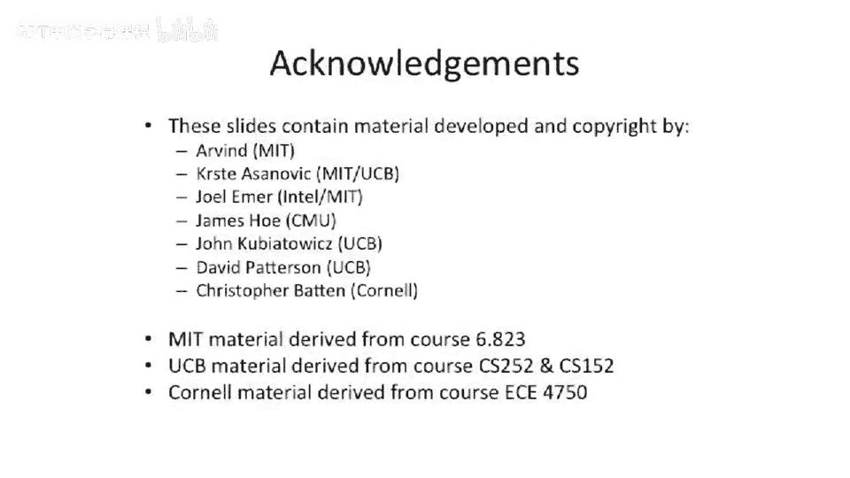

# 【计算机体系结构】普林斯顿—中英字幕 p81 80_03_introduction-to-parallelism -BV1ii421D7WR_p81-

Okay， so we're today we're talking about perilism and synchronization。

From a parallel parallelization perspective， we're worried here about parallel programming and how to build computer architectures that can run。

Simultaneously， multiple programs or multiple threads within one program。And today。

 we're going to talk about some models of that synchronization and some primitives that help you solve it。

 like synchronization primitives and memory fences。

This is a little bit of background and motivation for nowadays why we're going to multiple processors。

 so。We're going to show here Moore's law， plotted on a log plot。

Number of transistors going up exponentially。Our sequential performance has sort of gone up and then sort of stopped at this point。

 If you go look at the new core I 7 or something like that， it's kind of flattened out here。

 It isn't continuing to go up。And in fact， the numbers that they actually publish for sequential spec in are actually parallel numbers these days because they're using multiple cores to make specin and spec FP go a little bit faster。

And clock frequency。Has also flying out。 We didn't get to our 10 gigHz processor。And largely。

 that is due to us hitting。Some power challenges here。

 But its also just incredibly hard to go design these very high frequency processors。 So instead。

We started to use these more and more transistors to implement multiple cores。

So we started off with two cores and then four cores。 And， you know， we've。

 we've gone out from there。 Intel I think is now selling a8 core part。

 And there are 10 core parts coming out soon。 A D has a 16 core part。

 but it's not a true 16 core part。 I think it's28 cores that are glued together on， on a chip。

And there's some other reader stuff up here， some actual many cores。

 multi core processors with more cores。But people did multi processorory。

 built multi processorcesors before the multi core revolution here。Back in these days。

 there were multi。Processor systems。You could take multiple chips and put them together somehow into small systems or large systems。

 And for the rest rest of class between now and the end the term。

 we're gonna be talking about parallel computing systems。

 Both systems that have multiple cores on one chip and multiple chips。In a system。And for。

 there's some subtle differences between the two of those things， but a lot of commonality。

In today's lecture， we're going to focus on。Sysymmetric multiprocessors。And。Memory systems。

For sharing of data and using shared memory to share data。 But there are other ways to share data。

 And when we touching on that in two lectures， when we talk about messaging in more detail。

I bring up symmetric multiprocessors because it's the simplest model to reason about。

All processors are up here。And memory is down here。

 And it's assume there's no caches in the system to begin with。

 And everyone is equally distant from memory。 And it's one big memory。Youve multiple processors。

 which can either be running。Multiple threads in one program， or multiple programs。

Coup other interesting things is， you know。These concurrency challenges don't come up just from having multiple processors。

There are other things that can go and communicate with memory or communicate via memory。

We have all these different IO controllers down here， network cards。Discontrollers， graphics， cards。

 And they also want to read and write memory。So in your memory system， even on a un processor system。

 there are multiple agents that want to read and write memory。Simultaneously。Okay。

 so let's talk about synchronization the。Dining philosopher problem is an example of a synchronization challenge。

And。We're gonna talk about two major synchronization ideas。

 But there are more than our show on this slide。 Mainly there's sort of broadcast models and and other things like that。

 But for right now。When it is synchronization， it's。Some way。To。

Synchronize communication or arbitrary communication in a restricted fashion。

 So we're going to have two here。 We're going talk about producer consumer。 And that's the。

 the figure。On the right here， a producer， as the name implies， produces some values。

And the consumer consumes the values。This is the most basic form here， one producer， one consumer。

 You can think about having one producer， multiple consumers or multiple producers。

 multiple consumers， or multiple producers， one consumer。 A lot of this same ideas hold here。

So' that's one model that people like to use。 Another model that people like to use is some shared resource。

And you want to make sure that not more， let's say。

 than one processor is trying to access that shared resource。

 And this resource could either be a disk。A graphics card。

 or it could actually be a location and memory。And we're gonna call this mutual exclusion， and。

The reason it's called mutual exclusion is， it's exclusive。Who can access the resource at one time？

Now， the generalized form of this， that's the most basic form is。Only one。

Processor or one entity can go and access the resource at a time。 A more general form of it is。

Some number。Of processors or resources can go X to that at one time。

 And this is the more general semaphore question， which we'll be talking about a little bit later。

So what I mean by that is you could have。P processors。let's say P is 20。

And you could have a resource that no more than two processors can go access at the same time。

You might say， why would you want to do that？Well， a good example is something like a network card that has two outbound cues。

We'll say。So you can actually have multiple processors using it。

 But if you try to have three processors use that one network card at the same time。

 it was only two up on queuees and has to decide somehow to， to share those。

So that's an example of a true semapho versus just a mutex。Okay。

 so let's go through some code examples here， because these are good to be instructive。

And let's look at。Actually， before I do that。You can even have on a un processor system。

 synchronization challenges。And how is that possible？ Well， as I said。

 even in the un processor system， you sometimes have multiple concurrent entities。 So， for instance。

 your disk drive， doing a DMMA into memory at the same time as a process is trying to read from that block。

 For instance， and you need to guarantee， for instance。

 that the disk block is completely read before the processor goes and tries to read the block。

That's one way that can happen on a unit processor system。

 Another way that can happen in a unit processor system is unit processor systems。Can many times be。

Multi programmed。So the operating system would actually time slice between different programs。

 and you'll get interlaving of。Instructions in a preemptive environment。

 at least of different processes at the same time。 So you might be running one process。

The timer tick goes off。 you stop that process。 You switch to another process and start executing code from that。

 At some point， the timer tick goes off and you switch back to the first process。

 So even on a unit processor system， you can have。Synchronization challenges。Okay， so let's。

 let's look at a。Producer， consumer example。Let's look at the abstract first。

 So we have producer here。A consumer there。We're going to use。Memory。And one big。Symsymmetric。

Block of memory for all of the communication at this point。

We have a queue between the producer and consumer shown here。

And then we have a head and a tail pointer。 So it's a fifo。Says where our first in first out Q。

 it's going to say where the head is， where the tail is， they can sort of move after each other。

 and let's say it's circular。 so they wrap around at some point。🤧。You have a。Register value here。

On the producer。 and you can move。The tail pointer into this register。

And then we have three registers over here。The tail pointer register， the head pointer register。

 and a register for the value we receive。And the reason I point out these different registers is just to show that the producer owns this register and the consumer owns these three registers。

 And as you can see here， this is Rtel。 And that says Rtel。 So they're gonna have。

Different copies of our calendar they could potentially get out of sync here。 I' gonna see some。

 some。Fun hiyjis happening。Okay， so let's let's look at a basic sequence of code here。

Where the producer wants to。Put an item X in the cube。

For the consumer to read sometime in the future。First thing it wants to do is it's going to read the tail pointer。

Into its register。It's going to then theres a load store architecture here。

 It's going to do a store of value X into the tail， which is going to put it。Here。Now。

 we're gonna have to bump the tail。We can't do this atomically。

 so we actually have to add one to it in our register space。

 So we just increment it in our own register。 then we're going to store this back into the pointer in memory。

Same simple enough。Let's look what the consumer does。Consumer。Loads the head。

And the first thing that's really gonna to do here is's going try to figure out if。

The head equals the tail， because that will mean that the queue is empty。

 and it just needs the block。Loads the tail pointer。 So it was a head pointer into this register。

 tail pointer in that register。And Cs third equal。If they are equal。It's going to jump up here。

 reload。😡，The tail pointer intos the tail to see if it got updated by this。Thread。

And just spin here for forever， until。The tail pointer is not equal to the head pointer。

 which means there's some data available。 And then we can fall through。 And in the fall through case。

We are going to load from the head。Into R。 So into this register。 is so we did the read。

And we're going to update the head pointer to the next location。

Save it off and then do something on this value we got。So processes just。Do， do something。

So this program is a little naive。Ca we've been talking about out of order processors。

 We've been talking about out of order memory systems。And。In a perfect world， this is assuming。

That instructions are executed in order。And that there's no interleaving between the consumer and the producer here。

And vice versa in the memory system。So anyone think there's any problems with this。Sos。

This just work fine。 Yep， Okay， so， so you're， you're saying if the consumer runs before the producer。

Does anything。You might just try to take values off the queue。Well。

 so let's guard against that and say the the start case is head pointer equals tail pointer。

So that won't happen。 You'll sit spitting here。No。Because no one's like jumping up and screaming up and down at this point。

You're sort of all assuming that these operations happen in order。

 But we've talked about out of order machines， which reorder loads relative to stores。

We've talked about。Very interesting interleaving。 We talked about out of voter memory systems。

So someone should be jumping up down here and saying。

What do we guarantee about loads and stores to different addresses？😡。

So we said all we know is that a load。And a store。Excuse me， a store， and then a load。

That is serializing that order on the same processor。To the same address will happen in order。

Our out of order superss and our out of order memory systems we talked about have defined nothing about ordering between processors。

Or even memory operations inside of one processor。So that's what we're really going to be talking about today is how to reorder。

Those instructions。And how to prevent that from causing havoc。Okay，Let's。

 let's look at this on this number。These purple instructions。So we're in a number。Store， store。

And these two loads。 the reason we we look at those in particular is。

This is basically updating state that this thread is reading from。

 And these are the two instructions that update that thread。

 And these are the two instructions that read that thread or read that state， rather。

So the programmer。Assumes that there's some level of causality here。Incorrectly。

Producer is assuming if you look at this code， that。If three。This load。Happens after this store here。

That there's some relation between one and four。Namely， that one is happened by the time4 happens。

Not a good assumption in our memory systems， especially in our out of vote memory system。

Because if we recall。Our Auto of order memory system said nothing about store ordering。

We talked about the only thing we talked about was having a load to the same address as a store。

And not moving that load past that store。But otherwise， these two stores。

 our out ofor processor can very easily reorder， and our out ofor memory system can very easily reorder。

Likewise over here。Youre just two loads。These loads could happen completely out of order in and out of order computer。

And out of our memory system。No guarantees there。So。This assumption is bad。

In a multi processor system。Uni processor system might make sense。 Multiproor system， Ba assumption。

So let's look at some sequences that are problematic。Mean， namely。Let's say2， and then 3 happens。

And then four， and then one happens。So what happens when that？To updated the tale。Three says。

Readase the value of that new tail pointer。But at this point， we actually haven't stored the value。

Into the queue， because one never happened。We go execute four， and it just reads garbage。From memory。

And then finally， the value gets updated。Totally valid out of order memory systems that we talked about up to this point。

Nothing wrong here。Okay， let's say。Four and then one happened。So。Goes to load。O the head。

Then the value gets written。And then two and then three happen。 This is just completely out of order。

 Ki of no good semantics here。 So this piece of code， which looks like it should have。

The programmer would assume to have good semantics。Basically has no useful semantic。

 so lets we define what those semantics are。

