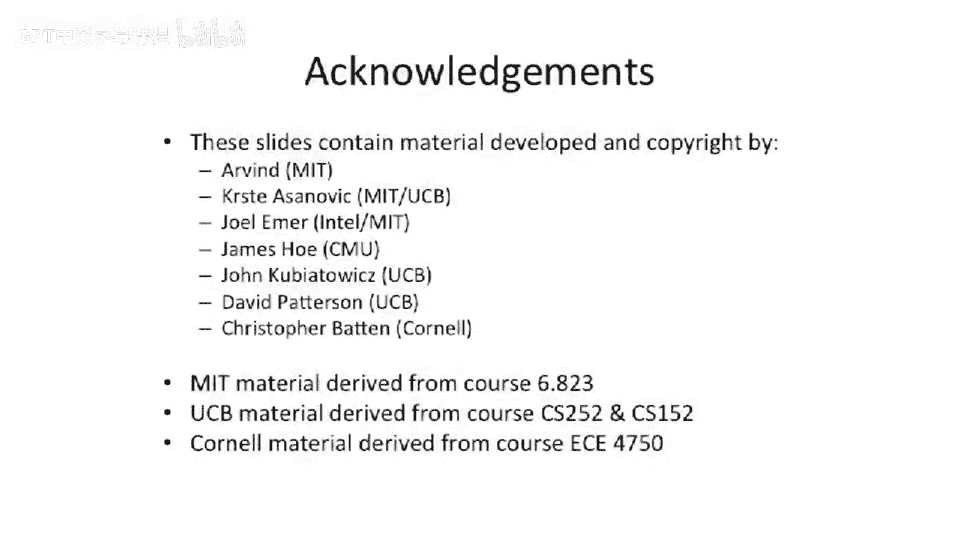

# 【计算机体系结构】普林斯顿—中英字幕 p83 82_05_introduction-to-locks -BV1ii421D7WR_p83-

So going back to our。Prodducer consumer。Idea here。We're going to have a producer producing a value。

 and a consumer。Consuming value。 But now we have two consumers。

And let's say we guarantee sequential consistency in our model。What breaks here， Well。

 if we guarantee sequential consistency and we have a reader， excuse me， a producer and a consumer。

That code sequence that I showed originally actually works out pretty well。

Because we're not having any of those reordering of， let's say， this store and like。

This read or something。 We're not actually getting those reorderings to happen because sequential consistency is basically outlawed those。

But all of a sudden， we have two consumers。And we go and stare at this piece of code carefully。

 This is our original piece of code。One of the things that happens is they。Check the head。Pointter。

To see if it's equal to ta， which means it' something available。

 and have two process two threads or two processes try to do that simultaneously。

They're going to fall through at this point。And what could happen is they could both try to read。

The same value。So let's say you actually have two consumers， Consumer 1。

 consumer 2 that are interlea。And we just basically do every other cycle is executing every other instruction from the two copies of this consumer code interleaved。

And what's going to happen is they're going to read the same value。Out of the queue。Well。

We really don't want that。 We want to somehow guarantee that this block here。Happens。

While no other threads。Or processes are executing the same block here。Of code。

So we're to introduce this notion of locks and semaphos。And we'll talk more about this next time。

 But the basic idea is that you have。Something now it could be a piece of hardware or it could be a memory location。

 which guards。The execution。Of。A critical section or a piece of code。

And you can either have those be such that only one process or one processor can execute that piece of code at the same time。

That's mutual exclusion。 And that's a mutex。 Or you can think of a more general notion of a semapho where you can have some number N。

 where N。Processes can enter a critical section concurrently。And an example of that。

 as I said before， at the beginning in class， why we want to do that is let's say you have two sets of resources。

 like two outbound cues on your network card。 and you have P processors。

 and you want two people to try to go use it at the same time。But you don't care which two。

 but it can't be3。 You need something that's more general than just a Mutex or a single user lock。O。

 so we're going to stop here and we'll talk more about locks and semaphos。

 including hopefully some people speak Dutch。Because。

 we need to know that to get the names of the sephoes。

