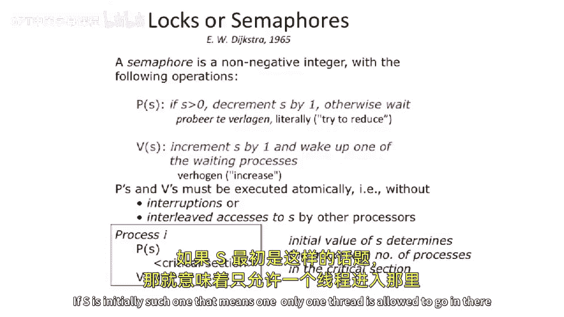

# 【计算机体系结构】普林斯顿—中英字幕 p85 84_02_locks-and-semaphores -BV1ii421D7WR_p85-

So this brings us up to what we had talked about right at the end of class last time。

Which was looking at。An example where you， let's say， have a sequentially consistent processor。

And we take a piece of code that we had talked about at the guinea of class last time and asked ourselves。

Does this still work？ And what we're going to do is， instead of having。One producer and one consumer。

 We're going have one producer and two consumers or multiple consumers。So shown here。

 we have one producer。 It has a register where keeps the tail pointer。

 There there are the two different pointers here in memory， the actual data storage of the queue。

Two consumers。They have their own register sets。😡，Because they're two different processors or two different complete threads。

So they have。Registers， which they cache effectively， it's not a cache。

 but they effectively have to load it into their register space。

And then they actually have where they will load the actual value that they pop off the end of the queue。

So someone， I think， said this at the end of the class here。

 But if you're going to be executing the producer， this piece of producer code。

And you're going to execute this consumer code。Does anyone see a problem here of something can happen that we probably don't want for a first in。

 first out queue with multiple readers，Let's walk through that。Let's say， two consumers。Our。

 we we interleave two consumers executing the same instruction from one consumer thread。

And the other consumer spread every other cycle。So， we have。The first consumer will read。

The head pointer into head。The second consumer will read the head pointer into its own head register。

This consumer here will read the tail pointer into。The town register。

 the second consumer will do that same thing。So all of a sudden， the two consumers。

Read the same heads and the same tail。 And this is sequentially consistent because we've not done done no reordering between within a thread。

 We've just done some valid interleaaving。Now， they both check this。 This is the the case。

 which is basically saying， is there anything in the queue。This is the head equal to ta。

 the head equals to tail， there's nothing in the queue if there's a distance between the head and the tail。

 that means there's some entries in the queue。So they both fall through and they say， well， yeah。

 there's there's stuff in the queue。The next thing they do is they go read from the head。

 and this is the value that they're going to use。Well， they both just read the same head pointer。

Because we are going execute from one thread。 We're going gonna to load that value。

 or execute from the other thread。 So all of a sudden。

 we just read the same value twice in one is the one thread and ones the other thread。

 But it was the same， same value that we get out of reading from the the pointer that points to the。

 the head， if you will。Now。In a perfect world， that would be the only bad thing that could happen in this case。

Becauseuse we would in， they both in the head pointers， and then they do stores here。

 And effectively， what would happen is they would write the same head location into the， the。

Or the same pointer， if you will， into the head。That's。Not so bad。 but effectively。

 what we did is we and queued one thing into the queue， and we got two things out of the queue。

 And this breaks our semantics of what a queue should actually do。

Something that could happen that's much worse here。Is that one of the threads。

Let's say another valid interleaving is the one thread just stalls for a long time。

 somewhere in here。And。Like a billion cycles。 It just stalls for a billion cycles。

 It takes a really bad cash miss or it traps into the operating system or something bad happens to it。

What can happen is before the update of the head pointer happens。Or。What could。

 what could happen here is you could have something really strange happen or you could basically have the other thread execute。

 and it can pop a whole bunch of values off。The head is the queue。In the meantime。

So let's say there was 100 things in the queue。We both execute into here at the same time。

One of the threads gets stalled here for a long period of time。

The other thread pops 100 things off the queue。 But then finally。

 this one here goes and updates the head pointer again。 So what's going to happen。

Is effectively you are basically going to。Reset the queue and put 100 things back onto the queue。

 And it's probably going to be garbage in memory in the queue at that time。

So this brings up the idea that。We may not want to be concurrently executing even in sequentially。

 even a strict sequentially consistent model， this block of code and another threads piece of code which is executing the same。

 same thing。 the two consumers。So we're going to call this a critical section。

AndIf you've taking an operating system class， you've seen this a bunch。

And the idea here is that you want to atically execute from all the consumers。Possible。

This block of code here。 So no two consumers could begin to execute that block of code at the same time。

And。One way to do that is you have a lock。On that piece of code， so you grab a lock。

You can go execute that piece of code and then you release the lock。Questions so far。Okay so。

A little bit more general notion of the same idea of a lock is called a semaphore。And。

If you've taken an operating systems class， you've probably seen these strange nomenclatures of P and V semaphoes。

And if you want to go look up where it actually comes from， it's Dutch。And。P。Largely means。呃。Attempt。

To acquire the Semaphore。 But in Dutch means I don't。 I here speak Dutch， my chance。

Ione speech anything close to Dutch。You do。Little， how do we say that？What is close to Dutch。

 actually。Germans close to Dutch。 Yeah， okay，So I don't speak to Dutch or German。But。It means。

 try to reduce。In the Sepho， you can have multiple。People trying to grab a lock at the same time。

 and multiple people can actually be to acquire that lock at the same time。

 So an example or acquire the sepho at the same time。

 the example we gave in last class is that you have multiple users trying to use one I O device。

And there's， let's say， two Qes in the IO device。You have 100 different processors or threads try and use that one I O device。

 You can actually have。Strictly only two acquire the IO device。But not more than two。In a mutex。

 you're only allowed to have one thing be able to acquire the critical section or acquire the lock at a time。

And。Hence， we have a little bit more general term for this， A P sum ofpho。

 basically decrements counter。So we start off with a counter S here。 We put some number into it。

 And then we do a P on that it'll actually decrease the counter。And if the counter。

Was greater than zero。We can go execute our critical section。

Then we have the release or the V semaphore。And that will actually increment this counter by one。

And it'll wake up some other process if there is some other process waiting on that。If， if。

 if S had dropped below。One， it'll wake up another process。🤧嗯。

And one of the important things here is that these both these P and these V sumphos must be atomic relative to each other。

 So whenever you go think about going to implement them， they must。

 they must be atomic relative to each other。 And this is with respect to everything happening。

 Everything other else happening on your system。 Otherwise， really。

 really bad things will start to happen。 You'll actually have multiple people grabbing the walk。

And how you typically use this is inside of your thread or your process。

You're going to put your critical section and put the acquire here and the release there。And。

One important thing here to note is these semaphos， you can have the value S here。Determine how many。

The initial value of S rather determines how many different threads or processes are able to enter the critical session concurrently。

If S is initially set to one， that means。

1， only one thread is allowed to go in there。 And that's what's called a muttex。

 So it's mutually exclusive。 Only one thing， only one。

Thread can go into critical section at that time。

