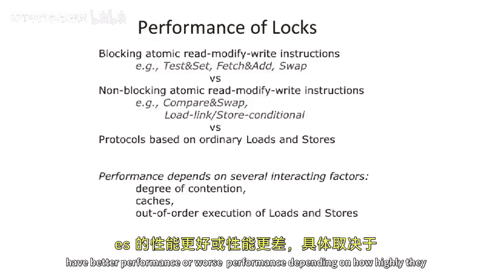

# 【计算机体系结构】普林斯顿—中英字幕 p86 85_03_atomic-operations -BV1ii421D7WR_p86-

And。Thankstra。Came up with this naming themenclature。So implementation of semaphoes。

This idea is all well and good， but we still need some way to come up with mutual exclusion。

Believe it or not， you can actually do this with just loads and stores。

 And we're to be talking about that a little bit later in class， but it's really pretty slow。嗯。

And it's it。There are some algorithms that can do this with just loads and stores。

But from an implementation perspective， people typically try to go faster。

So if you want to go faster。It might be helpful for your computer architecture your instruction architect to come up with a special instruction。

 which will allow you to do something atically。 So when we say do something autoically。

 it means that there's nothing else could be interleaved。In in the meantime。And the。

 the simple solution here is that you add an atomic operation， which can do a read。

A modify and a write。All atomically， if nothing else interleaving it。

So going back to our locks and semaphores here。All inside of this， this P and all inside this V here。

 you need to somehow atomically modify S。 You need to be able to read S。

 You need to be able to write S If you were to implement this somehow with code inside of the implementation of。

 of P and the implementation of V。So the primitive here that makes us faster is having some read。

 modify， write operation。 And we're going to look at a couple different choices of this。

One of the most basic ones is test and set。X86 has this instruction。This is the。

One of the most basic。Operations on X A6 for Atomic。Operations。

 lots of other architectures have an instruction which does this。So we write here as a piece of code。

 but in reality this the piece of pseudocode， but in reality this is an instruction will actually do this atomically relative to the whole rest of the system。

So let's look at what test and set does。The basic idea of test and set is it is。

 it's probably one of the most primitive。Atomic operations you can do。

 I've seen something slightly simpler than this。I got testing clear。

 which is a little bit easier to implement。 But largely the idea is that。

You're going to look at a memory address。And if that memory address is what you expect it to be。Then。

Write some value。And。Implicit in this piece of code here is that。The piece of code。

 which execute the test set， needs to know whether it' exceeded and was able to successfully write the value not or did not write the value。

 So there's sort of a status code。 and that's return in this register R here。

So if we look at this piece of code。You pass into it a memory reference， a memory address。

 which is the address of the Sepho or the address of the lock。 and you pass into it。

 and a register name。We do a load。Into that register。And that happens unconditionally。This part here。

 though。Is the test part。So the test part here is we check whether the thing we just read from this memory address。

Is zero。And， if so。We're going to write a one to the memory address。

Sometimes these test set operations will actually allow you to write something else besides just one。

 But for right now， this is sort of the more basic one here。

So it writes a one to that memory address。 And what's important here is the architecture。

Guarantees that。All of this happens atomically。 But what's interesting is if you think about our processors that we've built。

This requires a load and a store。H。So we will talk about how we implement this a little bit in a few slides。

 but。You basically have to stop everything else。 Stop all other loads and stores happening in the system。

Do this load。Do the test and possibly do the store。In hardware。

One of the more basic ways this is done or one of the original ways this was done actually on some of the X A 6 based architectures is there was something called the lock bit on the bus。

 So what they did is when one processor was going to go execute a atomic operation like this。

 a test and set， for instance。It would actually broadcast all the other processors in the system saying。

 I'm about to do this。 Do not touch anything。 Do not issue any memory instructions effectively or do not issue any bus based memory instructions。

It would would do the load， It would do the test， and would do the set。

 and then it would release this broadcast bit。 It was just a wire on a multi droprop bus。That's。

A pretty big hammer。 Things have gone a little bit better since then。

 But thiss give you an idea of a basic hardware implementation of this。

Thing's got a little bit more sophisticated。 This sort of showed up in the the 70s here。

 These fancier operations of fancier atomic operations。 So this whole box here is still a。😊。

Atomic operation。 All the the code in here happens atomically。

 And what this basically does is it's going to take a memory address and add something to it。

 So we're going add。R V to R input that into memory at the same memory address。

 And so we're gonna do a load in the store here Atically。

 So it's a read modified right operation also。And having it all be atomic。

Note this still actually returns into register R here the original value。

And sometimes that's actually very useful。 If you're trying to implement a semapho based on this。

 you kind of want to see what was there before。There's some， there's some jokes around fetch ad here。

 though， the。Atomic。Operation community kind of pushed this to the extreme at some point。

 And people started having sort of。Ftch and insert something here。So fetch Shan， multiply。

 fetch Shan， divide or or things like that。 And people started building some stranger machines that had。

Fettch and something else。 And theres this old joke that someone was going to implement an instruction called Feion FFT。

So it would be an atomic for a transform， I don't think it ever got to that point。

 but in the microco days and in the early multiproor microco days。

 there was some pretty sophisticated atomic operations。

That's largely been decided to not be a good direction to go。

You want to have a little bit of complexity in your atomic operations。

 So maybe test and set is a little too simple。 but some of these fancier fetch FF Ts is probably a little bit too complex。

🤧。Here's another interesting operation。That is atomic。

 And this one you can actually build some pretty interesting sephos out of。 It's called swap。

So it takes a register value and a memory location。

And it'll take what's in the memory location and what's in the。Reregister and swap the two things。

And note， we need to use a。We use a temporary here because you can't actually swap two things without a temporary。

This is actually not very common because its， it's kind of hard to use。

 So it's a little bit more common to something called Comp and swap。

 which is something between kind of a test and set and a swap operation。 And that's。

 that's what's kind of use。 We'll talk about that in a second。Okay。

 so now we go back to the multiple consumers problem that we had where multiple people are trying to deque from a queue。

And let's introduce。Test and set。And we's look at our critical section here。

We're going to use this term mutex to basically mean a semaphore that only one thing can enter at a time。

So what happens at the beginning here is there's a tight loop。And this tight loop will。

Read from the memory location of Mutex into a temporary register。And we'll compare it to zero。Note。

 we define test and set as writing one to memory if it succeeds。So if it was 0。

 that means that it was not able to actually modify memory。 The test failed。So if the test failed。

 it's just going to sit spin here。And we'll call this busy waiting or spin traditional spin lock。

It's called if it acquired the lock。This read value would have been a1。

 so it would not be equal to excuse me，If it。If it required the lock the。We you was right。

If it's one， it's zero。Okay， sorry， we did this wrong。 If， if the memory address was a。

It was a one coming into here。That means someone else already locked it。If it's a zero。

Coming into here， that means no one locked it， but we locked it and set it to a one now。

So if we acquired the lock， we're going to。Atutomically set it to a1， and we're going to read a zero。

So we'll drop into our critical section and start executing our critical section。

 And under the critical section， we can do stores， We can do loads。

 we can do whatever we want because we're guaranteeing that no other app。

 no other processor or no other thread is doing anything to it。And then at some point。

 we need to do the release here。And that we actually don't need a test and set for。

 We just need a store。The story is just going to clear that memory relocation and some other thread is safe to go and。

Fall into the critical section here。Okay， so。This can be done with lots of different。Implementations。

 we showed it here of test and set， but this can be done a swap。 It could be done to fetch and ad。

 The code gets a little bit more complex。But one of the interesting questions that comes up is。

 what happens if you're running along。Some threat acquires the critical or acquires the lock。

 falls into the critical section， and。Let's say terminates。

Or get swap out for a very long period of time。What's going to happen here？Well。System crash， I mean。

 we don't reference bad memory here。This is more of a hang。So it's gonna freeze。

 So this is actually pretty common in。The old， for instance， if you look at like。

Non preemptive operating systems。So back in the day of like the original Mac OS before Mac OS became Mac OS X。

 so versions of9 and earlier， that was a cooperative operating system。

And if someone went and grabbed a lock and then died or took an error case。

The whole machine would crash， crash。诶。If you're preemptive， I mean。

 it's like a timer interrupt going off， it's possible you still want people able to make forward progress。

But at least the O S can interrupt your process and try to do something about it。 It can detect that。

 one process is hung。But in a cooperative multi threading environment， if one process， let's say。

 just hogs the processor and never give us back the processor or just dies。

 And you have some other process which say， or let's say you you grab the lock in one process and die。

 And then another process。Is running along and tries to acquire the lock。

 But it's scene they're spinning in this little spinning section here for forever。

You're basically just gonna hang the processor。 You're not going to see anything else happen here。

 So you got to be pretty careful， especially in cooperative multithing environments。 So one of the。

 the tricks to this actually， is if you're in a cooperative multit environment。

You'll typically put inside the spin loop here， something which will yield。Two different thread。

So someone else can try to do something in that time， because if you just sit there spinning。

It's very possible that you won't be fair or no one else can ever go to unlock the lock。

 for instance。So you got to be a little careful there。Okay。

 so we're gonna move forward here and look at how to do。

A slightly different version of the same piece of code。 But now with。Compare and swap。

So before we do that， let's talk about the semantics of compare and swap。Compare and swap。

Takes memory。And two registers here。And it's going to compare memory。With one of the registers。

If it's equal。Then it's going to take the other register， put it in memory。

And effectively swap them in return a status。If the comparer。Operation fails。

 We come this L station statement here。 We don't do any swamp。

So this would be effectively taking a register and a memory location and swapping them。

Depenent on another register。So it's a little bit more powerful than just swap。

It's a little bit harder to implement， as you might imagine。

It's probably not as hard to implement as something like。Ftch an app。The reason for this is。

 if you want to go do this operation out at the memory system。

You could basically send it as atomic sort of operation。Go to main memory， compare this。

 put a comparator there and swap the two things。If you try to have these sort of increments or arbitrary instructions or ads。

 you need to put an adder out there， for sure。This only needs a comparator out there。Still， still。

 still painful to go implement， but it might be a little bit better than putting a full adder in your memory controller。

Becauseuse that's almost like duplicateating your A U out in your memory subsystem。

 which doesn't make a whole lot of sense。 But that's。

 that's why people use a joke about the fetch and FFT， but。Okay， so let's take a look at。

The same piece of the same case here of a multi reader。He's a code。

 But instead of what we're going to do is。We're not gonna to have。A spin lock at the beginning。

Instead， we're going to have。A critical section。But we're going to concurrently execute critical sections from different threads here。

 which。We're not going to call it critical section。

 Then we're going say we're gonna concurrently execute what was in the other threads C section。

And then we're going to atically try to swap out the head pointer。And replace it。

 So we're respectively doing speculative work here。

AndThis is called non non blocking synchronization。So， the synchronization primitive were。Going to。

Do the loads。 We talked about that before。 We checked to make sure if there's at least something available。

We pull the head pointer off。This is all speculative work at this point。

 because we have not checked to make sure that we can validly pull off the head of the queue。

We're going to increment the head pointer into a temporary here that we're going to call new head or register new head。

And then we're going to do it trying to swap the new head。With the old head。Atutomically。

So it's going to take the register that we think。Is the new head and the memory location？

Where the head pointer is。We're going to try to swap these two things。

 and the thing that we're dependent on here is whether what we think is the old head still is the old head。

And。If， if something。Bad happens here， we could try again。So。

 so the idea here is we're going spin actually in this。Effectively， bigger loop。

Trying to speculatively try to go and。Change the head。So one question that comes up here is。

What if the head？Was deed from added back onto。 and it just so happens we have some sort of。

's it's called an A B A problem。The head pointer was a。It was changed to B。

 and later it was changed back to a。All in this short period of time。Yeah。

 that may be a problem here in this piece of code。 You might need to think about that， and carefully。

Reason about that usually can protect that in some other way。 sort of when the。

 the pointer wraps around， maybe。If you think about a normal ray， when it wraps around。

 you put something which is not a comparing swap， you put it like a more spin mock。

Or a spin loop sort of lock on it。 So you only have to worry about that in these sort of circular buffers when something wraps around because otherwise there's no other way that the head pointer can go back to where it was before。

But you do need to worry about that， that you wrapped all the way around the array。

In this very short period of time。 So there's some race conditions that happen with these non blocking synchronization operations。

Another non blocking synchronization primitive that。Is actually really cool， I think。

 is goes by lots of different names， it goes by load locked。Load links。

 load reserve and store conditional。So you take your IA， you take your instruction set。

 and you add two new instructions。Something which checks to make sure or something which doesn't load。

And。What you then do is。Store conditional。Checks to make sure that no one else did a load。Or special。

Load link。To that same address。In the inter meeting time。

I can explain that one more time because that's a little confusing。

 but the basic idea is there's a flag register here。And in hardware， you do a load link。

This loads the value into your register。 and sort of on the side somewhere next to the register。

 it may not be architecturally visible。 It shouldn't be architecturally visible， likely。

It'll set a bit。You execute your critical section。 And when you come back to it to go to the store。

 we'll say for these sort of read modify write operations。When you go to the store。

 the store checks to make sure the flag。Is still set to one。If flag is one。If it's still one。

 that means no one。Did any memory operations to that address or or did at least any load links or store conditions to that address in the inter meetinging time。

 Actually， sorry， we'll say that more concrete。 No one else did a store conditional during that time。

 So no one else tried to do a store update。 Other people might have tried to do a load。But。

No one else did a store to that address or a store conditional to that address。

Because if someone else did a store conditional。What will happen？Is it actually？

Cancel the other processor's reservations， so it'll set their flag bits to zero autoically。

This is a pretty powerful primitive here。Such that you can basically do a load。

Try to do a store later in the future。If no one else tried to do a store to that same address in the meantime or store conditional to that address in the meantime。

 your store goes through。And everyone else's loads， if they could do a load in the meantime。

 would get invalidated， or they'll know that it gets invalid when they go to do a store conditional。

So if we take。The same example here。 And we implement with load link and store conditional。

 We're going。Look at the head pointer here where we normally do the update。And we're going do a load。

Into this register。And。When we go to do a store conditional， if we。

Someone else had changed this value in the meantime。 We're going to get a fail。

 And we're going to jump back around and have to redo the load link。

And this actually gets rid of the ABA problem also。Because。If you did have that sort of race。

 someone else would have done a store conditional to that address。

And the wraparound cases and all that stuff would actually， and it wouldnt validate your。

Flag on that bit， if you will。Or flag on that memory address。

One of the reasons that people like this is。When you go to do。Load。

Link or load reserve and store conditional。 You can a lot of times sort of piggyback this over a memory coherence protocol so that you do a load link and itll add an extra bit in your。

Memory will say。 So if you're doing some sort of memory coherence protocol。

 it'll pull it into your cache and you can sort of tag this line as special or。

That's the flag bit here effectively because his whole line was。Load Li。And then。

If no one else pushes it out of your cache or fetches it from your cache in the meantime。

would mean no one else did a load blink on it。By the time you go to do the store。

 you know that no one。Did anything。 And what's really nice about this is no communication that has to happen between the processors on the common case with an uncontended lock。

Versus the spin locks are are generating memory traffic all the time。

 They're sitting there doing loads， doing stores， trying to like grab the lock。

 trying to grab the lock， trying to grab lock。 And they're just generating all this traffic all over the place。

 versus this is very quiet。 You just pull it into your local cache。😊。

And if by the time that you get back to it， it was still in your cache。

 and it still has this bits set。That's great， you get to do it。In the contented case， though。

 you might actually get traffic ping pong in here， but you can still guarantee correctness。

So this brings us to performance。As I said， some of these blocking atomic operations can generate a lot of memory traffic。

 So theyll seen they're spinning。On memory and they'll at least be doing lots of loads。

And theres lots of loads might be going out to main memory。Non- blocklocking atomic operations。

 So like these compare and swap operations or loadlink store conditional and the load linked to store conditional。

 I was alluding to many times you can you can do it against your own cache。 Also。

 these things can have sometimes have better performance because you don't have to sit there sort of spinning in tight loops。

 you can try to do stuff in in the meantime， The downside to at least the compare swap implementation is you have to do sort of speculative work in the meantime。

re sitting there redoing some work。 And if you didn't get the lock that performance can be bad。

There's also， as I allud to the beginning class， there are things that use。

Ordinary loads in stores or algorithms that do implement locking with just loads in stores。

 Their performances is not， not very good。And we're going to look at an example of that called Decker's algorithm today。

Finally。The performance these。Isn't just dependent on the operations themselves， some of the these。

Primitives， Haror primitives。Have better performance or worse performance。

 depending on how highly they are contented。

So what I mean by contended is I mean you have multiple threads trying to acquire the lock at the same time。

If you have lots of people trying to fight for the lock， that's high contention。 If you have a lock。

 which there's almost never contention on。 you just go to get the lock， you just get it。

 And it's therefore for a really rare case。 Other locking primitive have better。

 better protocols there。And of course， we're going to talk about this in a little bit of how do you make these integrate well with caches。

 out of order processors and out of order memory systems。

