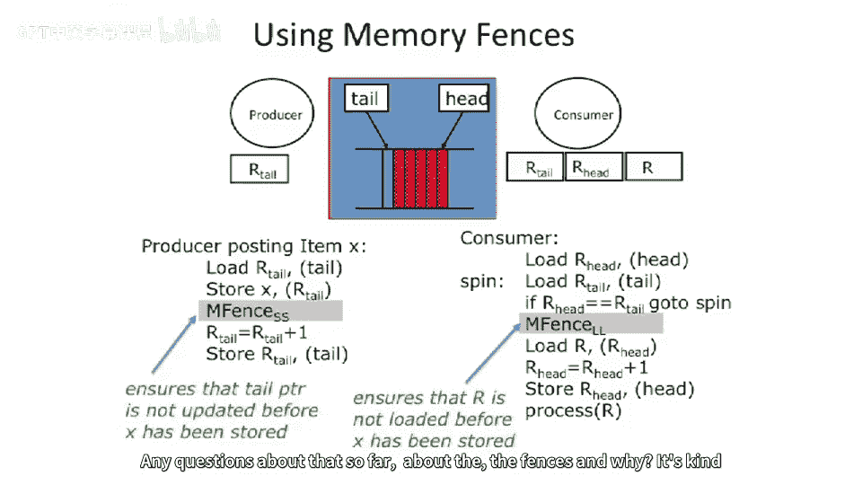

# 【计算机体系结构】普林斯顿—中英字幕 p87 86_04_memory-fences -BV1ii421D7WR_p87-

Okay， so now we。Get to talk about。Issues of sequential consistency and how to actually go about implementing these things。

So going back to our。Valid interleaving。 We start to ask ourselves。

How do we build a sequentially consistent model with out of vote processors or out of voter execution of memory？

What we already said in our autovo system that we can reorder loads to different addresses。

 We can reorder loads to the same address。It doesn't really matter。Well， if you go take that。

All of a sudden， they just break sequential consistency。嗯。

We said we can reorder a store in a load and out of order processor if they were to different addresses。

We said we can reorder stores and loads the other way， we can say we can reorder stores in stores。

 So our out of order memory systems and out of order processors effectively break sequential consistency。

 So how do you break， How do you implement a processor， which is useful。And is out of order。

We want to go out of order for performance reasons。Also。

 caches start to become a big problem here for performance。

If we want to have true sequential consistency。You're gonna have to somehow figure out how to。

Not store any data in your cache， because the second that you store data in your cache。

You're going have to。Let's say it's a right back cache。

 If you do a store to your local cache and you write a one to it。

 and some other processor tries to read it。Well， it's not going to be able to see that data。

So we need to be very careful here of when is。Data actually visible to other processors if you have a cache involved。

In a multi processor system。So we're going to move towards a little bit more。

Weak or relaxed memory models。So。As I said， last class。

Almost no processor actually implements a truly sequentially consistent memory system。

 They're all weaker than that。 Now， the question is， how weak do you want to go。

And this starts to come up because it's， it's a type trade off between what the programmer。

Can wrap their head around？Versus。Effectively performance in out border system。

So what we can do is we can think about going to weaker memory systems。And。When we do that。

 we're going to make the programmer decide。When a load in a store can be reordered or when a store in a store can be reordered or when a load in load can be reordered。

So let's look at these four different cases independently here， reordering a load with a load。

Reordering a load with a store after earth， reordering a store with a load after it。

 and reordering two stores。And note， we're not talking about the same memory addresses here at all。

 We're talking about to different addresses， But sequential consistency even says for different addresses。

 we need to worry about this。So。How many of these extra dependencies can we remove。

 And we're going to introduce this notion of a memory fence or sometimes he'll call a memory barrier。

Operation。Which is a serialization point that says all the previous instructions before。Well。

I'll be careful what I say there actually。Memory friends is actually a serialization operation。

 which says all of the memory axises。Or at least the named memory axises before a certain point have been completed before。

The memory fence completes。And all of the operations after it do not complete。

 have not started or completed。Before the memory fence completes。

 So it really is a barrier on your memory operations。

 And the reason I'm being a little bit hesitant here is。The basic memory fence。

We'll say that all memory operations before the memory fence completes。

And that none after the memory fence have started。When the memory fence completes。

But people have introduced little bit even weaker versions of memory fence over time， of course。

 for performance。And you start to see things where。

You will have only load memory fences where it barriers against all the loads previous。

Or you have one， uniquei directional memory fences， which will say。

Only look at all the stories that happen after this point。

 And don't allow any of them to happen before this point。

So people have actually introduced instructions in modern architectures， which have all these things。

 and probably one of the weaker ones， if you actually want to go look at a really weak memory model is go read about the ittanium。

Memory model， extremely weak memory model。And they theory。Need to have fences all over the place。

 And the trade off here， the performance trade off is how many fences you need to put in。

Versus performance you get from reordering of memory operations。So let's look at a couple。 Let's。

 let's name a few of these things， because everyone likes naming。 these are。Computer architecture。

 research， names， these are common across the industry at this point， effectively。

One of thems called total store ordering。So in total store ordering。

 this is not a very big step away from sequential consistency。The stores， so in total store ordering。

Loads do not get reordered to other loads， Los do not get reorder to other stores。

 stores will get reored with other stores。But a store followed by a load can be reordered。

 so a load can move above a store here。And if you want to enforce。

The order between a store and a load。Need to write this do。Store word。Minfants。Load word。

And this guarantees that this load is going to happen after that store in that processor。

Partial store ordering is a little bit weaker than that。 So partial store ordering。

Loads with other loads。Don't get reordered。Loads of other stores don't need fences。But。

Stores filed by loads， which is up here， and stores filed by stores also need fences to guarantee ordering。

And then， finally， we get this。Class of weak ordering。 And frankly。

 most processors these days actually fall into some category of weak ordering。

 And there's sort of different questions and how weak it is。

 But we're not going go into that level of detail here。 And here you actually the the。

To enforce all of these ordering。So kind kind of interesting， interesting to think about。

The nice thing about fences is that。While these operations are expensive and our big serialization points。

 the memory fences， you only need to pay for them。When you care about the ordering。

And when you don't care about the ordering， the computer architecture can reorder things and make everything go faster。

But it's only exactly when you care about it， that you need to introduce the fences。

One thing I was going to say is some compilers will do some of this work for you and introduce the fences for you。

And usually one of the ways thats done， actually， if， if you see a atomic operation。 So if they see。

 if a compiler sees something like a lock operation or A P or V in your code。

 and there's sort of a special way to。😊，S that's the compiler。

 It'll know that you need to make sure the memory operations have all been serialized at that point。

 Usually also atomic operations like Test and set are fences on their own right。Which helps。

 But sometimes compilers can even figure out where other fences are needed for other memory addresses。

And。One of the thing I was say here is that fences don't actually take a argument。

 as long as they take an undress to go fence on。And the reason for this is what you really want to do is you want to make sure all the previous memory operations。

 because in sequential consistency， we haven't said anything about the addresses。

 We just said previous memory operations in one thread don't move after a subsequent memory operation。

Okay， so let's look at an example here of where we might need to introduce。

Different different levels of fences here。 So here we have。Our。Proreduuce your consumer model。

And one of the things we were worried about in our original example is we were worried about these two stores getting reordered。

Well， we can enforce that by putting a memory fence operation in here。And saying it's a store store。

 So no stores can pass any other stores。 And this will guarantee that these happen in order。

But we don't really care， in this case， we'll say。If， well。This actually already has an arc。

 So that's not going to get reordered because this register is， is， is dependent there。

 But let's go over here。And take a look over here。 If we have full sequential consistency。

 we would not be able to reorder these two loads。But for performance。

 maybe we want to reorder those loads because。One of the input registers isn'tval。

Because it's the result of a long multiply， for instance， or something like that。

So you might want to reorge in you're out of order processor for performance reasons。

In true of sequential consistency， you wouldn't be able to do that。

 But with this weaker memory model， we can reorder that。

 but then guarantee correctness by introducing a fence operation here。

And this fence operation is going to say。After these loads are done。

These loads need to complete before this load starts。So you can sort of guarantee。

That if our head equals our tail。You know at that point that you're safe to go execute the rest of this code here。

Any questions about that so far about the the fences and why？

It's kind of a pay as you go， if you will。

