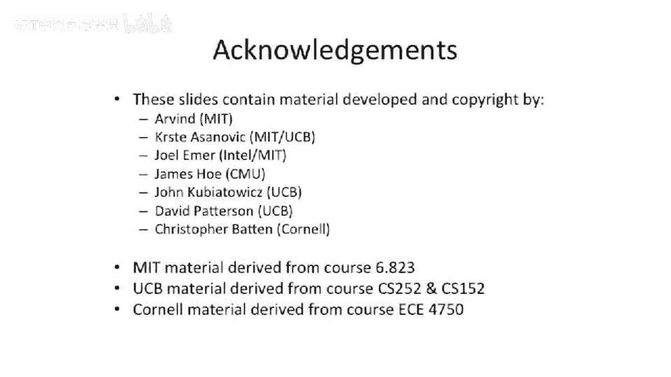

# 【计算机体系结构】普林斯顿—中英字幕 p88 87_05_dekkers-algorithm -BV1ii421D7WR_p88-

Okay， so now we're going to talk about。How do implement mutual exclusion without。Atutomic operations。

So I actually Ill ask you， how many people have seen mutual exclusion without atomic operations before。

Okay，A few people probably take an operating system class might have seen this before。

But it's all tricky and good to refresh anyway。So we're going to。Throw out test and set。

 We're going to throw out other things。 We're going to look at how you have。呃。

Llocks and mutual exclusion without any ordering or without having special instructions add to our instruction set。

So let's， let's take a look at a basic piece of code here that is wrapping around a critical section。

 trying to implement。A P and a V。 And we're gonna， we're gonna look at the case where we only have two threads。

 The end， The n threaded case gets a lot more complicated。So in this simple case here。

An easy way to go about doing this is or or one， one way we can think about doing this is。

Process  one。Setets its variable here。To one。Then it checks to see if the other process has ruin its。

L variable。 these are two different variables。 C1 and C 2。

 And we're assuming sequential consistency for this。If。It sees that the other process。

Wrope that value to2 or to 1， C2 to 1。It says， oh。Press is2 already one here。

It's going to go execute as critical section。 So it'll sit here and loop until C 2 is set to 0 at the end of the criticalle section。

Okay， anyone see any problems here。 Yeah， so if they both set their variables to one。

 So if we interleave this instruction and this instruction and then both do the checks。

C 1 and C 2 are both going to be equal to1。 They're both gonna to check if theyre say， okay， yes。

 C 2 is equal to 1。 C 1 is equal to1。 spin forever。

None of them will ever get to the release of the sum before。And all of a sudden，You have that box。嗯。

That's not great， so this is why this stuff's really hard to do。

Let's look at our second attempt here。Let's try to make that better。

By adding a little more checking in here， so same thing。C1 is。Equal to one。C2 is equal to1。

It does the same checks to see if the other person， the other threads set the the variable。

And if it doesn't win。It clears its own。So it sets C1 back to 0， if it fails。And loops back up here。

WellThis looks a lot better。Yeah， we're not going to any deadlocks here， I don't think。Because。

Let's say we're trying to interleave these things。 C1 sets to1， C 2 sets to1。

 They both do the check at the same time。They both say， oh， the other person grabbed it。

 I'll release my。Variable， set it to zero and loop back around。So we don't deadlock here。

And if you perturb the system a little bit。At some point。

 one of them is going to fall through willll say。 But what happens if the system is not perturbed。

Well。You can actually hit。Live walk。Here。Because。They could just sit there and in lockstep if you interleave these three instructions。

With these three instructions here， they're going to just keep。Going through the loops。

 clearing the variables， setting the variables， clearing the variables， setting the variables。

 testing。And none of them， neither of these two prothe are ever going to fall into the critical section。

So live lock here is just as bad as Delock in this case。And。

Another bad thing here is we have no guarantees of fairness。So。You could actually have a case where。

One process grabs this lock， well say。The other one sits here in， and loops in it。 it's able to。

Exutes critical section clear。C1， get back around， set C1 before process 2 is actually able to go around this loop。

I'm gonna to say processors probably are not running at different speeds。 Well， that's true。

 but maybe that's when has to take more cash misses than that one or who knows。 know。

 you don't have a strong guarantee。 You can't prove。That one threat is not going to starve。

So this is a fail。 We can't。 We can't have mutual exclusion this way。So instead， we go and we say。

 well。Let's make it more complicated。 And this came up was made by Decker and is largely called Decker's algorithm。

And this is actually a protocol for mutualtual exclusion。

 which works with just using modes in stores。And we introduce another variable here。

 and this is a shared variable between process1 and process 2。 we call this the turn variable。

So this looks pretty similar to what we had in the previous slide。 but now。The turn variable。

Is shared between the two。And what this is really going to act as is this is going to act as a tiebreaker in the case where they both set C1 effectively at the same time。

And the tiebreaker is interesting here， because。Actually just does two things。 It's tiebreaker。

 and we'll see how it is able to solve some problems around starvation。But the turn variable。

 one of the two threads here， because it's a shared variable， and we're sequentially consistent。

 is going to。Execute last， we'll say either the left side or the right side。So。

When you come down to here and do this check。Whoever racesed and actually set that turn variable last。

The other thread is going to execute。Let's say process 2， we inter leaveve these and these。

Process2 now sets。Pstit2s turn equals2 happens last。And when this goes to execute here。

We'll see that。C1 is set。And turn is equal to two。So we're just going to sit here and spin。

The other thread。Is going to see turn equal to  two。And。C2 is set， but we have a logical and here。

So both of these are not going to be true。So it's going to fall through an execute its critical section at this point。

At the end。C1 is going to get cleared。And what happens here is that's going to allow this other process to enter into its critical section。

So。Why this is nice from a starvation perspective is at least for two processes。

 it's going to allow you to alternate here。Because one of them is going to enter in。

 And when the other one goes to clear this variable。

 you're guaranteed that the other one can go execute at that point。

 So you're not going to have starvation。Now， the reason you don't get starvation is actually kind of subtle。

 Okay， so， let's look at the starvation case。So。Let's take cross one really fast and just loop around and it can。

Get around this loop and come to this point and perform。Bsses two can basically。

Who grabbed your what？Does that case you okay。So。What's going to happen at that point is。哦，就就定这人海。

When C1 gets up to zero。What's going to happen here is process 2 to never see C1 set to zero is what Vi is saying here is thiss going to set to zero that it's going to set to one before it' check。

But。What is interesting here is at some point， but C2 is still set to1。

Because this one's sitting here waiting。Okay， so T C2 sets to one。And turn gets set to one。

That's going to block。Process 2 from entering at this point。Or rather。

 this being one and that being one is going to block it from executing。And when。Turn gets set to one。

Or rather， let's， let's hold off and look at this。 That's going to allow this process  one。

 and it's going to force this process one to sit here and spin forever。

 And it's not going to be able to go race around a second time。Process 2， on the other hand。

 C is going to be set to one。Now， in the meantime， C was1 and then it was 0 and then it was1 again。

But。Turn is no longer equal to 2。At this point。Which is going to allow process 2 to fall through and execute its critical section。

So it's this shared turn variable here， which actually allows us to guarantee。

 if you have a contended case。Such that you're basically going to have a round ro in between the two。

Okay， so I think we went through that。ho are的。Finish up today talking about1， one last idea here。

Last two minutes。You can。To do deckers， actually， with N processes， more than two gets pretty tricky。

 Dketra shows a proof of that。 There's something that's a little bit simpler to reason about。

 called the。Leslie Emmports。Baakery algorithm。And the bakery algorithm is kind of interesting because the idea is have youve ever gone into a bakery or gone into a deli。

 There's the little tickets。 You go in。You take a ticket， and then you wait for them。

 either call your number or the little number on the screen to tick up one。

 And then once it gets ticks up， you go and you like get your。

Bread or get your sliced cheese or something。Well， you can do this in with just loads and stores。

 You don't need locks to go implement something like that。

 And I don't want to go into complete detail here。 But the， the basically， the idea here is。You set。

You said that you want to take the lock。And then what you do is you check if all of the people below you。

Are waiting in the lock。Also in， in order。 So it's kind of like you。

 you're checking to see if the number has incremented up to you up to this point。

And if everyone below you is， if， if there's no one below you who is waiting for a lock。

Then your number came up and you can go execute。 But if someone is， you， you can't。

 you can't go execute this。 And you， you wait for the everyone else to release their or set the variable to one effectively until the point that it's yours。

 And then you can go and buy your bread or order your， your cheese now。

That's not enough to actually work。There are things called ticket taking locks。

 which is actually a more general class of this sort of idea here。

 but you also need this sort of second matrix here to prevent sort of ABA problems of things running around。

 but I don't want to go in full detail about that。 I just wanted to give you an idea that one way to go implement sort of fast locks is our ticket taking locks。

 you walk in you take the ticket。 and this prevents multiple people from hoarding up to the front of the bakery and all trying to order exactly at the same time。

And in the bakery， it's a little bit easier because on the wall。

 theres like a number and someone tick the number up each time。

If you don't have a central arbiter to go tick the number up。

 you need to somehow make the last person who had the lock。Increase the number。

 and that's what this algorithm is actually doing。O， let's stop here for today。

 Next time we're going to talk about。Sysymmetric multi processorcess already a little bit behind where we were supposed to be from the syllabus perspective。

 We're about a half a class behind。 But I think we'll be able to pick up most of that。

