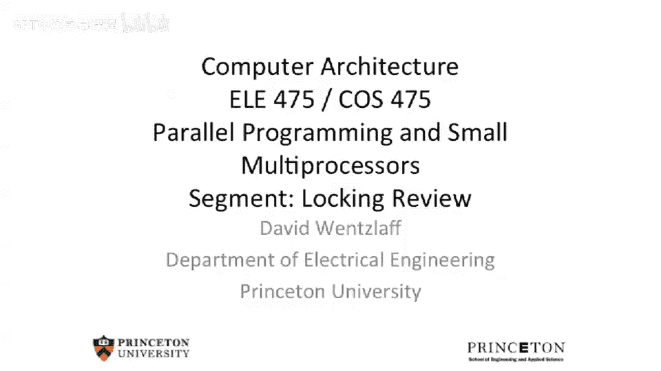

# 【计算机体系结构】普林斯顿—中英字幕 p89 88_02_locking-review -BV1ii421D7WR_p89-

So welcome back。 today， we're gonna be talking about how to go about building cache coherent systems。

 So we've just come off talking about consistency and memory consistency。

 And now we're gonna to start talking about memory coherence systems and talk about sort of the beginning protocols you can go about building memory coherent systems。

 But before that， let's go back and review what we we were working on at the end of last lecture。

 So at the end of last lecture， we were talking about mutual exclusion。

 And of the we had talked about having test and set and specialized operations that can do give you mutual exclusion。

 but you could also just use basic loads in stores。 And we had talked about using Des algorithm。

 And one of the key insights in the Des algorithm is that you have this shared turn variable here between the two processes which are trying to communicate。

Or trying to lock the same variable。Then we went on and expanded this to。Multiple process。

 mutual exclusion。 And this is sort of the moral equivalent of a going to the deli and trying to take a ticket。

 So you go to the deli， you take a little ticket and then someone goes and calls your your ticket number。

 and then you are served。 And this is how you can implement multiple people trying to access one resource。

 But unlike in a deli， where you have， let's say， a number on the on the wall which picks up or you have a the person behind the deli who calls your number or in a bakery where they call your number。

 Instead here， we need to do that in some sort of distributed manner。 So in the end process。

 mutual exclusion， The person who actually finishes being served， wakes up the next person。

And as I said， this is a little more complex， but you can still do the same idea here。 Ex me。

 totally with loads and stores。

