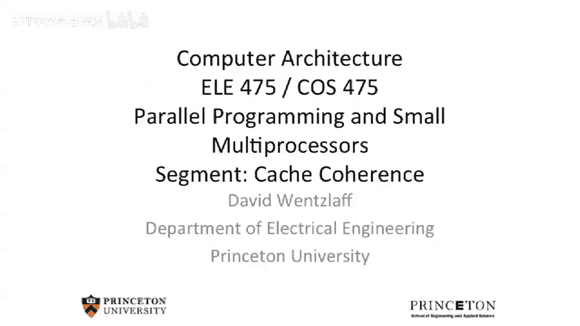
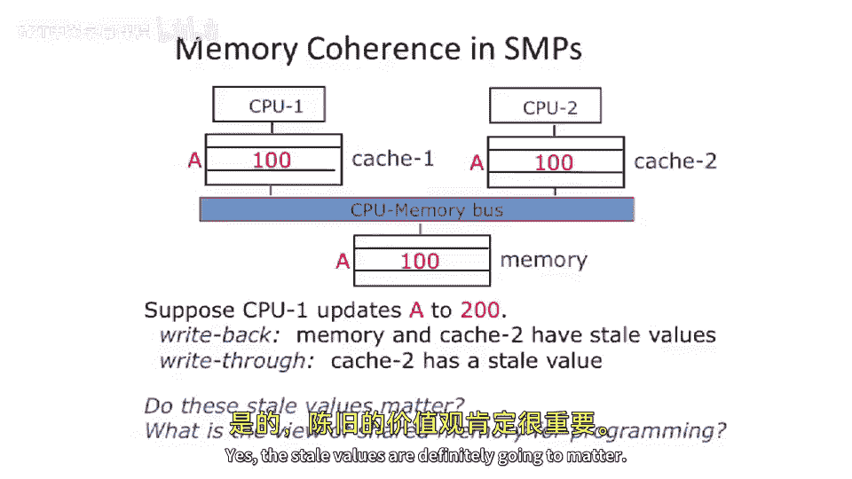
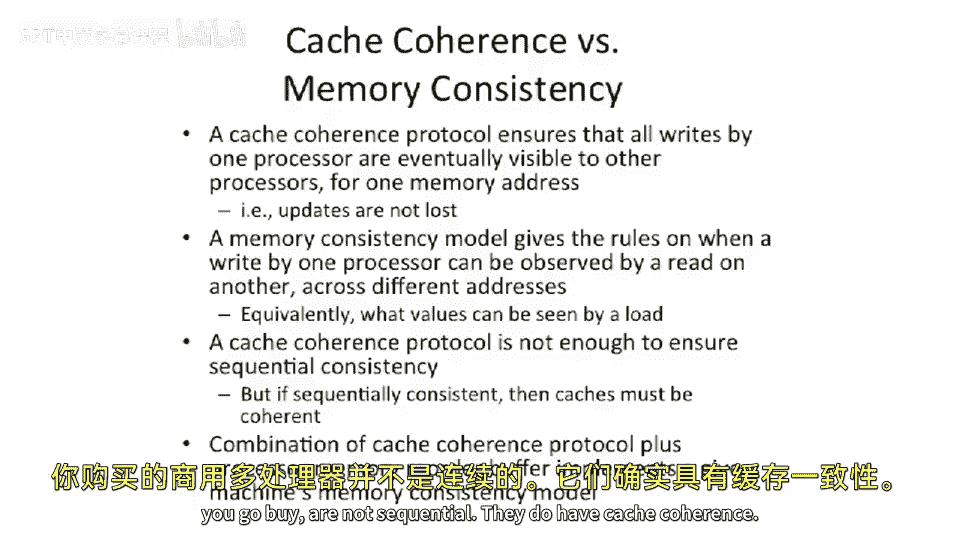

# 【计算机体系结构】普林斯顿—中英字幕 p91 90_04_cache-coherence -BV1ii421D7WR_p91-

Okay， so let's take a look at。The problems with having a bus。And actually。

 the bigger problems with having a cache。So here we show a little bit of example here。

 which has two CPUs。And two caches。And we have main memory。 And then everything sits on a bus。Now。

 why do we want to cash？ Well， we've discussed this in great detail in this class that cash is。

Make your program go faster because you don't have to go communicate with a distant memory to go access some piece of data that you've accessed either temporarily or。

Temporarily recently or has spatial locality with some other reference that you've done recently。

So let's， let's take a look at what， what happens in a space example。 So let's say。At address A here。

We start off with everyone having the value of 100。In their respective caches and in main memory。

 So address a。Has value 100。Now， let's say， let's suppose。That CPU 1。Updates address a to value 200。

Okay， so。Let's look at this in， in two cases。 The first is in the right back case。

 So all the caches here are right back。So， CPU 1。Updates this to value 200。

But this is a right back cache。Okay， so。What， what happens to the values in memory。Anding cash， too。

Hm。Well， all of a sudden， we have。A stale value。The newest value is here， it's going to be 200。

 but here in memory。And here in the cache。2， we have the old value。 So if CPU2 tries to go read。

 address a， it's gonna continually just get the old value。Likewise。

Main memory has an out of date value。Now， where does this become a problem？ Well。

 CPU 2 never sees the， the， the value that got updated for address A more， more to the point。

 What happens if CPU 2 tries to go update cache2 here with a value 300。 we'll say， well。

 now we got a big problem。 Now we have three different values。

And this is going to cause problems for both our memory consistency model。

 But also just to use this system， you know， you， how do you know when the value has been updated and is。

 and is shown。And we can see that it's because we have a cache is here that this problem exists。

And it's because we have two caches。 we， we get stale values。Either in。Other caches。

 or in main memory。Okay， so question comes up。 Maybe this is just a problem of write back。

 write back caches。 Yeah， there are optimization。 You know， they。

 they write only when they need and they can store dirty values inside themselves。

 But maybe we should be using right through caches instead。

 because then at least everything goes out to main memory。

 So let's take a look at the same example here。So it's reset， we have 100，100 and 100。Now， CPU 1。

Goes and does a right to address。A with value 200。 But now it's at least right through。Okay。

 so that writes 200 here and 200 here。So the question comes up， does cache 2。See this And CPU 2。

 see this update。No， we have no mechanism to do this。 And this is going to motivate。

Why we want to build cash coherence protocols。So we do the update here。

 We're gonna have basically value 200，200 here because we wrote through。

 But CPU 2 will never see that update value because it already has address a with value 100 in its cache。

So two questions here。 do these sta values matter。Yes。

TheSt values are definitely going to matter， so。What happens here， Well。

 you will never see the updates in the other CPU。And hence， there's basically no way to communicate。

Second question here。 What is the view of shared memory。For programming well。

There sort of a question here is。You need to have some notion of when。A store。

To a particular address， or a particular value shows up in another processor。 And right now。

 if we look at this case here， there's no mechanism for the other processor to ever see that updated value。

So even if CPU 2 does。A million reads。 It'll never get that updated value because it already has address dress a。

With value 100 in its cache。 So it could sit there and read。

 it could sit there and do a write that might update main memory。

 but it will still never have seen the update from CPU 1。

And that's problematic because how do you build pouring models for that。And， and more to the point。

 this， this affects your consistency model。 So let's take a look at rape back caches。

With sequential consistency。So this is using the same example we used from class last last time。

 So just a recap， we have two threads。They're sharing memory space。And we're going to call the1 T1。

 the other T2。And the T1 stores。1 to x and 11 to y， and concurrently executing T 2 loads y。

Into a register， then stores that register out to Y prime。 So a different memory address。

And then it loads X into R 2 and stores R 2 into X prime， a different memory address than。

Different memory dress than X。 That's correct。So what's going on here， Well， you notice that we。

 we purposely sort of made a tricky case here。 We made。Program1 or， or thread 1， write X。 and then Y。

 and then thread 2， read y。Then write a different value， Y prime， and then read X。

 and then write a different value X prime。 So we basically purposely flipped those， those two values。

 And let's take a look at what happens with a right back cache and see if。

 by the virtue of having a bus。With a right back cache violates sequential consistency。Okay。

 so let's we said in sequential consistency， all execution orderings and interleavings where we do not reorder instructions。

Need to be valid。 So we can choose a purposefully complex or purpose purposefully hard case here。

 So we're gonna， we're gonna basically do that。 So we're gonna have thread1。Execute first。

So to completion。 So what's going happen is we're gonna have three two caches， cache1。

 cache 2 and main memory。And we're going to look to see what's in these values as as time goes on here。

 and time' is going to move down on this graph。 So the first thing that happens is。

Memory X and memory Y。 memorymory X has 0， and y has 10 in it。 And that's just the。

 the initial conditions of this problem。Okay， so T1 gets executed well。

So that writes 1 and 11 to cache1。Now， note。Because this is a right back cash。

We have not updated memory here。 So it has a stale value。

 And this is going to cause us problems in our consistency model and our sequential。

 sequentially consistent consistency model。Okay， what happens next？ Well， let's say。X1， or excuse me。

 x and y on different cache lines。So they are able to write back independently。

 So we're gonna say that cache1 writes back Y， but not X。

H I should start seeing if there's going be a problem here。So。In main memory， we have Y has 11。

 and X has 0。Wu。Well， that's， that's， that's a sort of final case we don't want to see。 But let's。

 let's keep moving forward here。Okay， so then we run thread2 or thread T2 here to completion。

So it reads。The value's main memory brings it into its cache。Does the updates here。

 but it doesn't actually do it right back yet of these new values。

So， then， let's say。Cash1 writes back X。So now main memory says one and 11。嗯。That that's。

 that's not good。 But at least that's sort of what program T1 would do if you normally execute。 But。

 but what's not good about this is。Cash 2 here is not consistent with main memory。

 You can see that x has one here， but this cache says that x has 0。And then， finally。

Cash 2 does a right back of X prime and y prime。So it's gonna to write back what the values it had。

 which were 0。And 11， now。You may recall from the previous class that this was a sequentially inconsistent。

Memory output。This is never， supposed to happen in a sequentially consistent system。

 So all of a sudden， what we did is we took us a memory system。 We introduced caches。

 And by virtue of having these caches， we took a system which。

Would potentially implement sequential consistency， and would broke it。

We broke it because of the sta values in caches。 So this is for the right back case。

 So right back caches can basically cause sequentially inconsistent values to end up in May memory when you're done and likewise。

 in， in caches。Okay， let's walk through a case here。 sort of similar thing。

 but for right through caches。Because right through caches we're going to find are。

 are not particularly better either。But to get this case correct。

 we need to be a little bit more contrived。 So same program here。Cash1， memory， cache2。

And at the beginning of time， we're gonna to say that cash2。In the value， x here has。0。

 which is consistent with main memory。 So some reason， cache2， let's say。

 red value X in a previous program a long time ago for some other reason。 So cache 2 has。X being 0。

And what we're gonna show is this X being 0 in cache2 is going to cause some stale value to live on beyond the expected time。

 So let's say thread 1 executes。 So thread 1 executes and updates X with one， Y with 11。

 And it's right through。 So this gets pushed to main memory。So his two caches are on a bus。

 and there is no communication happening on that bus modular。

 just sort of communicating with main memory。 So the other cache doesn't react。Okay， that's。

 that's okay。 Let's see what happens now。 T 2 executes。Thread 2 executes。 Well。

 it reads from main memory， but you'll notice here that it doesn't have to read X 0 X， excusecus me。

Because X is already sitting in its cache。It has the sta value here。Hm。Well， why。

 why does it not need to do anything。 Well， it's because we haven't said that we need to actually change how a bus works。

 We just said when you go to read something， you can pull into your cache。

 And if people pull things into their cache， there's no way to ever kick things out of a cache unless。

 you know， it falls out because of capacity issues or conflict issues。Well。It goes and reads this。

 And then it does a write， let's say， to x prime and y prime。 And here， we get value 0 and one for。

X prime and y prime。 And this causes sequential consistency to break。

 This is a non sequentially consistent execution。So just because you have right through caches。

On a bus does not guarantee that you're going to have a sequentially consistent execution。Okay。

 so now the question is， we， we spend all of last class talking about sequential consistency。

 What good is this for if we， if， if our violent by putting a cash into it， all of a sudden。

 we break that whole model。Whats， what's the solution to this。Well。

 we're going introduce an idea here called。Cash coherence。

And we're going to contrast that with memory consistency models。

 So or being memory consistent somehow。 So we're going to define a cash coherence protocol as something that ensures that let's say all rights by one processor are at some point in the future are eventually seen by another processor。

And we're gonna say that you typically have some sort of cash coherence model or cache coherence system underlying system。

 which allows you to maintain some some consistency model。 So in effect here。

 what you're doing is cash coherence protocols， have the underlying implementation。

 which allows you to have these stronger guarantees。

 And the stronger guarantees are what makes the programmers life easier。

 as we discussed in last lecture， the programmer。Once some sort of guarantee we。

 we had discussed sequential consistency as one of the ways to go about doing that。Okay。

So we're to spend the whole rest of the class talking about how to go build a reasonable cash coherence protocol。

And as I said， memory consistency models are just the rules that the cache coherence protocol tries to observe。

And an important thing here is you can have different cache coherence protocols and different consistency models。

 So just because you have a cache coherence system doesn't mean you have， for instance。

 sequential consistency。In fact， sequential consistency is a very strict form of a consistency model。

 There are much looser models out there。 And， in fact， most processors you go by。

 commercial multi processors that you go by are not sequentially consistent。

They do have cash coherence， but they， those cash coherence implements something in that is typically looser than sequential consistency。

 And people will actually define different consistency models。

 We talked about a few of those things last time， like total store ordering。

Weat consistency models， things， things like that。So it's the combination of the cache coherence protocol。

 implementing a sequential consistency model， which allows you to actually go build useful software systems on multi processorcess。

