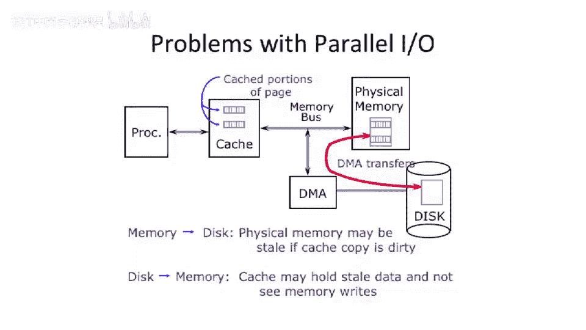

# 【计算机体系结构】普林斯顿—中英字幕 p92 91_05_bus-based-multiprocessors -BV1ii421D7WR_p92-

So， let's。Start thinking about how to go build a memory coherence protocol。

 So as a little bit of warm up。For our memory coherence protocol。

 we'll actually see that this problem exists beyond multi processorcessor systems。

 So a lot of the motivation for these ideas of memory coherence protocols actually predate even having multiprocess。

And how is that possible， Well， the same problem ends up in。I O。 So let's say you have parallel I O。

 So let's take a look at this picture here。 We have one processor， a un processor system。

 and we have main memory here。And we have a cache。And then over here。

 we have a disk with a DMA engine。So a direct memory access engine。 So this is a autonomous。

Controller here， which can move data from the disk to main memory and vice versa。So how does。

 how does this come up with something like parallel。

 What problems can come up with something like parallel I O。Well， let's say that the disk here。

W to transfer a page from the disk to physical memory or to main memory while the processor is running。

Well。You program up the DNAA controller and says， go。 Well。

 it's going start copying data here from the disk out to main memory。Well。

Because we have not done anything on this bus。 We just use it as a way to communicate the cash here。

Might have the same addresses that are being written too。 And now they're gonna a style value。

 So they'll never actually pick up the value from。That just got DM made or just got moved from the disk to physical memory。

Likewise， so that's disk to memory。 You might get sta data in the cache。Likewise。

 you could have memory。Trying to go to disk here。 So let's say you start to have a DMMA transfer from main memory to disk。

 but you might have data in the cache here。 Let's say it's a write back cache。 Well。

 this transfer could get started。 but it could miss updated data here in the cache。

 So I could try to start doing copies。 But because we said the DNA engine just copies directly from physical memory to the disk。

 it'll just miss those updates。 So there's no good way for the processor to go and write data to the disk。

 And， and this is something you fundamentally want to do。So there's a couple of solutions to this。

 And this is sort of a brain teaser to get you thinking about this。

 But what do you need to do to guarantee some way of having the disk here， For instance。

 be able to see the data that's in the cache。Well， how do you go about doing this？

You need some way to either invalidate the cache and send these to main memory and have the disk pull out the update or most up to date copies。

 And this is a sort of similar notion as what we have to do。Back in this example here。

We need some way to either get the most up to date value。Or invalidate or。

 or kick data out of a particular cache in order to allow the new reader of the data to be able to see updates。

And this is sort of an introduction to where we're gonna go， which is。Cash coherence protocols。

And cache coherance protocols are going to give us some guarantees and give us mechanisms in order to actually see that。

 see that data that has been updated。 That would otherwise be stale， according to some rules。Okay。

Other， other things going on here。 I think that's basically a basis basis of this。

 But I wanted to just get across the idea here that you。

Might need cash coherence。Protocols。Even in a single processor system。

 it gets even more complex in a multi processor system。So what was the， the， the。

 one of the big solutions to this problem。 Let's say you wanted to have caches。

 You wanted to be able to have either parallel I O going on or multiple processors with caches be able to access data。

 And you want a right to one processor to be able to be seen by another processor or the right from one processor to a cache be able to be seen by the disconroller here。

And fundamentally， the problem here is this DMA engine only knows to go to main memory。

It doesn't know that there might be。Dirdy data in the cache for the same address。

